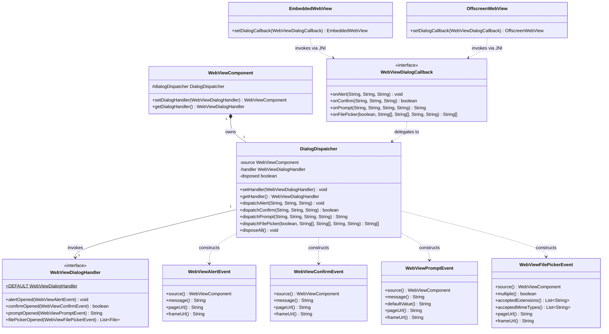

# REASONS Canvas: Browser-Initiated UI Dialogs (Java API + macOS WKWebView Coverage)

## R · Requirements

- Establish the cross-platform Java contract for browser-initiated UI
  dialogs originating inside the embedded page (`window.alert`,
  `window.confirm`, `window.prompt`, `<input type="file">` clicks), and
  ship a working macOS WKWebView implementation of that contract.
  Today macOS is silently broken: `cocoa_create_engine` in
  `src_c/webview_embed.cpp:1951` creates a `WKWebView` (line 1989) with
  no `uiDelegate` assigned, so the engine drops alert / confirm /
  prompt requests and `<input type="file">` clicks open no picker.
- Expose a single public functional-style interface
  `ca.weblite.webview.WebViewDialogHandler` with four `default`
  methods, all EDT-invoked:
  - `void alertOpened(WebViewAlertEvent)` — default shows
    `JOptionPane.showMessageDialog`.
  - `boolean confirmOpened(WebViewConfirmEvent)` — default shows
    `JOptionPane.showConfirmDialog(OK_CANCEL_OPTION)` and returns
    `true` for OK.
  - `String promptOpened(WebViewPromptEvent)` — default shows
    `JOptionPane.showInputDialog` and returns the entered text
    (or `null` on cancel).
  - `List<File> filePickerOpened(WebViewFilePickerEvent)` — default
    shows a modal `JFileChooser` honouring `multiple()` and
    `acceptedExtensions()`.
  All four defaults anchor on `SwingUtilities.getWindowAncestor(event.source())`.
- Expose four immutable event POJOs in `ca.weblite.webview`
  (`WebViewAlertEvent`, `WebViewConfirmEvent`, `WebViewPromptEvent`,
  `WebViewFilePickerEvent`) carrying the event data: source component,
  message / default value / multiple+accept hints as appropriate, and
  `pageUrl` + `frameUrl` for per-origin policy decisions.
- Expose `setDialogHandler(WebViewDialogHandler)` /
  `getDialogHandler()` on `WebViewComponent` as concrete `final`
  methods (no abstract overload needed). Passing `null` to the setter
  installs an internal `DROP` handler whose methods return void /
  `false` / `null` / empty list synchronously without UI — required
  for headless tests. `getDialogHandler()` MUST NEVER return `null`;
  it returns `WebViewDialogHandler.DEFAULT` (the Swing-dialog default
  instance) when no caller has set one.
- Wire the contract to the macOS heavyweight engine by attaching a
  `WKUIDelegate` ObjC class to the `WKWebView`. The delegate
  implements the four `WKUIDelegate` selectors
  (`runJavaScriptAlertPanelWithMessage:`,
  `runJavaScriptConfirmPanelWithMessage:`,
  `runJavaScriptTextInputPanelWithPrompt:`,
  `runOpenPanelWithParameters:`) and bridges each to the
  corresponding `DialogDispatcher.dispatch*` method via a new JNI
  callback (`WebViewDialogCallback`). After Java returns, the
  delegate invokes the platform's completion handler with the
  captured value, releasing the WebKit JS thread.
- All handler callbacks MUST run on the Swing Event Dispatch Thread.
  The dispatcher uses `SwingUtilities.invokeAndWait` (NOT
  `invokeLater` — the native side is suspended waiting for the
  answer; matches `alert` / `confirm` / `prompt`'s synchronous JS
  contract). Behaviour matches the existing
  [[swing-webview-context-menu-and-dom-mouse-events]] EDT contract
  but with synchronous return semantics.
- The implementation MUST NOT introduce a JSON-parsing dependency
  (the project has none — `pom.xml:43-50` declares only JUnit-test
  dependency). Dialog events are not page-injected JS; no JS shim is
  installed and no reserved `__webview_*` binding name is added.
  Communication flows: native engine → JNI callback → Java
  dispatcher → EDT-marshalled handler → return value → JNI return →
  native completion handler.
- The implementation MUST add two new JNI entry points on
  `WebViewNative`:
  - `webview_embed_set_dialog_callback(long, WebViewDialogCallback)`
    — for the heavyweight engine (macOS today; Linux heavyweight
    and Windows in subsequent canvases).
  - `webview_offscreen_set_dialog_callback(long, WebViewDialogCallback)`
    — for the offscreen engine (Linux lightweight in a subsequent
    canvas; stub no-op on macOS / Windows where the offscreen path
    is itself a stub).
  Both entry points follow the existing
  `webview_embed_set_focus_callback` /
  `webview_embed_set_click_callback` precedent
  (`WebViewNative.java:228, 243`).
- The implementation MUST add `setDialogCallback(WebViewDialogCallback)`
  to both `EmbeddedWebView` (heavyweight wrapper) and
  `OffscreenWebView` (offscreen wrapper), mirroring the existing
  `setFocusCallback` / `setClickCallback` on `EmbeddedWebView`
  (`EmbeddedWebView.java:311, 330`). Anchoring the callback in the
  wrapper's `heap` `IdentityHashMap` is required so the JVM does
  not collect the lambda while the native side holds a global ref.
- The Linux and Windows native callback sites are explicitly OUT OF
  SCOPE for this canvas — they land in STORY-004-002 and
  STORY-004-003. However the Java API and JNI surface introduced
  here MUST be designed so those two stories can wire their native
  callbacks without re-shaping the Java side. The Linux offscreen
  setter must exist (as a stub on macOS / Windows native binaries)
  so STORY-004-002 can implement it without touching Java again.
- Definition of Done:
  - All 20 STORY-004-001 ACs pass on macOS with the new code.
  - A `WebViewDialogDemo` Swing app under `demos/` exercises all
    four dialog kinds in both default-handler and custom-handler
    modes (per analysis open question 5).
  - README under "Demos" lists the new demo, and the existing
    "Talking to JavaScript" / mode-selection prose grows a small
    "Browser-initiated dialogs" subsection documenting the
    `setDialogHandler` API and the macOS-only coverage caveat for
    this iteration (Linux / Windows arrive in 004-002 / 004-003).
  - Unit tests for `DialogDispatcher` validate handler invocation,
    EDT marshaling, `setHandler(null)` drop semantics,
    `getHandler() != null` invariant, exception isolation,
    `WebViewFilePickerEvent.acceptedExtensions` normalisation, and
    the fallback values produced when the dispatcher is disposed
    mid-flight. Native delegate code is integration-tested via the
    demo (consistent with the no-automated-GUI-tests policy from
    [[swing-webview-context-menu-and-dom-mouse-events]]).
- Out of scope (explicit non-goals):
  - Linux WebKitGTK `script-dialog` / `run-file-chooser` signal
    handlers (STORY-004-002).
  - Windows WebView2 `add_ScriptDialogOpening` /
    `put_AreDefaultScriptDialogsEnabled(FALSE)` (STORY-004-003).
  - The standalone in-process `WebView` class — this canvas only
    touches the embedded `WebViewComponent` surface. Adding the
    same API to standalone `WebView` is a future story.
  - A dedicated `beforeUnloadOpened` handler method. `before-unload`
    confirmations route through `confirmOpened` on Linux and
    Windows when those land; on macOS WKWebView there is no
    separate `WKUIDelegate` selector for before-unload (it goes
    through `runJavaScriptConfirmPanelWithMessage:` like any other
    confirm), so the routing is trivial.
  - `window.open(url, name, features)` popup handling
    (`WKUIDelegate`'s `createWebViewWithConfiguration:` selector)
    — a different channel, out of scope.
  - HTTP basic / digest authentication challenges
    (`webView:didReceiveAuthenticationChallenge:` on the
    navigation delegate) — a different channel, out of scope.
  - Drag-and-drop file uploads (different code path; not
    `runOpenPanel`).
  - Per-call cancellation from Java mid-dialog (no
    "dismiss-this-confirm-from-Java" API; the handler return is
    the only outcome).
  - HiDPI / DPI coordinate translation — dialogs use platform-native
    Swing rendering and don't carry viewport coordinates.

## E · Entities

- **WebViewDialogHandler** (new public interface,
  `src/ca/weblite/webview/WebViewDialogHandler.java`). Functional
  interface-flavoured — four `default` methods, no required abstract
  method. The "DEFAULT" public constant points at an instance that
  uses every `default` method as-is, so callers who want stock Swing
  dialogs do nothing and callers who want overrides supply their own
  implementation with overridden methods.
  - `default void alertOpened(WebViewAlertEvent event)`
  - `default boolean confirmOpened(WebViewConfirmEvent event)`
  - `default String promptOpened(WebViewPromptEvent event)`
  - `default List<File> filePickerOpened(WebViewFilePickerEvent event)`
  - `static WebViewDialogHandler DEFAULT = new WebViewDialogHandler() {};`
    — anonymous interface instance with all defaults intact, used
    by the dispatcher when no caller has installed one.

- **WebViewAlertEvent** (new public class,
  `src/ca/weblite/webview/WebViewAlertEvent.java`). Immutable value
  type. Invariants:
  - All five fields are stored in `final` ivars assigned by the
    package-private constructor.
  - `source` is never null (NPE thrown by constructor).
  - `message`, `pageUrl`, `frameUrl` are never null but may be empty
    (empty when the engine reports no value).

- **WebViewConfirmEvent** (new public class,
  `src/ca/weblite/webview/WebViewConfirmEvent.java`). Same shape as
  `WebViewAlertEvent` — `source`, `message`, `pageUrl`, `frameUrl`.

- **WebViewPromptEvent** (new public class,
  `src/ca/weblite/webview/WebViewPromptEvent.java`). Fields:
  `source`, `message`, `defaultValue`, `pageUrl`, `frameUrl`. The
  `defaultValue` is never null but may be empty.

- **WebViewFilePickerEvent** (new public class,
  `src/ca/weblite/webview/WebViewFilePickerEvent.java`). Fields:
  `source`, `multiple` (boolean), `acceptedExtensions`
  (unmodifiable `List<String>`, lower-case, leading dot stripped,
  deduplicated), `acceptedMimeTypes` (unmodifiable `List<String>`,
  lower-case, deduplicated), `pageUrl`, `frameUrl`. Lists never null;
  empty when the page's `<input>` has no `accept` attribute.

- **WebViewDialogCallback** (new public interface,
  `src/ca/weblite/webview/WebViewDialogCallback.java`).
  Internal-ish functional interface — public only because the native
  layer's JNI bridge calls into it; consuming Swing code routes
  through `setDialogHandler` and never sees this type. Four methods
  matching the four dispatch entry points; each returns the answer
  synchronously. The class-level Javadoc states explicitly:
  "Invoked from a native thread (AppKit main on macOS, GTK main on
  Linux, WebView2 worker on Windows). Implementations route through
  `DialogDispatcher`, which marshals to the EDT."
  - `void onAlert(String message, String pageUrl, String frameUrl)`
  - `boolean onConfirm(String message, String pageUrl, String frameUrl)`
  - `String onPrompt(String message, String defaultValue, String pageUrl, String frameUrl)`
  - `String[] onFilePicker(boolean multiple, String[] mimeTypes, String[] extensions, String pageUrl, String frameUrl)`

- **DialogDispatcher** (new public class,
  `src/ca/weblite/webview/DialogDispatcher.java`). Per-component
  fan-out hub for native dialog requests. Owns the single
  `WebViewDialogHandler` reference. Public-because-cross-package
  (matches the existing `ConsoleDispatcher` /
  `WebViewMouseDispatcher` rationale).
  Invariants:
  - Constructed once per `WebViewComponent` instance, lives for the
    component's lifetime.
  - `getHandler()` never returns null.
  - `setHandler(null)` installs the `DROP` internal handler that
    suppresses dialogs without UI.
  - Every `dispatch*` method runs the active handler on the EDT.
  - Disposed dispatcher returns safe fallbacks (void / false / null /
    empty array) without invoking any handler.

- **WebViewComponent** (modified;
  `src/ca/weblite/webview/swing/WebViewComponent.java`). Gains:
  - `protected final DialogDispatcher dialogDispatcher = new DialogDispatcher(this);`
    instance field, initialised at construction (same pattern as
    `consoleDispatcher` / `mouseDispatcher`).
  - `public final WebViewComponent setDialogHandler(WebViewDialogHandler handler)`.
  - `public final WebViewDialogHandler getDialogHandler()`.

- **EmbeddedWebView** (modified;
  `src/ca/weblite/webview/EmbeddedWebView.java`). Gains:
  - `public EmbeddedWebView setDialogCallback(WebViewDialogCallback cb)`
    — mirrors `setFocusCallback` (line 311) and `setClickCallback`
    (line 330). Anchors `cb` in `heap` so the JVM does not collect
    it while the native side holds a global ref. Calls the new
    JNI entry point `WebViewNative.webview_embed_set_dialog_callback`.

- **OffscreenWebView** (modified). Gains:
  - `public OffscreenWebView setDialogCallback(WebViewDialogCallback cb)`
    — mirrors the heavyweight wrapper. Calls
    `WebViewNative.webview_offscreen_set_dialog_callback`.

- **WebViewNative** (modified;
  `src/ca/weblite/webview/WebViewNative.java`). Gains two native
  method declarations:
  - `native static void webview_embed_set_dialog_callback(long w, WebViewDialogCallback cb)`
  - `native static void webview_offscreen_set_dialog_callback(long peer, WebViewDialogCallback cb)`

- **`ca_weblite_webview_WebViewNative.h`** (regenerated;
  `src/ca/weblite/webview/ca_weblite_webview_WebViewNative.h` AND
  the duplicate at `src_c/ca_weblite_webview_WebViewNative.h` AND
  `windows/ca_weblite_webview_WebViewNative.h`). Re-derived from
  the modified `WebViewNative` class. The two new JNI function
  prototypes appear.

- **`src_c/webview_embed.cpp`** (modified, macOS-only changes in
  this canvas). Gains:
  - `Engine::dialog_callback` `jobject` field (global ref to the
    Java `WebViewDialogCallback`), placed alongside the existing
    `focus_callback` / `click_callback` fields.
  - `Engine::ui_delegate` `id` field holding the per-engine ObjC
    `WKUIDelegate` instance (released on engine destroy).
  - `get_webview_embed_ui_delegate_cls()` — once-per-JVM cached
    `Class` builder for the `WKUIDelegate` ObjC class, mirroring
    the existing `get_webview_embed_delegate_cls()` at line 1684
    (used for `WKScriptMessageHandler`).
  - Four selector implementations on the new delegate class:
    `webView:runJavaScriptAlertPanelWithMessage:initiatedByFrame:completionHandler:`,
    `webView:runJavaScriptConfirmPanelWithMessage:initiatedByFrame:completionHandler:`,
    `webView:runJavaScriptTextInputPanelWithPrompt:defaultText:initiatedByFrame:completionHandler:`,
    `webView:runOpenPanelWithParameters:initiatedByFrame:completionHandler:`.
  - `cocoa_set_dialog_callback(Engine*, JNIEnv*, jobject)` —
    setter mirroring `cocoa_set_focus_callback` (line 1923) and
    `cocoa_set_click_callback` (line 1940).
  - Inside `cocoa_create_engine` (line 1951), after the `WKWebView`
    is allocated and configured (lines 1989-1992) and the
    script-message delegate is attached (line 2083), assign the
    UIDelegate: `msg<void,id>(e->webview, sel("setUIDelegate:"), e->ui_delegate);`.
  - JNI bridge function bodies for the two new `WebViewNative_…`
    native methods, routing through `cocoa_set_dialog_callback`
    (heavyweight on macOS) and a no-op stub for the offscreen
    setter (offscreen is not implemented on macOS).

- **`WebViewHeavyweightComponent`** (modified;
  `src/ca/weblite/webview/swing/WebViewHeavyweightComponent.java`).
  Inside `createPeer()`, AFTER the existing
  `embedded.setFocusCallback(...)` /
  `embedded.setClickCallback(...)` registrations
  (`WebViewHeavyweightComponent.java:473-501`), insert the dialog
  callback registration that bridges to `dialogDispatcher`.

- **`WebViewLightweightComponent`** (modified;
  `src/ca/weblite/webview/swing/WebViewLightweightComponent.java`).
  Inside `addNotify()`, AFTER the existing console / mouse bridge
  installs and inside the `engine != null` branch (matching the
  existing late-install pattern), insert the corresponding
  `engine.setDialogCallback(...)` registration. Behaves identically
  to the heavyweight install but goes through the offscreen wrapper.

- **`WebViewDialogDemo`** (new Swing demo,
  `demos/WebViewDialogDemo/src/ca/weblite/webview/demos/WebViewDialogDemo.java`).
  Layout mirrors `demos/WebViewConsoleDemo/`. Loads an inline page
  (`addOnBeforeLoad` + `setUrl("about:blank")` or `data:` URL)
  with buttons for each dialog kind. Includes a JComboBox switch
  between three handler modes:
  - **Default** (`setDialogHandler(WebViewDialogHandler.DEFAULT)` or
    no setter call) — Swing dialogs.
  - **Custom** (override every method to print the event to stdout
    and return a fixed value: alert no-op, confirm true, prompt
    `"hardcoded"`, file picker `[/tmp/preselected.txt]`) — exercises
    AC10-AC13.
  - **Drop** (`setDialogHandler(null)`) — exercises AC14.

- **README.md** (modified). Two prose changes:
  1. Under the "Demos" / additional-demos paragraph, list
     `WebViewDialogDemo` with a one-line description.
  2. New subsection titled "Browser-initiated dialogs" (sibling of
     "Talking to JavaScript") documenting the `setDialogHandler`
     API, the four `default` methods, the `null`-handler drop
     semantics, and an explicit note that this iteration ships
     macOS coverage only — Linux and Windows continue to use the
     platform default dialogs until 004-002 / 004-003 land.

- **`DialogDispatcherTest`** (new JUnit 4 test,
  `test/ca/weblite/webview/DialogDispatcherTest.java`). Mirrors
  `EvalDispatcherTest` style. No real engine — tests drive the
  dispatcher's four `dispatch*` methods directly and assert on
  handler invocation, EDT marshaling, exception isolation, drop
  semantics, default normalisation of file-picker hints, and the
  dispose path.



## A · Approach

1. **Layering and threading model:**
   - The dispatcher is the sole gatekeeper between the native UI
     thread and the Java handler. Native delegates / signal handlers
     / event handlers invoke `WebViewDialogCallback.on*` from
     whatever native UI thread they run on (AppKit main on macOS in
     this canvas; GTK pump and WebView2 worker in subsequent
     canvases). The callback implementation in
     `WebViewHeavyweightComponent` / `WebViewLightweightComponent`
     is a one-line delegation to `dialogDispatcher.dispatch*(...)`.
   - `DialogDispatcher.dispatch*` does a synchronous EDT hop via
     `SwingUtilities.invokeAndWait`. If already on the EDT (impossible
     in practice — the native UI thread is never the EDT — but cheap
     to short-circuit), invoke the handler directly. The dispatch
     captures the handler return value, releases the EDT lock, and
     returns to the native side. The native side then invokes the
     platform's completion handler (WKWebView completion handler /
     WebKitGTK `_set_text` / `_set_confirmed` / WebView2 deferral)
     with the captured value.
   - The native UI thread blocks for the duration of the modal Swing
     dialog. This is the intended JS-contract behaviour: the page's
     JS thread is also blocked, and no engine repaints land during
     the modal. The README already documents this "page is frozen
     during the modal" expectation for any embedded WebView
     framework.

2. **Why `invokeAndWait` and not `invokeLater` + CompletableFuture:**
   - The JS contract for `alert` / `confirm` / `prompt` is
     synchronous; the native side has to know the answer before
     returning to JS. `invokeAndWait` produces a tiny dispatcher
     surface (one method per kind, no future tracking, no per-call
     identifier, no map cleanup) at the cost of holding the native
     UI thread. That cost is intentional — the dialog IS the modal
     pump.
   - `invokeLater` + a `CompletableFuture` returned to native code
     would require a second JNI call to feed the answer back. That
     pattern is reserved for `<input type="file">` on Windows in a
     future story IF the deferral analysis there reveals a deadlock
     in the synchronous-block approach (analysis Risk section).
     macOS, Linux, and the typical Windows case do not need it.
   - For `<input type="file">` (asynchronous in JS), the native
     `runOpenPanel` completion handler doesn't fire until the
     picker dismisses; we can still implement this synchronously
     in Java (the EDT blocks on `JFileChooser.showOpenDialog`) and
     return the chosen paths once the user clicks OK / Cancel.
     Functionally indistinguishable from the page's perspective
     because the page only sees the `change` event when the
     completion handler runs.

3. **Why `SwingUtilities.invokeAndWait` is safe from AppKit main:**
   - The AppKit main thread invokes the `WKUIDelegate` selector.
     The selector calls into Java via JNI; Java calls
     `invokeAndWait` to hop to AWT's EDT. The EDT runs
     `JOptionPane.showMessageDialog(host, ...)` which spins a
     **secondary modal pump on the EDT itself** (Swing's modal
     implementation is pure Java; it nests an event-queue pump on
     the EDT while the dialog is up). The EDT does not re-enter
     AppKit synchronously while pumping. Java2D's macOS paint path
     posts to AppKit asynchronously, but the EDT does not block on
     those posts.
   - The AppKit main thread sits parked in `invokeAndWait` until
     the EDT-side dialog closes. AppKit is therefore not running
     its own runloop — which is correct: the WKWebView and any
     other AppKit content are visually frozen until the dialog
     closes. This matches the JS contract.
   - The `WebViewFocusCallback` and `WebViewClickCallback` already
     run on the AppKit main thread and the Java side already
     processes them on a non-EDT path that ultimately
     `invokeLater`s to the EDT — without deadlock. Switching the
     last step from `invokeLater` to `invokeAndWait` blocks the
     AppKit thread on the EDT result; the EDT does not depend on
     the AppKit thread for the Swing-modal-pump itself.

4. **WKUIDelegate selector implementation strategy (per kind):**

   - **`alert`:**
     1. Read `message` (NSString) from the selector arg, convert to
        UTF-8 jstring.
     2. Read `pageUrl` from
        `webView.URL.absoluteString` (top-level) and `frameUrl` from
        `frame.request.URL.absoluteString` (or fall back to
        `webView.URL.absoluteString` when nil).
     3. Look up the Engine's `dialog_callback` `jobject` (global
        ref, set via `cocoa_set_dialog_callback`).
     4. Acquire the JNIEnv via `AttachCurrentThread` if needed
        (AppKit main thread may or may not already be a JVM
        attached thread — defensive `AttachCurrentThread` is
        cheap if already attached).
     5. Call the cached `onAlert(String, String, String)` jmethodID
        via `CallVoidMethod`.
     6. Detach (`DetachCurrentThread`) only if we attached here.
     7. Invoke the `WKWebView` completion handler:
        `((void(^)())completionHandler)();`

   - **`confirm`:**
     1-4. Same as alert.
     5. Call `onConfirm(...)`, returning `jboolean`.
     6. Detach.
     7. Invoke the completion handler with the captured boolean:
        `((void(^)(BOOL))completionHandler)(result == JNI_TRUE);`

   - **`prompt`:**
     1. Same as alert + `defaultValue` arg.
     2-4. Same as alert.
     5. Call `onPrompt(...)`, capturing the returned `jstring` (or
        null for cancel).
     6. If non-null: convert to NSString. If null: pass `nil` to
        the completion handler (WKWebView interprets `nil` as
        cancel; returns `null` to JS).
     7. Invoke the completion handler with the NSString-or-nil:
        `((void(^)(NSString*))completionHandler)(nsResult);`
     8. Detach.

   - **`open panel`:**
     1. Read `parameters.allowsMultipleSelection` (public API,
        `BOOL`).
     2. Read accepted MIME types via
        `[parameters valueForKey:@"_acceptedMIMETypes"]` (private
        API; KVC wrap in `@try`/`@catch`; fall back to empty
        NSArray). Convert to `jobjectArray` of UTF-8 jstrings.
     3. Read accepted file extensions via
        `[parameters valueForKey:@"_acceptedFileExtensions"]`,
        same KVC-with-fallback dance. Convert similarly.
     4. Read pageUrl / frameUrl as above.
     5. Call `onFilePicker(boolean, String[], String[], String, String)`,
        returning `jobjectArray` of UTF-8 jstrings (file paths).
     6. Build an `NSArray<NSURL*>*` from the returned paths via
        `[NSURL fileURLWithPath:...]`. Empty / null array → `nil`.
     7. Invoke the completion handler with the NSArray-or-nil:
        `((void(^)(NSArray<NSURL*>*))completionHandler)(urls);`
     8. Detach.

5. **Why use KVC for `_acceptedMIMETypes` / `_acceptedFileExtensions`:**
   - These are documented in WebKit source and have been stable
     since macOS 10.12, but they are not part of the public WKWebKit
     API. Public WKOpenPanelParameters only exposes
     `allowsMultipleSelection` and `allowsDirectories`. Apps
     wanting accept-attribute hints have used the KVC path for
     years (e.g. Electron, CEF on macOS).
   - The wrapper `@try`/`@catch` ensures we degrade gracefully if a
     future macOS removes the underscore-prefixed accessors:
     `acceptedExtensions` / `acceptedMimeTypes` become empty lists
     and the default `JFileChooser` simply shows all files. The
     page's own client-side `accept` validation continues to work.

6. **EDT marshal and exception isolation:**
   - The dispatcher's `dispatch*` methods all run through the same
     internal `runOnEdtAndCapture(Supplier<T>)` helper that:
     1. If `disposed`, return the supplier-provided fallback
        without invoking anything.
     2. If `SwingUtilities.isEventDispatchThread()`, invoke the
        supplier inline.
     3. Otherwise, wrap the supplier in a `Callable<T>`-style
        `Runnable` that stores its result in a final `Object[]`
        cell and call `SwingUtilities.invokeAndWait(...)`.
     4. Catch `InterruptedException` (restore interrupt flag,
        return fallback), `InvocationTargetException` (forward
        the wrapped exception to
        `Thread.getDefaultUncaughtExceptionHandler()`, return
        fallback), and `RuntimeException` (forward, return
        fallback). No exception propagates back to the JNI
        caller.
   - The four `dispatch*` methods construct their event POJO from
     the JNI-marshalled primitives, call `runOnEdtAndCapture`
     supplying the relevant handler invocation, and return the
     captured (or fallback) value.

7. **`setDialogHandler(null)` drop semantics:**
   - The dispatcher holds a non-null `volatile WebViewDialogHandler
     handler` field, initialised to `WebViewDialogHandler.DEFAULT`.
   - `setHandler(null)` does NOT null the field — it stores an
     internal `DROP` singleton that overrides every method to
     return the JS-spec cancel value synchronously without UI.
     `getHandler()` returns whatever is stored; it never returns
     `null`.
   - DROP is NOT identity-equal to DEFAULT (so callers can detect
     the drop state if they care), but is package-private — there
     is no `WebViewDialogHandler.DROP` public constant. Callers
     reset to the default by calling
     `setDialogHandler(WebViewDialogHandler.DEFAULT)` explicitly.
   - DROP returns: `alertOpened` → no-op; `confirmOpened` → false;
     `promptOpened` → null; `filePickerOpened` → empty list.

8. **Native-thread JNI mechanics:**
   - The macOS WKUIDelegate selector runs on AppKit main, which may
     or may not be a JVM-attached thread depending on whether
     anyone has run prior JNI work on it. The existing
     `fire_focus_callback` and `fire_click_callback` patterns in
     `webview_embed.cpp` use a shared helper that defensively
     `AttachCurrentThreadAsDaemon`s if needed and detaches at the
     end. Reuse that helper (or a sibling) for the dialog selectors.
   - The Engine's `dialog_callback` jobject is a global ref created
     in `cocoa_set_dialog_callback` (via `env->NewGlobalRef(cb)`)
     and deleted in `cocoa_set_dialog_callback` when replaced (and
     in the engine destructor). Same lifecycle pattern as
     `focus_callback` / `click_callback`.
   - The four `jmethodID`s for `onAlert` / `onConfirm` / `onPrompt`
     / `onFilePicker` are cached once at first invocation (lazy
     init) inside the engine, OR resolved per-call from the
     callback's class via `GetObjectClass` + `GetMethodID`. The
     existing `fire_click_callback` resolves per-call
     (`webview_embed.cpp:166`); the new code mirrors that for
     simplicity. The per-call resolution cost is small compared to
     the modal dialog's wall-clock duration.

9. **File-picker accept-attribute normalisation:**
   - The native side reports whatever the platform makes available.
     On macOS via KVC: `_acceptedMIMETypes` is an `NSArray<NSString*>`
     of MIME-type strings as the page wrote them (e.g. `"image/png"`,
     `"image/*"`); `_acceptedFileExtensions` is an `NSArray<NSString*>`
     of extension strings (may include or omit leading dots).
   - The JNI bridge converts both arrays to `jobjectArray` verbatim.
   - The Java `DialogDispatcher.dispatchFilePicker` is responsible
     for normalisation BEFORE constructing the
     `WebViewFilePickerEvent`:
     1. Lowercase all entries.
     2. For extensions: strip a single leading dot.
     3. Deduplicate (preserving first-seen order via
        `LinkedHashSet`).
     4. Wrap each in
        `Collections.unmodifiableList(new ArrayList<>(...))`.
   - This guarantees handler implementations see the same shape
     across all platforms and matches the STORY-004-001
     NF-expectation directly.

10. **Default `JFileChooser` filtering logic:**
    - Default `filePickerOpened` constructs a `JFileChooser`,
      sets `multiSelectionEnabled` from `event.multiple()`, and
      builds a filter:
      - If `acceptedExtensions` non-empty: add a
        `FileNameExtensionFilter("Accepted files", ext1, ext2, ...)`
        as the default filter and disable "All Files" via
        `setAcceptAllFileFilterUsed(false)` when the page has
        constrained extensions.
      - If only `acceptedMimeTypes` non-empty (no extensions):
        leave the chooser unfiltered (all files visible) since
        Swing's stock `JFileChooser` does not natively filter by
        MIME type. Handlers wanting MIME-based filtering can
        provide a custom handler.
      - If both lists empty: no filter, default
        "Open File" experience.
    - On `JFileChooser.APPROVE_OPTION`: return
      `Arrays.asList(chooser.getSelectedFiles())` (or
      `Collections.singletonList(chooser.getSelectedFile())`
      when single-file). On `CANCEL_OPTION` / closed: return
      `Collections.emptyList()`.

11. **Handler-on-EDT contract for callers:**
    - Handlers MUST NOT block the EDT on an EDT-scheduled task —
      e.g. `wv.evalAsync(js).get()` from inside a handler will
      deadlock because the dispatcher's `invokeAndWait` already
      occupies the EDT and `evalAsync` continuations land on
      that same EDT. Document in `WebViewDialogHandler` Javadoc
      and `setDialogHandler` Javadoc.
    - Handlers MAY freely call `wv.setUrl`, `wv.eval`,
      `wv.dispatch(r)`, etc. — those dispatch to the native UI
      thread and return immediately. Note that the native UI
      thread is currently blocked in the WKUIDelegate selector,
      so the navigation / eval queues until the handler returns
      and the delegate's completion handler releases the JS
      thread.

12. **Demo strategy:**
    - The demo loads an inline page (constructed via
      `addOnBeforeLoad` and `setUrl("about:blank")`, NOT a
      `data:` URL, because `data:` URLs constrain
      `webView.URL.absoluteString` to the literal data URI
      and the demo wants a "page URL" assertion path).
    - Page contains four buttons: "Alert", "Confirm", "Prompt",
      "Pick File" — each wires `onclick` to call the
      corresponding JS function. Page logs every call's return
      value to `console.log` so the existing console-capture
      channel surfaces it to the demo log pane.
    - Demo includes a JComboBox to switch among three handler
      modes (DEFAULT, custom, drop) and exercises AC-relevant
      behaviour by clicking each button under each mode.

## S · Structure

### Inheritance Relationships
1. `WebViewDialogHandler` is a public functional-style interface
   with four `default` methods and a `DEFAULT` static constant.
   Callers either accept the defaults entirely or implement /
   override one or more methods. No required abstract method.
2. `WebViewAlertEvent`, `WebViewConfirmEvent`, `WebViewPromptEvent`,
   `WebViewFilePickerEvent` are public final classes (no
   inheritance, no `Cloneable`, no `Serializable` per house
   style — matches the existing `ConsoleMessage` /
   `WebViewMouseEvent` POJOs).
3. `WebViewDialogCallback` is a public interface with four
   methods. NOT `@FunctionalInterface` (more than one method).
4. `DialogDispatcher` is a `public final` class — no subclassing
   expected (matches `ConsoleDispatcher` and `EvalDispatcher`).
5. `WebViewComponent` (existing abstract class) gains a
   `DialogDispatcher` instance field and two `final` methods. No
   change to the abstract surface; both subclasses inherit the
   new methods directly.
6. `EmbeddedWebView` and `OffscreenWebView` (existing concrete
   classes) each gain one `setDialogCallback` method matching
   their existing `setFocusCallback` / `setClickCallback`
   patterns.

### Dependencies
1. `WebViewDialogHandler` (default methods) → `javax.swing.JOptionPane`,
   `javax.swing.JFileChooser`,
   `javax.swing.SwingUtilities.getWindowAncestor`,
   `javax.swing.filechooser.FileNameExtensionFilter`,
   `java.io.File`, `java.util.List`, `java.util.Collections`.
2. `DialogDispatcher` → `javax.swing.SwingUtilities`
   (`invokeAndWait`, `isEventDispatchThread`),
   `java.lang.reflect.InvocationTargetException`, the four event
   POJO constructors, `WebViewDialogHandler`,
   `java.io.File`, `java.util.Arrays`, `java.util.LinkedHashSet`.
3. `WebViewComponent` → `DialogDispatcher`, `WebViewDialogHandler`.
4. `WebViewHeavyweightComponent.createPeer()` → `EmbeddedWebView`,
   `DialogDispatcher`, `WebViewDialogCallback`. Wires a
   `WebViewDialogCallback` adapter (anonymous inner class) that
   delegates each method to `dialogDispatcher.dispatch*`.
5. `WebViewLightweightComponent.addNotify()` → `OffscreenWebView`,
   `DialogDispatcher`, `WebViewDialogCallback`. Same shape as the
   heavyweight wiring.
6. `EmbeddedWebView.setDialogCallback` → `WebViewNative.webview_embed_set_dialog_callback`.
7. `OffscreenWebView.setDialogCallback` → `WebViewNative.webview_offscreen_set_dialog_callback`.
8. `Java_…_webview_1embed_1set_1dialog_1callback` (in `webview_embed.cpp`)
   → `cocoa_set_dialog_callback` (macOS path).
9. macOS UIDelegate selectors → `Engine::dialog_callback` jobject →
   JNI `CallVoidMethod` / `CallBooleanMethod` /
   `CallObjectMethod` → Java `WebViewDialogCallback.on*` →
   `DialogDispatcher.dispatch*` → EDT → `WebViewDialogHandler.*Opened`.

### Layered Architecture
1. **Native engine layer** (`src_c/webview_embed.cpp`): Cocoa
   `WKUIDelegate` ObjC class, four selector implementations, the
   `cocoa_set_dialog_callback` setter, and the JNI bridge
   functions for the two new `WebViewNative_…` natives. Engine
   struct holds the new `dialog_callback` / `ui_delegate`
   fields.
2. **JNI surface** (`ca.weblite.webview.WebViewNative`): two new
   `native static` method declarations.
3. **Engine wrapper layer** (`EmbeddedWebView`, `OffscreenWebView`):
   `setDialogCallback` setters that anchor the callback in
   `heap` and call the corresponding JNI method.
4. **Dispatcher layer** (`ca.weblite.webview.DialogDispatcher`):
   per-component fan-out hub holding the active handler,
   marshaling to the EDT, isolating handler exceptions.
5. **Component API layer**
   (`ca.weblite.webview.swing.WebViewComponent`):
   `setDialogHandler` / `getDialogHandler` public methods, owns
   the per-instance dispatcher.
6. **Public contract layer**
   (`ca.weblite.webview.WebViewDialogHandler` + four event POJOs +
   `WebViewDialogCallback`): the user-facing interface and the
   internal-ish JNI callback interface.
7. **Wiring layer** (`WebViewHeavyweightComponent.createPeer()`,
   `WebViewLightweightComponent.addNotify()`): bridges the
   per-component dispatcher to the per-engine native callback at
   peer-attach time.
8. **Demo layer** (`demos/WebViewDialogDemo/`): runnable Swing
   app exercising the four dialog kinds in three handler modes.

## O · Operations

### 1. Create Value Object — WebViewAlertEvent
File: `src/ca/weblite/webview/WebViewAlertEvent.java`

1. Responsibility: immutable carrier of one `window.alert` request's
   data, surfaced to the Java handler.
2. Package-private constructor:
   - `WebViewAlertEvent(WebViewComponent source, String message,
        String pageUrl, String frameUrl)`
   - Logic: null-check `source` (NPE with name `"source"`);
     coerce null `message` / `pageUrl` / `frameUrl` to empty string
     (the engine may legitimately report no value — empty is the
     "no value" sentinel for these fields, per the analysis
     resolution); store all four fields in `final` ivars.
3. Public accessors (no-`get` style, matching
   `WebViewMouseEvent` precedent):
   - `source(): WebViewComponent`
   - `message(): String`
   - `pageUrl(): String`
   - `frameUrl(): String`
4. `toString()` returns
   `"WebViewAlertEvent[message=<...>, pageUrl=<...>]"` for debug
   logging. Truncate `message` to 80 chars + `"..."` if longer.
5. No `equals` / `hashCode` overrides.

### 2. Create Value Object — WebViewConfirmEvent
File: `src/ca/weblite/webview/WebViewConfirmEvent.java`

1. Responsibility: immutable carrier of one `window.confirm`
   request's data.
2. Package-private constructor and accessors: identical shape to
   `WebViewAlertEvent` (Operation 1) — `source`, `message`,
   `pageUrl`, `frameUrl`. Same null-handling, same accessors,
   same `toString` style.
3. The two classes are intentionally NOT collapsed into a shared
   base class — per requirements (line 65 of the analysis) the
   four POJOs are distinct types for caller clarity and to keep
   handler method signatures honest.

### 3. Create Value Object — WebViewPromptEvent
File: `src/ca/weblite/webview/WebViewPromptEvent.java`

1. Responsibility: immutable carrier of one `window.prompt`
   request's data, including the default value the page supplied.
2. Package-private constructor:
   - `WebViewPromptEvent(WebViewComponent source, String message,
        String defaultValue, String pageUrl, String frameUrl)`
   - Logic: null-check `source`; coerce all other null Strings to
     empty (`defaultValue` empty when the page passed no second
     argument or passed `null` — JS coerces to the string
     `"null"`, but if WKWebView reports `nil` we treat that as
     empty).
3. Public accessors: `source()`, `message()`, `defaultValue()`,
   `pageUrl()`, `frameUrl()`.
4. `toString()` — same pattern as Operation 1.

### 4. Create Value Object — WebViewFilePickerEvent
File: `src/ca/weblite/webview/WebViewFilePickerEvent.java`

1. Responsibility: immutable carrier of one `<input type=file>`
   click's parameters.
2. Package-private constructor:
   - `WebViewFilePickerEvent(WebViewComponent source, boolean multiple,
        List<String> acceptedExtensions, List<String> acceptedMimeTypes,
        String pageUrl, String frameUrl)`
   - Logic: null-check `source`; coerce null `pageUrl` /
     `frameUrl` to empty; null `acceptedExtensions` /
     `acceptedMimeTypes` become empty unmodifiable lists; non-null
     lists are defensively wrapped via
     `Collections.unmodifiableList(new ArrayList<>(input))` so
     mutation of the source list after construction does not
     affect the stored field.
   - Constructor does NOT re-normalise the lists — normalisation
     is the caller's responsibility (the `DialogDispatcher`
     normalises before calling the constructor per Operation 7).
3. Public accessors: `source()`, `multiple()`,
   `acceptedExtensions()`, `acceptedMimeTypes()`, `pageUrl()`,
   `frameUrl()`. The two list accessors return the stored
   already-unmodifiable views directly.
4. `toString()` — single-line summary including extension count,
   MIME-type count, `multiple` flag.

### 5. Create Handler Interface — WebViewDialogHandler
File: `src/ca/weblite/webview/WebViewDialogHandler.java`

1. Public `interface`, NOT `@FunctionalInterface` (it has four
   `default` methods and no required abstract method; multiple
   methods make it non-functional).
2. Imports needed: `javax.swing.JOptionPane`,
   `javax.swing.JFileChooser`, `javax.swing.SwingUtilities`,
   `javax.swing.filechooser.FileNameExtensionFilter`,
   `java.awt.Window`, `java.io.File`, `java.util.Collections`,
   `java.util.List`, `java.util.Arrays`.
3. Four `default` methods:
   - `default void alertOpened(WebViewAlertEvent event)`:
     - Logic: `Window host = SwingUtilities.getWindowAncestor(event.source());`
       then
       `JOptionPane.showMessageDialog(host, event.message(), "JavaScript Alert", JOptionPane.PLAIN_MESSAGE);`.
     - The `host` may be null if the component is not in a window
       — `JOptionPane` handles this by parenting on a hidden
       shared frame, which is the standard Swing behaviour and
       matches the requirements' fallback contract.
   - `default boolean confirmOpened(WebViewConfirmEvent event)`:
     - Logic: `Window host = SwingUtilities.getWindowAncestor(event.source());`
       then
       `int r = JOptionPane.showConfirmDialog(host, event.message(), "JavaScript Confirm", JOptionPane.OK_CANCEL_OPTION);`
       and `return r == JOptionPane.OK_OPTION;`.
   - `default String promptOpened(WebViewPromptEvent event)`:
     - Logic: `Window host = SwingUtilities.getWindowAncestor(event.source());`
       then
       `Object r = JOptionPane.showInputDialog(host, event.message(), "JavaScript Prompt", JOptionPane.QUESTION_MESSAGE, null, null, event.defaultValue());`
       and `return r == null ? null : r.toString();`.
     - Uses the seven-arg `showInputDialog` so the default value
       can be pre-populated (the simpler three-arg form doesn't
       accept initial value); the `null, null` positional args
       are the icon and the selection-values array — both unused.
   - `default List<File> filePickerOpened(WebViewFilePickerEvent event)`:
     - Logic:
       1. Resolve `Window host`.
       2. Construct `JFileChooser chooser = new JFileChooser();`.
       3. `chooser.setMultiSelectionEnabled(event.multiple());`
       4. If `!event.acceptedExtensions().isEmpty()`:
          - `String[] exts = event.acceptedExtensions().toArray(new String[0]);`
          - `chooser.setFileFilter(new FileNameExtensionFilter("Accepted files", exts));`
          - `chooser.setAcceptAllFileFilterUsed(false);`
       5. Otherwise leave the chooser unfiltered.
       6. `int r = chooser.showOpenDialog(host);`
       7. If `r != JFileChooser.APPROVE_OPTION`, return
          `Collections.emptyList()`.
       8. Otherwise: if `event.multiple()`, return
          `Arrays.asList(chooser.getSelectedFiles())`;
          else return
          `Collections.singletonList(chooser.getSelectedFile())`.
4. Public static constant:
   - `WebViewDialogHandler DEFAULT = new WebViewDialogHandler() {};`
   - Anonymous instance with all defaults intact. Stateless; safe
     to share across components and threads.
5. Class-level Javadoc:
   - Documents that all methods run on the Swing EDT.
   - Documents the synchronous JS-contract semantics: every
     handler invocation blocks the WebKit JS thread until the
     handler returns; `alert` / `confirm` / `prompt` rely on this
     blocking behaviour to provide their synchronous return
     values.
   - Documents the `setDialogHandler(null)` drop-handler shortcut
     (callers wanting to suppress all dialogs without writing
     stub override methods).
   - Documents the EDT-deadlock warning: handlers MUST NOT block
     on `wv.evalAsync(js).get()` or any other EDT-scheduled task
     from inside a handler — the EDT is busy running the
     handler.
   - Documents that handlers MAY freely call
     `wv.setUrl` / `wv.eval` / `wv.dispatch(r)`; these enqueue
     work onto the native UI thread but do not block.
   - Documents that handler exceptions are caught by the
     dispatcher and forwarded to
     `Thread.getDefaultUncaughtExceptionHandler()`; they do not
     propagate to the native engine.
   - Documents the macOS coverage status (this canvas), with a
     forward reference to STORY-004-002 / STORY-004-003 for
     Linux / Windows.

### 6. Create JNI Callback Interface — WebViewDialogCallback
File: `src/ca/weblite/webview/WebViewDialogCallback.java`

1. Public `interface`. NOT `@FunctionalInterface` — four methods.
2. Four methods, each returning the answer synchronously:
   - `void onAlert(String message, String pageUrl, String frameUrl)`
   - `boolean onConfirm(String message, String pageUrl, String frameUrl)`
   - `String onPrompt(String message, String defaultValue, String pageUrl, String frameUrl)` — may return null
   - `String[] onFilePicker(boolean multiple, String[] mimeTypes, String[] extensions, String pageUrl, String frameUrl)` — never returns null; empty array for "cancel"
3. Class-level Javadoc:
   - States explicitly: "Invoked from a native thread (AppKit
     main on macOS, GTK main on Linux, WebView2 worker on
     Windows). Implementations MUST marshal to the EDT before
     touching Swing state. The library-provided implementation
     in `WebViewHeavyweightComponent` /
     `WebViewLightweightComponent` routes through
     `DialogDispatcher`, which performs the EDT hop via
     `SwingUtilities.invokeAndWait`."
   - States that this interface is part of the JNI surface and
     is NOT intended to be implemented by application code —
     application code customises behaviour via
     `WebViewComponent.setDialogHandler(WebViewDialogHandler)`.
4. Method-level Javadoc:
   - For `onPrompt`: returning `null` signals cancel (matches
     JS `prompt()`'s `null` return value).
   - For `onFilePicker`: returning an empty array signals cancel
     (matches JS `<input type=file>`'s no-files-selected state).

### 7. Create Dispatcher — DialogDispatcher
File: `src/ca/weblite/webview/DialogDispatcher.java`

1. Responsibility: per-component fan-out hub for native dialog
   requests. Holds the single active `WebViewDialogHandler`,
   marshals dispatch onto the EDT via
   `SwingUtilities.invokeAndWait`, isolates handler exceptions,
   normalises `WebViewFilePickerEvent.acceptedExtensions` /
   `acceptedMimeTypes` before constructing the event POJO,
   honours the `disposed` flag to return safe fallbacks during
   teardown.
2. Class is `public final` — matches the existing
   `ConsoleDispatcher` / `EvalDispatcher` precedent.
3. Fields:
   - `private final WebViewComponent source;` — non-null;
     supplied at construction.
   - `private volatile WebViewDialogHandler handler = WebViewDialogHandler.DEFAULT;`
     — never null; written via `setHandler`.
   - `private volatile boolean disposed = false;` — set true by
     `disposeAll()`.
   - `private static final WebViewDialogHandler DROP = new WebViewDialogHandler() { @Override public void alertOpened(WebViewAlertEvent e){} @Override public boolean confirmOpened(WebViewConfirmEvent e){ return false; } @Override public String promptOpened(WebViewPromptEvent e){ return null; } @Override public List<File> filePickerOpened(WebViewFilePickerEvent e){ return java.util.Collections.emptyList(); } };`
     — package-private singleton, installed when caller passes
     `null` to `setHandler`. Stateless; safe to share.
4. Constructor:
   - `public DialogDispatcher(WebViewComponent source)`:
     - Logic: null-check `source` (NPE with name `"source"`);
       store.
5. Public methods:
   - `public void setHandler(WebViewDialogHandler h)`:
     - Logic: if `h == null`, store `DROP`; else store `h`.
     - Atomic write to a volatile field.
   - `public WebViewDialogHandler getHandler()`:
     - Logic: return the stored handler (never null).
   - `public void dispatchAlert(String message, String pageUrl, String frameUrl)`:
     - Logic: if `disposed`, return; otherwise build a
       `WebViewAlertEvent` and call
       `runOnEdtAndCaptureVoid(() -> handler.alertOpened(event))`.
   - `public boolean dispatchConfirm(String message, String pageUrl, String frameUrl)`:
     - Logic: if `disposed`, return false; otherwise build a
       `WebViewConfirmEvent` and return
       `runOnEdtAndCapture(() -> handler.confirmOpened(event), Boolean.FALSE).booleanValue()`.
   - `public String dispatchPrompt(String message, String defaultValue, String pageUrl, String frameUrl)`:
     - Logic: if `disposed`, return null; otherwise build a
       `WebViewPromptEvent` and return
       `runOnEdtAndCapture(() -> handler.promptOpened(event), (String) null)`.
   - `public String[] dispatchFilePicker(boolean multiple, String[] mimeTypes, String[] extensions, String pageUrl, String frameUrl)`:
     - Logic: if `disposed`, return `new String[0]`;
       normalise the two arrays into unmodifiable lists per
       Approach §9, construct a `WebViewFilePickerEvent`, call
       `List<File> files = runOnEdtAndCapture(() -> handler.filePickerOpened(event), java.util.Collections.emptyList());`,
       then convert to `String[]` of absolute paths (skipping
       nulls in the file list), and return.
   - `public void disposeAll()`:
     - Logic: set `disposed = true`. The dispatcher does NOT need
       to drain pending futures — `dispatch*` methods are
       short-lived synchronous calls; in-flight handlers running
       on the EDT will complete naturally and their return values
       reach the native completion handler as usual. (Contrast
       with `EvalDispatcher.disposeAllPending` which has long-
       lived futures to fail.)
6. Private helpers:
   - `private void runOnEdtAndCaptureVoid(Runnable r)`:
     - Logic: if `SwingUtilities.isEventDispatchThread()`,
       invoke `r.run()` directly inside a try/catch that
       forwards exceptions to
       `Thread.getDefaultUncaughtExceptionHandler()`.
     - Otherwise, build a
       `Runnable wrapped = () -> { try { r.run(); } catch (Throwable t) { forwardUncaught(t); } }`
       and call
       `SwingUtilities.invokeAndWait(wrapped)`.
     - Catch `InterruptedException` from invokeAndWait (restore
       interrupt flag, return), `InvocationTargetException`
       (forward `getCause()` to uncaught handler), other
       `RuntimeException` (forward, return).
   - `private <T> T runOnEdtAndCapture(java.util.function.Supplier<T> supplier, T fallback)`:
     - Logic: same EDT-or-not branching as the void variant. The
       captured result is stored in a final single-element
       `Object[1]` cell. Returns `fallback` on any exception
       (after forwarding to uncaught handler). On successful
       EDT execution, returns the captured value (which may be
       null — the supplier's return value is propagated even
       when null).
   - `private static void forwardUncaught(Throwable t)`:
     - Logic: identical to
       `ConsoleDispatcher.deliver`'s per-listener catch
       (`ConsoleDispatcher.java:235-241`). Calls
       `Thread.getDefaultUncaughtExceptionHandler().uncaughtException(Thread.currentThread(), t);`
       wrapped in a try/catch that printStackTraces if the
       handler itself throws.
7. Normalisation helper (private static):
   - `private static List<String> normaliseExtensions(String[] input)`:
     - Logic: if null or empty, return
       `Collections.emptyList()`.
     - Build a `LinkedHashSet<String>` (preserves insertion
       order).
     - For each entry: lowercase via `String.toLowerCase(java.util.Locale.ROOT)`,
       strip a single leading `.` if present, skip empty
       strings, add to set.
     - Wrap in
       `Collections.unmodifiableList(new ArrayList<>(set))`.
   - `private static List<String> normaliseMimeTypes(String[] input)`:
     - Logic: identical except for the leading-dot strip step —
       MIME types don't have leading dots.
8. Constraints / Invariants:
   - `setHandler` and `getHandler` are safe to call from any
     thread; the field is volatile.
   - `dispatch*` methods are called from native threads (and
     possibly EDT in unit tests). Both paths must produce a
     valid return value within bounded time even when the
     handler throws.
   - `disposed = true` is observed by every subsequent
     `dispatch*` call without locking thanks to the volatile
     field.

### 8. Extend WebViewComponent Base
File: `src/ca/weblite/webview/swing/WebViewComponent.java`

1. Add import: `import ca.weblite.webview.DialogDispatcher;` and
   `import ca.weblite.webview.WebViewDialogHandler;`.
2. Add field at class level (next to the existing
   `mouseDispatcher` declaration,
   `WebViewComponent.java:67`):
   - `protected final DialogDispatcher dialogDispatcher = new DialogDispatcher(this);`
   - The `this` escape during construction is acceptable for the
     same reason as `mouseDispatcher` — the dispatcher does not
     call back into the component during construction.
3. Add two `public final` methods on the base class (not
   abstract — they don't depend on subclass state):
   - `public final WebViewComponent setDialogHandler(WebViewDialogHandler handler)`:
     - Logic: `dialogDispatcher.setHandler(handler); return this;`
   - `public final WebViewDialogHandler getDialogHandler()`:
     - Logic: `return dialogDispatcher.getHandler();`
4. Method-level Javadoc:
   - `setDialogHandler`: documents the replacement semantic, the
     `null = drop` shortcut, and the
     `WebViewDialogHandler.DEFAULT` constant for explicit
     reset-to-default. Cross-references the
     `WebViewDialogHandler` Javadoc for the EDT and JS-contract
     constraints. Notes that this iteration ships macOS coverage
     only; Linux / Windows continue to use platform-default
     dialogs.
   - `getDialogHandler`: documents the never-null invariant and
     the DEFAULT-when-unset behaviour.
5. Constraints / Invariants:
   - Both new methods MUST be safe to call before the component
     is displayed. The dispatcher holds the handler reference
     independently of peer-attach state; the native callback is
     wired at peer-attach time and reads the handler reference
     fresh on each dispatch.
   - Calling the two methods after `dispose()` is benign:
     `setDialogHandler` mutates the dispatcher state; subsequent
     dispatches return safe fallbacks because `disposed = true`.
   - `getDialogHandler() != null` is an invariant — never returns
     null even after dispose, even when the caller passed null
     (DROP is non-null).

### 9. Extend EmbeddedWebView with setDialogCallback
File: `src/ca/weblite/webview/EmbeddedWebView.java`

1. Add import: `import ca.weblite.webview.WebViewDialogCallback;`
   (in the existing import block).
2. Add method, placed AFTER `setClickCallback`
   (`EmbeddedWebView.java:330-337`):
   ```
   public EmbeddedWebView setDialogCallback(WebViewDialogCallback cb) {
       checkAlive();
       if (cb != null) {
           heap.add(cb);
       }
       WebViewNative.webview_embed_set_dialog_callback(peer, cb);
       return this;
   }
   ```
3. Javadoc:
   - States: "Register (or clear, by passing null) a callback
     invoked for each JS-initiated UI dialog (alert / confirm /
     prompt) and `<input type=file>` click inside the embedded
     WebView. Unlike `setFocusCallback` / `setClickCallback`,
     dialog callbacks RETURN VALUES to the engine
     synchronously: the native UI thread is suspended while
     waiting for the answer. Implementations MUST marshal to
     the EDT (the library-provided implementation routes
     through `DialogDispatcher` which uses
     `SwingUtilities.invokeAndWait`)."
   - States: "Anchoring the callback in `heap` is required so
     the JVM does not garbage-collect the lambda while the
     native side holds a global ref."
4. No other changes to `EmbeddedWebView`. The `dispose()` path
   already clears the heap, which transitively makes the
   callback eligible for GC after the native side's
   `cocoa_set_dialog_callback(nullptr)` clears its global ref
   (called inside `webview_embed_destroy`).

### 10. Extend OffscreenWebView with setDialogCallback
File: `src/ca/weblite/webview/OffscreenWebView.java`

1. Add import: `import ca.weblite.webview.WebViewDialogCallback;`.
2. Add `public OffscreenWebView setDialogCallback(WebViewDialogCallback cb)`
   following the same template as the heavyweight wrapper
   (Operation 9) — `checkAlive()`, anchor in `heap` if non-null,
   call `WebViewNative.webview_offscreen_set_dialog_callback(peer, cb)`,
   return `this`.
3. Javadoc:
   - Mirrors the `EmbeddedWebView.setDialogCallback` Javadoc
     above.
   - Adds: "On macOS / Windows, where the offscreen engine
     itself is a stub, this method has no effect — the native
     stub is a no-op. Linux is the only platform where the
     offscreen path actually dispatches dialog requests, and
     STORY-004-002 implements the GTK signal-handler side."
4. No other changes to `OffscreenWebView`.

### 11. Extend WebViewNative with two new natives
File: `src/ca/weblite/webview/WebViewNative.java`

1. Add import (none needed — `WebViewDialogCallback` lives in
   the same package).
2. Add two `native static` method declarations, placed near the
   existing `webview_embed_set_click_callback` and
   `webview_offscreen_*` blocks:
   - After `webview_embed_release_native_focus`
     (`WebViewNative.java:251`):
     ```
     // Register (or clear, by passing null) a callback invoked for each
     // JS-initiated UI dialog (alert / confirm / prompt) or <input type=file>
     // click inside the embedded WebView.  The callback returns the answer
     // synchronously, releasing the native UI thread once Java has the value.
     // Implementations route through DialogDispatcher which marshals to the
     // Swing EDT.  Per-platform delivery:
     //   - macOS:   WKUIDelegate selectors on the WKWebView (this canvas).
     //   - Linux:   script-dialog and run-file-chooser signals on
     //              WebKitWebView (STORY-004-002).
     //   - Windows: ICoreWebView2::add_ScriptDialogOpening event handler
     //              (STORY-004-003); file picker remains OS-native.
     native static void webview_embed_set_dialog_callback(long w, WebViewDialogCallback cb);
     ```
   - In the offscreen section, after
     `webview_offscreen_execute_editing_command`
     (`WebViewNative.java:353`):
     ```
     // Offscreen counterpart to webview_embed_set_dialog_callback.  Linux only;
     // macOS / Windows native binaries provide a no-op stub.
     native static void webview_offscreen_set_dialog_callback(long peer, WebViewDialogCallback cb);
     ```
3. Constraints / Invariants:
   - Both methods accept null `cb` to clear the registration.
   - Both methods are no-ops if `w` / `peer` is 0 (matches the
     existing native-side null-guard pattern for the other
     `*_set_*_callback` methods).
   - Neither method ever throws via JNI.

### 12. Regenerate JNI header
Files:
- `src/ca/weblite/webview/ca_weblite_webview_WebViewNative.h`
- `src_c/ca_weblite_webview_WebViewNative.h`
- `windows/ca_weblite_webview_WebViewNative.h`

1. Re-derive the JNI header from the modified `WebViewNative`
   class via `javac -h` (the existing project workflow — same
   tooling that produced the current headers).
2. Two new function prototypes must appear:
   - `Java_ca_weblite_webview_WebViewNative_webview_1embed_1set_1dialog_1callback`
   - `Java_ca_weblite_webview_WebViewNative_webview_1offscreen_1set_1dialog_1callback`
3. Both with signatures `(JNIEnv*, jclass, jlong, jobject)` →
   `void`.
4. Copy the regenerated header to all three locations (the project
   keeps copies in `src/`, `src_c/`, and `windows/` per the
   existing pattern).

### 13. Implement macOS WKUIDelegate Class
File: `src_c/webview_embed.cpp`

1. Add forward declarations / fields to the `Engine` struct (the
   Cocoa-specific Engine struct around `webview_embed.cpp:1549`):
   - `id ui_delegate = nullptr;` — per-engine `WKUIDelegate`
     instance. Retained when assigned; released in
     `cocoa_destroy_engine`.
   - `jobject dialog_callback = nullptr;` — global ref to the
     Java `WebViewDialogCallback`. Cleared in
     `cocoa_set_dialog_callback` when replaced and in
     `cocoa_destroy_engine`.
   - Cached `jmethodID` cache (lazy): four mids for `onAlert` /
     `onConfirm` / `onPrompt` / `onFilePicker`. Cache key is
     the callback's `jclass`; refreshed when the callback is
     replaced.
2. Add `get_webview_embed_ui_delegate_cls()` once-per-JVM cached
   Class builder, mirroring `get_webview_embed_delegate_cls()`
   at `webview_embed.cpp:1684`. Class name:
   `WebViewEmbedUIDelegate`. Conforms to `WKUIDelegate`
   (registered via
   `class_addProtocol(c, objc_getProtocol("WKUIDelegate"));`).
   Four method implementations added via
   `class_addMethod(c, sel("..."), (IMP)impl_fn, type_encoding);`.
3. Add four C `IMP` functions, one per selector. Each takes
   `(id self, SEL _cmd, ...)` per Objective-C calling convention.
   Common skeleton:
   ```
   static void impl_alert(id self, SEL _cmd, id webView, id message,
                          id frame, id completionHandler) {
       Engine *e = get_engine_from_ui_delegate(self);
       if (!e || !e->dialog_callback) {
           ((void(^)())completionHandler)();
           return;
       }
       JNIEnv *env = nullptr;
       bool attached = ensure_jni_attached(e->jvm, &env);
       jstring jmsg = ns_to_jstring(env, message);
       jstring jpage = page_url_jstring(env, webView);
       jstring jframe = frame_url_jstring(env, frame, webView);
       jclass cls = env->GetObjectClass(e->dialog_callback);
       jmethodID mid = env->GetMethodID(cls, "onAlert",
                                        "(Ljava/lang/String;Ljava/lang/String;Ljava/lang/String;)V");
       env->CallVoidMethod(e->dialog_callback, mid, jmsg, jpage, jframe);
       if (env->ExceptionCheck()) { env->ExceptionDescribe(); env->ExceptionClear(); }
       env->DeleteLocalRef(jmsg); env->DeleteLocalRef(jpage);
       env->DeleteLocalRef(jframe); env->DeleteLocalRef(cls);
       if (attached) e->jvm->DetachCurrentThread();
       ((void(^)())completionHandler)();
   }
   ```
   Similar skeletons for `impl_confirm` (returns `jboolean`
   from `CallBooleanMethod`, invokes
   `((void(^)(BOOL))completionHandler)(result == JNI_TRUE);`),
   `impl_prompt` (returns `jstring` from
   `CallObjectMethod`, converts null→nil / non-null→NSString,
   invokes
   `((void(^)(NSString*))completionHandler)(nsResult);`), and
   `impl_open_panel` (returns `jobjectArray` from
   `CallObjectMethod`, builds `NSArray<NSURL*>*` via
   `[NSURL fileURLWithPath:]`, invokes
   `((void(^)(NSArray<NSURL*>*))completionHandler)(urls);`;
   empty array → `nil`).
4. `get_engine_from_ui_delegate(id self)` helper: reads the
   associated Engine pointer set via
   `objc_setAssociatedObject(ui_delegate, "eng", (id)e, OBJC_ASSOCIATION_ASSIGN);`
   at delegate-construction time.
5. For the open-panel selector, extract the `accept` hints
   defensively:
   ```
   id parameters = ...;
   NSArray *mimes = nil;
   NSArray *exts = nil;
   @try { mimes = [parameters valueForKey:@"_acceptedMIMETypes"]; }
   @catch (NSException *ex) { mimes = nil; }
   @try { exts = [parameters valueForKey:@"_acceptedFileExtensions"]; }
   @catch (NSException *ex) { exts = nil; }
   ```
   Then convert each `NSArray<NSString*>` (or nil) to a
   `jobjectArray` of UTF-8 jstrings via a helper
   `ns_array_to_jstring_array(env, mimes)` (returns
   zero-length array for nil input).
6. Add `cocoa_set_dialog_callback` static function, mirroring
   `cocoa_set_focus_callback` (line 1923) and
   `cocoa_set_click_callback` (line 1940):
   ```
   static void cocoa_set_dialog_callback(Engine *e, JNIEnv *env, jobject cb) {
       if (!e) return;
       if (e->dialog_callback) {
           env->DeleteGlobalRef(e->dialog_callback);
           e->dialog_callback = nullptr;
       }
       if (cb) {
           e->dialog_callback = env->NewGlobalRef(cb);
       }
   }
   ```
7. Inside `cocoa_create_engine` (line 1951), after the existing
   script-message delegate registration block (lines 2083-2090):
   ```
   // Install the WKUIDelegate so JS-initiated dialogs (alert / confirm /
   // prompt / <input type=file>) flow through Java instead of being
   // silently dropped (the default behaviour when uiDelegate is nil).
   Class ui_delegate_cls = get_webview_embed_ui_delegate_cls();
   id ui_delegate = msg((id)ui_delegate_cls, sel("new"));
   objc_setAssociatedObject(ui_delegate, "eng", (id)e, OBJC_ASSOCIATION_ASSIGN);
   msg<void, id>(e->webview, sel("setUIDelegate:"), ui_delegate);
   e->ui_delegate = ui_delegate;  // retain count of 1 from `new`; we hold the only ref
   ```
8. Inside `cocoa_destroy_engine` (existing function in the same
   file): release `ui_delegate` and delete the
   `dialog_callback` global ref:
   ```
   if (e->ui_delegate) {
       msg<void, id>(e->webview, sel("setUIDelegate:"), nil);
       msg(e->ui_delegate, sel("release"));
       e->ui_delegate = nullptr;
   }
   if (e->dialog_callback) {
       env->DeleteGlobalRef(e->dialog_callback);
       e->dialog_callback = nullptr;
   }
   ```
9. Add JNI bridge functions at the bottom of the file (the
   existing function block where `webview_embed_set_focus_callback`
   etc. live):
   ```
   JNIEXPORT void JNICALL
   Java_ca_weblite_webview_WebViewNative_webview_1embed_1set_1dialog_1callback(
       JNIEnv *env, jclass, jlong w, jobject cb) {
       Engine *e = reinterpret_cast<Engine*>(w);
       if (!e) return;
   #if __APPLE__
       cocoa_set_dialog_callback(e, env, cb);
   #elif __linux__
       // Linux implementation lands in STORY-004-002.
       gtk_set_dialog_callback(e, env, cb);
   #endif
   }
   ```
   - The `__linux__` branch references `gtk_set_dialog_callback`,
     which lands in STORY-004-002. For this canvas, the function
     can be declared as an empty stub in the Linux build paths
     to keep linking happy across all three branches:
     ```
     #if __linux__
     static void gtk_set_dialog_callback(Engine *e, JNIEnv *env, jobject cb) {
         // Stub — implemented in STORY-004-002.  Anchoring / clearing the
         // global ref is the only thing this stub must do correctly so
         // STORY-004-002 can wire signal handlers without re-doing the
         // lifecycle code.
         if (!e) return;
         if (e->dialog_callback) { env->DeleteGlobalRef(e->dialog_callback); e->dialog_callback = nullptr; }
         if (cb) { e->dialog_callback = env->NewGlobalRef(cb); }
     }
     #endif
     ```
     (The same field/ref dance, no signal connection. STORY-004-002
     swaps in the `g_signal_connect` calls.)
   - Similar offscreen variant:
     ```
     JNIEXPORT void JNICALL
     Java_ca_weblite_webview_WebViewNative_webview_1offscreen_1set_1dialog_1callback(
         JNIEnv *env, jclass, jlong peer, jobject cb) {
         Offscreen *o = reinterpret_cast<Offscreen*>(peer);
         if (!o) return;
     #if __linux__
         gtk_offscreen_set_dialog_callback(o, env, cb);
     #else
         // No offscreen engine on macOS / Windows.
     #endif
     }
     ```
     The `gtk_offscreen_set_dialog_callback` stub mirrors the
     embedded one.
10. Constraints / Invariants:
    - No changes to any existing line in `cocoa_create_engine`
      other than the additive block at step 7.
    - The four selector IMPs MUST always invoke the completion
      handler exactly once, even on error paths (null callback,
      JNI exception, etc.). Failure to do so hangs the WebKit
      JS thread forever.
    - The Engine's `dialog_callback` field is read on every
      dialog dispatch; concurrent `cocoa_set_dialog_callback`
      replacement is racy in theory but irrelevant in practice
      because callback replacement only happens at peer-attach
      time (single-threaded EDT).
    - The `_acceptedMIMETypes` / `_acceptedFileExtensions` KVC
      reads are wrapped in `@try`/`@catch`; failure produces an
      empty `jobjectArray` and the default `JFileChooser` shows
      all files. Document the KVC use with an explanatory
      comment in the code.

### 14. Wire the Dialog Bridge — WebViewHeavyweightComponent
File: `src/ca/weblite/webview/swing/WebViewHeavyweightComponent.java`

1. Add imports:
   - `import ca.weblite.webview.WebViewDialogCallback;`
2. Inside `createPeer()` (currently
   `WebViewHeavyweightComponent.java:409`), AFTER the existing
   `embedded.setClickCallback(...)` block at
   `WebViewHeavyweightComponent.java:491-501`, insert:
   ```
   // Install the dialog bridge so JS alert/confirm/prompt and
   // <input type=file> route to the per-component WebViewDialogHandler.
   // Anchored in EmbeddedWebView.heap by setDialogCallback so the JVM
   // does not collect the lambda while the native side holds a global ref.
   embedded.setDialogCallback(new WebViewDialogCallback() {
       @Override public void onAlert(String message, String pageUrl, String frameUrl) {
           dialogDispatcher.dispatchAlert(message, pageUrl, frameUrl);
       }
       @Override public boolean onConfirm(String message, String pageUrl, String frameUrl) {
           return dialogDispatcher.dispatchConfirm(message, pageUrl, frameUrl);
       }
       @Override public String onPrompt(String message, String defaultValue, String pageUrl, String frameUrl) {
           return dialogDispatcher.dispatchPrompt(message, defaultValue, pageUrl, frameUrl);
       }
       @Override public String[] onFilePicker(boolean multiple, String[] mimeTypes, String[] extensions, String pageUrl, String frameUrl) {
           return dialogDispatcher.dispatchFilePicker(multiple, mimeTypes, extensions, pageUrl, frameUrl);
       }
   });
   ```
3. Logic / sequencing rationale:
   - The dialog bridge install comes AFTER `setFocusCallback` and
     `setClickCallback` in registration order, but ordering does
     not matter functionally — these are independent native
     callbacks.
   - No `addOnBeforeLoad` / `addJavascriptCallback` calls — the
     dialog channel does not use a JS shim or reserved binding.
   - The anonymous `WebViewDialogCallback` captures `dialogDispatcher`
     (the base-class field). On `dispose()`, the
     `EmbeddedWebView.dispose()` path clears `heap` and the
     native side's `cocoa_set_dialog_callback(nullptr)` is
     called from `webview_embed_destroy`, releasing the global
     ref. After dispose, the dispatcher's `disposed` flag
     ensures dispatches return safe fallbacks if any in-flight
     native callback fires before the native side has fully
     torn down.
4. Constraints / Invariants:
   - Purely additive — no changes to existing `createPeer` lines.
   - No changes to `dispose()` — the native destroy path
     already handles callback cleanup.
   - The component's `dispose()` method MUST also call
     `dialogDispatcher.disposeAll()` so the dispatcher's
     `disposed` flag flips before any in-flight handler runs
     past the native teardown. Add this line in
     `WebViewHeavyweightComponent.dispose()` immediately before
     the existing `embedded.dispose()` call.

### 15. Wire the Dialog Bridge — WebViewLightweightComponent
File: `src/ca/weblite/webview/swing/WebViewLightweightComponent.java`

1. Add imports:
   - `import ca.weblite.webview.WebViewDialogCallback;`
2. Inside `addNotify()` (currently
   `WebViewLightweightComponent.java:189`), AFTER the existing
   console-bridge and mouse-bridge installs and INSIDE the
   `engine != null` branch (matches the late-install pattern
   used by the other bridges), insert the exact-same anonymous
   `WebViewDialogCallback` block from Operation 14 but targeting
   `engine.setDialogCallback(...)` instead of `embedded.setDialogCallback`:
   ```
   engine.setDialogCallback(new WebViewDialogCallback() {
       @Override public void onAlert(String message, String pageUrl, String frameUrl) {
           dialogDispatcher.dispatchAlert(message, pageUrl, frameUrl);
       }
       @Override public boolean onConfirm(String message, String pageUrl, String frameUrl) {
           return dialogDispatcher.dispatchConfirm(message, pageUrl, frameUrl);
       }
       @Override public String onPrompt(String message, String defaultValue, String pageUrl, String frameUrl) {
           return dialogDispatcher.dispatchPrompt(message, defaultValue, pageUrl, frameUrl);
       }
       @Override public String[] onFilePicker(boolean multiple, String[] mimeTypes, String[] extensions, String pageUrl, String frameUrl) {
           return dialogDispatcher.dispatchFilePicker(multiple, mimeTypes, extensions, pageUrl, frameUrl);
       }
   });
   ```
3. Logic / sequencing rationale: identical to Operation 14.
4. Constraints / Invariants:
   - On macOS / Windows, the offscreen engine is a stub and
     `setDialogCallback` is a no-op there — handler registration
     on the Java side still works but the lightweight component
     on those platforms is itself stubbed (per the existing
     README behaviour). The bridge install does not error out
     in stub mode.
   - The `engine != null` check around the existing console /
     mouse bridges is inherited — when `engine == null`, the
     dialog bridge is also skipped.
   - The component's `removeNotify()` (or equivalent disposal
     path) MUST also call `dialogDispatcher.disposeAll()` for
     the same reason as Operation 14.

### 16. Create Interactive Demo — WebViewDialogDemo
Files:
- `demos/WebViewDialogDemo/src/ca/weblite/webview/demos/WebViewDialogDemo.java`
- `demos/WebViewDialogDemo/README.md` (optional — short)

1. Responsibility: exercise every dialog kind in every handler
   mode against an inline page, so AC verification is possible
   without an external website.
2. JFrame layout:
   - Top: a `JComboBox<String>` with three items — "Default
     handler (Swing dialogs)", "Custom handler (programmatic
     answers)", "Drop handler (no UI)". Default selection is
     index 0.
   - Centre: a single `WebViewComponent.create()` filling most
     of the content pane.
   - Bottom: a `JTextArea` (read-only, scrollable) that
     receives every captured `console.*` line so the demo can
     verify JS-side return values without external tooling.
3. Inline page (installed via
   `addOnBeforeLoad("document.title='WebViewDialogDemo';")`
   and `setUrl(...)` with a `data:text/html` URI carrying):
   ```
   <!doctype html>
   <html><body style="font:14px sans-serif;padding:20px">
   <h2>WebView Dialog Demo</h2>
   <button onclick="alert('hello world')">Alert</button>
   <button onclick="console.log('confirm =', confirm('proceed?'))">Confirm</button>
   <button onclick="console.log('prompt =', JSON.stringify(prompt('name?', 'default')))">Prompt</button>
   <input type="file" id="single" accept=".png,.jpg" onchange="console.log('files =', this.files.length)">
   <input type="file" id="multi" accept="image/*,.pdf" multiple onchange="console.log('multi files =', this.files.length)">
   </body></html>
   ```
4. Global Swing setup before `JFrame` show:
   - `JPopupMenu.setDefaultLightWeightPopupEnabled(false);`
     and the tooltip pendant — required for heavyweight on macOS
     so any Swing popup (in this demo, the JFileChooser's "Open"
     button menu, JOptionPane's button labels) paints above the
     WKWebView. (Matches the existing
     `WebViewHeavyweightDemo` setup.)
5. Handler-mode switcher:
   - On selection change, call
     `wv.setDialogHandler(...)` with one of three values:
     - **Default**:
       `wv.setDialogHandler(WebViewDialogHandler.DEFAULT);` (or
       `setDialogHandler(null)` would be DROP, so explicit
       DEFAULT is required).
     - **Custom**:
       ```
       wv.setDialogHandler(new WebViewDialogHandler() {
           @Override public void alertOpened(WebViewAlertEvent e) {
               appendLog("custom alert: " + e.message());
           }
           @Override public boolean confirmOpened(WebViewConfirmEvent e) {
               appendLog("custom confirm: " + e.message());
               return true;
           }
           @Override public String promptOpened(WebViewPromptEvent e) {
               appendLog("custom prompt: " + e.message());
               return "hardcoded";
           }
           @Override public List<File> filePickerOpened(WebViewFilePickerEvent e) {
               appendLog("custom file picker: multiple=" + e.multiple()
                   + " ext=" + e.acceptedExtensions());
               return Collections.singletonList(new File("/tmp/preselected.txt"));
           }
       });
       ```
     - **Drop**: `wv.setDialogHandler(null);`
6. The demo registers a `ConsoleListener` that mirrors every
   captured line into the JTextArea. The handler's
   `appendLog(...)` helper also appends to the same area
   (`SwingUtilities.invokeLater(() -> textArea.append(...))`).
7. The demo is for AC verification, not full editor support —
   `<input type="file">` selections are not actually read; the
   demo just verifies the page's `change` event fires and
   `files.length` matches the expected count.

### 17. Update README
File: `README.md`

1. Locate the existing "Demos" / additional-demos paragraph
   (currently under the demo discussion, around the
   `WebViewContextMenuDemo` and `WebViewAsyncEvalDemo` bullets).
2. Append a new bullet:
   ```
   * `demos/WebViewDialogDemo/` — exercises the new
     `WebViewDialogHandler` API: the four default Swing dialogs
     (alert / confirm / prompt / file picker), a custom handler
     with programmatic answers, and the `setDialogHandler(null)`
     drop mode for headless tests.
   ```
3. Add a new top-level subsection (sibling of "Talking to
   JavaScript") titled **"Browser-initiated dialogs"**, placed
   after "Talking to JavaScript" and before the "Demo" section.
   Content:
   - One paragraph describing what `window.alert` /
     `window.confirm` / `window.prompt` and `<input type=file>`
     do, and how `WebViewComponent.setDialogHandler` lets the
     host customise or suppress them.
   - A short code example:
     ```java
     wv.setDialogHandler(new WebViewDialogHandler() {
         @Override public boolean confirmOpened(WebViewConfirmEvent e) {
             return JOptionPane.showConfirmDialog(
                 frame, e.message(), "Confirm",
                 JOptionPane.OK_CANCEL_OPTION) == JOptionPane.OK_OPTION;
         }
     });
     ```
   - A platform-status note documenting that this iteration
     covers macOS heavyweight only; on Linux and Windows the
     embedded WebView continues to show the platform-default
     dialogs (WebKitGTK and WebView2 respectively) until
     STORY-004-002 and STORY-004-003 land. The `setDialogHandler`
     API itself is available everywhere; it just doesn't fire on
     Linux / Windows yet.
   - One bullet noting the `setDialogHandler(null)` drop
     semantic for headless test environments.
4. No other prose changes.

### 18. Unit Tests — DialogDispatcherTest
File: `test/ca/weblite/webview/DialogDispatcherTest.java`

1. Test layout follows `EvalDispatcherTest` — JUnit 4, no real
   engine, no Swing initialisation beyond what
   `SwingUtilities.invokeAndWait` requires.
2. Test cases:
   - `testDefaultHandlerNotNull()`: a fresh `DialogDispatcher`
     reports `getHandler() == WebViewDialogHandler.DEFAULT`.
   - `testSetHandlerNullInstallsDrop()`: after
     `setHandler(null)`, `getHandler()` is non-null but is NOT
     identity-equal to `DEFAULT`. Dispatch returns the
     drop-semantic values (alert no-op, confirm false, prompt
     null, file picker empty array).
   - `testSetHandlerCustomIsReturnedByGetter()`: after
     `setHandler(custom)`, `getHandler() == custom`.
   - `testDispatchAlertInvokesHandlerOnEdt()`: a custom handler
     records `SwingUtilities.isEventDispatchThread()` and the
     received event; after `dispatcher.dispatchAlert("msg",
     "http://a", "http://b")` returns, assert the recorded
     boolean is true, message matches, URLs match.
   - `testDispatchConfirmReturnsHandlerValue()`: handler returns
     `true`; dispatcher's `dispatchConfirm(...)` returns true.
     Then change handler to return `false`; assert again.
   - `testDispatchPromptReturnsHandlerValue()`: handler returns
     `"answer"`; dispatcher's `dispatchPrompt(...)` returns
     `"answer"`. Handler returns null; dispatcher returns null.
   - `testDispatchFilePickerReturnsHandlerPaths()`: handler
     returns
     `Arrays.asList(new File("/tmp/a.png"), new File("/tmp/b.png"))`;
     dispatcher's `dispatchFilePicker(...)` returns a String[]
     of two elements `"/tmp/a.png"`, `"/tmp/b.png"`.
   - `testDispatchFilePickerNormalisesExtensions()`: pass
     `new String[]{".PNG", "JPG", ".png"}` as extensions; the
     event's `acceptedExtensions()` is `["png","jpg"]`
     (lowercase, dot-stripped, deduped, order-preserved).
   - `testDispatchFilePickerNormalisesMimeTypes()`: pass
     `new String[]{"Image/PNG", "image/png"}`; event's
     `acceptedMimeTypes()` is `["image/png"]`.
   - `testDispatchFilePickerHandlesNullArrays()`: pass null for
     both arrays; event's lists are both empty; dispatch
     succeeds.
   - `testHandlerExceptionIsIsolated()`: handler throws a
     `RuntimeException`; the dispatcher's `dispatchAlert` returns
     normally (void); a custom uncaught-exception handler
     installed for the test thread records the thrown
     `RuntimeException`. Use a test-local
     `Thread.UncaughtExceptionHandler` set via
     `Thread.setDefaultUncaughtExceptionHandler` and restore
     the prior handler in `@After`.
   - `testHandlerExceptionConfirmReturnsFalse()`: handler throws;
     `dispatchConfirm` returns `false` (the fallback).
   - `testHandlerExceptionPromptReturnsNull()`: handler throws;
     `dispatchPrompt` returns `null`.
   - `testHandlerExceptionFilePickerReturnsEmpty()`: handler
     throws; `dispatchFilePicker` returns `new String[0]`.
   - `testDisposedDispatcherReturnsFallbacks()`: call
     `disposeAll()`, then assert each `dispatch*` returns the
     fallback value without invoking the (otherwise-throwing)
     handler.
   - `testDisposeAllIsIdempotent()`: call `disposeAll()` twice;
     no exception.
   - `testEdtCallFromEdtShortCircuits()`: use
     `SwingUtilities.invokeAndWait(() -> dispatcher.dispatchAlert(...))`
     so the test thread is the EDT during the inner dispatch.
     Assert the handler still runs on the EDT and the dispatch
     completes without re-entering `invokeAndWait`.
3. Each test uses a mock `WebViewComponent` — since the
   dispatcher only uses the source for event construction and
   never calls methods on it during dispatch, a stub subclass
   that overrides every abstract method to no-op suffices.
4. Tests do NOT verify Swing-dialog rendering (that's the demo's
   job); they verify the dispatcher's Java contract.

## N · Norms

- **Mirror the `WebViewMouseDispatcher` pattern for the
  dispatcher class skeleton, not `ConsoleDispatcher`.** The
  mouse dispatcher's `private final WebViewComponent source;`
  field, EDT-marshal helper, and per-listener exception
  isolation pattern are the closer template — both dispatchers
  hold a reference to their owning component and produce
  events parametrized by source. Diverges from
  `WebViewMouseDispatcher` in two key places: single handler
  reference instead of `CopyOnWriteArrayList`, and
  `invokeAndWait` instead of `invokeLater`. Document both
  divergences in `DialogDispatcher`'s class-level Javadoc.
- **Accessor naming.** Value-object accessors use the no-`get`
  style (`event.message()`, `event.multiple()`) to match
  `ConsoleMessage`, `WebViewMouseEvent`, and the
  fluent setters on `WebView`. Boolean accessors keep the `is`
  prefix only when grammatically natural (`multiple()` not
  `isMultiple()` because "multiple" is already adjectival;
  `isContentEditable` etc. on existing types stay as-is).
- **Null discipline.** Strings that have a "no value" semantic
  use the empty string, not null, on the four event POJOs.
  Lists on `WebViewFilePickerEvent` use empty
  unmodifiable lists, not null. The single Java-side null
  surface area is `WebViewDialogHandler.promptOpened`'s return
  value (where null signals cancel per the JS contract); the
  dispatcher carries that null verbatim to the native side,
  which maps it to the platform's "user cancelled" outcome.
- **`getDialogHandler() != null` is a never-relax invariant.**
  Even after `setDialogHandler(null)`, `getDialogHandler()`
  returns the DROP singleton. Even after `dispose()`,
  `getDialogHandler()` returns whatever was last set (the
  dispatcher's handler field outlives the native peer).
  Document on the method Javadoc.
- **`setDialogHandler(null) != setDialogHandler(DEFAULT)`.**
  Null installs the drop singleton (no UI, returns JS-spec
  cancel values). `DEFAULT` installs the Swing-dialogs default
  instance. Callers wanting to reset to the framework default
  must pass `WebViewDialogHandler.DEFAULT` explicitly. Document
  on `setDialogHandler` Javadoc.
- **JS-contract null vs Swing-side null in promptOpened.** The
  Swing-default `promptOpened` calls
  `JOptionPane.showInputDialog(...)` which returns null on
  cancel and the entered text otherwise. The dispatcher
  propagates that null verbatim to the native side, which on
  macOS invokes the WKWebView completion handler with `nil`,
  which JS sees as `null`. Do NOT coerce null to empty string
  anywhere in this pipeline.
- **Reserved-binding prefix is NOT touched.** This canvas adds
  no `__webview_*` JS binding name and no JS shim. The
  reserved-prefix invariant from
  [[swing-webview-context-menu-and-dom-mouse-events]] and
  [[swing-webview-devtools-and-console-api]] is preserved
  verbatim.
- **No JSON parser dependency.** The four event POJOs and
  `WebViewDialogCallback` use primitive arguments only
  (`String`, `String[]`, `boolean`). No JSON parsing happens
  on the dispatch path — the JNI bridge passes UTF-8 jstrings
  and `jobjectArray` of jstrings directly.
- **`@try`/`@catch` is the macOS private-API
  defensive-programming idiom.** Use it around the
  `_acceptedMIMETypes` / `_acceptedFileExtensions` KVC reads.
  Falling back to an empty `NSArray` on failure is correct —
  the page's own client-side `accept` validation continues to
  work and the user can still select files of any type. Do
  NOT log the catch (the failure is expected on hypothetical
  future macOS releases that hide the private accessors).
- **Cached `jmethodID`s are resolved per-call, NOT cached.**
  The existing `fire_click_callback` resolves
  `cls = GetObjectClass(cb); mid = GetMethodID(cls, "invoke", ...)`
  on every invocation
  (`webview_embed.cpp:166-170`). Mirror that pattern in the
  four dialog selectors. Caching across calls would require
  cleaning up `GlobalRef` on callback replacement and adds
  complexity for negligible perf gain (the modal dialog's
  wall-clock duration dwarfs the GetMethodID cost).
- **JNI exception clearing on every C-call boundary.** After
  every `CallVoidMethod` / `CallBooleanMethod` /
  `CallObjectMethod`, check `env->ExceptionCheck()` and clear
  any pending Java exception with `env->ExceptionDescribe();
  env->ExceptionClear();`. A pending Java exception
  propagating into AppKit would crash the process — the C
  side must always sanitize before returning to ObjC.
- **Completion handler invocation is non-negotiable on every
  exit path.** The four WKUIDelegate selector implementations
  MUST invoke the completion handler exactly once, regardless
  of error paths (null callback, JNI attach failure, exception
  catch). A skipped completion handler hangs the page's JS
  thread forever. The pattern: use a single tail-position
  call to the completion block at the end of the function,
  with early-return paths invoking the block with the
  "safe default" arg (`alert: ()`, `confirm: NO`, `prompt: nil`,
  `open-panel: nil`).
- **`pom.xml` Java 8 target stays in force.** `default`
  methods on interfaces, `Supplier<T>`,
  `Function<T,R>`, `Collections.singletonList`,
  `Collections.emptyList`, `Collections.unmodifiableList`,
  `LinkedHashSet`, and `java.util.function` are all Java 8.
- **Demo style.** New demos follow the existing pattern
  documented under [[swing-webview-context-menu-and-dom-mouse-events]]
  Norms (single Java source under
  `demos/<DemoName>/src/...`, no Maven config, runnable via the
  existing `run-*` scripts after the standard compile-and-run).
  Demos are NOT shipped as Maven artifacts; they are reference
  applications.
- **Heavyweight popup prerequisite.** The demo MUST call
  `JPopupMenu.setDefaultLightWeightPopupEnabled(false)` and
  `ToolTipManager.sharedInstance().setLightWeightPopupEnabled(false)`
  at startup, before the JFrame is shown. Without this, the
  `JFileChooser`'s File / View dropdowns and `JOptionPane`'s
  message-area tooltips render BEHIND the WKWebView on
  macOS. Document this at the top of the demo file with a
  one-line comment.
- **Unit-test conventions.** Tests live under
  `test/ca/weblite/webview/`. Tests must run headless (no
  `JFrame` shown). Tests that need EDT execution use
  `SwingUtilities.invokeAndWait` directly; do not use a
  TestFX-style framework (the project has no such dependency).
- **EDT contract is non-negotiable.** Every dispatcher
  invocation of the handler runs on the EDT, full stop. The
  ban on `evalAsync(...).get()` from inside a handler is a
  documented rule, not a runtime check. Document in
  `WebViewDialogHandler` Javadoc.
- **No automated tests for GUI integration.** Consistent with
  [[swing-heavyweight-webview-embedding]],
  [[swing-lightweight-webview-embedding]],
  [[swing-webview-component-mode-selection]], and
  [[swing-webview-context-menu-and-dom-mouse-events]]. The
  20 STORY-004-001 ACs are verified by running
  `WebViewDialogDemo` and exercising each branch manually on
  macOS; `DialogDispatcherTest` covers the Java contract.

## S · Safeguards

- **Constructor null-checks.** `WebViewAlertEvent`,
  `WebViewConfirmEvent`, `WebViewPromptEvent`,
  `WebViewFilePickerEvent`, and `DialogDispatcher` constructors
  all reject null `source` with `NullPointerException` whose
  message names the offending parameter (`"source"`). Other
  String fields coerce null to empty rather than throwing —
  the native engine may legitimately report no value for
  `pageUrl` / `frameUrl` etc., and empty-string-as-no-value is
  the established convention.
- **Handler exception isolation.** Each `WebViewDialogHandler`
  invocation in `DialogDispatcher.runOnEdtAndCapture(Void)` is
  wrapped in `try { ... } catch (Throwable t) { ... }` that
  forwards to `Thread.getDefaultUncaughtExceptionHandler()`.
  Matches the existing `ConsoleDispatcher.deliver` pattern
  (`ConsoleDispatcher.java:235-241`) and
  `WebViewMouseDispatcher.deliver` pattern
  (`WebViewMouseDispatcher.java:316-323`). A misbehaving handler
  cannot break the dispatcher pipeline, hang the native UI
  thread, or prevent the completion handler from firing —
  matches story AC20.
- **InterruptedException handling.**
  `SwingUtilities.invokeAndWait` can throw
  `InterruptedException` if the calling thread is interrupted
  while waiting. The dispatcher catches this, restores the
  interrupt flag via `Thread.currentThread().interrupt()`, and
  returns the fallback value. The native completion handler
  still fires (with the fallback). No `InterruptedException`
  ever escapes the dispatcher.
- **InvocationTargetException unwrapping.** When
  `invokeAndWait` wraps a handler exception, the dispatcher
  catches `InvocationTargetException`, unwraps via
  `getCause()`, and forwards the cause (not the wrapper) to
  the uncaught-exception handler. This matches the convention
  used elsewhere in the codebase and gives debuggers / loggers
  the original throw site.
- **EDT-in-a-handler self-deadlock.** A handler calling
  `wv.evalAsync(js).get()` deadlocks because both calls park on
  the EDT (the dispatcher holds the EDT for the handler
  invocation; `evalAsync` continuations land on the EDT). The
  dispatcher does NOT detect this — it is a documented caller
  hazard. The fix is to restructure the handler to use
  `.thenAccept(...)` instead of `.get()`, but that breaks the
  synchronous dialog return. Real callers that need a
  JS-round-trip from inside a handler should pre-compute the
  needed value before the dialog opens, OR return a default
  and finish the work asynchronously after the dialog closes.
  Document in `WebViewDialogHandler` Javadoc.
- **Dispatcher behaviour after dispose.** Calling
  `dialogDispatcher.disposeAll()` is idempotent. After
  disposal, every `dispatch*` call returns the safe fallback
  (void / false / null / empty array) without invoking the
  handler — even if the handler is non-null. The native
  completion handler still fires with that fallback value,
  releasing the WebKit JS thread cleanly.
- **WKUIDelegate selector completion-handler invariant.** Every
  selector implementation MUST invoke the completion handler
  EXACTLY ONCE on every code path — including JNI attach
  failure, exception catch, and null-callback short-circuit.
  Skipping invocation hangs the page's JS thread forever and
  is unrecoverable without page reload. Use a single
  tail-call to the completion block, with early-return paths
  invoking it with the safe-default arg. This is enforced
  by code review; the language has no compiler check for it.
- **`<input type="password">` is unaffected.** The WKUIDelegate
  selectors for alert / confirm / prompt do not receive
  password-field state; password values continue to be the
  page's own concern. The dispatch payloads never carry
  password input.
- **`_acceptedMIMETypes` / `_acceptedFileExtensions` KVC
  fallback.** The macOS open-panel selector wraps the two KVC
  reads in `@try`/`@catch` and falls back to empty arrays on
  failure. The default `JFileChooser` then shows all files
  unfiltered. The page's own `<input accept="...">` validation
  continues to work in JavaScript on the page side.
- **JNI exception sanitization.** Every `CallVoidMethod` /
  `CallBooleanMethod` / `CallObjectMethod` is followed by
  `if (env->ExceptionCheck()) { env->ExceptionDescribe();
  env->ExceptionClear(); }`. A leaked Java exception
  propagating into ObjC crashes the process — sanitization is
  mandatory.
- **`AttachCurrentThread` / `DetachCurrentThread` symmetry.**
  Each selector implementation tracks whether IT attached the
  AppKit thread to the JVM (returns `JNI_OK` from
  `AttachCurrentThreadAsDaemon`, OR `GetEnv` returned the
  already-attached env). If attached locally, the selector
  detaches before returning. If already attached, the
  selector leaves the attachment in place. Asymmetric attach /
  detach (or repeated detach) crashes the process.
- **Listener mutation during dispatch.** Calling
  `setDialogHandler(otherHandler)` from inside an
  EDT-running handler invocation is legal — the volatile
  handler field is re-read on every dispatch, so the new
  handler takes effect for the NEXT dispatch. The CURRENT
  dispatch completes with the handler it was called with.
- **Pre-display handler registration.** Callers may register a
  handler via `setDialogHandler` before the native peer
  attaches; the handler reference lives in the Java-side
  dispatcher and is read whenever a native dispatch arrives.
  No buffering, no replay — dialogs are synchronous and there
  is no JS in flight before the page loads.
- **Dispose during open dialog.** If `dispose()` is called
  while a Swing dialog is still showing on the EDT, the dialog
  remains visible (the dispatcher's `disposed` flag does NOT
  forcibly close it — that would race with the EDT). The
  handler eventually completes when the user dismisses the
  dialog; the captured value is returned to the dispatcher,
  but the `disposed` flag (set by `disposeAll()`) overrides
  it and the dispatcher returns the fallback to the native
  side. The native side is responsible for not crashing when
  the WKWebView has been deallocated; in practice the destroy
  path calls `setUIDelegate:nil` BEFORE releasing the
  delegate, so any in-flight completion handler points at a
  still-valid WKWebView. Document this teardown ordering as a
  Constraint on the `cocoa_destroy_engine` change in
  Operation 13.
- **Two simultaneous WebViews showing dialogs.** Each
  `WebViewComponent` has its own `DialogDispatcher` and its
  own native callback. Each dispatch independently calls
  `SwingUtilities.invokeAndWait`. The EDT serialises them — the
  second `JOptionPane.show*` call queues until the first one
  dismisses. The native JS thread for the second component
  blocks during the queue. No deadlock — the EDT eventually
  pumps both. Document this in `WebViewDialogHandler` Javadoc
  as "simultaneous dialogs queue on the EDT in registration
  order".
- **Reserved-prefix protection is preserved.** No new reserved
  binding is added by this canvas. The existing
  `RESERVED_BINDING_PREFIX = "__webview_"` discipline
  continues unchanged.
- **macOS-only coverage in this canvas.** Linux and Windows
  builds continue to use the platform's default dialog
  behaviour (WebKitGTK and WebView2 built-in dialogs) until
  STORY-004-002 and STORY-004-003 land. `setDialogHandler`
  registrations on Linux / Windows are silently inactive —
  the handler reference is stored in the dispatcher but no
  native callback is wired to invoke it. README documents
  this explicitly per Operation 17. A future maintainer who
  removes the macOS-only restriction MUST update this
  documentation in lockstep.
- **No `setDebug` coupling.** Dialog handling works in release
  builds (`debug=false`). The `WKUIDelegate` is installed
  unconditionally during `cocoa_create_engine`. Contrast with
  `openDevTools` which DOES require debug.
- **No GUI dependency at construction time.** Constructing a
  `WebViewComponent`, calling `setDialogHandler`, and
  constructing a `DialogDispatcher` MUST be possible in a
  headless test environment (no `java.awt.HeadlessException`
  thrown). The interface's `default` methods do invoke
  `JOptionPane` / `JFileChooser`, but those classes only
  trigger headless errors when their `show*` methods are
  CALLED — declaring or constructing the handler is fine.
  Tests that exercise the dispatcher use custom handlers
  that do not invoke Swing.
