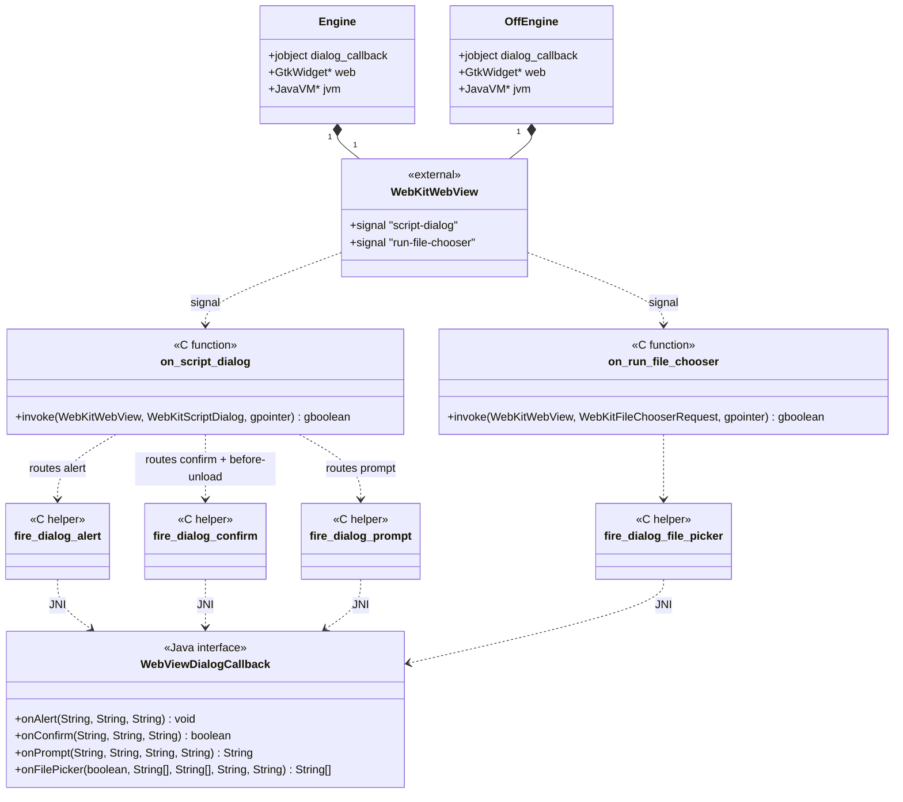

# REASONS Canvas: Browser-Initiated UI Dialogs — Linux WebKitGTK Coverage (Heavyweight + Lightweight)

## R · Requirements

- Wire the existing `WebViewDialogHandler` contract — designed and
  shipped in STORY-004-001 / canvas-11 — to the Linux WebKitGTK
  engines so JS-initiated `alert` / `confirm` / `prompt` and
  `<input type="file">` clicks flow through the per-component
  `DialogDispatcher` and end up on the Swing EDT, identical to the
  macOS WKWebView path.
- Both Linux engines are in scope:
  - **Heavyweight** (`WebViewHeavyweightComponent` →
    `EmbeddedWebView` → `gtk_create_engine` in
    `src_c/webview_embed.cpp:456`).
  - **Lightweight** (`WebViewLightweightComponent` →
    `OffscreenWebView` → `gtk_off_create_engine` in
    `src_c/webview_embed.cpp:1057`).
- Connect two `g_signal_connect` handlers on every `WebKitWebView`
  created by either engine:
  - `script-dialog` (`WebKitScriptDialog *`) — fires for `alert` /
    `confirm` / `prompt` / `before-unload`.  Returning `TRUE`
    suppresses the default GTK dialog and lets the application drive
    the response via `webkit_script_dialog_confirm_set_confirmed` /
    `webkit_script_dialog_prompt_set_text`.
  - `run-file-chooser` (`WebKitFileChooserRequest *`) — fires for
    `<input type="file">` clicks.  Returning `TRUE` suppresses the
    default GTK file chooser; the application calls
    `webkit_file_chooser_request_select_files` (accept) or
    `webkit_file_chooser_request_cancel` (cancel).
- The two signal handlers MUST be shared code (single C function per
  signal kind) registered at the two distinct `g_signal_connect`
  sites — same approach as the existing `on_load_changed` /
  `on_load_failed` handlers (lines 591-594) wired into both engines
  individually.  Per the canvas-11 Approach §10 commitment, sharing
  the function pointer keeps behaviour-symmetric across heavyweight
  and lightweight modes.
- `before-unload` (`WEBKIT_SCRIPT_DIALOG_BEFORE_UNLOAD_CONFIRM`) MUST
  route to `dispatchConfirm` — no dedicated `beforeUnloadOpened`
  handler is introduced in this story.  Matches story
  STORY-004-002 AC12 and the canvas-11 Norms commitment.
- Each signal handler MUST find the `Engine *` (or `OffEngine *`)
  via the `user_data` `gpointer` passed to `g_signal_connect` —
  same pattern as the existing `on_message` and `on_run_press`
  handlers, which already carry the engine pointer through this
  channel.
- Each handler MUST read the engine's `dialog_callback` `jobject`
  global ref (already declared on both `Engine` and `OffEngine`
  structs by STORY-004-001) and invoke the appropriate
  `WebViewDialogCallback` method via JNI:
  - `onAlert` — signature
    `(Ljava/lang/String;Ljava/lang/String;Ljava/lang/String;)V`.
  - `onConfirm` — signature
    `(Ljava/lang/String;Ljava/lang/String;Ljava/lang/String;)Z`.
  - `onPrompt` — signature
    `(Ljava/lang/String;Ljava/lang/String;Ljava/lang/String;Ljava/lang/String;)Ljava/lang/String;`.
  - `onFilePicker` — signature
    `(Z[Ljava/lang/String;[Ljava/lang/String;Ljava/lang/String;Ljava/lang/String;)[Ljava/lang/String;`.
- The handlers run on the GTK main thread (the dedicated GTK pump
  thread per the README "Heavyweight platform notes" section).  JNI
  attach / detach MUST follow the existing `fire_click_callback`
  pattern (line 402) — `GetEnv` first, fall back to
  `AttachCurrentThread` if needed, detach only when this call
  attached.
- The handler MUST always return `TRUE` so the GTK default never
  fires.  When `dialog_callback` is null (no handler installed yet,
  or post-disposal), the handler MUST still return `TRUE` and
  resolve the dialog with the JS-spec safe default:
  - Alert: no `set_*` call; return `TRUE`.
  - Confirm / before-unload:
    `webkit_script_dialog_confirm_set_confirmed(dialog, FALSE)`.
  - Prompt: no `set_text` call (engine treats absence as `null`);
    return `TRUE`.
  - File picker: `webkit_file_chooser_request_cancel(request)`.
  This preserves the no-handler invariant — the JS thread always
  resumes within bounded time even when the engine fires a dialog
  before peer-attach finishes wiring the callback (in practice
  impossible because no page is loaded yet, but the handler must
  not assume it).
- `pageUrl` and `frameUrl` MUST be populated from
  `webkit_web_view_get_uri(WEBKIT_WEB_VIEW(web))`.  WebKitGTK's
  script-dialog and file-chooser signals do not carry frame
  information at this API level, so `frameUrl` equals `pageUrl` —
  matches STORY-004-002 AC11 / AC18 (the AC verifies the top-level
  case only).
- `webkit_file_chooser_request_get_mime_types` returns a
  NULL-terminated `const gchar *const *`.  The handler MUST convert
  it to a `jobjectArray` of UTF-8 jstrings (empty array when the
  page imposed no `accept`).  The DialogDispatcher normalises on
  the Java side per canvas-11 Approach §9.
- File-extension hints: WebKitGTK's
  `webkit_file_chooser_request_get_mime_types_filter` returns a
  `GtkFileFilter *` (or `NULL`).  This filter is opaque — it does
  not expose the original `.ext` strings the page wrote.  The
  handler MUST pass an **empty extensions array** to Java; the
  Java-side normalisation (canvas-11 Operations §7) handles the
  empty case correctly and the default `JFileChooser` falls through
  to showing all files unfiltered.  This is a documented Linux
  limitation; the page's own `<input accept="...">` validation
  continues to work in JavaScript on the page side.
- The implementation MUST NOT regress existing GTK behaviour for
  any other dialog kind, signal, or load-cycle event.  Only the
  two new `g_signal_connect` calls are added in each engine; no
  existing signal handlers, scripts, or settings are modified.
- The implementation MUST NOT add new JNI entry points
  (`webview_embed_set_dialog_callback` and
  `webview_offscreen_set_dialog_callback` are already in place
  from STORY-004-001).  The implementation MUST NOT add Java-side
  code (the `DialogDispatcher` is already wired and the
  `WebViewDialogCallback` adapter is already installed at
  peer-attach time on both Swing subclasses).  The story is purely
  native: four new pieces of C / glib code in `src_c/webview_embed.cpp`.
- Definition of Done:
  - All 16 STORY-004-002 ACs from
    `requirements/[User-story-4]browser-initiated-ui-dialogs.md` pass
    on Linux in both `WebViewHeavyweightComponent` and
    `WebViewLightweightComponent` modes.  Verified by running
    `WebViewDialogDemo` on a Linux host with X11 + WebKitGTK 2.x
    available.
  - The existing 57-test Java suite continues to pass with zero
    new failures (no Java code changes).
  - README's "Browser-initiated dialogs" section is updated: the
    Linux portion of the platform-status note now says "wired" for
    both modes instead of "uses platform-default dialogs".
- Out of scope (explicit non-goals):
  - Windows WebView2 coverage — STORY-004-003.
  - Standalone `WebView` integration (still scoped out per
    STORY-004-001 requirements).
  - Dedicated `beforeUnloadOpened` handler method — before-unload
    routes to `confirmOpened` as documented.
  - Surfacing file-extension hints to Java on Linux —
    `webkit_file_chooser_request_get_mime_types_filter`'s
    `GtkFileFilter` is opaque; documented as a Linux limitation.
  - `WebKitPermissionRequest` (geolocation / notifications /
    camera) — different signal, different shape, out of scope.
  - `authenticate` signal (HTTP basic / digest auth) — different
    channel, out of scope.
  - Drag-and-drop file uploads — different code path, doesn't go
    through `run-file-chooser`.

## E · Entities

This canvas does not introduce any new Java types.  All Java
contracts (`WebViewDialogHandler`, four event POJOs,
`WebViewDialogCallback`, `DialogDispatcher`,
`WebViewComponent.setDialogHandler`, etc.) were shipped in
STORY-004-001 / canvas-11 and remain unchanged.

Native types touched (all in `src_c/webview_embed.cpp`):

- **`Engine`** (line 348) — Linux heavyweight engine struct.  Already
  carries `jobject dialog_callback` from STORY-004-001
  (line 387 in this file, post-004-001).  No new fields.

- **`OffEngine`** (line 976) — Linux lightweight (offscreen) engine
  struct.  Already carries `jobject dialog_callback` from
  STORY-004-001.  No new fields.

- **`on_script_dialog`** (new static C function) — shared
  `script-dialog` signal handler.  Same body works against both
  `Engine *` and `OffEngine *` via a tiny templated / overloaded
  dispatch helper (the only thing each variant does differently is
  read the right `dialog_callback` field and call
  `webkit_web_view_get_uri` against the right web-view widget).

- **`on_run_file_chooser`** (new static C function) — shared
  `run-file-chooser` signal handler.  Same shape — engine-aware via
  the helper.

- **`fire_dialog_callback`** family (four new static C helpers, one
  per dialog kind) — JNI dispatch helpers that mirror the existing
  `fire_click_callback` shape (line 402): attach the GTK pump
  thread to the JVM if needed, resolve the `jmethodID`, call the
  `WebViewDialogCallback` method, sanitize any pending JNI
  exception, detach.  Each returns the dialog kind's natural type
  (`void` / `jboolean` / `jstring` (owned local ref) / `jobjectArray`
  (owned local ref)).

- **README.md** (modified) — the "Browser-initiated dialogs"
  platform-status subsection updates the Linux line to "wired
  (heavyweight + lightweight) via WebKitGTK `script-dialog` and
  `run-file-chooser` signals."



## A · Approach

1. **Signal-handler dispatch model:**
   - Each signal handler receives the engine pointer via the
     `gpointer user_data` slot of `g_signal_connect`.  This is the
     established convention in this file (e.g. line 607 passes `e`
     into the script-message handler).
   - The `Engine` and `OffEngine` structs share the relevant
     fields by name (`dialog_callback`, `web`, `jvm`).  Rather
     than templating, factor the engine-agnostic JNI work into
     four `fire_dialog_*` helpers that take the three fields as
     plain arguments — this avoids dragging GTK-engine
     struct definitions into the JNI helpers and keeps each helper
     a small, single-purpose function.

2. **`script-dialog` handler flow** (per dialog-kind branch on
   `webkit_script_dialog_get_dialog_type`):
   - **`WEBKIT_SCRIPT_DIALOG_ALERT`:**
     - Read message via `webkit_script_dialog_get_message(dialog)`.
     - Call `fire_dialog_alert(jvm, callback, message, pageUrl,
       frameUrl)`.
     - Return `TRUE`.  No need to set anything on the dialog —
       alert has no payload.
   - **`WEBKIT_SCRIPT_DIALOG_CONFIRM` and
     `WEBKIT_SCRIPT_DIALOG_BEFORE_UNLOAD_CONFIRM`:**
     - Read message.
     - Call `fire_dialog_confirm(...)`; capture `jboolean` result.
     - `webkit_script_dialog_confirm_set_confirmed(dialog,
       result == JNI_TRUE)`.
     - Return `TRUE`.  Mapping `BEFORE_UNLOAD_CONFIRM` →
       `dispatchConfirm` matches the canvas-11 commitment.
   - **`WEBKIT_SCRIPT_DIALOG_PROMPT`:**
     - Read message via `_get_message`; read default via
       `webkit_script_dialog_prompt_get_default_text`.
     - Call `fire_dialog_prompt(...)`; capture `jstring`-derived
       UTF-8 (or NULL for cancel).
     - On non-NULL: `webkit_script_dialog_prompt_set_text(dialog,
       resultCstr)`.  On NULL: do NOT call `_set_text` — WebKitGTK
       treats the absence as "user cancelled" and the page sees
       `null`.
     - Return `TRUE`.

3. **`run-file-chooser` handler flow:**
   - Read `gboolean multiple =
     webkit_file_chooser_request_get_select_multiple(request)`.
   - Read `const gchar *const *mimes =
     webkit_file_chooser_request_get_mime_types(request)`.  NULL or
     empty when the page imposed no `accept`.  Length is determined
     by NULL-termination.
   - Build `jobjectArray jmimes` (UTF-8 jstrings).
   - Build `jobjectArray jexts` as **empty** — see Requirements:
     WebKitGTK's `GtkFileFilter` does not expose the original
     extensions back to the host.  Java-side normalisation handles
     the empty case.
   - Read pageUrl via `webkit_web_view_get_uri(webView)`; frameUrl
     equals pageUrl (no per-frame info available from this signal).
   - Call `fire_dialog_file_picker(...)`; capture
     `jobjectArray jresult` of file paths.
   - If `jresult` is NULL or zero-length: call
     `webkit_file_chooser_request_cancel(request)`.
   - Otherwise: convert to a `const gchar **` of UTF-8 paths and
     call `webkit_file_chooser_request_select_files(request,
     paths)`.  WebKitGTK takes ownership semantics per its docs —
     it copies the strings, so we free the array (and our copied
     strings) immediately after.
   - Return `TRUE`.

4. **JNI attach / detach + exception sanitization:**
   - The GTK pump thread is NOT a JVM-attached thread by default
     (the existing `fire_click_callback` proves this — it
     defensively `AttachCurrentThread`s).  The new `fire_dialog_*`
     helpers follow the same pattern.
   - Every `CallVoidMethod` / `CallBooleanMethod` /
     `CallObjectMethod` is followed by
     `if (env->ExceptionCheck()) { env->ExceptionDescribe();
     env->ExceptionClear(); }` — pending Java exceptions
     propagating into GLib's signal-handler machinery would
     terminate the process.
   - Each helper detaches the JVM only if it attached locally.

5. **Why `fire_dialog_*` helpers don't cache `jmethodID`:**
   - The existing `fire_click_callback` resolves
     `GetObjectClass` + `GetMethodID` on every invocation
     (line 413-415).  Replicate that pattern.  Caching across
     calls would require cleaning up `GlobalRef`s on callback
     replacement; the cache-miss cost is dwarfed by the modal
     dialog's wall-clock duration.

6. **Null-callback safety:**
   - The engine's `dialog_callback` field can legitimately be NULL
     (no caller has wired the bridge yet, or the engine is being
     destroyed and the field was cleared first).  Both signal
     handlers MUST short-circuit safely in this state:
     - Alert: just return `TRUE`.
     - Confirm / before-unload: `_set_confirmed(dialog, FALSE)` +
       return `TRUE`.
     - Prompt: no `_set_text` (engine returns `null` to the page)
       + return `TRUE`.
     - File picker: `_cancel(request)` + return `TRUE`.
   - This preserves the no-handler invariant: the JS thread always
     resumes within bounded time even when the engine fires a
     dialog before peer-attach has wired the callback.

7. **EDT marshaling and the synchronous JS contract:**
   - The native handler invokes the Java method synchronously
     (e.g. `CallBooleanMethod` for confirm).  The Java side
     (`DialogDispatcher.dispatchConfirm`) hops to the EDT via
     `SwingUtilities.invokeAndWait`, runs the handler, and
     returns.  Only then does the native handler call
     `webkit_script_dialog_confirm_set_confirmed` and return
     `TRUE`.
   - During this round-trip the GTK pump thread is blocked.  That
     is correct per the JS contract — WebKitGTK suspends the JS
     thread for the duration of any `script-dialog` handler
     anyway; we're just doing the suspension inside our handler
     while we wait for the Java answer.
   - The GTK pump and the AWT EDT are decoupled threads per
     `README.md` ("A dedicated GTK pump thread drives the
     WebKitGTK main loop independently of AWT's X11 event loop").
     No mutual blocking dependency exists; `invokeAndWait` from
     the GTK pump is deadlock-free.  This is the same shape
     `WebViewClickCallback` already uses (via `invokeLater` — the
     new path adds the wait but doesn't change the threading
     topology).

8. **Suppression-of-GTK-default invariant:**
   - Returning `TRUE` from both handlers claims the dialog;
     WebKitGTK does not invoke any further default behaviour.
   - The handler is always installed in this story (one
     `g_signal_connect` per engine instance).  The Java side
     decides via `setDialogHandler` what UI to show; the GTK
     defaults are gone permanently for any
     `WebViewComponent`-managed engine.  This is the desired
     behaviour and matches STORY-004-002 AC1 / AC2 / AC13.
   - Callers wanting the GTK default back have no escape hatch in
     this story — by design, since the canvas-11 design committed
     to "the GTK default is fully suppressed once the bridge is
     installed."  If a future caller needs the GTK default,
     they can install a custom handler that calls the native
     dialog APIs directly (out of scope here).

9. **README update strategy:**
   - The "Browser-initiated dialogs" section already exists from
     STORY-004-001.  This canvas only edits the platform-status
     note inside it to mark Linux as wired.  The macOS / Windows
     descriptions are unchanged.
   - The Linux file-picker `accept`-extension limitation is
     documented in the same section as a one-line note.

## S · Structure

### Inheritance Relationships
1. No new Java types; existing `WebViewDialogHandler` / event POJOs
   / `WebViewDialogCallback` / `DialogDispatcher` /
   `WebViewComponent` API surface from STORY-004-001 is unchanged.
2. Native C functions are static-linkage helpers in
   `src_c/webview_embed.cpp`; no header changes.

### Dependencies
1. `on_script_dialog` (new) → WebKitGTK 2.x `script-dialog` signal
   on `WebKitWebView`; `webkit_script_dialog_get_dialog_type`,
   `_get_message`, `_prompt_get_default_text`,
   `_confirm_set_confirmed`, `_prompt_set_text`;
   `webkit_web_view_get_uri`.
2. `on_run_file_chooser` (new) → WebKitGTK 2.x `run-file-chooser`
   signal; `webkit_file_chooser_request_get_select_multiple`,
   `_get_mime_types`, `_select_files`, `_cancel`;
   `webkit_web_view_get_uri`.
3. `fire_dialog_alert` / `_confirm` / `_prompt` / `_file_picker`
   (new) → `JavaVM->GetEnv` / `AttachCurrentThread` /
   `DetachCurrentThread`; `JNIEnv->GetObjectClass` /
   `GetMethodID` / `CallVoidMethod` / `CallBooleanMethod` /
   `CallObjectMethod` / `NewStringUTF` / `GetStringUTFChars` /
   `ReleaseStringUTFChars` / `NewObjectArray` /
   `SetObjectArrayElement` / `FindClass` / `ExceptionCheck` /
   `ExceptionDescribe` / `ExceptionClear` / `DeleteLocalRef` /
   `DeleteGlobalRef`.
4. `gtk_create_engine` (modified) → `g_signal_connect` for
   `script-dialog` and `run-file-chooser`, both passing the
   `Engine *` as `user_data`.
5. `gtk_off_create_engine` (modified) → same two
   `g_signal_connect` calls, passing the `OffEngine *` as
   `user_data`.

### Layered Architecture
1. **Native engine layer** (`src_c/webview_embed.cpp`): two new
   shared signal-handler functions, four new JNI dispatch
   helpers, two new `g_signal_connect` registration sites
   (one per engine).  No changes to anything outside the
   GTK `#ifdef` block.
2. **JNI surface**: unchanged.  `webview_embed_set_dialog_callback`
   and `webview_offscreen_set_dialog_callback` are already wired
   to `gtk_set_dialog_callback` / `gtk_off_set_dialog_callback`
   by STORY-004-001.
3. **Engine wrapper layer** (`EmbeddedWebView` /
   `OffscreenWebView`): unchanged.
4. **Dispatcher layer** (`DialogDispatcher`): unchanged.
5. **Component API layer** (`WebViewComponent`): unchanged.
6. **Public contract layer** (`WebViewDialogHandler` + event
   POJOs): unchanged.
7. **Wiring layer** (`WebViewHeavyweightComponent.createPeer()`,
   `WebViewLightweightComponent.addNotify()`): unchanged — the
   `WebViewDialogCallback` adapters they install at peer-attach
   time start receiving events automatically once this canvas
   wires the native signal handlers.
8. **Demo layer** (`demos/WebViewDialogDemo/`): unchanged.  The
   demo's three handler modes start working on Linux as soon as
   this canvas lands.

## O · Operations

### 1. Add JNI Dispatch Helper — fire_dialog_alert
File: `src_c/webview_embed.cpp`
Location: alongside `fire_click_callback` (line 402), inside the
`WEBVIEW_GTK` `#ifdef` block (lines 240-1523).

1. Responsibility: invoke
   `WebViewDialogCallback.onAlert(String, String, String)V`
   on the JVM, attaching the GTK pump thread if needed and
   sanitizing any pending JNI exception before returning.
   Mirrors `fire_click_callback` (line 402-423) shape.
2. Signature:
   ```
   static void fire_dialog_alert(
       JavaVM *jvm, jobject callback,
       const char *message, const char *pageUrl, const char *frameUrl);
   ```
3. Logic:
   - If `jvm == nullptr` or `callback == nullptr`, return
     immediately.
   - `JNIEnv *env = nullptr; bool detach = false;`
   - `if (jvm->GetEnv((void**)&env, JNI_VERSION_1_6) != JNI_OK) {
     jvm->AttachCurrentThread((void**)&env, nullptr); detach =
     true; }`.
   - If `env == nullptr`, return.
   - Convert each `const char *` to a `jstring` via
     `env->NewStringUTF(s ? s : "")`.
   - `jclass cls = env->GetObjectClass(callback);`
   - `jmethodID m = env->GetMethodID(cls, "onAlert",
     "(Ljava/lang/String;Ljava/lang/String;Ljava/lang/String;)V");`
   - If `m != nullptr`: `env->CallVoidMethod(callback, m, jmsg,
     jpage, jframe);`.
   - `if (env->ExceptionCheck()) { env->ExceptionDescribe();
     env->ExceptionClear(); }`.
   - `env->DeleteLocalRef(jmsg); env->DeleteLocalRef(jpage);
     env->DeleteLocalRef(jframe); env->DeleteLocalRef(cls);`.
   - `if (detach) jvm->DetachCurrentThread();`.
4. Constraints: never throws back into C++ /
   GLib.  Always sanitizes any pending Java exception before
   returning.

### 2. Add JNI Dispatch Helper — fire_dialog_confirm
File: `src_c/webview_embed.cpp` (same area as Operation 1).

1. Responsibility: invoke
   `WebViewDialogCallback.onConfirm(String, String, String)Z`;
   return the `jboolean` answer (or `JNI_FALSE` on any error).
2. Signature:
   ```
   static jboolean fire_dialog_confirm(
       JavaVM *jvm, jobject callback,
       const char *message, const char *pageUrl, const char *frameUrl);
   ```
3. Logic: shaped like Operation 1 but:
   - Method ID via `GetMethodID(cls, "onConfirm",
     "(Ljava/lang/String;Ljava/lang/String;Ljava/lang/String;)Z")`.
   - `jboolean result = env->CallBooleanMethod(callback, m, jmsg,
     jpage, jframe);`.
   - On exception: clear it and set `result = JNI_FALSE`.
   - Return `result` (false on null jvm / callback / env / cls /
     mid / exception — i.e. the safe default for "no answer").

### 3. Add JNI Dispatch Helper — fire_dialog_prompt
File: `src_c/webview_embed.cpp` (same area).

1. Responsibility: invoke
   `WebViewDialogCallback.onPrompt(String, String, String, String)Ljava/lang/String;`;
   return a newly-allocated UTF-8 `char *` (caller owns; free with
   `g_free` — see Norms for the allocator choice) or `NULL` on cancel /
   error.
2. Signature:
   ```
   static char *fire_dialog_prompt(
       JavaVM *jvm, jobject callback,
       const char *message, const char *defaultValue,
       const char *pageUrl, const char *frameUrl);
   ```
3. Logic:
   - Initial `char *result = nullptr;`.
   - Attach + resolve method via
     `GetMethodID(cls, "onPrompt",
     "(Ljava/lang/String;Ljava/lang/String;Ljava/lang/String;Ljava/lang/String;)Ljava/lang/String;")`.
   - `jstring jresult = (jstring)env->CallObjectMethod(callback,
     m, jmsg, jdefault, jpage, jframe);`.
   - On exception: clear, force `jresult = nullptr` (so result
     stays null → cancel).
   - If `jresult != nullptr`:
     - `const char *cstr = env->GetStringUTFChars(jresult,
       nullptr);`.
     - If `cstr != nullptr`: `result = g_strdup(cstr);
       env->ReleaseStringUTFChars(jresult, cstr);`.
     - `env->DeleteLocalRef(jresult);`.
   - Clean up local refs + detach.
   - Return `result`.  Caller MUST `g_free(result)` when done
     (matches existing `g_free(s)` discipline used after
     `jsc_value_to_string` results, line 605).

### 4. Add JNI Dispatch Helper — fire_dialog_file_picker
File: `src_c/webview_embed.cpp` (same area).

1. Responsibility: invoke
   `WebViewDialogCallback.onFilePicker(boolean, String[], String[], String, String)[Ljava/lang/String;`;
   return a newly-allocated NULL-terminated `gchar **` of UTF-8
   paths (caller owns; free with `g_strfreev`) or `NULL` on cancel
   / error.  The empty-array case (zero-length array from Java) is
   ALSO surfaced as `NULL` — the caller treats `NULL` as "cancel"
   uniformly.
2. Signature:
   ```
   static gchar **fire_dialog_file_picker(
       JavaVM *jvm, jobject callback,
       gboolean multiple,
       const gchar *const *mimeTypes,
       const gchar *const *extensions,
       const char *pageUrl, const char *frameUrl);
   ```
3. Logic:
   - Initial `gchar **result = nullptr;`.
   - Build `jobjectArray jmimes`: find `java/lang/String` via
     `env->FindClass`.  Count entries in `mimeTypes` until NULL.
     `NewObjectArray(count, stringCls, nullptr)` then loop
     `SetObjectArrayElement(arr, i, NewStringUTF(mimes[i]))` +
     `DeleteLocalRef` for each `NewStringUTF` result.  When
     `mimeTypes == nullptr`, build a zero-length array (still
     non-null per the canvas-11 contract).
   - Build `jobjectArray jexts` analogously (always zero-length on
     Linux today — see Requirements).
   - Resolve method via
     `GetMethodID(cls, "onFilePicker",
     "(Z[Ljava/lang/String;[Ljava/lang/String;Ljava/lang/String;Ljava/lang/String;)[Ljava/lang/String;")`.
   - `jobjectArray jresult = (jobjectArray)env->CallObjectMethod(
     callback, m, (jboolean)multiple, jmimes, jexts, jpage,
     jframe);`.
   - On exception: clear, force `jresult = nullptr`.
   - If `jresult != nullptr` AND its length > 0:
     - Allocate `result = g_new0(gchar *, length + 1);` (last
       entry remains `NULL` for `_strfreev`).
     - For each element: read `jstring` →
       `GetStringUTFChars` → `g_strdup` → `ReleaseStringUTFChars`
       → store in `result[i]` → `DeleteLocalRef`.
     - If the resulting array would have zero non-null entries
       (defensive), free it and set `result = nullptr`.
   - Clean up local refs (jmimes, jexts, jpage, jframe, jresult,
     cls, stringCls).
   - Detach if attached.
   - Return `result`.  Caller MUST `g_strfreev(result)` when done.

### 5. Add Signal Handler — on_script_dialog
File: `src_c/webview_embed.cpp` (alongside `fire_dialog_*`
helpers).

1. Responsibility: handle the `script-dialog` signal on any
   `WebKitWebView` created by either GTK engine.  Shared by both
   heavyweight and lightweight; engine pointer arrives via
   `user_data`.  But the engine pointer is one of two types
   (`Engine *` or `OffEngine *`), so this story uses two thin
   wrapper handlers that extract the right field and call a shared
   inner function.
2. Inner function (engine-agnostic):
   ```
   static gboolean handle_script_dialog(
       JavaVM *jvm, jobject dialog_callback,
       const gchar *page_url,
       WebKitScriptDialog *dialog);
   ```
   Logic:
   - `WebKitScriptDialogType type = webkit_script_dialog_get_dialog_type(dialog);`
   - `const gchar *message = webkit_script_dialog_get_message(dialog);` (returns const, do NOT free).
   - `const char *frame_url = page_url ? page_url : "";` (no per-frame info on this signal).
   - Switch on `type`:
     - `case WEBKIT_SCRIPT_DIALOG_ALERT`:
       - `fire_dialog_alert(jvm, dialog_callback, message, page_url, frame_url);`
       - (no `set_*` call needed.)
     - `case WEBKIT_SCRIPT_DIALOG_CONFIRM`:
     - `case WEBKIT_SCRIPT_DIALOG_BEFORE_UNLOAD_CONFIRM`:
       - `jboolean ok = JNI_FALSE;`
       - If `dialog_callback != nullptr`:
         `ok = fire_dialog_confirm(jvm, dialog_callback, message, page_url, frame_url);`
       - `webkit_script_dialog_confirm_set_confirmed(dialog, ok == JNI_TRUE);`
     - `case WEBKIT_SCRIPT_DIALOG_PROMPT`:
       - `const gchar *def = webkit_script_dialog_prompt_get_default_text(dialog);`
       - `char *answer = nullptr;`
       - If `dialog_callback != nullptr`:
         `answer = fire_dialog_prompt(jvm, dialog_callback, message, def ? def : "", page_url, frame_url);`
       - If `answer != nullptr`:
         `webkit_script_dialog_prompt_set_text(dialog, answer);
         g_free(answer);`
       - (If null: do NOT call `_set_text`; engine returns null to
         the page, matching the JS-spec cancel semantic.)
     - `default`: nothing — silently let it through (TRUE return
       still suppresses any default; the unknown type doesn't reach
       Java).
   - Return `TRUE`.
3. Thin wrappers:
   ```
   static gboolean on_script_dialog_engine(
       WebKitWebView *web, WebKitScriptDialog *dialog, gpointer user_data) {
       Engine *e = static_cast<Engine *>(user_data);
       if (!e) return TRUE;
       const gchar *uri = webkit_web_view_get_uri(web);
       return handle_script_dialog(e->jvm, e->dialog_callback, uri, dialog);
   }

   static gboolean on_script_dialog_off_engine(
       WebKitWebView *web, WebKitScriptDialog *dialog, gpointer user_data) {
       OffEngine *e = static_cast<OffEngine *>(user_data);
       if (!e) return TRUE;
       const gchar *uri = webkit_web_view_get_uri(web);
       return handle_script_dialog(e->jvm, e->dialog_callback, uri, dialog);
   }
   ```
4. Constraints:
   - Always returns `TRUE` so the GTK default never fires.
   - Reads `dialog_callback` AT INVOCATION (the field is
     volatile-like for read purposes — the GTK pump is the only
     thread that touches it during the dialog lifecycle; the JNI
     setter via `gtk_set_dialog_callback` is called by the EDT but
     ordering is enforced by the natural happens-before of the
     `g_signal_connect` install and any subsequent dialog signal).
   - On null `dialog_callback`, applies the safe default per
     Requirements §safe-default and Approach §6.

### 6. Add Signal Handler — on_run_file_chooser
File: `src_c/webview_embed.cpp` (alongside `on_script_dialog`).

1. Responsibility: handle the `run-file-chooser` signal on any
   `WebKitWebView` created by either GTK engine.  Same
   shared-inner-function + two-wrappers pattern as Operation 5.
2. Inner function:
   ```
   static gboolean handle_run_file_chooser(
       JavaVM *jvm, jobject dialog_callback,
       const gchar *page_url,
       WebKitFileChooserRequest *request);
   ```
   Logic:
   - `gboolean multiple = webkit_file_chooser_request_get_select_multiple(request);`
   - `const gchar *const *mime_types = webkit_file_chooser_request_get_mime_types(request);`
     (NULL or NULL-terminated array of UTF-8 strings; do NOT free.)
   - `const char *frame_url = page_url ? page_url : "";`
   - If `dialog_callback == nullptr`:
     `webkit_file_chooser_request_cancel(request);
     return TRUE;`
   - `gchar **paths = fire_dialog_file_picker(jvm, dialog_callback,
     multiple, mime_types, /* extensions */ nullptr, page_url,
     frame_url);`
   - If `paths == nullptr` (cancel / empty):
     `webkit_file_chooser_request_cancel(request);`
   - Else:
     - `webkit_file_chooser_request_select_files(request,
       (const gchar *const *)paths);`
     - WebKitGTK copies the strings internally — the canonical
       reference is the WebKitGTK 2.x docs for
       `webkit_file_chooser_request_select_files`.
     - Free with `g_strfreev(paths);`.
   - Return `TRUE`.
3. Thin wrappers `on_run_file_chooser_engine` /
   `on_run_file_chooser_off_engine` — same shape as Operation 5's
   wrappers but reading `WebKitFileChooserRequest *` from the
   second arg and using `OffEngine *` vs `Engine *`.
4. Constraints:
   - Always returns `TRUE` so the GTK default file picker never
     fires.
   - Always resolves the request — `_select_files` OR `_cancel`,
     never neither — so the page's JS `change` event always fires
     within bounded time.

### 7. Connect Signal Handlers in gtk_create_engine
File: `src_c/webview_embed.cpp` (modify `gtk_create_engine` at
line 456).

1. Locate the existing `load-changed` / `load-failed`
   registration block (lines 591-594).
2. AFTER that block (so dialog handlers are wired immediately
   after the load handlers but BEFORE the external-message
   manager setup at line 597), insert:
   ```
   // Wire JS-initiated dialogs (alert / confirm / prompt /
   // <input type=file>) to the per-engine Java DialogDispatcher
   // via the dialog_callback global ref.  Returning TRUE from each
   // handler suppresses the default GTK dialog; the Java side
   // decides what UI (if any) to show, with default behaviour
   // being Swing dialogs anchored on the host JFrame.  See
   // WebViewDialogHandler for the full contract.
   g_signal_connect(WEBKIT_WEB_VIEW(e->web), "script-dialog",
                    (GCallback)on_script_dialog_engine, e);
   g_signal_connect(WEBKIT_WEB_VIEW(e->web), "run-file-chooser",
                    (GCallback)on_run_file_chooser_engine, e);
   ```
3. Constraints:
   - The two `g_signal_connect` calls pass `e` (the `Engine *`) as
     `user_data`.  The signal handlers read `e->jvm`,
     `e->dialog_callback`, and `e->web` from it.
   - Both registrations happen unconditionally — i.e. before the
     caller has wired any `WebViewDialogHandler`.  The handlers
     short-circuit safely when `dialog_callback` is NULL.
   - No `g_signal_handler_disconnect` is added in
     `gtk_destroy_engine` because the GTK widget destruction
     (line 830-834) automatically removes all signal handlers
     connected to the widget.

### 8. Connect Signal Handlers in gtk_off_create_engine
File: `src_c/webview_embed.cpp` (modify `gtk_off_create_engine`
at line 1057).

1. Locate the existing `script-message-received::external`
   registration block (lines 1092-1102).
2. AFTER that block (so dialog handlers are wired immediately
   after the message handler), insert:
   ```
   // Wire JS-initiated dialogs to the per-engine Java
   // DialogDispatcher.  Same shape as gtk_create_engine; the
   // offscreen variants of the signal handlers route through
   // OffEngine instead of Engine but call the same inner
   // handle_script_dialog / handle_run_file_chooser logic.
   g_signal_connect(WEBKIT_WEB_VIEW(e->web), "script-dialog",
                    (GCallback)on_script_dialog_off_engine, e);
   g_signal_connect(WEBKIT_WEB_VIEW(e->web), "run-file-chooser",
                    (GCallback)on_run_file_chooser_off_engine, e);
   ```
3. Constraints:
   - Same as Operation 7, with `e` of type `OffEngine *`.
   - No disconnection in `gtk_off_destroy_engine` (line 1180) —
     widget destruction at line 1184 removes the handlers.

### 9. Update README — mark Linux wired
File: `README.md`.

1. Locate the "Browser-initiated dialogs" subsection (added by
   STORY-004-001's canvas).  The current platform-status
   paragraph reads:
   > "**Platform coverage (current).**  macOS heavyweight
   > (WKWebView) routes all four dialog kinds through the handler
   > in this release (STORY-004-001).  On Linux and Windows,
   > `setDialogHandler` stores the handler reference but the
   > embedded engine continues to use its built-in dialogs until
   > STORY-004-002 (WebKitGTK signal handlers) and STORY-004-003
   > (WebView2 `ScriptDialogOpening` event) land. ..."
2. Rewrite to:
   > "**Platform coverage (current).**  macOS heavyweight
   > (WKWebView) routes all four dialog kinds through the handler
   > (STORY-004-001).  Linux WebKitGTK routes all four kinds
   > through the handler in both heavyweight and lightweight modes
   > via the `script-dialog` and `run-file-chooser` signals
   > (STORY-004-002).  On Windows, `setDialogHandler` stores the
   > handler reference but the embedded engine continues to use
   > its built-in dialogs until STORY-004-003 (WebView2
   > `ScriptDialogOpening` event) lands.  On Windows,
   > `<input type="file">` will continue to use the OS-native
   > dialog even after STORY-004-003 — WebView2 exposes no public
   > hook for it, so `filePickerOpened` never fires on Windows."
3. Add a small Linux-specific limitation note in the same
   subsection (after the platform-coverage paragraph):
   > "On Linux, the `WebViewFilePickerEvent.acceptedExtensions`
   > list is always empty even when the page wrote
   > `<input accept=".png,.jpg">` — WebKitGTK exposes the
   > extension filter as an opaque `GtkFileFilter` rather than
   > the original extension strings.  The page's MIME-type hints
   > (`accept="image/png"` etc.) are surfaced via
   > `acceptedMimeTypes`; the page's own client-side `accept`
   > validation continues to work."
4. No other prose changes.

## N · Norms

- **Mirror `fire_click_callback`'s JNI pattern.**  The four new
  `fire_dialog_*` helpers follow the same shape: defensive
  `GetEnv` + `AttachCurrentThread` + detach-only-if-we-attached;
  `GetObjectClass` + `GetMethodID` per call (no caching);
  `ExceptionCheck` / `Describe` / `Clear` after every
  `Call*Method`; local-ref cleanup via `DeleteLocalRef`.
  Consistency with the existing pattern is worth more than the
  micro-optimisation of method-id caching.
- **Two wrappers per signal, one shared inner.**  The
  `Engine` / `OffEngine` divergence is a single line — read the
  right `dialog_callback` field, the right `jvm`, and pass them
  plus the page URL into a shared inner function.  This avoids
  template hackery while keeping the bulk of the logic in one
  place.
- **Always return `TRUE`** from both signal handlers.  This is the
  invariant that suppresses the GTK default.  A future maintainer
  must NOT add a `return FALSE` branch — that would re-enable the
  GTK default dialog, which immediately breaks STORY-004-002
  AC1 / AC2 / AC13 and reintroduces the `transient_for` glitch the
  story is meant to fix.
- **Always resolve the dialog before returning.**  Every code
  path in `on_script_dialog` and `on_run_file_chooser` must call
  the appropriate `_set_confirmed` / `_set_text` / `_select_files`
  / `_cancel` function (or, for alert, just return) so the page's
  JS thread always resumes within bounded time.  In particular,
  the null-callback path MUST resolve the dialog with the safe
  default, NEVER leave it un-resolved.
- **String memory ownership.**  Strings returned from
  `fire_dialog_prompt` are caller-owned (`g_strdup`'d UTF-8) and
  must be `g_free`'d after `webkit_script_dialog_prompt_set_text`.
  Arrays returned from `fire_dialog_file_picker` are caller-owned
  (`gchar **` allocated with `g_new0`, each entry `g_strdup`'d) and
  must be `g_strfreev`'d after
  `webkit_file_chooser_request_select_files`.  WebKitGTK copies
  the strings internally per the WebKitGTK 2.x docs, so freeing
  immediately after the call is correct.
- **No new headers, no new dependencies.**  All required types
  (`WebKitScriptDialog`, `WebKitFileChooserRequest`,
  `WebKitScriptDialogType` enum, `_get_message`,
  `_get_dialog_type`, `_prompt_get_default_text`,
  `_confirm_set_confirmed`, `_prompt_set_text`,
  `_get_select_multiple`, `_get_mime_types`, `_select_files`,
  `_cancel`) are part of the WebKitGTK 2.x public API and live
  under `webkit2/webkit2.h` which is already included via the
  GTK `#include` block at the top of
  `src_c/webview_embed.cpp`.
- **Use only long-stable WebKitGTK accessors.**  All of the
  accessors named in Operations 5 and 6 have been in WebKitGTK
  since 2.0; no version conditional is needed (the existing
  project supports both `libwebkit2gtk-4.0-dev` and
  `libwebkit2gtk-4.1-dev` per README, and these accessors are
  identical between the two).  Do NOT introduce
  `webkit_script_dialog_ref` / `_close` — the synchronous return
  model keeps the dialog alive for the duration of the signal
  handler.
- **JNI attach defensiveness.**  Always check the return of
  `AttachCurrentThread` (some pathological JVM states can reject
  it).  If it fails, the helper returns the safe default (void /
  FALSE / NULL / NULL) and the dialog still resolves via the
  Operations 5/6 null-callback path.
- **No JS shim, no reserved binding.**  This story is pure native
  signal-handler wiring; the `__webview_*` reserved-prefix
  convention is untouched.
- **No JSON dependency.**  All payloads are primitive strings
  (`jstring`) or string arrays (`jobjectArray` of `jstring`); no
  JSON encoding / decoding involved.
- **`pom.xml` Java 8 target stays in force.**  No Java code
  changes in this story, so the language-level target is
  trivially preserved.
- **No automated tests for GUI integration.**  Consistent with
  the existing canvases for the heavyweight / lightweight
  components and with STORY-004-001's testing strategy.  Manual
  AC verification via `WebViewDialogDemo` on a real Linux host
  (X11 + WebKitGTK 2.x) is the chosen approach.  The 27
  `DialogDispatcherTest` cases shipped in STORY-004-001 continue
  to cover the Java-side dispatcher contract, including the
  paths that STORY-004-002's native code exercises end-to-end.

## S · Safeguards

- **Signal handler ALWAYS returns `TRUE`.**  Every code path in
  `on_script_dialog_*` and `on_run_file_chooser_*` returns
  `TRUE`.  A `FALSE` return re-enables the GTK default dialog,
  immediately violating AC1 / AC2 / AC13.
- **Signal handler ALWAYS resolves the dialog or request before
  returning.**  Required state transitions:
  - Alert: nothing to set.  Just return.
  - Confirm / before-unload: `_set_confirmed` MUST be called
    (even on the null-callback / exception path; pass `FALSE`).
  - Prompt: either `_set_text(answer)` for non-null answer, OR
    no `_set_text` call for null (engine treats absence as cancel).
    The handler MUST NOT both call `_set_text` and treat the
    answer as cancel.
  - File picker: `_select_files` for non-empty result, OR
    `_cancel` for empty / null result.  Never neither.
- **Null `dialog_callback` is a legitimate, non-fatal state.**
  The handler MUST short-circuit safely (per Approach §6) — never
  invoke any `fire_dialog_*` helper with a null callback.  This
  preserves the no-handler invariant during peer-attach windows
  and post-disposal teardown.
- **JNI attach / detach symmetry.**  Each `fire_dialog_*` helper
  detaches the JVM IFF it attached locally.  Asymmetric
  attach/detach (especially detach-without-attach) crashes the
  process.  The `bool detach = ...` pattern from
  `fire_click_callback` is the canonical mechanism.
- **JNI exception sanitization on every C-call boundary.**  After
  every `Call*Method`, check `ExceptionCheck` and clear any
  pending exception.  A pending Java exception propagating into
  GLib signal-dispatch infrastructure terminates the process.
  The helper's return value defaults to the safe sentinel on
  any exception path.
- **Allocator discipline.**  Strings allocated for return from
  `fire_dialog_prompt` use `g_strdup` (the GLib allocator
  WebKitGTK / GTK expect), not `strdup` or `new[]`.  Free with
  `g_free`.  Arrays allocated for return from
  `fire_dialog_file_picker` use `g_new0(gchar*, n+1)` so the
  NULL terminator is implicit, and each element uses `g_strdup`.
  Free with `g_strfreev` (handles each entry + the outer array).
  Failure to use the matching allocator pair will eventually
  trigger heap corruption on any allocator-aware build.
- **WebKitGTK string return-value contracts.**
  `webkit_script_dialog_get_message`,
  `_prompt_get_default_text`,
  `webkit_file_chooser_request_get_mime_types`, and
  `webkit_web_view_get_uri` all return strings owned by the
  caller's `WebKit*` object — DO NOT free.  Their lifetime is
  bound by the dialog / request / web-view object lifetime; the
  handler is the only user during its own synchronous run, so
  the values are safe to use without copying.
- **`webkit_file_chooser_request_select_files` argument
  ownership.**  Per WebKitGTK docs, the function copies the
  string array internally; the caller is free to (and should)
  `g_strfreev` the array immediately after the call.  Do NOT
  leave the array allocated for the request's lifetime — that's
  the request's job, not ours.
- **`webkit_script_dialog_prompt_set_text` argument ownership.**
  Per WebKitGTK docs, the function copies the string internally;
  free our `g_strdup`'d copy immediately after.
- **Identical behaviour across heavyweight and lightweight.**
  STORY-004-002 AC14 explicitly asserts that the same page input
  produces identical Java field values in both modes.  Because
  the two thin wrappers call a SHARED inner function that
  receives identical inputs (page URL, message, default text,
  multiple flag, mime-types array), behaviour is byte-identical
  by construction.  A future maintainer modifying one wrapper
  without the other will violate this AC.
- **No `g_signal_handler_disconnect` in destroy paths.**  GTK
  removes all signal handlers automatically when the widget is
  destroyed (`gtk_widget_destroy` at lines 830-834 / 1184).
  Adding an explicit disconnect would be redundant and risks
  use-after-free if the handler ID isn't stored correctly.
- **Disposal race safety.**  `gtk_destroy_engine` and
  `gtk_off_destroy_engine` already clear `dialog_callback` to
  NULL before destroying the widget (added in STORY-004-001).
  Any signal handler that fires during the destroy window
  observes the cleared field via the Approach §6 null-callback
  path and resolves the dialog with the safe default.
- **`<input type=file>` empty-extensions-array Java contract.**
  The Java-side `DialogDispatcher.normaliseExtensions` (canvas-11
  Operation 7) accepts a `String[]` argument including null /
  empty.  Passing a zero-length `jobjectArray` from Operation 4
  resolves cleanly to `Collections.emptyList()` on the
  `WebViewFilePickerEvent`; the default `JFileChooser` falls
  through to "show all files".
- **`before-unload` routing.**  Mapping
  `WEBKIT_SCRIPT_DIALOG_BEFORE_UNLOAD_CONFIRM` to
  `dispatchConfirm` matches the canvas-11 commitment and
  STORY-004-002 AC12.  A future maintainer adding a dedicated
  `beforeUnloadOpened` to `WebViewDialogHandler` MUST also
  update Operation 5's switch branch to route to it; until then,
  the two enum values share the confirm handler.
- **Linux-only.**  Both `g_signal_connect` calls and all five
  new functions (4 fire helpers + 2 inner handlers + 2×2
  wrappers + ...) live inside the existing `#ifdef WEBVIEW_GTK`
  block.  They are invisible to the macOS and Windows builds.
- **Native code review focus.**  The macOS implementation
  (STORY-004-001) is the closest precedent and the gold standard;
  this story's code should be reviewed against it for
  thread-attach symmetry, exception sanitization, and
  string-ownership discipline.  Any divergence between platforms
  on those three axes is a likely bug.
