# REASONS Canvas: Browser-Initiated UI Dialogs — Windows WebView2 Coverage

## R · Requirements

- Wire the existing `WebViewDialogHandler` contract — designed and
  shipped in STORY-004-001 / canvas-11, with Linux WebKitGTK coverage
  added in STORY-004-002 / canvas-12 — to the Windows WebView2
  engine so JS-initiated `alert` / `confirm` / `prompt` (and
  `before-unload`) flow through the per-component
  `DialogDispatcher` and end up on the Swing EDT.
- The Windows engine is `windows/webview_embed.cc`, which hosts an
  `ICoreWebView2` controller created lazily in the controller-ready
  callback inside `create_engine`.  The new wiring lives entirely
  inside that callback plus a new `ScriptDialogHandler` class
  defined alongside the existing `FocusHandler` / `MsgHandler`.
- Suppress WebView2's built-in dialogs by calling
  `settings->put_AreDefaultScriptDialogsEnabled(FALSE)` right after
  the existing `put_AreDevToolsEnabled` /
  `put_AreDefaultContextMenusEnabled` calls
  (`windows/webview_embed.cc:430-437`).  Without this, both the
  built-in WebView2 dialog AND the Java-side Swing dialog would
  appear simultaneously — visibly violating story
  STORY-004-003 AC12.
- Register a `ScriptDialogHandler` (implementing
  `ICoreWebView2ScriptDialogOpeningEventHandler`) via
  `webview->add_ScriptDialogOpening(handler, &e->script_dialog_token)`
  right after the existing `add_WebMessageReceived` site
  (`windows/webview_embed.cc:447-449`).  Follow the established
  `CallbackBase<Iface>` template pattern used by `FocusHandler` /
  `MsgHandler` for reference-counted COM lifetime.
- The handler's `Invoke` runs on the WebView2 worker thread per
  engine (the dedicated message-pump thread created in
  `create_engine` — `windows/webview_embed.cc:562+`).  It MUST:
  1. Read `args->get_Kind`, `args->get_Message`, `args->get_Uri`,
     and (for prompt) `args->get_DefaultText`.
  2. Call `args->GetDeferral(&deferral)` to defer the response —
     the WebView2 worker thread must keep pumping the message
     queue while we wait for the EDT to produce an answer, so we
     CANNOT block synchronously inside `Invoke`.
  3. Return `S_OK` immediately, with the deferral held by a
     worker thread we spin up to do the JNI hop into
     `DialogDispatcher`.
  4. When Java returns, marshal back onto the WebView2 worker
     thread via the existing `dispatch_to_thread(e, [...]{...})`
     helper, apply the answer to the args
     (`args->Accept()` / `args->put_ResultText(...)`), call
     `deferral->Complete()`, then release the deferral and args.
- The blocking-block-the-worker alternative discussed in the
  analysis (canvas-11 Approach §"deadlock risk?" for Windows) is
  REJECTED: the worker thread also services WM_DISPATCH messages,
  controller event callbacks, JS execution, and rendering ticks;
  blocking it inside `Invoke` would freeze unrelated engine
  operations and risk deadlocking the `dispatch_to_thread` call
  the dispatcher itself needs to feed the answer back.  The
  deferral pattern is the supported / documented one and is what
  the WebView2 SDK examples use.
- Use the JS-thread suspension: WebView2 holds the page's JS
  thread suspended for the duration of the open dialog (the
  caller's `alert(...)` / `confirm(...)` / `prompt(...)` does
  not return until our `deferral->Complete()` fires).  This is
  correct per the JS contract and is the same effective
  behaviour the Linux / macOS branches produce via their native
  synchronous return models.
- The `Engine` struct must carry an
  `EventRegistrationToken script_dialog_token{}` alongside the
  existing `message_token`, `got_focus_token`, `lost_focus_token`
  (`windows/webview_embed.cc:107-109`).  No need to call
  `remove_ScriptDialogOpening` explicitly — engine destruction
  releases the controller / webview which detaches all event
  handlers; mirrors how `destroy_engine` already handles the
  three existing tokens.
- `before-unload` routes to `dispatchConfirm` — same as Linux.
  WebView2 surfaces this as
  `COREWEBVIEW2_SCRIPT_DIALOG_KIND_BEFOREUNLOAD`; the handler's
  switch maps it to `fire_dialog_confirm` exactly like the
  regular `_CONFIRM` kind.  Matches story STORY-004-003 AC9 and
  the canvas-11 / canvas-12 commitments.
- The four JNI dispatch helpers (`fire_dialog_alert` /
  `fire_dialog_confirm` / `fire_dialog_prompt` /
  `fire_dialog_file_picker`) introduced on Linux in
  STORY-004-002 are NOT shared into the Windows binary —
  Windows is built from a separate translation unit
  (`windows/webview_embed.cc`) that doesn't include
  `src_c/webview_embed.cpp`.  The Windows side needs its own
  copies of the three relevant helpers (alert / confirm /
  prompt; no file picker — see below).  The helpers are
  byte-equivalent to the GTK versions modulo
  `g_strdup` → `strdup` / `g_free` → `free`.
- File picker: WebView2 exposes NO public hook for
  `<input type="file">`.  This story does NOT intercept the
  file picker.  `<input type="file">` continues to open the
  OS-native Common Item Dialog as today; the page receives the
  selection through the normal `change` event.
  `WebViewFilePickerEvent` does not fire on Windows.  This is a
  documented platform limitation per STORY-004-003 AC4 and the
  canvas-11 design.  No `fire_dialog_file_picker` helper is
  needed on Windows.
- Handler exceptions are caught by the Java side
  (`DialogDispatcher`'s try/catch forwards to
  `Thread.getDefaultUncaughtExceptionHandler`); on the Windows
  native side, `Invoke` and the deferred completion code MUST
  always call `deferral->Complete()` exactly once on every code
  path, even when the Java answer is the "safe fallback"
  (alert: no-op; confirm: false; prompt: null).  A skipped
  `Complete` hangs the page's JS thread forever.  Matches story
  STORY-004-003 AC13.
- `pageUrl` and `frameUrl` MUST both be populated from
  `args->get_Uri`.  WebView2 does not expose a separate frame
  URL on the dialog event args at this SDK version, so
  `frameUrl` equals `pageUrl` (top-level only).  This matches
  STORY-004-003 AC11's verification (which only checks the
  top-level case) and the canvas-11 analysis resolution.
  Document the equality in the README's Windows note.
- The Java side and the JNI surface are already complete:
  - `WebViewDialogHandler`, four event POJOs, `DialogDispatcher`,
    `WebViewDialogCallback`, `WebViewComponent.setDialogHandler`,
    `EmbeddedWebView.setDialogCallback`, the Java-side
    `WebViewDialogCallback` adapter installed at peer-attach in
    `WebViewHeavyweightComponent.createPeer()` — all unchanged.
  - `Java_ca_weblite_webview_WebViewNative_webview_1embed_1set_1dialog_1callback`
    (`windows/webview_embed.cc:970-988`) already stores/clears
    the `dialog_callback` global ref correctly.
  - `Engine::dialog_callback` field exists at
    `windows/webview_embed.cc:132`.  `destroy_engine` already
    clears it (`windows/webview_embed.cc:621-630`).
  STORY-004-003 only adds the event-handler side that consumes
  this field.
- The implementation MUST NOT regress any other existing Windows
  WebView2 behaviour.  Only:
  1. One `settings->put_AreDefaultScriptDialogsEnabled(FALSE)` call.
  2. One `webview->add_ScriptDialogOpening` registration.
  3. One new `EventRegistrationToken` field in `Engine`.
  4. One new `ScriptDialogHandler` class.
  5. Three new `fire_dialog_*` JNI helpers (alert / confirm /
     prompt — no file_picker on Windows).
- Definition of Done:
  - All 13 STORY-004-003 ACs from
    `requirements/[User-story-4]browser-initiated-ui-dialogs.md`
    pass on Windows 11 with the system WebView2 Runtime installed.
    Verified by running `WebViewDialogDemo` on a Windows host.
  - The existing 57-test Java suite continues to pass with zero
    new failures (no Java code changes).
  - The macOS heavyweight (STORY-004-001) and Linux WebKitGTK
    (STORY-004-002) implementations continue to work unchanged —
    no shared code is touched.
  - README's "Browser-initiated dialogs" subsection is updated:
    the Windows portion of the platform-status note now says
    "wired" for alert/confirm/prompt and "uses the OS-native
    Common Item Dialog (no WebView2 hook); `filePickerOpened`
    never fires on Windows" for the file picker.
- Out of scope (explicit non-goals):
  - Intercepting `<input type="file">` on Windows.  WebView2
    has no public hook; documented as a permanent platform
    limitation.
  - `NewWindowRequested`, `PermissionRequested`,
    `BasicAuthenticationRequested`, `WebResourceRequested`,
    `DocumentTitleChanged` — different event channels, out of
    scope for this story.
  - Standalone `WebView` integration (scoped out per canvas-11).
  - Dedicated `beforeUnloadOpened` handler method —
    `before-unload` routes to `confirmOpened` as documented.
  - Migrating the vendored WebView2 SDK header
    (`windows/script/Microsoft.Web.WebView2.0.8.355`) to a newer
    version.  The vendored SDK supports
    `ICoreWebView2ScriptDialogOpeningEventHandler` and
    `ICoreWebView2Settings::put_AreDefaultScriptDialogsEnabled`,
    which are sufficient.

## E · Entities

This canvas introduces no new Java types.  All Java contracts
(`WebViewDialogHandler`, four event POJOs,
`WebViewDialogCallback`, `DialogDispatcher`,
`WebViewComponent.setDialogHandler`) were shipped in STORY-004-001
and remain unchanged.

Native types touched (all in `windows/webview_embed.cc`):

- **`Engine`** (line 100, in the `embed_win` namespace) —
  Windows engine struct.  Already carries `jobject dialog_callback`
  (line 132) from STORY-004-001.  This canvas adds one new field:
  `EventRegistrationToken script_dialog_token{}` alongside the
  existing `message_token` / `got_focus_token` / `lost_focus_token`
  at lines 107-109.

- **`ScriptDialogHandler`** (new C++ class) — implements
  `ICoreWebView2ScriptDialogOpeningEventHandler` via the existing
  `CallbackBase<Iface>` template (line 190).  Stores an
  `Engine *` like `FocusHandler` / `MsgHandler`.  Its `Invoke`
  reads the dialog args, gets a deferral, spawns a worker
  thread for the JNI hop, and returns `S_OK` immediately.

- **`fire_dialog_alert` / `fire_dialog_confirm` /
  `fire_dialog_prompt`** (three new C++ helper functions) —
  byte-equivalent to the GTK versions from STORY-004-002 but
  using `strdup` / `free` rather than `g_strdup` / `g_free`
  (no GLib on Windows).  They live alongside the existing
  `fire_focus_callback` / `fire_click_callback` at
  `windows/webview_embed.cc:135-188`.  No
  `fire_dialog_file_picker` is added — WebView2 has no
  public file-picker hook.

- **`dispatch_to_thread`** (existing helper, line 530) — used
  unchanged.  The completion-side code in
  `ScriptDialogHandler` worker thread posts a lambda via
  this helper to marshal the answer back onto the WebView2
  worker thread for `Accept` / `put_ResultText` /
  `deferral->Complete`.

- **README.md** (modified) — "Browser-initiated dialogs"
  platform-status subsection updates the Windows line to
  "wired (alert / confirm / prompt) via WebView2's
  `add_ScriptDialogOpening` event" and explicitly notes that
  `<input type="file">` continues to use the OS-native Common
  Item Dialog because WebView2 exposes no public hook.

```mermaid
classDiagram
direction TB

class Engine {
    +HWND parent
    +HWND child
    +DWORD thread_id
    +ICoreWebView2Controller* controller
    +ICoreWebView2* webview
    +EventRegistrationToken message_token
    +EventRegistrationToken got_focus_token
    +EventRegistrationToken lost_focus_token
    +EventRegistrationToken script_dialog_token
    +jobject dialog_callback
    +JavaVM* jvm
}

class CallbackBase {
    <<template>>
    +AddRef() ULONG
    +Release() ULONG
    +QueryInterface(REFIID, LPVOID*) HRESULT
}

class ScriptDialogHandler {
    -Engine* m_engine
    +Invoke(ICoreWebView2, ICoreWebView2ScriptDialogOpeningEventArgs) HRESULT
}

class fire_dialog_alert {
    <<C function>>
}

class fire_dialog_confirm {
    <<C function>>
}

class fire_dialog_prompt {
    <<C function>>
}

class ICoreWebView2 {
    <<external>>
    +add_ScriptDialogOpening(handler, &token) HRESULT
}

class ICoreWebView2Settings {
    <<external>>
    +put_AreDefaultScriptDialogsEnabled(BOOL) HRESULT
}

class ICoreWebView2ScriptDialogOpeningEventArgs {
    <<external>>
    +get_Uri(LPWSTR*) HRESULT
    +get_Kind(COREWEBVIEW2_SCRIPT_DIALOG_KIND*) HRESULT
    +get_Message(LPWSTR*) HRESULT
    +get_DefaultText(LPWSTR*) HRESULT
    +Accept() HRESULT
    +put_ResultText(LPCWSTR) HRESULT
    +GetDeferral(ICoreWebView2Deferral**) HRESULT
}

class WebViewDialogCallback {
    <<Java interface>>
    +onAlert(String, String, String) void
    +onConfirm(String, String, String) boolean
    +onPrompt(String, String, String, String) String
}

ScriptDialogHandler --|> CallbackBase
ICoreWebView2 ..> ScriptDialogHandler : add_ScriptDialogOpening
ICoreWebView2 ..> ICoreWebView2Settings : configures
ScriptDialogHandler ..> ICoreWebView2ScriptDialogOpeningEventArgs : reads
ScriptDialogHandler ..> fire_dialog_alert : routes alert
ScriptDialogHandler ..> fire_dialog_confirm : routes confirm + before-unload
ScriptDialogHandler ..> fire_dialog_prompt : routes prompt
fire_dialog_alert ..> WebViewDialogCallback : JNI
fire_dialog_confirm ..> WebViewDialogCallback : JNI
fire_dialog_prompt ..> WebViewDialogCallback : JNI
Engine "1" *-- "1" ICoreWebView2
```



## A · Approach

1. **Two-thread deferral pattern.**  WebView2's
   `ScriptDialogOpening` event fires on the engine's dedicated
   WebView2 worker thread (the one created in `create_engine` that
   runs the message pump and services `WM_EMBED_DISPATCH` /
   `WM_EMBED_QUIT` messages).  We CANNOT block that thread
   synchronously waiting for the EDT, because:
   - The dispatcher's `dispatch_to_thread(e, ...)` for the
     completion-side code re-enters the same worker thread.  If
     the worker is blocked inside `Invoke`, the completion-side
     `PostThreadMessage` arrives but is never picked up — classic
     self-deadlock.
   - Other operations on the same engine (concurrent
     `webview_embed_eval`, `webview_embed_set_bounds`,
     repaint ticks) all use `dispatch_to_thread` and would queue
     indefinitely.
   - The WebView2 SDK explicitly documents the
     `GetDeferral` / `Complete` pattern for any handler that
     needs to perform work that might involve other threads.

   Therefore the flow is:

   ```
   WebView2 worker (Invoke)         Java worker          EDT
   ----------------------           -----------          ---
   Read Kind/Message/Uri
   GetDeferral -> deferral
   spawn std::thread([...]{
     fire_dialog_*(jvm, cb, ...)
                            -- JNI --> DialogDispatcher
                                       invokeAndWait ->
                                                       handler.X
                                                       <- return
                            <-------- answer
     dispatch_to_thread(e, [...]{
       Accept / put_ResultText
       deferral->Complete()
       deferral->Release()
       args->Release()
     });
   }).detach();
   return S_OK    // worker stays free to pump messages
   ```

   The Java worker thread does block on the EDT (via the
   dispatcher's `invokeAndWait`), but that's a single Java thread
   per dialog — it doesn't starve the WebView2 worker.

2. **Why `std::thread` rather than reusing a fixed worker pool.**
   Dialogs are user-driven, low-frequency, and modal — they don't
   come in bursts.  Each `Invoke` spinning a single `std::thread`
   for the duration of the modal is cheap relative to the
   dialog's wall-clock lifetime (user-action time).  A thread
   pool adds complexity (queueing, lifecycle) for no measurable
   benefit.  Match the existing patterns in
   `webview_embed_dispatch` (line 822) which also spins a
   short-lived thread via `dispatch_to_thread` indirectly.

3. **`fire_dialog_*` helpers are byte-equivalent across
   platforms.**  The Linux side (STORY-004-002) defines them in
   `src_c/webview_embed.cpp` inside `namespace embed`.  Windows
   needs its own copies inside `namespace embed_win` in
   `windows/webview_embed.cc`.  The translation-unit divergence
   is by design — the Windows build doesn't include
   `src_c/webview_embed.cpp` (separate `cl.exe` invocation per
   `script/build.bat`), so the symbols would conflict if
   shared.  The platform-specific allocator (`g_strdup` vs.
   plain `strdup`, `g_free` vs. plain `free`) further justifies
   the per-binary copy.  The MS-CRT `strdup` is widely available
   in `<cstring>` / `<string.h>`; if the existing Windows file
   already uses `_strdup` (the Microsoft-recommended name) we
   follow that.

4. **JNI dispatch from the Java worker thread.**  The
   `std::thread` spawned by `ScriptDialogHandler::Invoke` is
   NOT a JVM-attached thread.  The `fire_dialog_*` helpers must
   `AttachCurrentThreadAsDaemon` (or `AttachCurrentThread`) and
   detach on exit.  Same pattern as the GTK helpers but the
   thread is short-lived rather than persistent — daemon
   attachment avoids any concern about the thread keeping the
   JVM alive past intended shutdown.  Decision: use
   `AttachCurrentThread` (matching the existing
   `fire_focus_callback` and `fire_click_callback` patterns at
   `windows/webview_embed.cc:135-188`) since those also work on
   one-shot WebView2 worker invocations.

5. **Completion-side marshaling via `dispatch_to_thread`.**
   `args->Accept()`, `args->put_ResultText(...)`, and
   `deferral->Complete()` MUST be called on the WebView2 worker
   thread per Microsoft's threading model for WebView2 — any
   COM call on the engine's interfaces is bound to the thread
   they were created on.  Once the Java worker has the answer,
   it queues a lambda via `dispatch_to_thread(e, [...] {...})`
   that performs the three COM calls on the worker.  Inside the
   lambda the deferral and args are released via their
   `ComPtr`-style smart pointers (or explicit `Release` if we
   use raw pointers like the rest of the codebase does — see
   Norms).

6. **Per-kind result mapping (inside the completion-side
   lambda):**
   - **Alert:** `args->Accept()` is optional for alert (no
     payload to convey); just call `deferral->Complete()`.
     Calling `Accept` is harmless on a no-payload dialog and
     matches the SDK's intent — call it for clarity.
   - **Confirm / Before-unload:** if Java returned `true`, call
     `args->Accept()`.  If `false`, do NOT call `Accept`
     (WebView2 interprets "no Accept" as "user clicked
     Cancel").  Then `deferral->Complete()`.
   - **Prompt:** if Java returned a non-null string, call
     `args->put_ResultText(utf16)` and then `args->Accept()`.
     If Java returned `null`, do NOT call `put_ResultText` or
     `Accept` (cancel).  Then `deferral->Complete()`.

7. **`COREWEBVIEW2_SCRIPT_DIALOG_KIND` switch.**  The handler
   reads the kind once at the start of `Invoke` and stores it
   for the completion-side lambda.  Switch cases:
   - `_ALERT` → `fire_dialog_alert` →
     completion: `Accept` + `Complete`.
   - `_CONFIRM` / `_BEFOREUNLOAD` → `fire_dialog_confirm` →
     completion: `Accept` iff `true` + `Complete`.
   - `_PROMPT` → `fire_dialog_prompt` → completion:
     `put_ResultText` + `Accept` iff non-null + `Complete`.
   - default (unknown kind from a future SDK): just
     `Complete` the deferral.  Don't `Accept`.  Avoids
     bricking the page on a kind we don't recognise.

8. **UTF-16 / UTF-8 conversion.**  WebView2 API uses
   `LPWSTR` (UTF-16) throughout.  Existing codebase has
   `utf8_to_wide` (line 644) for the outgoing direction and
   `WideCharToMultiByte` for incoming (line 285-287).  Wrap
   the existing pattern in tiny helpers `wide_to_utf8(LPWSTR
   in) -> std::string` and reuse `utf8_to_wide` for outgoing.
   `args->get_Uri`, `_get_Message`, `_get_DefaultText` all
   return `LPWSTR` that must be released with
   `CoTaskMemFree`; capture the strings, copy to `std::string`,
   then immediately `CoTaskMemFree` so the rest of the
   pipeline can work in UTF-8.

9. **Settings change is unconditional.**  The
   `put_AreDefaultScriptDialogsEnabled(FALSE)` call happens
   every time the controller-ready callback runs, regardless
   of whether the Java side has registered a handler.  The
   `Java_..._set_dialog_callback` JNI bridge is what wires the
   actual response path; until that's called, the
   `ScriptDialogHandler` invokes a null Java callback and the
   handler returns the safe default
   (no-op for alert; false for confirm; null for prompt).
   The page's JS thread still resumes within bounded time.
   This matches the canvas-12 (Linux) null-callback safety
   invariant.

10. **No remove on destroy.**  `destroy_engine` (line 580)
    already releases the controller and webview interfaces,
    which detaches all event handlers including
    `ScriptDialogOpening`.  Adding an explicit
    `remove_ScriptDialogOpening` would be redundant and
    introduces a potential use-after-free if the token is
    re-used.  Match the existing pattern for the message /
    focus tokens — they aren't explicitly removed either.

11. **README update strategy.**  The "Browser-initiated
    dialogs" section already exists and was updated by
    STORY-004-002 for Linux.  This canvas tweaks the same
    platform-status paragraph to mark Windows as wired for the
    three dialog kinds, with a one-paragraph note about the
    OS-native file picker.  No structural changes to the
    README.

## S · Structure

### Inheritance Relationships
1. No new Java types; existing `WebViewDialogHandler`, four event
   POJOs, `WebViewDialogCallback`, `DialogDispatcher`,
   `WebViewComponent` API surface from STORY-004-001 is
   unchanged.
2. `ScriptDialogHandler` (new) inherits from the existing
   `CallbackBase<ICoreWebView2ScriptDialogOpeningEventHandler>`
   template (windows/webview_embed.cc:190) — same pattern as
   `FocusHandler`, `MsgHandler`, `EnvHandler`,
   `ControllerHandler`.

### Dependencies
1. `ScriptDialogHandler::Invoke` (new) → reads
   `ICoreWebView2ScriptDialogOpeningEventArgs::get_Uri /
   _get_Kind / _get_Message / _get_DefaultText / GetDeferral`;
   spawns a `std::thread` that calls one of the three
   `fire_dialog_*` helpers via JNI then `dispatch_to_thread`s
   the completion lambda back to the WebView2 worker.
2. `fire_dialog_alert / _confirm / _prompt` (new) → JNI
   `AttachCurrentThread` / `GetObjectClass` / `GetMethodID` /
   `CallVoidMethod` / `CallBooleanMethod` / `CallObjectMethod` /
   `NewStringUTF` / `GetStringUTFChars` /
   `ReleaseStringUTFChars` / `ExceptionCheck` /
   `ExceptionDescribe` / `ExceptionClear` / `DeleteLocalRef` /
   `DetachCurrentThread`.
3. `create_engine`'s controller-ready callback (modified) →
   adds `settings->put_AreDefaultScriptDialogsEnabled(FALSE)`
   inside the existing settings block (line 430-437); adds a
   `webview->add_ScriptDialogOpening` registration right after
   the `add_WebMessageReceived` site (line 447-449).

### Layered Architecture
1. **Native engine layer** (`windows/webview_embed.cc`): three
   new `fire_dialog_*` JNI helpers, one new
   `ScriptDialogHandler` class, two new lines in the
   controller-ready callback
   (`put_AreDefaultScriptDialogsEnabled(FALSE)` plus
   `add_ScriptDialogOpening`), one new field in the `Engine`
   struct (`script_dialog_token`).  No changes outside the
   `embed_win` namespace.
2. **JNI surface**: unchanged.
   `webview_embed_set_dialog_callback` already exists and works.
3. **Engine wrapper layer** (`EmbeddedWebView`): unchanged.
4. **Dispatcher layer** (`DialogDispatcher`): unchanged.
5. **Component API layer** (`WebViewComponent`): unchanged.
6. **Public contract layer** (`WebViewDialogHandler` + event
   POJOs): unchanged.
7. **Wiring layer**
   (`WebViewHeavyweightComponent.createPeer()`): unchanged —
   the `WebViewDialogCallback` adapter it installs at
   peer-attach time starts receiving Windows dialog events
   automatically once this canvas wires the
   `ScriptDialogHandler`.
8. **Demo layer** (`demos/WebViewDialogDemo/`): unchanged.

## O · Operations

### 1. Add Engine Field — script_dialog_token
File: `windows/webview_embed.cc`

1. Locate the `Engine` struct (line 100).
2. Find the three existing token fields:
   ```
   EventRegistrationToken message_token{};
   EventRegistrationToken got_focus_token{};
   EventRegistrationToken lost_focus_token{};
   ```
   (Lines 107-109.)
3. Add one new field immediately after, before the existing
   `jobject focus_callback` field:
   ```
   // EventRegistrationToken for the ScriptDialogOpening handler
   // registered in create_engine.  Not explicitly removed in
   // destroy_engine -- the controller / webview Release calls
   // there detach all event handlers transitively (same as
   // message_token / got_focus_token / lost_focus_token).
   EventRegistrationToken script_dialog_token{};
   ```
4. Constraints:
   - Zero-initialised (`{}`).  WebView2 fills it in via
     `add_ScriptDialogOpening`'s out parameter.
   - No corresponding cleanup in `destroy_engine` — see
     Approach §10.

### 2. Add JNI Dispatch Helper — fire_dialog_alert
File: `windows/webview_embed.cc`
Location: alongside the existing `fire_focus_callback` (line
135) and `fire_click_callback` (line 161), inside the
`namespace embed_win` block.

1. Responsibility: invoke
   `WebViewDialogCallback.onAlert(String, String, String)V`
   on the JVM.  Mirrors the Linux `fire_dialog_alert` from
   STORY-004-002 modulo the allocator (uses `std::string` for
   transient copies; no `g_strdup` / `g_free` needed since we
   don't return strings).
2. Signature:
   ```
   static void fire_dialog_alert(
       JavaVM *jvm, jobject callback,
       const char *message, const char *pageUrl,
       const char *frameUrl);
   ```
3. Logic:
   - If `jvm == nullptr` or `callback == nullptr`, return.
   - `JNIEnv *env = nullptr; bool detach = false;`
   - `if (jvm->GetEnv((void**)&env, JNI_VERSION_1_6) != JNI_OK) {
     if (jvm->AttachCurrentThread((void**)&env, nullptr) != JNI_OK
         || !env) return;
     detach = true; }`
   - `jstring jmsg = env->NewStringUTF(message ? message : "");`
   - `jstring jpage = env->NewStringUTF(pageUrl ? pageUrl : "");`
   - `jstring jframe = env->NewStringUTF(frameUrl ? frameUrl : "");`
   - `jclass cls = env->GetObjectClass(callback);`
   - `jmethodID m = env->GetMethodID(cls, "onAlert",
     "(Ljava/lang/String;Ljava/lang/String;Ljava/lang/String;)V");`
   - If `m != nullptr`:
     `env->CallVoidMethod(callback, m, jmsg, jpage, jframe);`
   - `if (env->ExceptionCheck()) { env->ExceptionDescribe();
     env->ExceptionClear(); }`
   - `env->DeleteLocalRef(jmsg); env->DeleteLocalRef(jpage);
     env->DeleteLocalRef(jframe); env->DeleteLocalRef(cls);`
   - `if (detach) jvm->DetachCurrentThread();`
4. Constraints: never throws back into C++.  Always sanitizes
   pending Java exceptions before returning.  Identical
   contract to the Linux `fire_dialog_alert`.

### 3. Add JNI Dispatch Helper — fire_dialog_confirm
File: `windows/webview_embed.cc` (same area as Operation 2).

1. Responsibility: invoke
   `WebViewDialogCallback.onConfirm(String, String, String)Z`;
   return the `jboolean` answer (or `JNI_FALSE` on any error).
2. Signature:
   ```
   static jboolean fire_dialog_confirm(
       JavaVM *jvm, jobject callback,
       const char *message, const char *pageUrl,
       const char *frameUrl);
   ```
3. Logic:
   - Same shell as Operation 2.  Resolve method via
     `GetMethodID(cls, "onConfirm",
     "(Ljava/lang/String;Ljava/lang/String;Ljava/lang/String;)Z")`.
   - `jboolean result = JNI_FALSE;`
   - `if (m != nullptr) result =
     env->CallBooleanMethod(callback, m, jmsg, jpage, jframe);`
   - On exception: clear, force `result = JNI_FALSE`.
   - Clean up local refs, detach if attached, return `result`.
4. Constraints: returns `JNI_FALSE` on any error path — the
   safe default for "no answer" (matches the JS-spec cancel
   semantic).

### 4. Add JNI Dispatch Helper — fire_dialog_prompt
File: `windows/webview_embed.cc` (same area).

1. Responsibility: invoke
   `WebViewDialogCallback.onPrompt(String, String, String, String)Ljava/lang/String;`;
   return a newly-allocated UTF-8 `char *` (caller owns; free
   with `free`) or `nullptr` on cancel / error.
2. Signature:
   ```
   static char *fire_dialog_prompt(
       JavaVM *jvm, jobject callback,
       const char *message, const char *defaultValue,
       const char *pageUrl, const char *frameUrl);
   ```
3. Logic:
   - Same shell as Operation 2/3.
   - `char *result = nullptr;`
   - Resolve method via
     `GetMethodID(cls, "onPrompt",
     "(Ljava/lang/String;Ljava/lang/String;Ljava/lang/String;Ljava/lang/String;)Ljava/lang/String;")`.
   - `jstring jresult = (jstring)env->CallObjectMethod(
     callback, m, jmsg, jdefault, jpage, jframe);`
   - On exception: clear, force `jresult = nullptr`.
   - If `jresult != nullptr`:
     `const char *cstr = env->GetStringUTFChars(jresult,
     nullptr);
     if (cstr != nullptr) {
       size_t n = strlen(cstr);
       result = (char *)malloc(n + 1);
       if (result) memcpy(result, cstr, n + 1);
       env->ReleaseStringUTFChars(jresult, cstr);
     }
     env->DeleteLocalRef(jresult);`
   - Clean up other local refs, detach if attached.
   - Return `result`.  Caller MUST `free(result)` when done.
4. Constraints: uses plain `malloc`/`free` (no GLib on Windows).
   Returns `nullptr` for cancel — completion-side code MUST
   check for null and use the "don't accept" path
   (WebView2 returns null to the page).

### 5. Add ScriptDialogHandler Class
File: `windows/webview_embed.cc`
Location: alongside `FocusHandler` / `MsgHandler` at line
246+, inside `namespace embed_win`.

1. Responsibility: handle the `ScriptDialogOpening` event on
   `ICoreWebView2`.  Spawn a JNI worker thread; on Java's
   return, marshal back to the WebView2 worker via
   `dispatch_to_thread` and complete the deferral.
2. Declaration:
   ```
   class ScriptDialogHandler : public CallbackBase<
       ICoreWebView2ScriptDialogOpeningEventHandler> {
   public:
       explicit ScriptDialogHandler(Engine *e) : m_engine(e) {}
       HRESULT STDMETHODCALLTYPE Invoke(
           ICoreWebView2 *,
           ICoreWebView2ScriptDialogOpeningEventArgs *args) override;
   private:
       Engine *m_engine;
   };
   ```
3. `Invoke` implementation:
   1. `if (!args || !m_engine) return S_OK;`
   2. Read the kind:
      ```
      COREWEBVIEW2_SCRIPT_DIALOG_KIND kind =
          COREWEBVIEW2_SCRIPT_DIALOG_KIND_ALERT;
      args->get_Kind(&kind);
      ```
   3. Read the strings:
      ```
      LPWSTR uri_w = nullptr;
      LPWSTR msg_w = nullptr;
      LPWSTR def_w = nullptr;
      args->get_Uri(&uri_w);
      args->get_Message(&msg_w);
      if (kind == COREWEBVIEW2_SCRIPT_DIALOG_KIND_PROMPT) {
          args->get_DefaultText(&def_w);
      }
      ```
   4. Convert to UTF-8 `std::string`:
      ```
      std::string uri = wide_to_utf8(uri_w);
      std::string msg = wide_to_utf8(msg_w);
      std::string def = wide_to_utf8(def_w);
      if (uri_w) CoTaskMemFree(uri_w);
      if (msg_w) CoTaskMemFree(msg_w);
      if (def_w) CoTaskMemFree(def_w);
      ```
   5. Get the deferral (AddRef on args so we keep it alive
      across the threads):
      ```
      ICoreWebView2Deferral *deferral = nullptr;
      HRESULT hr = args->GetDeferral(&deferral);
      if (FAILED(hr) || !deferral) {
          // Can't defer -- accept synchronously with the safe
          // default and let the engine resume.  This branch is
          // rare and a sign of an SDK-level error; logging it
          // helps diagnose.
          WV_LOG("GetDeferral failed: HRESULT=0x%08lx",
                 (unsigned long)hr);
          return S_OK;
      }
      args->AddRef();
      ```
   6. Spawn the JNI worker thread:
      ```
      Engine *e = m_engine;
      std::thread([e, args, deferral, kind, uri, msg, def] {
          // Invoke Java synchronously from this worker.
          jobject cb = e ? e->dialog_callback : nullptr;
          JavaVM *jvm = e ? e->jvm : nullptr;
          // Result placeholders for the completion-side lambda.
          jboolean confirmed = JNI_FALSE;
          char *prompt_answer = nullptr;
          switch (kind) {
              case COREWEBVIEW2_SCRIPT_DIALOG_KIND_ALERT:
                  if (cb) fire_dialog_alert(
                      jvm, cb, msg.c_str(),
                      uri.c_str(), uri.c_str());
                  break;
              case COREWEBVIEW2_SCRIPT_DIALOG_KIND_CONFIRM:
              case COREWEBVIEW2_SCRIPT_DIALOG_KIND_BEFOREUNLOAD:
                  if (cb) confirmed = fire_dialog_confirm(
                      jvm, cb, msg.c_str(),
                      uri.c_str(), uri.c_str());
                  break;
              case COREWEBVIEW2_SCRIPT_DIALOG_KIND_PROMPT:
                  if (cb) prompt_answer = fire_dialog_prompt(
                      jvm, cb, msg.c_str(), def.c_str(),
                      uri.c_str(), uri.c_str());
                  break;
              default:
                  break;
          }

          // Marshal back to the WebView2 worker thread to apply
          // the answer and complete the deferral.  ICoreWebView2*
          // methods are bound to the thread the engine was
          // created on (the engine's worker thread); calling
          // Accept / put_ResultText / Complete from the Java
          // worker would violate WebView2's threading model.
          dispatch_to_thread(e, [args, deferral, kind, confirmed,
                                 prompt_answer] {
              switch (kind) {
                  case COREWEBVIEW2_SCRIPT_DIALOG_KIND_ALERT:
                      args->Accept();
                      break;
                  case COREWEBVIEW2_SCRIPT_DIALOG_KIND_CONFIRM:
                  case COREWEBVIEW2_SCRIPT_DIALOG_KIND_BEFOREUNLOAD:
                      if (confirmed == JNI_TRUE) args->Accept();
                      // else: don't Accept -- WebView2 returns
                      // false to the page.
                      break;
                  case COREWEBVIEW2_SCRIPT_DIALOG_KIND_PROMPT:
                      if (prompt_answer != nullptr) {
                          std::wstring wtxt = utf8_to_wide(
                              prompt_answer);
                          args->put_ResultText(wtxt.c_str());
                          args->Accept();
                          free(prompt_answer);
                      }
                      // else: don't put_ResultText, don't Accept
                      // -- WebView2 returns null to the page.
                      break;
                  default:
                      break;
              }
              deferral->Complete();
              deferral->Release();
              args->Release();
          });
      }).detach();
      ```
   7. `return S_OK;`
4. Constraints:
   - Always returns `S_OK` immediately (after launching the
     worker thread).  The actual response happens
     asynchronously when Java returns.
   - `args` is `AddRef`'d before the worker thread launches and
     `Release`'d inside the completion-side lambda — covers
     the case where WebView2 would otherwise release `args`
     after `Invoke` returns.
   - The deferral is `Release`'d inside the completion-side
     lambda too.
   - On null `dialog_callback`, the safe-default path runs:
     alert → Accept (it has no payload); confirm → don't
     Accept (returns false to page); prompt → don't
     put_ResultText / Accept (returns null to page).  Page's
     JS thread always resumes.

### 6. Add UTF-16 / UTF-8 Conversion Helper
File: `windows/webview_embed.cc`
Location: alongside the existing `utf8_to_wide` (line 644),
inside `namespace embed_win`.

1. Responsibility: convert a (possibly null) `LPWSTR` to a
   `std::string` UTF-8.  Returns an empty string for null
   input.  Used by `ScriptDialogHandler::Invoke` to convert
   the `_get_Uri` / `_get_Message` / `_get_DefaultText`
   return values before the JNI worker thread launches (so
   `CoTaskMemFree` can happen on the WebView2 worker thread
   that owns those COM allocations).
2. Signature:
   ```
   static std::string wide_to_utf8(LPCWSTR w);
   ```
3. Logic:
   - If `w == nullptr` or `*w == L'\0'`, return `std::string()`.
   - `int n = WideCharToMultiByte(CP_UTF8, 0, w, -1, nullptr, 0,
     nullptr, nullptr);`
   - If `n <= 0`, return `std::string()`.
   - `std::string s(n, '\0');`
   - `WideCharToMultiByte(CP_UTF8, 0, w, -1, &s[0], n,
     nullptr, nullptr);`
   - If `!s.empty() && s.back() == '\0'` `s.pop_back();`
   - Return `s`.
4. Constraints:
   - Mirrors the inline pattern used in `engine_on_message`
     (line 285-288).  Factor it into a named helper so
     `ScriptDialogHandler::Invoke` doesn't duplicate the
     boilerplate.

### 7. Suppress Built-in WebView2 Dialogs
File: `windows/webview_embed.cc`
Location: the controller-ready callback inside
`create_engine`, around line 430-437.

1. Find the existing settings block:
   ```
   ICoreWebView2Settings *settings = nullptr;
   if (SUCCEEDED(e->webview->get_Settings(&settings)) &&
       settings) {
       settings->put_AreDevToolsEnabled(
           e->debug ? TRUE : FALSE);
       settings->put_AreDefaultContextMenusEnabled(TRUE);
       settings->Release();
   }
   ```
2. Add `put_AreDefaultScriptDialogsEnabled(FALSE)` before
   `settings->Release()`:
   ```
   ICoreWebView2Settings *settings = nullptr;
   if (SUCCEEDED(e->webview->get_Settings(&settings)) &&
       settings) {
       settings->put_AreDevToolsEnabled(
           e->debug ? TRUE : FALSE);
       settings->put_AreDefaultContextMenusEnabled(TRUE);
       // Suppress WebView2's built-in alert / confirm / prompt
       // dialogs.  Java drives the response via the
       // ScriptDialogHandler registered below.  STORY-004-003.
       settings->put_AreDefaultScriptDialogsEnabled(FALSE);
       settings->Release();
   }
   ```
3. Constraints:
   - Unconditional — the setting is applied every time an
     engine is created, regardless of whether the Java side
     has wired a handler.  The `ScriptDialogHandler` runs the
     null-callback safe-default path when no handler is wired,
     so the JS thread still resumes within bounded time.

### 8. Register the ScriptDialogOpening Handler
File: `windows/webview_embed.cc`
Location: the controller-ready callback in `create_engine`,
right after the `add_WebMessageReceived` site
(lines 447-449).

1. Find the existing message-handler registration:
   ```
   auto *mh = new MsgHandler(e);
   e->webview->add_WebMessageReceived(mh, &e->message_token);
   mh->Release();
   ```
2. Insert the dialog-handler registration immediately after:
   ```
   // Wire JS-initiated dialogs (alert / confirm / prompt /
   // before-unload) to the per-engine Java DialogDispatcher
   // via the dialog_callback global ref.  WebView2's built-in
   // dialogs are suppressed by
   // put_AreDefaultScriptDialogsEnabled(FALSE) above.  File
   // picker (<input type=file>) is NOT intercepted -- WebView2
   // exposes no public hook; the OS-native Common Item Dialog
   // continues to appear as before.  STORY-004-003.
   auto *sdh = new ScriptDialogHandler(e);
   e->webview->add_ScriptDialogOpening(
       sdh, &e->script_dialog_token);
   sdh->Release();
   ```
3. Constraints:
   - The `new` / `Release` pattern matches `MsgHandler` /
     `FocusHandler` registrations — `add_ScriptDialogOpening`
     retains its own ref so we drop ours immediately.
   - No `remove_ScriptDialogOpening` call in
     `destroy_engine` — controller / webview Release detaches
     handlers transitively.

### 9. Update README — mark Windows wired
File: `README.md`.

1. Locate the "Browser-initiated dialogs" subsection
   (added by canvas-11, updated by canvas-12).  The current
   platform-status paragraph reads:
   > "**Platform coverage (current).**  macOS heavyweight
   > (WKWebView) routes all four dialog kinds through the
   > handler (STORY-004-001).  Linux WebKitGTK routes all four
   > kinds through the handler in both heavyweight and
   > lightweight modes via the `script-dialog` and
   > `run-file-chooser` signals (STORY-004-002).  On Windows,
   > `setDialogHandler` stores the handler reference but the
   > embedded engine continues to use its built-in dialogs
   > until STORY-004-003 (WebView2 `ScriptDialogOpening`
   > event) lands.  On Windows, `<input type="file">` will
   > continue to use the OS-native dialog even after
   > STORY-004-003 — WebView2 exposes no public hook for it,
   > so `filePickerOpened` never fires on Windows."
2. Rewrite to:
   > "**Platform coverage (current).**  macOS heavyweight
   > (WKWebView) routes all four dialog kinds through the
   > handler (STORY-004-001).  Linux WebKitGTK routes all four
   > kinds through the handler in both heavyweight and
   > lightweight modes via the `script-dialog` and
   > `run-file-chooser` signals (STORY-004-002).  Windows
   > WebView2 routes alert / confirm / prompt (and
   > before-unload) through the handler via the
   > `ScriptDialogOpening` event combined with
   > `put_AreDefaultScriptDialogsEnabled(FALSE)`
   > (STORY-004-003).  On Windows, `<input type="file">`
   > continues to use the OS-native Common Item Dialog —
   > WebView2 exposes no public hook for the file picker, so
   > `filePickerOpened` never fires on Windows.  On Windows,
   > `frameUrl()` equals `pageUrl()` for now (top-level
   > only) because the `ScriptDialogOpening` event args do
   > not expose a separate frame URL."
3. No other prose changes.

## N · Norms

- **Mirror the existing `CallbackBase<Iface>` template** for
  the new `ScriptDialogHandler` class.  Match the
  `FocusHandler` / `MsgHandler` shape: minimal constructor
  taking `Engine *`, override `Invoke`, store the engine
  pointer in a private member.  Don't add lifecycle logic
  beyond what `CallbackBase` provides.
- **Mirror `fire_focus_callback` / `fire_click_callback`'s JNI
  pattern** for the three new `fire_dialog_*` helpers
  (`windows/webview_embed.cc:135-188`).  Per-call
  `GetObjectClass` + `GetMethodID`; `ExceptionCheck` /
  `Describe` / `Clear` after every `Call*Method`; defensive
  `AttachCurrentThread` with detach-iff-we-attached.
  Consistency with the existing pattern beats method-id
  caching.
- **Mirror Linux `fire_dialog_*` signatures** from
  STORY-004-002.  The Java JNI signature strings
  (`(Ljava/lang/String;Ljava/lang/String;Ljava/lang/String;)V`
  etc.) MUST be byte-identical across platforms — the same
  Java `WebViewDialogCallback` interface is the target.
  Method-name strings (`"onAlert"`, `"onConfirm"`,
  `"onPrompt"`) likewise byte-identical.
- **Two-thread deferral pattern.**  Use `GetDeferral` +
  `std::thread([..]{...}).detach()` for the JNI hop +
  `dispatch_to_thread(e, [..]{...})` for the WebView2
  completion side.  Do NOT block the WebView2 worker thread
  synchronously in `Invoke`.  This is the only thread-safe
  pattern documented by Microsoft for any WebView2 event that
  involves cross-thread waits.
- **AddRef args before the worker thread, Release inside the
  completion lambda.**  WebView2 owns the args lifetime
  inside `Invoke`; without `AddRef` it may release them
  between the `S_OK` return and our completion lambda.  The
  deferral is similarly captured by ref and released inside
  the completion lambda.
- **UTF-16 / UTF-8 conversion.**  Use the new `wide_to_utf8`
  helper for incoming `LPWSTR` strings; use the existing
  `utf8_to_wide` for the outgoing `put_ResultText` call.
  ALWAYS `CoTaskMemFree` the strings returned by
  `get_Uri` / `_get_Message` / `_get_DefaultText` — they are
  COM-allocated strings the caller owns.
- **Plain `malloc` / `free`** for the `fire_dialog_prompt`
  return path.  No GLib on Windows; matching the Linux
  side's `g_strdup` / `g_free` would require linking glib,
  which isn't part of the Windows toolchain.  The caller
  (the completion-side lambda) MUST `free` the returned
  string exactly once.
- **JNI exception sanitization on every C-call boundary.**
  After every `Call*Method`, check `ExceptionCheck` and clear
  any pending exception via `ExceptionDescribe` +
  `ExceptionClear`.  A pending Java exception propagating
  back through C++ into the WebView2 worker terminates the
  process — same rule as Linux / macOS.
- **Always Complete the deferral on every path.**  Every
  branch of the completion-side lambda's switch (including
  the `default` / unknown-kind branch) MUST call
  `deferral->Complete()` exactly once.  A skipped Complete
  hangs the page's JS thread forever.  Same invariant as the
  Linux signal handlers' "always resolve the dialog" rule
  but expressed through `Complete` instead of a
  webkit_script_dialog_*_set_* call.
- **No `remove_ScriptDialogOpening` in destroy paths.**  The
  controller's `Release` call in `destroy_engine` (line 580+)
  detaches the handler transitively.  Match the existing
  pattern for `message_token` / `got_focus_token` /
  `lost_focus_token`.
- **No new headers.**  All required types
  (`ICoreWebView2ScriptDialogOpeningEventHandler`,
  `ICoreWebView2ScriptDialogOpeningEventArgs`,
  `ICoreWebView2Deferral`, `ICoreWebView2Settings`,
  `COREWEBVIEW2_SCRIPT_DIALOG_KIND` enum) live in the
  vendored WebView2 SDK headers already included via
  `windows/script/Microsoft.Web.WebView2.0.8.355/build/native/include`
  (per `windows/script/build.bat:36-37`).
- **`extern "C"` discipline is preserved.**  The file's
  trailing `extern "C" {` block (line 843) wraps all JNI
  exports.  No JNI bridges are added by this story (the
  `webview_embed_set_dialog_callback` bridge already exists
  from STORY-004-001 and works correctly).  No new symbols
  need C linkage.
- **No Java code changes.**  This story is purely native.
  The 27 `DialogDispatcherTest` cases shipped in
  STORY-004-001 continue to cover the Java contract that
  STORY-004-003's native code exercises end-to-end.
- **No automated tests for GUI integration.**  Consistent
  with macOS / Linux stories and the existing canvases.
  Manual AC verification via `WebViewDialogDemo` on a real
  Windows 11 host with the WebView2 Runtime installed.

## S · Safeguards

- **Always Complete the deferral.**  Every branch of the
  completion-side lambda in `ScriptDialogHandler::Invoke`
  MUST call `deferral->Complete()` exactly once.  Skipping
  `Complete` (including via an exception escape we forgot to
  catch) leaves the page's JS thread suspended forever and
  is unrecoverable without page reload.
- **Always Release the deferral and args** inside the
  completion-side lambda.  We `AddRef`'d both before
  launching the worker thread; without the matching
  `Release` we leak the COM objects on every dialog.
- **No COM calls on the wrong thread.**  `args->Accept`,
  `args->put_ResultText`, and `deferral->Complete` MUST be
  called on the WebView2 worker thread (`e->thread_id`).
  The Java worker thread is NOT a WebView2 thread — calling
  these methods from there would silently misbehave or
  crash per WebView2's threading model.  Enforced by always
  routing the completion through `dispatch_to_thread(e, ...)`.
- **AddRef before crossing threads.**  Both `args` and
  `deferral` are `AddRef`'d in `Invoke` before launching
  the worker thread; without this, WebView2 may release
  them after `S_OK` returns, and the completion-side lambda
  references freed memory.
- **JNI attach / detach symmetry.**  The three
  `fire_dialog_*` helpers detach the JVM iff they attached
  locally.  The Java worker thread spawned by `Invoke` is
  new each time, so each helper invocation attaches and
  detaches fresh — no thread-local JVM attachment state to
  manage.
- **JNI exception sanitization on every C-call boundary.**
  After every `Call*Method`, check `ExceptionCheck` and
  clear.  A pending Java exception propagating into the
  WebView2 SDK terminates the process.
- **Null `dialog_callback` is a legitimate, non-fatal state.**
  `Invoke` MUST short-circuit safely when
  `e->dialog_callback` is null (no caller has wired the
  bridge yet, or the engine is being destroyed and the
  field was cleared first).  The safe-default flow runs:
  alert → Accept; confirm → don't Accept; prompt → don't
  put_ResultText / Accept.  Page's JS thread always resumes.
- **Disposal race safety.**  `destroy_engine` already clears
  `dialog_callback` to NULL (line 621-630, from STORY-004-001)
  before releasing the controller and webview.  Any
  in-flight `Invoke` running on the worker thread observes
  the cleared field via the Approach §6 null-callback path
  and resolves the dialog with the safe default.
- **Heap-string ownership.**  `fire_dialog_prompt`'s return
  value is malloc-allocated and the completion-side lambda
  MUST `free` it exactly once after using it (or, on cancel,
  unconditionally — the lambda checks `prompt_answer !=
  nullptr` and either frees or no-ops, but the malloc'd
  buffer if any is ALWAYS freed in the lambda).
- **UTF-16 conversion safety.**  `wide_to_utf8` handles null
  input and `WideCharToMultiByte` failures by returning an
  empty string.  `utf8_to_wide` for the outgoing
  `put_ResultText` direction is already proven by existing
  callers in the file.
- **Settings change is idempotent.**  Calling
  `put_AreDefaultScriptDialogsEnabled(FALSE)` multiple times
  is harmless — WebView2 just stores the latest value.  No
  reset on engine disposal is needed (the engine itself is
  destroyed).
- **`before-unload` routing.**  Mapping
  `COREWEBVIEW2_SCRIPT_DIALOG_KIND_BEFOREUNLOAD` to
  `fire_dialog_confirm` matches the canvas-11 commitment,
  the canvas-12 Linux behaviour, and STORY-004-003 AC9.  A
  future maintainer adding a dedicated `beforeUnloadOpened`
  to `WebViewDialogHandler` MUST update both this switch
  branch AND the Linux `handle_script_dialog` switch in
  lockstep.
- **No file-picker interception on Windows.**  WebView2 has
  no public hook for `<input type="file">` clicks.  The
  `ScriptDialogHandler` does NOT receive file-picker
  events; the OS-native Common Item Dialog continues to
  appear unchanged.  A future maintainer trying to "fix"
  this by adding a `fire_dialog_file_picker` helper to
  Windows will find no SDK hook to call it from — this is
  a permanent platform limitation.
- **Windows-only.**  All new code lives in
  `windows/webview_embed.cc`.  Linux (`src_c/webview_embed.cpp`)
  and macOS (`src_c/webview_embed.cpp` under `WEBVIEW_COCOA`)
  are untouched.  The Java side is untouched.
- **No regression of macOS / Linux paths.**  No shared code
  is modified.  The macOS `cocoa_create_engine` + WKUIDelegate
  path (STORY-004-001) and the Linux `gtk_create_engine` /
  `gtk_off_create_engine` + WebKitGTK signal-handler path
  (STORY-004-002) operate identically before and after this
  canvas.
- **Frame URL equality with page URL.**  WebView2's
  `ScriptDialogOpening` event args expose `get_Uri` (the
  top-level page URL) but no separate frame URL.  Both
  `pageUrl` and `frameUrl` fields on the Java event POJOs
  are populated from `get_Uri` on Windows.  Documented in
  the README's Windows note.  AC11 of STORY-004-003 only
  verifies the top-level case, so this is AC-compliant.
- **Vendored SDK version compatibility.**  The interfaces
  used (`ICoreWebView2ScriptDialogOpeningEventHandler`,
  `ICoreWebView2ScriptDialogOpeningEventArgs`,
  `ICoreWebView2Deferral`,
  `put_AreDefaultScriptDialogsEnabled`,
  `COREWEBVIEW2_SCRIPT_DIALOG_KIND` enum) are all part of
  the WebView2 SDK 1.0.x baseline that the vendored
  `Microsoft.Web.WebView2.0.8.355` package provides.  No
  version bump is required.
