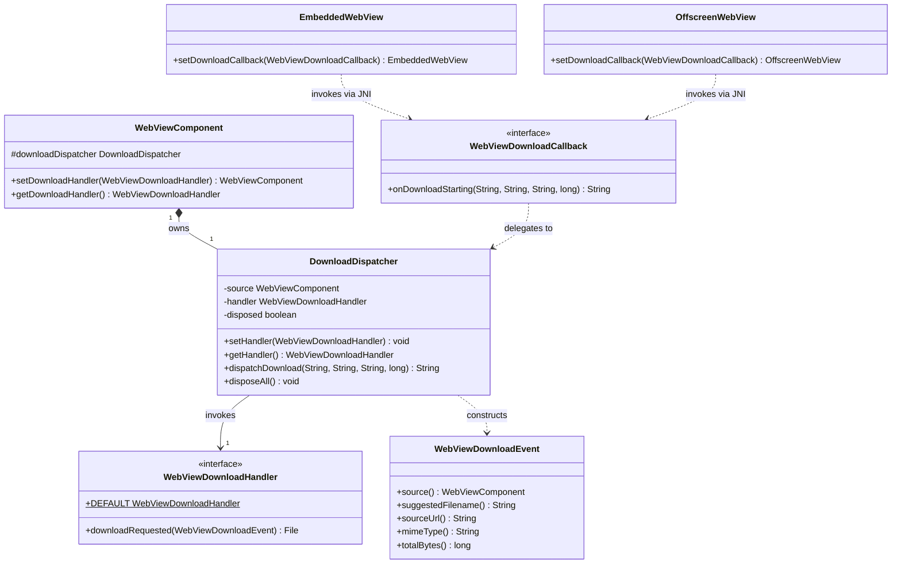

# REASONS Canvas: WebView Download Handler — Destination Routing (Java API + macOS + Linux + Windows Coverage)

## R · Requirements

- Establish the cross-platform Java contract for browser-initiated
  downloads originating inside the embedded page (HTTP responses
  carrying `Content-Disposition: attachment`, non-renderable MIME
  types like archives / installers / engine-unsupported binaries),
  and ship working coverage on all three supported engines — macOS
  `WKWebView` (11.3+), Linux `WebKitGTK` (heavyweight + lightweight),
  and Windows `WebView2` (modern Evergreen Runtime). Today every
  platform is silently broken: the page's link `click` fires, the
  engine classifies the response as a download, and then nothing —
  no file appears on disk, no JS-side error, no Java-side callback,
  no log line. The host application has no way to participate. The
  three native call sites are:
  - macOS — no `WKNavigationDelegate` is attached today (grep
    `WKNavigationDelegate` in `src_c/webview_embed.cpp` returns no
    matches; the engine relies on the default `WKWebView`
    navigation behaviour at
    `src_c/webview_embed.cpp:cocoa_create_engine`). Without a nav
    delegate, `webView:navigationAction:didBecomeDownload:` and
    `webView:navigationResponse:didBecomeDownload:` cannot fire, so
    every download is dropped. **This canvas wires a brand-new
    `WebviewEmbedNavigationDelegate` ObjC class — not an extension
    of `WebviewEmbedUIDelegate` (analysis Decision 3).**
  - Linux — `WebKitGTK` raises downloads via the
    `WebKitWebContext::download-started` signal. The codebase does
    not explicitly create a `WebKitWebContext` (grep
    `webkit_web_context` in `src_c/webview_embed.cpp` returns
    nothing), so every `WebKitWebView` uses
    `webkit_web_context_get_default()`. **This canvas connects
    `download-started` on the shared default context exactly once
    per process, routes to the originating engine via a new
    `WebKitWebView*` → `Engine*` / `OffEngine*` map (analysis
    Decision 2). Foreign WebViews not owned by this library are
    skipped.**
  - Windows — `WebView2`'s `ICoreWebView2_4::add_DownloadStarting`
    is the hook (`windows/webview_embed.cc` currently only registers
    `add_ScriptDialogOpening` at line 771). **This canvas adds an
    `ICoreWebView2DownloadStartingEventHandler` registration
    alongside the existing `ScriptDialogHandler`, querying the
    `ICoreWebView2_4` interface on the engine's `webview` object
    and silently skipping registration if the SDK headers / runtime
    do not expose it.**

- Expose a single public functional-style interface
  `ca.weblite.webview.WebViewDownloadHandler` with **one** `default`
  method, EDT-invoked:
  - `File downloadRequested(WebViewDownloadEvent event)` — default
    impl returns `${user.home}/Downloads/<deduped-filename>` after
    creating `~/Downloads` if absent. Returning `null` cancels the
    download (engine is told to abort; no bytes written).
  - A static `WebViewDownloadHandler.DEFAULT` constant points at an
    instance with the default method intact — mirrors
    `WebViewDialogHandler.DEFAULT` at
    `src/ca/weblite/webview/WebViewDialogHandler.java:92`.

- Expose one immutable event POJO `ca.weblite.webview.WebViewDownloadEvent`
  carrying the four engine-supplied fields:
  - `WebViewComponent source()`
  - `String suggestedFilename()` — engine-supplied; sanitised
    Java-side to strip path separators (`/`, `\`) and leading dots
    (defence-in-depth against engine sanitisation regressions; see
    Safeguards).
  - `String sourceUrl()` — the URL the response was fetched from.
  - `String mimeType()` — engine-supplied; empty string when not
    available.
  - `long totalBytes()` — engine-supplied content length; `-1` when
    unknown (chunked transfer encoding, missing `Content-Length`,
    or — on Linux only — a legitimate 0-byte response per the
    analysis's tolerated mapping in AC12).

- Expose `setDownloadHandler(WebViewDownloadHandler)` /
  `getDownloadHandler()` on `WebViewComponent` as concrete `final`
  methods (no abstract overload needed). Passing `null` to the
  setter installs an internal `DROP` handler whose
  `downloadRequested` returns `null` synchronously without UI —
  cancels every download, required for headless tests and kiosk
  modes. `getDownloadHandler()` MUST NEVER return `null`; it returns
  `WebViewDownloadHandler.DEFAULT` (the `~/Downloads` instance) when
  no caller has set one. Behaviourally identical to
  `setDialogHandler` / `getDialogHandler` at
  `src/ca/weblite/webview/swing/WebViewComponent.java:461-475`.

- Wire the contract to each native engine by adding a parallel
  `WebViewDownloadCallback` JNI bridge interface (sibling of
  `WebViewDialogCallback` at
  `src/ca/weblite/webview/WebViewDialogCallback.java:39`). The
  interface has one synchronous method in this canvas:
  - `String onDownloadStarting(String suggestedFilename, String sourceUrl, String mimeType, long totalBytes)`
    — returns the absolute path string for the destination, or
    `null` to cancel. Throws are not allowed (Java-side
    implementation catches and reports through the dispatcher's
    uncaught-exception forwarding).

- All handler callbacks MUST run on the Swing Event Dispatch Thread.
  The dispatcher uses `SwingUtilities.invokeAndWait` (NOT
  `invokeLater` — the native side is suspended waiting for the
  destination decision; matches the synchronous shape of
  `DialogDispatcher` at
  `src/ca/weblite/webview/DialogDispatcher.java:220`). The native
  UI thread MUST NOT call the dispatcher synchronously from the
  selector / signal handler / event handler — it MUST hand off to
  a worker thread first, mirroring the deferral pattern fixed for
  macOS dialogs in commit `480798c` (see Safeguards).

- The implementation MUST NOT introduce a JSON-parsing dependency
  (the project has none — `pom.xml:43-50` declares only JUnit-test
  dependency). Download events are not page-injected JS; no JS shim
  is installed and no reserved `__webview_*` binding name is added.
  Communication flows: native engine → JNI callback (via worker
  thread) → Java dispatcher → EDT-marshalled handler → return value
  → JNI return → engine receives destination path or cancel.

- The implementation MUST add two new JNI entry points on
  `WebViewNative`:
  - `webview_embed_set_download_callback(long, WebViewDownloadCallback)`
    — for the heavyweight engine (macOS WKWebView, Linux
    `WebKitWebView` in foreign-X11-window, Windows WebView2).
  - `webview_offscreen_set_download_callback(long, WebViewDownloadCallback)`
    — for the offscreen engine (Linux lightweight
    `GtkOffscreenWindow`; stub no-op on macOS / Windows).
  Both follow the existing
  `webview_embed_set_dialog_callback` /
  `webview_offscreen_set_dialog_callback` precedent
  (`WebViewNative.java:228, 243` regime — verify the exact names
  added by canvas-11 at generation time).

- The implementation MUST add `setDownloadCallback(WebViewDownloadCallback)`
  to both `EmbeddedWebView` (heavyweight wrapper at
  `src/ca/weblite/webview/EmbeddedWebView.java:442`) and
  `OffscreenWebView` (offscreen wrapper), mirroring the existing
  `setDialogCallback` on each. Anchoring the callback in the
  wrapper's `heap` `List<Object>` is required so the JVM does
  not collect the lambda while the native side holds a global
  ref — same shape as
  `EmbeddedWebView.setDialogCallback` at
  `EmbeddedWebView.java:442-449`.

- The implementation MUST wire the per-component dispatcher to the
  per-engine native callback at peer-attach time inside
  `WebViewHeavyweightComponent.createPeer()` and
  `WebViewLightweightComponent.addNotify()`, immediately following
  the existing dialog-callback install (sibling pattern; same
  conditional placement; same anchor in the heavyweight /
  lightweight engine wrapper's heap).

- Default destination policy (the
  `WebViewDownloadHandler.DEFAULT` impl):
  - Resolve `~/Downloads` as
    `new File(System.getProperty("user.home"), "Downloads")`.
  - Create the directory if absent (`mkdirs()`); on failure return
    `null` (cancel) and let the failure surface via
    `Thread.getDefaultUncaughtExceptionHandler()` after the
    dispatcher's catch.
  - De-duplicate: if `report.pdf` exists, try
    `report (1).pdf`, `report (2).pdf`, …, up to
    `report (999).pdf`. Split-point is the **last** `.`
    in the filename (so `archive.tar.gz` becomes
    `archive.tar (1).gz` per browser convention). After the
    999-collision ceiling return `null` (cancel).
  - **The full default-handler implementation runs entirely on
    the EDT** because the dispatcher's EDT-hop has already taken
    place. No async work, no second thread spawn.

- The implementation MUST add 21 acceptance criteria's worth of
  coverage:
  - 20 are STORY-005-001's original ACs from
    `requirements/[User-story-5]webview-download-handler.md`.
  - AC18 is tightened to specify **same-origin** URLs (the
    `<a download="...">` attribute is overridden by
    `Content-Disposition: attachment; filename=` cross-origin per
    the HTML spec — analysis Ambiguity).
  - AC21 (new — analysis Edge Case):
    > **AC21: Concurrent downloads produce independent
    > destinations.** Given a `WebViewComponent` on any supported
    > platform with the default handler and a page that initiates
    > two simultaneous downloads `a.txt` and `b.txt` of distinct
    > filenames within 100ms of each other, when both downloads
    > complete, then `${user.home}/Downloads/a.txt` and
    > `${user.home}/Downloads/b.txt` both exist with their
    > respective full contents, `downloadRequested` is invoked
    > exactly twice (once per file), and neither download's
    > destination decision blocks the other's destination
    > decision callback.

- Definition of Done:
  - All 21 acceptance criteria pass on the listed platforms.
  - `WebViewDownloadDemo` Swing app under
    `demos/WebViewDownloadDemo/` exercises the three handler modes
    (Default / Custom / Drop) mirroring `demos/WebViewDialogDemo/`.
    The demo serves three downloadable resources from a tiny
    embedded `com.sun.net.httpserver.HttpServer` (same pattern as
    the existing console / dialog demos use for their test pages).
  - `run-mac-download-demo.sh`,
    `run-linux-download-demo.sh`, and
    `run-windows-download-demo.bat` exist alongside the existing
    `run-*-dialog-demo.{sh,bat}` scripts in the project root.
  - `README.md` gains a new "Downloads" subsection between
    "Browser-initiated dialogs" and "Demo" documenting:
    `setDownloadHandler` / `getDownloadHandler` API; the
    `WebViewDownloadEvent` shape; the `~/Downloads` default policy
    and de-duplication; the `setDownloadHandler(null)` cancel-all
    semantics; the macOS 11.3+ caveat; the Windows modern-Evergreen
    caveat; the XDG-non-awareness caveat for Linux; the same-origin
    caveat for the `<a download>` attribute. README's existing
    "Browser-initiated dialogs" subsection structure is the
    template.
  - Unit tests for `DownloadDispatcher` (no real engine) validate
    handler invocation, EDT marshaling, `setHandler(null)` drop
    semantics, `getHandler() != null` invariant, exception
    isolation, filename sanitisation, and the fallback values
    produced when the dispatcher is disposed mid-flight. Mirrors
    `DialogDispatcherTest`'s style. The full
    end-to-end 21 ACs are verified manually via the demo per the
    project's no-automated-GUI-tests policy (Norms).

- Out of scope (explicit non-goals — story 2 territory or
  separately-tracked):
  - Per-download progress callbacks (`progress` /
    bytesReceived) — STORY-005-002.
  - Per-download completion / failure callbacks (`completed` /
    `failed`) — STORY-005-002.
  - Mid-flight `cancel()` from Java — STORY-005-002.
  - The `WebViewDownload` handle class, the
    `WebViewDownloadListener` interface, and the
    `WebViewDownloadHandler.downloadStarted` second method —
    STORY-005-002. **This canvas designs the
    `WebViewDownloadHandler` interface so STORY-005-002 can add
    `downloadStarted` as a second `default` method without
    rewriting any existing handler.**
  - Resumable downloads (resume data plumbing) — out of scope of
    both stories.
  - The standalone in-process `WebView` class
    (`src/ca/weblite/webview/WebView.java`) — this canvas only
    touches the embedded `WebViewComponent` surface. Adding the
    same API to standalone `WebView` is a future story.
  - HTTP basic / digest authentication challenges during
    download — different delegate channel, out of scope.
  - Bridging `<input type="file">` saves (e.g.
    `showSaveFilePicker` from the File System Access API) — a
    different code path, out of scope.
  - `window.open(url)` to a downloadable URL — these come through
    a different `WKNavigationDelegate` selector
    (`createWebViewWithConfiguration:` then the new view's
    nav-delegate's `didBecomeDownload:`). This library does not
    support `window.open` popups today; explicitly out of scope.
  - Telemetry / diagnostic logging of download events to stderr —
    handlers that want to log do so themselves.
  - Bandwidth throttling / pause — none of the three engines
    expose a clean public API for this.
  - macOS earlier than 11.3 — no `WKDownload` API; downloads
    continue to silently drop, documented as a known limitation
    in README and surfaced via a runtime
    `respondsToSelector:` probe (see Safeguards).
  - WebView2 runtimes lacking the `ICoreWebView2_4` interface —
    downloads continue to silently drop, documented as a known
    limitation. The
    `add_DownloadStarting` registration is skipped if the
    `QueryInterface` for `ICoreWebView2_4` fails.

## E · Entities

- **WebViewDownloadHandler** (new public interface,
  `src/ca/weblite/webview/WebViewDownloadHandler.java`). Functional
  interface-flavoured — one `default` method, designed so STORY-005-002
  can add a second `default void downloadStarted(WebViewDownload)`
  alongside it without breaking existing impls. The `DEFAULT` public
  constant points at an instance that uses the `default` method
  as-is, so callers wanting the `~/Downloads` policy do nothing.
  - `default File downloadRequested(WebViewDownloadEvent event)`
  - `static WebViewDownloadHandler DEFAULT = new WebViewDownloadHandler() {};`

- **WebViewDownloadEvent** (new public class,
  `src/ca/weblite/webview/WebViewDownloadEvent.java`). Immutable
  value type. Invariants:
  - All five fields are stored in `final` ivars assigned by the
    package-private constructor.
  - `source` is never null (NPE thrown by constructor with name
    `"source"`).
  - `suggestedFilename`, `sourceUrl`, `mimeType` are never null but
    may be empty (empty when the engine reports no value). The
    constructor performs the defensive filename sanitisation pass —
    strip `/` and `\` (replace with `_`), and strip leading `.`
    runs — so a malicious server's `Content-Disposition` cannot
    escape `~/Downloads` even if a future engine version regresses
    on its own sanitisation.
  - `totalBytes` is `-1` when unknown, otherwise non-negative.

- **WebViewDownloadCallback** (new public interface,
  `src/ca/weblite/webview/WebViewDownloadCallback.java`).
  Internal-ish functional interface — public only because the
  native layer's JNI bridge calls into it; consuming Swing code
  routes through `setDownloadHandler` and never sees this type.
  Same access rationale as `WebViewDialogCallback` (see its Javadoc
  at `WebViewDialogCallback.java:8-38`). One method matching the
  one synchronous dispatch entry point this canvas adds — the
  three asynchronous lifecycle methods are added in STORY-005-002.
  Class-level Javadoc states explicitly: "Invoked from a worker
  thread spawned by the native UI thread (AppKit main on macOS,
  GTK main on Linux, WebView2 worker on Windows). The Java-side
  implementation routes through `DownloadDispatcher`, which
  marshals to the EDT."
  - `String onDownloadStarting(String suggestedFilename, String sourceUrl, String mimeType, long totalBytes)`

- **DownloadDispatcher** (new public class,
  `src/ca/weblite/webview/DownloadDispatcher.java`). Per-component
  fan-out hub for native download requests. Owns the single
  `WebViewDownloadHandler` reference. Public-because-cross-package
  (matches the existing `DialogDispatcher.java:55` rationale).
  Invariants:
  - Constructed once per `WebViewComponent` instance, lives for the
    component's lifetime.
  - `getHandler()` never returns null.
  - `setHandler(null)` installs the `DROP` internal handler that
    cancels every download without UI.
  - `dispatchDownload` runs the active handler on the EDT via
    `invokeAndWait`, captures the returned `File`, performs the
    same exception isolation as
    `DialogDispatcher.runOnEdtVoid` at
    `DialogDispatcher.java:202`.
  - Disposed dispatcher returns null (cancel) without invoking the
    handler, matching the dialog dispatcher's disposed-state
    semantics at `DialogDispatcher.java:125`.
  - Internal `DROP` singleton implements
    `downloadRequested` to return `null`.

- **WebViewComponent** (modified;
  `src/ca/weblite/webview/swing/WebViewComponent.java`). Gains:
  - `protected final DownloadDispatcher downloadDispatcher = new DownloadDispatcher(this);`
    instance field, initialised at construction immediately after
    the existing `dialogDispatcher` field at
    `WebViewComponent.java:77` (same pattern).
  - `public final WebViewComponent setDownloadHandler(WebViewDownloadHandler handler)` —
    final method on the base class, mirrors
    `setDialogHandler` at `WebViewComponent.java:461`.
  - `public final WebViewDownloadHandler getDownloadHandler()` —
    final method, mirrors `getDialogHandler` at
    `WebViewComponent.java:473`.

- **EmbeddedWebView** (modified;
  `src/ca/weblite/webview/EmbeddedWebView.java`). Gains:
  - `public EmbeddedWebView setDownloadCallback(WebViewDownloadCallback cb)`
    — mirrors `setDialogCallback` at
    `EmbeddedWebView.java:442`. Anchors `cb` in `heap` so the JVM
    does not collect it while the native side holds a global ref.
    Calls the new JNI entry point
    `WebViewNative.webview_embed_set_download_callback`.

- **OffscreenWebView** (modified;
  `src/ca/weblite/webview/OffscreenWebView.java`). Gains:
  - `public OffscreenWebView setDownloadCallback(WebViewDownloadCallback cb)`
    — mirrors the heavyweight wrapper's setter. Calls
    `WebViewNative.webview_offscreen_set_download_callback`.

- **WebViewNative** (modified;
  `src/ca/weblite/webview/WebViewNative.java`). Gains two native
  method declarations alongside the existing
  `webview_embed_set_dialog_callback` /
  `webview_offscreen_set_dialog_callback`:
  - `native static void webview_embed_set_download_callback(long w, WebViewDownloadCallback cb)`
  - `native static void webview_offscreen_set_download_callback(long peer, WebViewDownloadCallback cb)`

- **JNI headers** (regenerated;
  `src/ca/weblite/webview/ca_weblite_webview_WebViewNative.h`
  AND the duplicate at `src_c/ca_weblite_webview_WebViewNative.h`
  AND `windows/ca_weblite_webview_WebViewNative.h`). Re-derived
  from the modified `WebViewNative` class. The two new JNI
  function prototypes appear.

- **`src_c/webview_embed.cpp`** (modified; macOS + Linux changes
  in this canvas). Gains:

  **macOS additions (inside the existing `#ifdef WEBVIEW_COCOA`
  block):**
  - `Engine::download_callback` `jobject` field (global ref to the
    Java `WebViewDownloadCallback`), placed alongside the existing
    `dialog_callback` field at
    `webview_embed.cpp:2167`.
  - `Engine::navigation_delegate` `id` field holding the per-engine
    `WKNavigationDelegate` ObjC instance. Released on engine
    destroy (same pattern as the existing `ui_delegate` field).
  - Per-`WKDownload` tracking record `DownloadRecord` (a simple
    struct) holding the `WKDownload*` raw pointer and the owning
    `Engine*` for back-routing inside the
    `WKDownloadDelegate` selector. Stored in a per-Engine
    `std::map<id, DownloadRecord*>` keyed by the `WKDownload*`,
    guarded by an `std::mutex`. The map is purged for each entry
    when the destination decision completes (since this canvas
    has no progress / terminal tracking — STORY-005-002 extends
    the record's lifetime to the terminal callback).
  - `get_webview_embed_navigation_delegate_cls()` — once-per-JVM
    cached `Class` builder for the
    `WebviewEmbedNavigationDelegate` ObjC class, mirroring the
    existing `get_webview_embed_ui_delegate_cls()` at
    `webview_embed.cpp` (used for `WKUIDelegate`).
  - `get_webview_embed_download_delegate_cls()` — same pattern,
    for the `WebviewEmbedDownloadDelegate` ObjC class. Two
    separate classes — analysis Decision 3.
  - Selector implementation:
    `webView:navigationAction:didBecomeDownload:` and
    `webView:navigationResponse:didBecomeDownload:` on the
    navigation delegate. Both:
    1. Read the `Engine*` via
       `objc_getAssociatedObject(self, "eng")`.
    2. Set the `WKDownload`'s `delegate` to the engine's
       `WebviewEmbedDownloadDelegate` instance via
       `[download setDelegate:]`.
    3. Associate the `Engine*` on the `WKDownload` (same
       associated-object pattern) so the download delegate can
       look up the engine without a separate map.
    4. Insert a `DownloadRecord` into the per-Engine map keyed
       by the `WKDownload*`.
  - Selector implementation:
    `download:decideDestinationUsingResponse:suggestedFilename:completionHandler:`
    on the download delegate. **Implements the
    `480798c` deferral pattern verbatim** (see Safeguards and
    the existing template at
    `src_c/webview_embed.cpp:2544` — `impl_run_alert`):
    1. Read the `Engine*` via
       `objc_getAssociatedObject(self, "eng")`. If null or
       `e->download_callback` is null, fire the completion
       handler synchronously on AppKit main with `nil`
       (cancel — the safe default when no Java handler is
       wired). Release the copied completion handler block.
    2. **Copy the completion handler block** via
       `msg(completionHandler, sel("copy"))` so it survives
       past the selector return. Balanced with `release`
       after invocation.
    3. **Snapshot strings on AppKit main** via the existing
       helpers `ns_string_to_utf8(...)` and
       `page_url_utf8(...)` (added in 480798c). Snapshot the
       MIME type from `response.MIMEType` and the expected
       content length from `response.expectedContentLength`
       (Cocoa `long long`). Map
       `NSURLResponseUnknownLength` (which is `-1`) to `-1`
       in `WebViewDownloadEvent.totalBytes`.
    4. **Spawn `std::thread`** for the JNI work:
       AttachCurrentThread, GetObjectClass(cb),
       GetMethodID("onDownloadStarting",
       `"(Ljava/lang/String;Ljava/lang/String;Ljava/lang/String;J)Ljava/lang/String;"`),
       CallObjectMethod, ExceptionCheck +
       ExceptionDescribe + ExceptionClear, capture the
       returned `jstring`, convert to `std::string`,
       DetachCurrentThread.
    5. **dispatch_async back to AppKit main** to invoke the
       completion handler with
       `[NSURL fileURLWithPath:javaPath]` on non-null /
       non-empty return, or `nil` on null / empty / error.
       Release the copied block inside the
       `dispatch_async` lambda.
  - `cocoa_set_download_callback(Engine*, JNIEnv*, jobject)` —
    setter mirroring `cocoa_set_dialog_callback`. Releases
    any previously-stored global ref before installing the new
    one. Called from the JNI bridge for
    `webview_embed_set_download_callback`.
  - Inside `cocoa_create_engine` (the same site where
    `setUIDelegate:` is called per canvas-11), assign the
    navigation delegate: `msg<void,id>(e->webview,
    sel("setNavigationDelegate:"), e->navigation_delegate)`.
    The download delegate is set per-download inside
    `didBecomeDownload:`, not at engine creation.
  - **Runtime availability gate**: before
    `setNavigationDelegate:` is called, probe
    `[WKDownload class] != nil` **AND**
    `[e->webview respondsToSelector:@selector(loadRequest:)]`
    is unchanged from baseline (a smoke check). The
    authoritative test is `objc_getClass("WKDownload") != nil`.
    If `WKDownload` is unavailable (macOS < 11.3), skip the
    navigation-delegate install entirely. Any subsequent
    download attempt is silently dropped by `WKWebView` as it
    was before this canvas. Log a one-line stderr warning at
    engine creation if `WV_LOG` (or equivalent existing
    logging macro) is wired.
  - Inside `cocoa_destroy_engine`, clear
    `e->download_callback` (DeleteGlobalRef) **before**
    releasing the navigation / download delegates, so any
    in-flight selector sees a null field and short-circuits
    to the cancel path. Walk the per-Engine
    `DownloadRecord` map and free each record; clear any
    remaining `WKDownload`-side associated `Engine*` (set to
    null) so a late selector firing on a stale download is a
    no-op rather than a UAF.
  - JNI bridge body for the new
    `webview_embed_set_download_callback` native method,
    routing through `cocoa_set_download_callback` on macOS.

  **Linux additions (inside the existing GTK block):**
  - `Engine::download_callback` `jobject` field (heavyweight
    engine) and `OffEngine::download_callback` `jobject` field
    (lightweight engine), each placed alongside the existing
    `dialog_callback` field at
    `webview_embed.cpp:391` and `:1436`.
  - **Process-global map** `static std::map<WebKitWebView*,
    EngineOwner> g_webkit_view_owners` (with a `std::mutex`),
    where `EngineOwner` is a small tagged union holding either
    `Engine*` (heavyweight) or `OffEngine*` (lightweight). The
    map is populated when each engine creates its
    `WebKitWebView` and purged on engine destroy. Mirrors the
    macOS `g_webview_map` shape at
    `webview_embed.cpp:2181-2182`.
  - **Process-global one-shot download-started signal
    connection** to `webkit_web_context_get_default()`. The
    connection is established lazily on the **first** engine
    creation that succeeds (guarded by a
    `static std::atomic<bool> g_download_signal_connected`).
    Connecting on every engine create would result in N
    parallel handlers all firing for the same download.
  - Shared inner dispatcher `handle_download_started(WebKitWebContext*,
    WebKitDownload*)` — the static C function connected to
    `download-started`. Flow:
    1. Look up the originating `WebKitWebView*` via
       `webkit_download_get_web_view(download)`.
    2. Look up the owning `Engine*` / `OffEngine*` in
       `g_webkit_view_owners`. If absent (download belongs to
       a foreign WebView not owned by this library), return
       without claiming — the engine will run its default
       behaviour (which on WebKitGTK is to use the
       built-in GTK file dialog). **Do not call
       `webkit_download_cancel` for foreign downloads — that
       would be intrusive.**
    3. Connect a per-download `decide-destination` signal
       handler whose closure captures the
       `WebViewDownloadCallback` global ref and the
       `WebKitDownload*`. Returning `TRUE` from
       `decide-destination` after calling
       `webkit_download_set_destination` claims the decision.
    4. Read `suggestedFilename` from the download's
       `WebKitURIResponse.suggested_filename`, `sourceUrl`
       from `WebKitURIRequest.uri`, `mimeType` from
       `WebKitURIResponse.mime_type`, `totalBytes` from
       `WebKitURIResponse.content_length` — map `0` to `-1`
       per the analysis's accepted Linux quirk in AC12.
    5. JNI hop (no thread spawn needed on Linux — the GTK
       pump thread is already decoupled from AWT's EDT per
       canvas-11 Approach §3, so `invokeAndWait` from the
       GTK thread is deadlock-free for the dialog work and
       the same applies here).
    6. On non-null / non-empty Java return, convert path to
       URI via `g_filename_to_uri(path, NULL, &err)`, call
       `webkit_download_set_destination(download, uri)`,
       return `TRUE`. On null / empty / error, call
       `webkit_download_cancel(download)`, return `FALSE`.
  - `gtk_set_download_callback(Engine*, JNIEnv*, jobject)` and
    `gtk_off_set_download_callback(OffEngine*, JNIEnv*,
    jobject)` setters mirroring the dialog setters at
    `webview_embed.cpp:1399` and `:1687`.
  - Inside each `gtk_create_engine` /
    `gtk_off_create_engine`, after the `WebKitWebView*` is
    created, add the view to `g_webkit_view_owners` keyed by
    the new `WebKitWebView*`. Inside the engine's destroy
    function, remove the entry. **Do NOT** re-connect
    `download-started` per-engine — the connect is
    process-global and idempotent.
  - JNI bridge bodies for the two new native methods, routing
    through `gtk_set_download_callback` (heavyweight) and
    `gtk_off_set_download_callback` (lightweight) on Linux.

- **`windows/webview_embed.cc`** (modified). Gains:
  - `Engine::download_callback` `jobject` field, placed
    alongside the existing `dialog_callback` field at
    `windows/webview_embed.cc:140`.
  - `Engine::download_starting_token`
    `EventRegistrationToken` field for the
    `add_DownloadStarting` registration, placed alongside the
    existing `script_dialog_opening_token` at
    `windows/webview_embed.cc:112`.
  - New COM event handler class
    `DownloadStartingHandler : public CallbackBase<ICoreWebView2DownloadStartingEventHandler>`,
    structured as a direct sibling of
    `ScriptDialogHandler` at
    `windows/webview_embed.cc:477-548`. Flow:
    1. Read `Uri`, `ResultFilePath` (the engine's
       default-chosen path, from which the filename and
       parent directory can be derived), `Download Operation`
       (which exposes `MimeType` and `TotalBytesToReceive`).
       Convert each `LPWSTR` to `std::string` via the
       existing `wide_to_utf8` helper.
    2. Extract `suggestedFilename` as the basename of
       `ResultFilePath` (the engine fills `ResultFilePath`
       with `<DefaultDownloadDir>\<suggestedFilename>` per
       SDK docs — extract via `PathFindFileNameW` then
       `wide_to_utf8`).
    3. Call `args->GetDeferral(&deferral)`. On failure
       (rare), log via `WV_LOG` and return `S_OK` —
       WebView2's default download UI will appear, which is
       the legacy behaviour. **No regression caused.**
    4. `AddRef` the args, capture the deferral.
    5. **Spawn `std::thread`** for the JNI hop — same
       pattern as `ScriptDialogHandler` at
       `windows/webview_embed.cc:518`. JNI call:
       AttachCurrentThread, resolve `onDownloadStarting`
       method ID, CallObjectMethod, capture returned
       `jstring`, convert to `std::string`,
       DetachCurrentThread.
    6. `dispatch_to_thread(e, [args, deferral, javaPath] {
       ... })` to marshal back onto the WebView2 worker
       thread (COM apartment requirement —
       `args->put_ResultFilePath` /
       `args->put_Cancel` MUST run on the WebView2
       worker, NOT on the Java worker we're currently
       on — same `ScriptDialogHandler` rationale at
       `windows/webview_embed.cc:548`).
    7. On non-null / non-empty Java return: call
       `args->put_ResultFilePath(wide_path)` after
       UTF-8 → UTF-16 conversion via the existing
       `utf8_to_wide` helper. On null / empty / error:
       call `args->put_Cancel(TRUE)`. Then
       `deferral->Complete()` followed by `args->Release()`
       and `deferral->Release()`.
  - **Runtime interface availability gate**: inside the
    engine creation path where `add_ScriptDialogOpening` is
    registered (alongside line 771), `QueryInterface` the
    `ICoreWebView2` for `ICoreWebView2_4`. If the result
    is `S_OK`, register `add_DownloadStarting` on the
    `ICoreWebView2_4` pointer and store the token; release
    the temporary pointer. If the result is anything other
    than `S_OK` (the host is on an old WebView2 Runtime that
    pre-dates `_4`), skip the registration. Log a one-line
    `WV_LOG` warning. **The library continues to function
    normally; only downloads silently drop on that runtime.**
  - `windows_set_download_callback(Engine*, JNIEnv*, jobject)`
    setter mirroring the existing dialog-callback setter at
    `windows/webview_embed.cc:1322`.
  - Inside the engine teardown path,
    `args->remove_DownloadStarting(token)` (if it was
    registered), DeleteGlobalRef on `download_callback`,
    null the field — same shape as the existing dialog
    teardown at `windows/webview_embed.cc:945-953`.
  - JNI bridge body for the new native method.

- **`WebViewHeavyweightComponent`** (modified;
  `src/ca/weblite/webview/swing/WebViewHeavyweightComponent.java`).
  Inside `createPeer()`, immediately AFTER the existing
  `embedded.setDialogCallback(...)` registration, insert the
  matching `embedded.setDownloadCallback(...)` registration.
  The adapter is an anonymous `WebViewDownloadCallback`
  implementation that delegates to
  `downloadDispatcher.dispatchDownload(...)`.

- **`WebViewLightweightComponent`** (modified;
  `src/ca/weblite/webview/swing/WebViewLightweightComponent.java`).
  Inside `addNotify()`, AFTER the existing dialog-callback
  install in the `engine != null` branch (matching the
  existing late-install pattern), insert the corresponding
  `engine.setDownloadCallback(...)` registration. Behaves
  identically to the heavyweight install but goes through the
  offscreen wrapper.

- **`WebViewDownloadDemo`** (new Swing demo,
  `demos/WebViewDownloadDemo/src/ca/weblite/webview/demos/WebViewDownloadDemo.java`).
  Mirrors `demos/WebViewDialogDemo/`'s shape. Launches a
  tiny `com.sun.net.httpserver.HttpServer` on a random
  localhost port that serves three download endpoints:
  - `/sample.txt` (4 KB, `Content-Disposition: attachment;
    filename="sample.txt"`, `Content-Type: text/plain`).
  - `/report.pdf` (12 KB, `attachment; filename="report.pdf"`,
    `application/pdf`).
  - `/installer.bin` (256 KB,
    `attachment; filename="installer.bin"`,
    `application/octet-stream`).
  The Swing layout has a top toolbar with a `JComboBox`
  switching between three handler modes — **Default**
  (`setDownloadHandler(WebViewDownloadHandler.DEFAULT)` or no
  setter call), **Custom** (override
  `downloadRequested` to route to a `JFileChooser`-selected
  directory chosen at app start and log each event to a
  `JTextArea`), and **Drop**
  (`setDownloadHandler(null)`) — and a `WebViewComponent`
  loaded with a tiny HTML page that has three download
  links to the three endpoints. The `JTextArea` log is shared
  across all three modes; each download event appends one
  line stating the chosen filename and the destination path
  (or `"cancelled"` for the Drop mode).

- **README.md** (modified). Two prose changes:
  1. Under the existing "Demos" / additional-demos paragraph,
     list `WebViewDownloadDemo` with a one-line description.
  2. New subsection titled **"Downloads"** between
     "Browser-initiated dialogs" and "Demo", structured
     identically to the dialog subsection:
     - One-paragraph summary of the API surface
       (`setDownloadHandler`, `getDownloadHandler`).
     - One-paragraph description of `WebViewDownloadEvent`
       fields.
     - One-paragraph default-handler policy
       (`~/Downloads` + de-duplication).
     - One-paragraph drop-handler semantics
       (`setDownloadHandler(null)` cancels every download).
     - One-paragraph platform-coverage note (macOS 11.3+,
       modern Evergreen WebView2 Runtime, no XDG awareness
       on Linux, same-origin caveat for `<a download>`).

- **`DownloadDispatcherTest`** (new JUnit 4 test,
  `test/ca/weblite/webview/DownloadDispatcherTest.java`).
  Mirrors `DialogDispatcherTest` style. No real engine — tests
  drive the dispatcher's one `dispatchDownload` method
  directly and assert on handler invocation, EDT marshaling,
  exception isolation, drop semantics (`setHandler(null)`),
  default normalisation of filename (path-separator
  sanitisation, leading-dot stripping), and the dispose path.
  Tests run headless. Tests that need EDT execution use
  `SwingUtilities.invokeAndWait` directly. No automated test
  exercises the native bridges or the real engine; those are
  verified manually via the demo per Norms.



## A · Approach

1. **Layering and threading model:**
   - The dispatcher is the sole gatekeeper between the worker
     thread (spawned from the native UI thread on macOS / Windows)
     or the native UI thread (on Linux where the GTK pump is
     already decoupled from AWT) and the Java handler. Native
     delegates / signal handlers / event handlers invoke
     `WebViewDownloadCallback.onDownloadStarting(...)` from the
     worker / GTK thread. The callback implementation in
     `WebViewHeavyweightComponent` / `WebViewLightweightComponent`
     is a one-line delegation to
     `downloadDispatcher.dispatchDownload(...)`.
   - `DownloadDispatcher.dispatchDownload` does a synchronous
     EDT hop via `SwingUtilities.invokeAndWait`. The dispatch
     captures the handler's returned `File` (or `null`),
     converts to an absolute path string (or empty string / null
     for cancel), and returns to the native side. The native
     side then resolves the engine's deferral with that path or
     cancels.
   - The worker thread (macOS / Windows) blocks for the duration
     of the EDT-side handler invocation. This is fine — the
     default handler's filename de-duplication probe is
     sub-millisecond. Custom handlers that show UI (e.g. a
     `JFileChooser`) hold the worker thread for the dialog's
     modal lifetime, which is exactly the expected behaviour.

2. **Why `invokeAndWait` and not `invokeLater` + CompletableFuture:**
   - The destination decision is engine-synchronous: no bytes are
     written until the engine has been given a path. Just like
     the `alert` / `confirm` / `prompt` case for dialogs, the
     native side has to know the answer before resolving its
     deferral. `invokeAndWait` produces a tiny dispatcher surface
     (one method, no future tracking, no per-call identifier, no
     map cleanup) at the cost of holding the worker thread. That
     cost is intentional — the deferral IS the synchronisation
     point. Same reasoning as canvas-11 Approach §2.
   - `invokeLater` + `CompletableFuture` would require a second
     JNI call to feed the answer back. That pattern is not
     warranted here.

3. **Why the 480798c deferral pattern is mandatory on macOS:**
   - The `WKDownloadDelegate.decideDestinationUsingResponse:
     suggestedFilename:completionHandler:` selector is invoked
     on AppKit main, same as the `WKUIDelegate` selectors. Doing
     `SwingUtilities.invokeAndWait` directly from the selector
     would re-introduce the exact deadlock that commit
     `480798c` was written to fix:
     - AppKit main parks in `invokeAndWait`.
     - The EDT runs the default `downloadRequested` (no Swing
       UI, but it might call `mkdirs()` which can — through
       Java's `FileSystem.getDefault()` — touch AppKit on
       macOS via icon lookups for the directory).
     - More damning: a custom handler that shows a Swing
       dialog parks the EDT in modal pump, modal pump
       needs AppKit main to create the dialog's NSWindow,
       AppKit main is blocked in `invokeAndWait`. Deadlock.
   - **The selector MUST follow the 480798c template
     verbatim** — copy the completion handler block, snapshot
     strings on AppKit main, spawn a `std::thread` for the JNI
     hop, `dispatch_async` back to AppKit main for the
     completion handler. This is the only deadlock-safe shape.
     See `src_c/webview_embed.cpp:2544-2614` (`impl_run_alert`)
     for the precise template to clone.
   - The string-snapshot helpers `ns_string_to_utf8`,
     `page_url_utf8`, and `ns_array_to_utf8_vector` (added in
     480798c) are reused as-is. No new helpers are needed for
     this canvas — the download event's four string fields
     come from `NSURL.absoluteString`, the response's
     `MIMEType`, and the `suggestedFilename:` selector
     argument, all standard `NSString`s.

4. **Why three new ObjC delegate classes on macOS, not extensions of `WebviewEmbedUIDelegate`:**
   - `WKWebView` consults its `navigationDelegate` for
     `didBecomeDownload:` selectors, NOT its `uiDelegate`.
     Extending `WebviewEmbedUIDelegate` to also be the navigation
     delegate would conflate two unrelated concerns and require
     the same class to conform to two different protocols
     (`WKUIDelegate` and `WKNavigationDelegate`), which is
     legal but anti-idiomatic.
   - Per-download state (the `WKDownload`-to-`Engine*` mapping,
     the per-download tracking record) belongs on a third class
     `WebviewEmbedDownloadDelegate` because the
     `WKDownload`'s `delegate` is set per-download — multiple
     concurrent downloads each have their own download delegate
     instance share the same class but each gets its own
     associated `Engine*` reference via
     `objc_setAssociatedObject` (the existing
     `objc_setAssociatedObject(self, "eng", e, OBJC_ASSOCIATION_ASSIGN)`
     idiom at `webview_embed.cpp:2424` is reused).
   - The two delegate classes are constructed via the same
     once-per-JVM cached-`Class` builder pattern as
     `WebviewEmbedUIDelegate`. The third "class" is just a
     C++ POD (`DownloadRecord`) — no ObjC class needed for it.

5. **Why the shared default `WebKitWebContext` plus routing map on Linux:**
   - The codebase currently uses the default
     `WebKitWebContext` implicitly (no
     `webkit_web_context_get_default()` calls anywhere). This
     means cookies, session storage, and disk cache are shared
     across all `WebKitWebView` instances in the JVM — which is
     the current observable behaviour callers depend on.
   - Switching to per-engine contexts to get a clean
     `download-started` signal per engine would change cookie /
     session / cache scoping unilaterally — a behavioural
     regression for any app embedding multiple WebViews.
     **Rejected**.
   - The chosen approach: connect `download-started` on the
     shared default context exactly once per process, look up
     the originating `WebKitWebView*` via
     `webkit_download_get_web_view(download)`, route to the
     right engine via the new `g_webkit_view_owners` map, and
     **return without claiming the signal** when the originating
     view is not in the map (a foreign WebView). The
     foreign-view skip is critical: this library does not own
     foreign WebViews and must not cancel their downloads.
   - Mirrors the macOS `g_webview_map` shape at
     `src_c/webview_embed.cpp:2181-2182`.

6. **Why `setDownloadHandler(null)` is "cancel all", not "reset to default":**
   - Headless tests, CI environments, and kiosk-mode embedders
     need a way to suppress every download deterministically
     without any UI. Returning the safe-default
     (`~/Downloads`) when callers pass null would silently
     create files in their home directory during test runs —
     surprising and brittle.
   - Inherited from `DialogDispatcher.DROP` at
     `DialogDispatcher.java:62`. Document on the
     `setDownloadHandler` Javadoc explicitly:
     `setDownloadHandler(null) != setDownloadHandler(DEFAULT)`.

7. **Filename de-duplication strategy:**
   - Match Chrome / Edge / Safari behaviour: append
     ` (1)`, ` (2)`, … before the **last** `.`-segment of the
     filename. So `report.pdf` → `report (1).pdf`,
     `archive.tar.gz` → `archive.tar (1).gz` (note: the
     `.tar` is treated as part of the stem). Browser
     compatibility wins over `tar.gz` precision; document but
     don't fix.
   - Cap at 999 collisions and return null (cancel) beyond.
     Prevents infinite loops on read-only filesystems or
     other pathological cases.
   - The probe runs on the EDT inside the default-handler body.
     `File.exists()` on a typical Downloads directory is
     sub-millisecond even at 999 collisions; no perceptible UI
     stall.

8. **Path sanitisation defensive layer:**
   - Every engine claims to sanitise path separators from
     `suggestedFilename`, but the Java side does it again
     defensively. Strip `/` and `\` (replace with `_`),
     strip any leading-`.` run (so `.htaccess` becomes
     `htaccess`, preventing a hidden-file write that the user
     might not notice in `~/Downloads`). Sanitisation lives in
     the `WebViewDownloadEvent` constructor so the handler sees
     the safe value, not the raw engine value.
   - A malicious server's
     `Content-Disposition: filename="../../etc/passwd"` cannot
     escape `~/Downloads` even if a future engine version
     regresses on its own sanitisation. Defence-in-depth
     mandated by AC15.

9. **Runtime availability gates (macOS 11.3+ and ICoreWebView2_4):**
   - **macOS**: probe `objc_getClass("WKDownload") != nil` at
     engine creation. If false (pre-11.3), skip the navigation
     delegate install entirely. Downloads continue to silently
     drop (the existing pre-canvas behaviour). One-line stderr
     warning logged via the existing logging facility (or
     `fprintf(stderr, ...)` if no `WV_LOG` exists on the
     Cocoa side — verify at generation time).
   - **Windows**: `QueryInterface` the engine's `ICoreWebView2`
     for `ICoreWebView2_4`. If the result is not `S_OK`, skip
     the `add_DownloadStarting` registration. Downloads
     continue to silently drop. One-line `WV_LOG` warning.

10. **Demo design — three handler modes:**
    - **Default**: `setDownloadHandler(WebViewDownloadHandler.DEFAULT)`
      or no setter call. Downloads land in `~/Downloads`. The
      log shows each download's source URL and the chosen
      destination.
    - **Custom**: An anonymous handler that routes the
      destination to a temp directory chosen via
      `JFileChooser` at app start. Logs each event's URL,
      filename, MIME, and chosen destination.
    - **Drop**: `setDownloadHandler(null)`. All downloads
      are cancelled. The log shows the cancel decision.
    - Mode-switching via a `JComboBox` at the top of the
      window. The `WebViewComponent` and the
      `JTextArea` log are persistent across mode switches.
    - The embedded `HttpServer` serves three fixed-size
      payloads under three filenames; the test page has three
      `<a href="..." download>` links plus a `Reload` button
      to re-trigger the same downloads (testing the de-dup
      logic in Default mode).
    - **Heavyweight popup prerequisite**: `JPopupMenu`'s
      `setDefaultLightWeightPopupEnabled(false)` and
      `ToolTipManager.sharedInstance().setLightWeightPopupEnabled(false)`
      MUST be called before the JFrame is shown — without this
      the `JFileChooser`'s dropdowns in Custom mode render
      behind the WKWebView on macOS. Same constraint as the
      dialog demo's Norms.

## S · Structure

### Inheritance Relationships
1. `WebViewDownloadHandler` is a public functional-style
   interface with one `default` method and a `DEFAULT` static
   constant. Callers either accept the default entirely or
   override the one method. No required abstract method. The
   interface is designed so STORY-005-002 can add a second
   `default void downloadStarted(WebViewDownload)` method
   without breaking existing impls.
2. `WebViewDownloadEvent` is a public final class (no
   inheritance, no `Cloneable`, no `Serializable` per house
   style — matches `WebViewAlertEvent` /
   `WebViewConfirmEvent` / `WebViewPromptEvent` /
   `WebViewFilePickerEvent` POJOs).
3. `WebViewDownloadCallback` is a public interface with one
   method. NOT marked `@FunctionalInterface` (consistent with
   `WebViewDialogCallback` which is also non-annotated despite
   having multiple methods — the
   annotation isn't load-bearing).
4. `DownloadDispatcher` is a `public final` class — no
   subclassing expected (matches `DialogDispatcher` at
   `src/ca/weblite/webview/DialogDispatcher.java:55`).
5. `WebViewComponent` (existing abstract class) gains a
   `DownloadDispatcher` instance field and two `final`
   methods. No change to the abstract surface; both
   subclasses inherit the new methods directly.
6. `EmbeddedWebView` and `OffscreenWebView` (existing concrete
   classes) each gain one `setDownloadCallback` method matching
   their existing `setDialogCallback` shape.

### Dependencies
1. `WebViewDownloadHandler` (default method) →
   `java.io.File`, `java.lang.System`.
2. `WebViewDownloadEvent` (constructor sanitisation) →
   `java.lang.String.replace`, `java.lang.String.indexOf`.
3. `DownloadDispatcher` → `javax.swing.SwingUtilities`
   (`invokeAndWait`, `isEventDispatchThread`),
   `java.lang.reflect.InvocationTargetException`,
   `WebViewDownloadHandler`, `WebViewDownloadEvent`,
   `java.io.File`.
4. `WebViewComponent` → `DownloadDispatcher`,
   `WebViewDownloadHandler`.
5. `WebViewHeavyweightComponent.createPeer()` → `EmbeddedWebView`,
   `DownloadDispatcher`, `WebViewDownloadCallback`. Wires a
   `WebViewDownloadCallback` adapter (anonymous inner class)
   that delegates the one method to
   `downloadDispatcher.dispatchDownload`.
6. `WebViewLightweightComponent.addNotify()` → `OffscreenWebView`,
   `DownloadDispatcher`, `WebViewDownloadCallback`. Same shape
   as the heavyweight wiring.
7. `EmbeddedWebView.setDownloadCallback` →
   `WebViewNative.webview_embed_set_download_callback`.
8. `OffscreenWebView.setDownloadCallback` →
   `WebViewNative.webview_offscreen_set_download_callback`.
9. `Java_…_webview_1embed_1set_1download_1callback` (in
   `webview_embed.cpp`) → `cocoa_set_download_callback` on
   macOS, `gtk_set_download_callback` on Linux. The
   `_offscreen_` variant routes to
   `gtk_off_set_download_callback` on Linux and a no-op stub
   on macOS / Windows.
10. macOS download path: navigation delegate's
    `didBecomeDownload:` selector → download delegate's
    `decideDestinationUsingResponse:` selector → copy
    completion handler, snapshot strings on AppKit main,
    spawn `std::thread` → JNI bridge calls
    `WebViewDownloadCallback.onDownloadStarting` →
    `DownloadDispatcher.dispatchDownload` → EDT → handler →
    returns `File` path → `dispatch_async` back to AppKit
    main → completion handler invoked with
    `[NSURL fileURLWithPath:]` (or `nil`).
11. Linux download path: shared `download-started` signal
    handler → look up `WebKitWebView*` in
    `g_webkit_view_owners` → connect per-download
    `decide-destination` signal → fire JNI on the GTK pump
    thread (no thread spawn needed) → `DownloadDispatcher` →
    EDT → handler → `webkit_download_set_destination` (or
    `webkit_download_cancel`).
12. Windows download path: `DownloadStartingHandler::Invoke`
    on the WebView2 worker → `GetDeferral`, capture strings
    → spawn `std::thread` → JNI bridge calls
    `onDownloadStarting` → `DownloadDispatcher` → EDT →
    handler → returns `File` path →
    `dispatch_to_thread(e, ...)` back onto WebView2 worker
    → `put_ResultFilePath` (or `put_Cancel(TRUE)`) →
    `deferral->Complete()`.

### Layered Architecture
1. **Native engine layer** (`src_c/webview_embed.cpp`,
   `windows/webview_embed.cc`): per-platform delegate /
   signal-handler / event-handler classes;
   per-engine `download_callback` field; per-download
   tracking record (macOS); `g_webkit_view_owners` map
   (Linux); `download_starting_token` (Windows); JNI
   bridge functions for the two new natives.
2. **JNI surface** (`ca.weblite.webview.WebViewNative`): two
   new `native static` method declarations.
3. **Engine wrapper layer** (`EmbeddedWebView`,
   `OffscreenWebView`): `setDownloadCallback` setters
   anchoring the callback in `heap` and calling the
   corresponding JNI method.
4. **Dispatcher layer** (`ca.weblite.webview.DownloadDispatcher`):
   per-component fan-out hub holding the active handler,
   marshaling to the EDT via `invokeAndWait`, isolating
   handler exceptions.
5. **Component API layer**
   (`ca.weblite.webview.swing.WebViewComponent`):
   `setDownloadHandler` / `getDownloadHandler` public
   methods; owns the per-instance dispatcher.
6. **Public contract layer**
   (`ca.weblite.webview.WebViewDownloadHandler` +
   `WebViewDownloadEvent` + `WebViewDownloadCallback`): the
   user-facing interface, the event POJO, and the
   internal-ish JNI callback interface.
7. **Wiring layer**
   (`WebViewHeavyweightComponent.createPeer()`,
   `WebViewLightweightComponent.addNotify()`): bridges the
   per-component dispatcher to the per-engine native
   callback at peer-attach time.
8. **Demo layer** (`demos/WebViewDownloadDemo/`): runnable
   Swing app exercising the three handler modes against a
   tiny embedded `HttpServer`.

## O · Operations

### 1. Create Value Object — WebViewDownloadEvent
File: `src/ca/weblite/webview/WebViewDownloadEvent.java`

1. Responsibility: immutable carrier of one
   download-starting request's data, surfaced to the Java
   handler via `WebViewDownloadHandler.downloadRequested`.
2. Package-private constructor:
   - `WebViewDownloadEvent(WebViewComponent source, String
     suggestedFilename, String sourceUrl, String mimeType,
     long totalBytes)`
   - Logic:
     - Null-check `source` (NPE with name `"source"`).
     - Coerce null `sourceUrl` / `mimeType` to empty string.
     - Sanitise `suggestedFilename`:
       - Null becomes empty.
       - Replace `'/'` and `'\\'` with `'_'`.
       - Strip any leading `'.'` characters (so
         `".htaccess"` becomes `"htaccess"`,
         `"...config"` becomes `"config"`).
       - If sanitised result is empty (e.g. raw input was
         `"/"`), substitute `"download"`.
     - Coerce `totalBytes` `< 0` to `-1` (other negatives
       collapse to the canonical sentinel).
     - Store all five fields in `final` ivars.
3. Public accessors (no-`get` style, matching
   `WebViewMouseEvent` / `WebViewAlertEvent` precedent):
   - `source(): WebViewComponent`
   - `suggestedFilename(): String`
   - `sourceUrl(): String`
   - `mimeType(): String`
   - `totalBytes(): long`
4. `toString()` returns
   `"WebViewDownloadEvent[filename=<...>, url=<...>, mime=<...>, totalBytes=<...>]"`.
   Truncate `sourceUrl` to 80 chars + `"..."` if longer.
5. No `equals` / `hashCode` overrides.

### 2. Create Public Interface — WebViewDownloadHandler
File: `src/ca/weblite/webview/WebViewDownloadHandler.java`

1. Responsibility: cross-platform Java contract for
   browser-initiated downloads. One `default` method;
   `DEFAULT` constant; designed to gain a second `default`
   method in STORY-005-002 without breaking impls.
2. Single `default` method:
   - `default File downloadRequested(WebViewDownloadEvent event)`
   - Logic:
     - Resolve `Downloads`:
       `File dir = new File(System.getProperty("user.home"), "Downloads")`.
     - If `!dir.exists() && !dir.mkdirs()` → return `null`
       (cancel). The caller's uncaught-exception handler
       does not fire here (it's a clean cancel decision,
       not an exception).
     - Compute filename:
       - `String name = event.suggestedFilename()`.
       - If empty, substitute `"download"`.
     - De-duplicate loop:
       - `File candidate = new File(dir, name)`.
       - If `!candidate.exists()` → return `candidate`.
       - Compute stem + extension: last `'.'` in `name`
         splits stem from extension. If no dot, the whole
         name is stem and extension is empty.
       - For `i = 1; i <= 999; i++`:
         - `String stamped = stem + " (" + i + ")" + (ext.isEmpty() ? "" : "." + ext)`.
         - `candidate = new File(dir, stamped)`.
         - If `!candidate.exists()` → return `candidate`.
       - After 999 collisions → return `null` (cancel).
3. `DEFAULT` constant:
   - `WebViewDownloadHandler DEFAULT = new WebViewDownloadHandler() {};`
4. Comprehensive Javadoc:
   - Threading: handler runs on the EDT; the native engine's
     UI thread is parked waiting; same hazards as
     `WebViewDialogHandler` re `evalAsync(...).get()`
     self-deadlock.
   - `setDownloadHandler(null) != setDownloadHandler(DEFAULT)`
     — explicit explanation.
   - Cancellation contract: returning `null` cancels with no
     bytes written.
   - Platform caveats: macOS 11.3+ required for downloads
     to fire on macOS; modern Evergreen WebView2 Runtime
     required on Windows; Linux uses the user's `~/Downloads`
     without XDG awareness (callers wanting XDG override
     `downloadRequested`).
   - Note: same-origin caveat for `<a download>` attribute.

### 3. Create Internal Interface — WebViewDownloadCallback
File: `src/ca/weblite/webview/WebViewDownloadCallback.java`

1. Responsibility: JNI bridge interface the native engine
   invokes from a worker thread (macOS / Windows) or the
   GTK pump thread (Linux). Public-because-cross-package
   (matches `WebViewDialogCallback` at
   `src/ca/weblite/webview/WebViewDialogCallback.java:8-38`).
2. Single method:
   - `String onDownloadStarting(String suggestedFilename, String sourceUrl, String mimeType, long totalBytes)`
   - Contract:
     - Return the absolute path string of the chosen
       destination, or `null` / empty string to cancel.
     - MUST NOT throw — Java-side implementation catches and
       reports through the dispatcher's uncaught-exception
       forwarding.
     - MUST marshal to the EDT before touching Swing state.
3. Class-level Javadoc: identical structure to
   `WebViewDialogCallback`'s Javadoc, naming the per-platform
   invoking thread.

### 4. Create Dispatcher — DownloadDispatcher
File: `src/ca/weblite/webview/DownloadDispatcher.java`

1. Responsibility: per-component fan-out hub between the
   native worker thread and the Java handler. Holds the
   single `WebViewDownloadHandler` reference; marshals to the
   EDT; isolates handler exceptions.
2. Fields:
   - `private final WebViewComponent source;`
   - `private volatile WebViewDownloadHandler handler = WebViewDownloadHandler.DEFAULT;`
   - `private volatile boolean disposed = false;`
   - `static final WebViewDownloadHandler DROP = new WebViewDownloadHandler() {
        @Override public File downloadRequested(WebViewDownloadEvent e) { return null; }
     };`
3. Constructor:
   - `public DownloadDispatcher(WebViewComponent source)`
   - Null-check `source`; store.
4. Methods:
   - `public void setHandler(WebViewDownloadHandler h)` — set
     `handler = (h == null) ? DROP : h`.
   - `public WebViewDownloadHandler getHandler()` — return
     `handler`.
   - `public void disposeAll()` — set `disposed = true`.
   - `public boolean isDisposed()` — return `disposed`.
   - `public String dispatchDownload(String suggestedFilename, String sourceUrl, String mimeType, long totalBytes)` —
     - If `disposed`, return `null`.
     - Construct the event:
       `WebViewDownloadEvent event = new WebViewDownloadEvent(source, suggestedFilename, sourceUrl, mimeType, totalBytes);`
     - Run on EDT via `runOnEdtAndCapture(event)`.
     - On non-null `File` return, return
       `result.getAbsolutePath()`; otherwise return `null`.
5. Private helper:
   - `private File runOnEdtAndCapture(WebViewDownloadEvent event)`
   - Logic:
     - If `SwingUtilities.isEventDispatchThread()`, invoke
       `handler.downloadRequested(event)` directly (wrapped
       in try/catch that forwards via
       `forwardUncaught(t)` and returns `null` on throw).
     - Otherwise, use a `File[1]` cell and
       `SwingUtilities.invokeAndWait(...)` with the same
       try/catch shape. Mirror
       `DialogDispatcher.runOnEdtVoid` at
       `DialogDispatcher.java:202-235`.
6. `private static void forwardUncaught(Throwable t)` —
   identical to `DialogDispatcher.forwardUncaught` at
   `DialogDispatcher.java:237-251`.

### 5. Modify WebViewComponent — Add download handler API
File: `src/ca/weblite/webview/swing/WebViewComponent.java`

1. Add field, immediately after the existing
   `dialogDispatcher` field at line 77:
   ```java
   /** Per-component download fan-out hub. Holds the active
    *  {@link WebViewDownloadHandler} and marshals each
    *  native-side download-starting request onto the Swing
    *  EDT.  Subclasses install a
    *  {@link WebViewDownloadCallback} on their native peer
    *  at peer-attach time that delegates to this
    *  dispatcher's {@code dispatchDownload} method. */
   protected final DownloadDispatcher downloadDispatcher = new DownloadDispatcher(this);
   ```
2. Add imports: `ca.weblite.webview.DownloadDispatcher`,
   `ca.weblite.webview.WebViewDownloadHandler`.
3. Add public methods, after the existing
   `getDialogHandler()` at line 475:
   - `public final WebViewComponent setDownloadHandler(WebViewDownloadHandler handler)`
     → `downloadDispatcher.setHandler(handler); return this;`
   - `public final WebViewDownloadHandler getDownloadHandler()`
     → `return downloadDispatcher.getHandler();`
4. Javadoc mirrors the existing `setDialogHandler` Javadoc:
   the `null != DEFAULT` contract, the EDT-only contract,
   the `evalAsync(...).get()` self-deadlock hazard, the
   platform caveats.

### 6. Modify EmbeddedWebView — Add setDownloadCallback
File: `src/ca/weblite/webview/EmbeddedWebView.java`

1. Add method immediately after `setDialogCallback` at line
   442:
   - `public EmbeddedWebView setDownloadCallback(WebViewDownloadCallback cb)`
   - Logic:
     - `checkAlive()`.
     - If `cb != null`, `heap.add(cb)`.
     - `WebViewNative.webview_embed_set_download_callback(peer, cb)`.
     - `return this`.
2. Javadoc mirrors the existing
   `setDialogCallback` Javadoc: anchoring in heap,
   per-platform delivery thread, EDT marshaling contract.

### 7. Modify OffscreenWebView — Add setDownloadCallback
File: `src/ca/weblite/webview/OffscreenWebView.java`

1. Add method matching the `EmbeddedWebView` shape; routes
   to `WebViewNative.webview_offscreen_set_download_callback`.

### 8. Modify WebViewNative — Declare native methods
File: `src/ca/weblite/webview/WebViewNative.java`

1. Add two declarations alongside the existing
   `webview_embed_set_dialog_callback` and
   `webview_offscreen_set_dialog_callback`:
   - `public static native void webview_embed_set_download_callback(long w, WebViewDownloadCallback cb);`
   - `public static native void webview_offscreen_set_download_callback(long peer, WebViewDownloadCallback cb);`

### 9. Regenerate JNI Headers
Files: `src/ca/weblite/webview/ca_weblite_webview_WebViewNative.h`,
`src_c/ca_weblite_webview_WebViewNative.h`,
`windows/ca_weblite_webview_WebViewNative.h`.

1. Re-derive each header from the modified `WebViewNative`
   class via `javah` (or the equivalent build-step
   already used for the dialog work). Two new JNI
   function prototypes appear in each.

### 10. Modify src_c/webview_embed.cpp — macOS download bridge
File: `src_c/webview_embed.cpp`

1. Add `Engine::download_callback` `jobject` field after
   the existing `dialog_callback` field at line 2167:
   ```cpp
   // JNI global ref to the registered WebViewDownloadCallback,
   // or nullptr. Invoked by the WKDownloadDelegate selector
   // below for each download-starting request. Cleared in
   // cocoa_destroy_engine BEFORE the navigation_delegate is
   // released so any in-flight selector reads a null field
   // instead of a freed ref.
   jobject download_callback = nullptr;
   ```
2. Add `Engine::navigation_delegate` `id` field and
   `Engine::download_delegate` `id` field after
   `ui_delegate` at line 2173.
3. Add per-Engine map for in-flight downloads:
   ```cpp
   std::mutex download_records_mutex;
   std::map<id, void*> download_records; // WKDownload* -> opaque tracker
   ```
   (the tracker struct holds the `Engine*` and is freed
   when the destination decision completes; STORY-005-002
   extends its lifetime to the terminal callback).
4. Add `get_webview_embed_navigation_delegate_cls()`
   one-shot class builder. Inherits NSObject, conforms to
   `WKNavigationDelegate`. Implements two selectors:
   - `webView:navigationAction:didBecomeDownload:`
   - `webView:navigationResponse:didBecomeDownload:`
   Both: read `Engine*` via associated object, set the
   `WKDownload`'s `delegate` to the engine's
   `download_delegate`, associate the `Engine*` on the
   `WKDownload` via `objc_setAssociatedObject(download,
   "eng", e, OBJC_ASSOCIATION_ASSIGN)`, insert a
   `DownloadRecord` into the per-Engine map.
5. Add `get_webview_embed_download_delegate_cls()` one-shot
   class builder. Inherits NSObject, conforms to
   `WKDownloadDelegate`. Implements:
   - `download:decideDestinationUsingResponse:suggestedFilename:completionHandler:` —
     **Implements the 480798c deferral pattern**:
     1. Read `Engine* e = (Engine*)objc_getAssociatedObject(download, "eng")`.
     2. `id ch = msg(completionHandler, sel("copy"))`.
     3. Snapshot strings on AppKit main:
        ```cpp
        std::string suggested = ns_string_to_utf8(suggestedFilename);
        std::string source_url = ns_string_to_utf8(
            msg<id>(msg<id>(msg<id>(response, sel("URL")), sel("absoluteString"))));
        std::string mime = ns_string_to_utf8(
            msg<id>(response, sel("MIMEType")));
        long long total = (long long)msg<long long>(
            response, sel("expectedContentLength"));
        ```
     4. If `!e || !e->download_callback` → fire `ch` with `nil` on
        AppKit main (already on main), release `ch`, return.
     5. Spawn `std::thread([jvm, cb, suggested, source_url,
        mime, total, ch]() { ... })`:
        - `AttachCurrentThread`, resolve method ID
          `onDownloadStarting`
          `"(Ljava/lang/String;Ljava/lang/String;Ljava/lang/String;J)Ljava/lang/String;"`.
        - Build jstrings, `CallObjectMethod`.
        - `ExceptionCheck` + `ExceptionDescribe` +
          `ExceptionClear`.
        - Extract result as `std::string` (or empty if null).
        - `DetachCurrentThread`.
     6. `dispatch_async(dispatch_get_main_queue(), ^{
            id nsPath = path.empty()
                ? nil
                : [NSURL fileURLWithPath: ns_str(path)];
            ((void (^)(NSURL *))ch)(nsPath);
            msg(ch, sel("release"));
        })`.
6. Add `cocoa_set_download_callback(Engine*, JNIEnv*, jobject)`
   setter mirroring `cocoa_set_dialog_callback`.
7. Inside `cocoa_create_engine`, after the existing
   `setUIDelegate:` call (per canvas-11 wiring), do:
   - **Probe `objc_getClass("WKDownload") != nil`**. If
     unavailable (pre-11.3), skip the rest of the
     download-delegate wiring; log via `fprintf(stderr,
     "[webview] WKDownload unavailable (macOS < 11.3); "
     "download support disabled\n")` once per process
     (guarded by a `static std::atomic_flag`).
   - Build the navigation delegate via
     `get_webview_embed_navigation_delegate_cls`,
     `objc_setAssociatedObject(nd, "eng", e, OBJC_ASSOCIATION_ASSIGN)`,
     `msg<void,id>(e->webview, sel("setNavigationDelegate:"), nd);`.
     Store `e->navigation_delegate = nd`.
   - Build the download delegate via
     `get_webview_embed_download_delegate_cls`. Store
     `e->download_delegate = dd`.
8. Inside `cocoa_destroy_engine`, before the existing
   `ui_delegate` release:
   - DeleteGlobalRef on `download_callback`, null the
     field.
   - Walk `download_records`, free each tracker, clear the
     map. For each `WKDownload*` still associated with this
     engine, null the associated `Engine*` so a late
     selector firing is a no-op rather than UAF.
   - Release `download_delegate`, `navigation_delegate` (in
     that order). Set the WKWebView's `navigationDelegate`
     to `nil` first via `msg<void,id>(e->webview,
     sel("setNavigationDelegate:"), nil)`.
9. Add JNI bridge function bodies for
   `Java_…_webview_1embed_1set_1download_1callback`:
   - Read `Engine*` from peer.
   - On macOS: route through `cocoa_set_download_callback`.
   - On Linux: route through `gtk_set_download_callback`.
   - For `_offscreen_` variant: on macOS, no-op (offscreen
     mode is a stub on macOS); on Linux, route through
     `gtk_off_set_download_callback`.

### 11. Modify src_c/webview_embed.cpp — Linux download bridge
File: `src_c/webview_embed.cpp`

1. Add `Engine::download_callback` and
   `OffEngine::download_callback` `jobject` fields after
   their respective `dialog_callback` fields at
   line 391 and line 1436.
2. Add process-global routing map after the existing
   inner-dispatcher helpers near line 700:
   ```cpp
   struct EngineOwner {
       enum class Kind { ENGINE, OFFENGINE } kind;
       union {
           Engine* engine;
           OffEngine* off_engine;
       };
   };
   static std::mutex g_webkit_view_owners_mutex;
   static std::map<WebKitWebView*, EngineOwner> g_webkit_view_owners;
   static std::atomic<bool> g_download_signal_connected{false};
   ```
3. Add `handle_download_started(WebKitWebContext*,
   WebKitDownload*)` shared inner dispatcher:
   - Look up `WebKitWebView*` via
     `webkit_download_get_web_view(download)`.
   - Lock `g_webkit_view_owners_mutex`, lookup the
     `EngineOwner`. If not found, return (foreign view,
     don't claim).
   - Extract `JavaVM*` and `download_callback` from the
     owner. If `download_callback == nullptr`, return
     (engine has no Java handler yet).
   - Connect a one-shot `decide-destination` handler on
     the download. The handler:
     1. Read `suggested_filename` via
        `webkit_uri_response_get_suggested_filename(
        webkit_download_get_response(download))` —
        fall back to empty string if null.
     2. Read `sourceUrl` via
        `webkit_uri_request_get_uri(
        webkit_download_get_request(download))`.
     3. Read `mime_type` via
        `webkit_uri_response_get_mime_type(
        webkit_download_get_response(download))`.
     4. Read `totalBytes` via
        `webkit_uri_response_get_content_length(
        webkit_download_get_response(download))`. Map
        `0` to `-1`.
     5. JNI hop directly from the GTK pump thread (no
        thread spawn — GTK pump is decoupled from AWT
        per canvas-11 Approach §3): AttachCurrentThread
        (if needed), resolve `onDownloadStarting`, call,
        capture result.
     6. On non-null / non-empty Java return:
        `gchar* uri = g_filename_to_uri(path.c_str(),
        NULL, &err)`; if `uri`, call
        `webkit_download_set_destination(download, uri)`,
        `g_free(uri)`, return TRUE. If
        `g_filename_to_uri` fails, fall through to cancel.
     7. On null / empty / error:
        `webkit_download_cancel(download)`, return FALSE.
   - Connect the handler with
     `g_signal_connect(download, "decide-destination",
     G_CALLBACK(on_decide_destination), owner_copy);`
     where `owner_copy` is the snapshot needed in the
     closure.
4. Add `ensure_download_signal_connected()` helper:
   - Atomic CAS on `g_download_signal_connected`. If
     already true, return.
   - `g_signal_connect(webkit_web_context_get_default(),
     "download-started", G_CALLBACK(handle_download_started),
     nullptr)`.
5. Add `gtk_set_download_callback(Engine*, JNIEnv*, jobject)`
   and `gtk_off_set_download_callback(OffEngine*, JNIEnv*,
   jobject)` setters. Each:
   - DeleteGlobalRef any previously-stored callback.
   - NewGlobalRef the new one (or store null on null).
   - Call `ensure_download_signal_connected()` lazily.
6. Inside `gtk_create_engine`, after the
   `WebKitWebView*` is created (around line 980), do:
   ```cpp
   std::lock_guard<std::mutex> lock(g_webkit_view_owners_mutex);
   g_webkit_view_owners[WEBKIT_WEB_VIEW(e->web)] =
       EngineOwner{EngineOwner::Kind::ENGINE, {.engine = e}};
   ```
   Inside `gtk_off_create_engine`, do the same with
   `Kind::OFFENGINE`.
7. Inside each destroy function, remove the entry:
   ```cpp
   std::lock_guard<std::mutex> lock(g_webkit_view_owners_mutex);
   g_webkit_view_owners.erase(WEBKIT_WEB_VIEW(e->web));
   ```
   Then DeleteGlobalRef on `download_callback`. Order
   matters: erase from the map first so any
   `download-started` firing in flight finds no owner
   and returns without claiming.

### 12. Modify windows/webview_embed.cc — Windows download bridge
File: `windows/webview_embed.cc`

1. Add `Engine::download_callback` `jobject` field after
   the existing `dialog_callback` field at line 140.
2. Add `Engine::download_starting_token`
   `EventRegistrationToken` field after
   `script_dialog_opening_token` at line 112.
3. Add new COM event handler class:
   ```cpp
   class DownloadStartingHandler : public CallbackBase<
       ICoreWebView2DownloadStartingEventHandler> {
   public:
       explicit DownloadStartingHandler(Engine* e) : m_engine(e) {}
       HRESULT STDMETHODCALLTYPE Invoke(
           ICoreWebView2*,
           ICoreWebView2DownloadStartingEventArgs* args) override {
           // ... see below
       }
   private:
       Engine* m_engine;
   };
   ```
   Implementation flow (sibling of `ScriptDialogHandler` at
   `windows/webview_embed.cc:477-548`):
   - `if (!args || !m_engine) return S_OK;`
   - Get `ICoreWebView2DownloadOperation*` via
     `args->get_DownloadOperation(&op)`.
   - Read `Uri`, `MimeType`, `TotalBytesToReceive` from `op`.
   - Read `args->get_ResultFilePath(&result_path_w)` for
     the engine's default-chosen path; extract
     `suggestedFilename = PathFindFileNameW(result_path_w)`,
     convert to UTF-8.
   - Free the wide strings via `CoTaskMemFree`.
   - `args->GetDeferral(&deferral)`. On failure, log via
     `WV_LOG`, release `op`, return `S_OK`. (The WebView2
     default download UI appears — legacy behaviour.)
   - `args->AddRef()`, `deferral->AddRef()` (deferral is
     already AddRef'd by GetDeferral but we double-store).
   - Spawn `std::thread` for the JNI hop (parallel
     `ScriptDialogHandler` line 518):
     - JNI: `onDownloadStarting`, capture returned
       `std::string` path.
   - `dispatch_to_thread(e, [args, deferral, op, java_path] {
        if (java_path.empty()) {
            args->put_Cancel(TRUE);
        } else {
            std::wstring wpath = utf8_to_wide(java_path);
            args->put_ResultFilePath(wpath.c_str());
        }
        deferral->Complete();
        deferral->Release();
        args->Release();
        op->Release();
     });`
4. Inside the engine creation path where
   `add_ScriptDialogOpening` is registered (alongside line
   771), do:
   ```cpp
   ICoreWebView2_4* webview4 = nullptr;
   HRESULT qhr = e->webview->QueryInterface(
       IID_PPV_ARGS(&webview4));
   if (SUCCEEDED(qhr) && webview4) {
       webview4->add_DownloadStarting(
           Microsoft::WRL::Make<DownloadStartingHandler>(e).Get(),
           &e->download_starting_token);
       webview4->Release();
   } else {
       WV_LOG("ICoreWebView2_4 not available; downloads disabled. "
              "HRESULT=0x%08lx", (unsigned long)qhr);
   }
   ```
5. Add `windows_set_download_callback(Engine*, JNIEnv*,
   jobject)` setter (sibling of the dialog setter at line
   1322).
6. Inside the engine teardown path:
   - Remove the `add_DownloadStarting` registration: query
     `ICoreWebView2_4*` again, call
     `remove_DownloadStarting(token)`. Token check via
     `token.value != 0`.
   - DeleteGlobalRef on `download_callback`. Null the
     field.
   - Order: remove the event handler **before** clearing
     the Java callback so any in-flight `Invoke` sees the
     null callback and short-circuits.
7. Add JNI bridge body for the new
   `Java_…_webview_1embed_1set_1download_1callback`
   function. The `_offscreen_` variant is a no-op stub on
   Windows.

### 13. Modify WebViewHeavyweightComponent — Wire callback
File: `src/ca/weblite/webview/swing/WebViewHeavyweightComponent.java`

1. Inside `createPeer()`, immediately AFTER the existing
   `embedded.setDialogCallback(...)` registration, insert:
   ```java
   final DownloadDispatcher dd = downloadDispatcher;
   embedded.setDownloadCallback(new WebViewDownloadCallback() {
       @Override
       public String onDownloadStarting(String suggestedFilename,
                                        String sourceUrl,
                                        String mimeType,
                                        long totalBytes) {
           return dd.dispatchDownload(suggestedFilename,
               sourceUrl, mimeType, totalBytes);
       }
   });
   ```
2. Add imports for `WebViewDownloadCallback`,
   `DownloadDispatcher`.

### 14. Modify WebViewLightweightComponent — Wire callback
File: `src/ca/weblite/webview/swing/WebViewLightweightComponent.java`

1. Inside `addNotify()` (or the equivalent late-install
   block inside the `engine != null` branch), AFTER the
   existing `engine.setDialogCallback(...)` registration,
   insert the matching `engine.setDownloadCallback(...)`
   block routing to `downloadDispatcher.dispatchDownload`.

### 15. Create WebViewDownloadDemo
File: `demos/WebViewDownloadDemo/src/ca/weblite/webview/demos/WebViewDownloadDemo.java`

1. Imports: `WebViewComponent`, `WebViewDownloadHandler`,
   `WebViewDownloadEvent`, plus Swing + AWT + `HttpServer`.
2. `main(String[] args)`:
   - Call
     `JPopupMenu.setDefaultLightWeightPopupEnabled(false)`
     and
     `ToolTipManager.sharedInstance().setLightWeightPopupEnabled(false)`
     immediately (heavyweight popup prerequisite — same
     constraint as the dialog demo).
   - Start an `HttpServer` on `127.0.0.1:0` (random port)
     serving three endpoints:
     - `/sample.txt` (4 KB)
     - `/report.pdf` (12 KB, raw `application/pdf` MIME)
     - `/installer.bin` (256 KB,
       `application/octet-stream`)
     All three respond with
     `Content-Disposition: attachment; filename="..."`.
   - Build a `JFrame` containing:
     - Top: a `JComboBox<String>` with values
       `"Default"`, `"Custom"`, `"Drop"`.
     - Centre: a `WebViewComponent` loaded with an inline
       HTML page (via `data:` URL or via the same
       `HttpServer`'s `/` endpoint) showing three
       `<a href="..." download>` links plus a
       `<button onclick="location.reload()">Reload</button>`.
     - Bottom: a `JScrollPane` wrapping a `JTextArea` log.
   - JComboBox listener:
     - `"Default"`: `wv.setDownloadHandler(WebViewDownloadHandler.DEFAULT)`.
     - `"Custom"`: install an anonymous handler that
       prompts for a temp directory via `JFileChooser`
       once at app start, returns `new File(dir, event.suggestedFilename())`,
       and appends a log line.
     - `"Drop"`: `wv.setDownloadHandler(null)`.
   - Show the JFrame, set size 1024x768, centre.
3. The demo is a single Java source file with no Maven
   config — same style as `demos/WebViewDialogDemo/`.

### 16. Create run-*-download-demo scripts
Files: `run-mac-download-demo.sh`, `run-linux-download-demo.sh`,
`run-windows-download-demo.bat`.

1. Each script mirrors the existing
   `run-*-dialog-demo.{sh,bat}` shape:
   - Compile the demo source alongside the main artifact
     classpath.
   - Run with the correct LWJGL / native library path.
2. Make `*.sh` executable (`chmod +x`).

### 17. Modify README.md — Add Downloads section
File: `README.md`

1. Under the "Demos" listing, add:
   `* WebViewDownloadDemo - demonstrates setDownloadHandler with default ~/Downloads policy, custom destination routing, and drop-all modes`
   (or equivalent matching the existing demo listings'
   prose style).
2. Add a new subsection titled "Downloads" between the
   existing "Browser-initiated dialogs" subsection and the
   "Demo" section. Content:
   - **One paragraph** summarising `setDownloadHandler` /
     `getDownloadHandler` API surface.
   - **One paragraph** documenting `WebViewDownloadEvent`
     fields (suggestedFilename, sourceUrl, mimeType,
     totalBytes).
   - **One paragraph** documenting the default
     `~/Downloads` policy with de-duplication.
   - **One paragraph** documenting
     `setDownloadHandler(null)` cancel-all semantics for
     headless tests.
   - **One paragraph** listing platform caveats:
     - macOS 11.3+ required; older macOS silently drops
       downloads.
     - Modern Evergreen WebView2 Runtime required on
       Windows; older runtimes silently drop downloads.
     - Linux does not honour `XDG_DOWNLOAD_DIR` in the
       default handler; users wanting XDG override
       `downloadRequested`.
     - The `<a download="...">` attribute is overridden
       by `Content-Disposition: attachment; filename=`
       for cross-origin downloads per the HTML spec; the
       handler sees whichever the engine resolves.

### 18. Create DownloadDispatcherTest
File: `test/ca/weblite/webview/DownloadDispatcherTest.java`

1. JUnit 4 test class mirroring `DialogDispatcherTest`
   style.
2. Helper: `private WebViewComponent newSourceStub()`
   returns a minimal `WebViewComponent` subclass with no
   native peer (just enough for the dispatcher
   constructor's null check).
3. Tests:
   - `setHandler_replacesHandler` —
     `setHandler(custom)` then `getHandler()` returns
     `custom`.
   - `setHandler_null_installsDrop` — `setHandler(null)`
     then `dispatchDownload(...)` returns `null` without
     invoking any custom handler.
   - `getHandler_defaultsToDEFAULT` — fresh dispatcher
     returns `WebViewDownloadHandler.DEFAULT`.
   - `dispatchDownload_runsOnEdt` — install a handler
     recording `SwingUtilities.isEventDispatchThread()`;
     dispatch from a non-EDT thread; assert recorded
     value is true.
   - `dispatchDownload_returnsPath` — install a handler
     returning `new File("/tmp/x")`; assert
     `dispatchDownload(...)` returns `"/tmp/x"` (or the
     OS-specific absolute path).
   - `dispatchDownload_returnsNullOnHandlerNull` —
     install a handler returning `null`; assert
     `dispatchDownload(...)` returns `null`.
   - `dispatchDownload_isolatesHandlerException` —
     install a handler that throws `RuntimeException`;
     replace the default uncaught-exception handler with
     a recorder; assert
     `dispatchDownload(...)` returns `null` and the
     recorder captured the throw.
   - `disposeAll_returnsNullWithoutInvokingHandler` —
     install a handler that records invocations; call
     `disposeAll`; dispatch; assert recorder is empty
     and return is `null`.
   - `eventConstructor_sanitisesPathSeparators` —
     construct a `WebViewDownloadEvent` with filename
     `"../../etc/passwd"` and assert the resulting
     `suggestedFilename()` contains no `/`, `\\`, or
     leading dots.
   - `eventConstructor_coercesNullStringsToEmpty` —
     construct with null `sourceUrl` / `mimeType` and
     assert the accessors return `""`.
   - `eventConstructor_throwsOnNullSource` — assert
     `NullPointerException` with parameter name
     `"source"`.
   - `eventConstructor_coercesNegativeTotalBytesToMinusOne` —
     construct with `-5`, assert `totalBytes() == -1`.
4. All tests run headless; tests requiring EDT use
   `SwingUtilities.invokeAndWait` directly.

## N · Norms

- **Mirror the `DialogDispatcher` pattern for the dispatcher
  class skeleton.** The dialog dispatcher's
  `private final WebViewComponent source;` field,
  EDT-marshal helper (`runOnEdtVoid` at
  `DialogDispatcher.java:202`), per-call exception isolation
  (`forwardUncaught` at `DialogDispatcher.java:237`), and
  disposed-state semantics are the precise template. The
  download dispatcher diverges only in: (a) returning a
  `String` path (not void / boolean / String / String[]),
  (b) constructing the `WebViewDownloadEvent` itself rather
  than receiving per-kind primitive args, and (c) having a
  single dispatch entry point. Document both divergences in
  `DownloadDispatcher`'s class-level Javadoc.
- **Accessor naming.** Value-object accessors use the
  no-`get` style (`event.suggestedFilename()`,
  `event.totalBytes()`) matching `WebViewAlertEvent`,
  `WebViewMouseEvent`, and the fluent setters on `WebView`.
- **Null discipline.** Strings that have a "no value"
  semantic use the empty string, not null, on
  `WebViewDownloadEvent`. The single Java-side null surface
  is `WebViewDownloadHandler.downloadRequested`'s return
  value (where null signals cancel — the dispatcher carries
  that null verbatim to the native side, which maps it to
  the engine's cancel primitive).
- **`getDownloadHandler() != null` is a never-relax
  invariant.** Even after `setDownloadHandler(null)`,
  `getDownloadHandler()` returns the DROP singleton. Even
  after engine `dispose()`, `getDownloadHandler()` returns
  whatever was last set (the dispatcher's handler field
  outlives the native peer — same lifecycle as
  `dialogDispatcher`). Document on the method Javadoc.
- **`setDownloadHandler(null) != setDownloadHandler(DEFAULT)`.**
  Null installs the drop singleton (no UI, cancels every
  download). `DEFAULT` installs the
  `~/Downloads`-with-deduplication instance. Callers wanting
  to reset to the framework default must pass
  `WebViewDownloadHandler.DEFAULT` explicitly. Document on
  `setDownloadHandler` Javadoc.
- **Reserved-binding prefix is NOT touched.** This canvas
  adds no `__webview_*` JS binding name and no JS shim. The
  reserved-prefix invariant from prior canvases is preserved
  verbatim.
- **No JSON parser dependency.** The event POJO and
  `WebViewDownloadCallback` use primitive arguments only
  (`String`, `long`). The JNI bridge passes UTF-8 jstrings
  and primitive longs directly.
- **`pom.xml` Java 8 target stays in force.** `default`
  methods on interfaces, `java.util.concurrent.atomic.*`,
  `Collections.unmodifiable*`, lambda expressions, and
  `java.util.function` are all Java 8. **No `java.nio.file`
  use in `WebViewDownloadHandler.DEFAULT`** — stay on
  `java.io.File` for symmetry with the rest of the codebase
  (the project uses `File` throughout; switching to NIO for
  this one site is unnecessary churn).
- **Engine string snapshot on AppKit main is via the
  480798c helpers.** Use `ns_string_to_utf8` /
  `page_url_utf8` / `ns_array_to_utf8_vector` — do NOT
  re-implement the NSString→UTF-8 conversion locally.
- **`@try`/`@catch` is unused in this canvas.** Unlike
  the file-picker selector on dialogs (which has
  private-API KVC reads), the download delegate's
  selectors only touch documented public API
  (`response.MIMEType`, `response.expectedContentLength`,
  `response.URL.absoluteString`). No defensive `@try` is
  warranted.
- **JNI exception clearing on every C-call boundary.**
  After every `CallObjectMethod`, check
  `env->ExceptionCheck()` and clear with
  `env->ExceptionDescribe(); env->ExceptionClear();`. A
  pending Java exception propagating into AppKit / GTK /
  WebView2 worker would crash the process.
- **Completion handler / deferral invocation is
  non-negotiable on every exit path.** The macOS
  `decideDestinationUsingResponse:` selector MUST invoke
  the completion handler exactly once, regardless of
  error paths (null callback, JNI attach failure,
  exception catch). The Windows
  `DownloadStartingHandler::Invoke` MUST call
  `deferral->Complete()` exactly once. A skipped
  completion handler / deferral hangs the engine. Use a
  single tail-position call in each, with early-return
  paths invoking it with the "safe default"
  arg (`nil` / `put_Cancel(TRUE)`).
- **Linux foreign-view skip is non-negotiable.** The
  `download-started` handler on the shared default
  `WebKitWebContext` MUST return without claiming when
  the originating `WebKitWebView*` is not in
  `g_webkit_view_owners`. This preserves the no-effect
  contract on WebViews not owned by this library — a
  foreign download from a third-party WebKit-using app in
  the same JVM continues to fire its own default flow.
- **Process-global `download-started` connection is
  one-shot.** `ensure_download_signal_connected()` uses an
  atomic CAS to connect exactly once. Multiple engine
  creations do not multiply-connect.
- **Per-`WKDownload` `objc_setAssociatedObject(eng)` uses
  `OBJC_ASSOCIATION_ASSIGN`** (not RETAIN) — the
  `Engine*` is a non-ARC raw pointer and the engine's
  destroy path nulls the association before freeing. RETAIN
  would create a retain cycle (Engine retains the WKDownload
  tracking; WKDownload retains the Engine via association).
- **Default handler de-duplication.** Loop iterates `i = 1`
  through `i = 999` inclusive. After 999 unsuccessful
  attempts, return `null` (cancel). Document the 999
  ceiling on the `WebViewDownloadHandler.DEFAULT` Javadoc
  as a sanity cap, not a hard requirement.
- **Filename sanitisation runs in the
  `WebViewDownloadEvent` constructor**, not in the
  default handler. This means the value the handler sees
  is already safe — custom handlers don't have to
  re-sanitise. Defence-in-depth at the boundary, not at
  every consumption site.
- **Open question — observation without override** (analysis
  Decision 1): the two-method shape of
  `WebViewDownloadHandler` (this canvas: one method; story 2:
  adds `downloadStarted`) couples observation to handler
  ownership. A future story may add
  `WebViewComponent.addDownloadObserver(...)` if a user
  needs to observe downloads with the default
  `~/Downloads` policy intact. **Not introduced in this
  canvas.** Document in the README's Downloads subsection as
  a known limitation.
- **Demo style.** Single Java source under
  `demos/WebViewDownloadDemo/src/...`, no Maven config,
  runnable via the new `run-*-download-demo` scripts. Demos
  are NOT shipped as Maven artifacts; they are reference
  applications.
- **Heavyweight popup prerequisite.** The demo MUST call
  `JPopupMenu.setDefaultLightWeightPopupEnabled(false)` and
  `ToolTipManager.sharedInstance().setLightWeightPopupEnabled(false)`
  at startup, before the JFrame is shown. Without this, the
  `JFileChooser`'s File / View dropdowns in Custom mode
  render BEHIND the WKWebView on macOS. Document this at
  the top of the demo file with a one-line comment. Same
  constraint as the dialog demo.
- **Unit-test conventions.** Tests live under
  `test/ca/weblite/webview/`. Tests must run headless (no
  `JFrame` shown). Tests that need EDT execution use
  `SwingUtilities.invokeAndWait` directly. No TestFX-style
  framework — the project has no such dependency.
- **No automated tests for GUI / native integration.**
  Consistent with all prior canvases. The 21 STORY-005-001
  ACs are verified by running `WebViewDownloadDemo` and
  exercising each branch manually on each platform;
  `DownloadDispatcherTest` covers the Java contract.

## S · Safeguards

- **Constructor null-checks.** `WebViewDownloadEvent`
  constructor rejects null `source` with
  `NullPointerException` whose message names the offending
  parameter (`"source"`). Other String fields coerce null to
  empty rather than throwing — the engine may legitimately
  report no value, and empty-string-as-no-value is the
  established convention.
- **Handler exception isolation.** Each
  `WebViewDownloadHandler` invocation in
  `DownloadDispatcher.runOnEdtAndCapture` is wrapped in
  `try { ... } catch (Throwable t) { forwardUncaught(t); return null; }`.
  Matches `DialogDispatcher.runOnEdtVoid` at
  `DialogDispatcher.java:213`. A misbehaving handler cannot
  break the dispatcher pipeline, hang the native UI thread,
  or prevent the deferral from resolving — matches AC14.
- **InterruptedException handling.**
  `SwingUtilities.invokeAndWait` can throw
  `InterruptedException` if the calling thread is
  interrupted. The dispatcher catches this, restores the
  interrupt flag via `Thread.currentThread().interrupt()`,
  and returns `null` (cancel). The native completion
  handler / deferral still fires with the cancel value.
- **480798c deferral pattern on macOS is MANDATORY.** The
  `decideDestinationUsingResponse:` selector MUST follow
  the exact shape established by `impl_run_alert` at
  `src_c/webview_embed.cpp:2544-2614`:
  1. Copy the completion handler block via
     `msg(completionHandler, sel("copy"))`.
  2. Snapshot all NSString inputs to `std::string` via
     `ns_string_to_utf8` on AppKit main.
  3. Spawn `std::thread` for the JNI hop.
  4. `dispatch_async(dispatch_get_main_queue(), ...)`
     back to AppKit main to invoke the completion
     handler.
  5. `msg(ch, sel("release"))` inside the
     `dispatch_async` block.
  Deviating from this pattern WILL deadlock — confirmed by
  the bug `480798c` was written to fix. Code-review must
  flag any `SwingUtilities.invokeAndWait` call reachable
  from any `WKWebView` delegate selector that does not go
  through this worker-thread pattern.
- **Three separate ObjC classes on macOS, not a unified
  delegate.** `WebviewEmbedNavigationDelegate` and
  `WebviewEmbedDownloadDelegate` are built via separate
  `get_webview_embed_*_delegate_cls` builders. They MUST
  NOT be merged. The navigation delegate conforms to
  `WKNavigationDelegate`; the download delegate conforms to
  `WKDownloadDelegate`; merging them would require dual
  protocol conformance and conflate per-engine vs
  per-download state.
- **macOS WKDownload runtime availability gate.** Before
  `setNavigationDelegate:` is called inside
  `cocoa_create_engine`, probe
  `objc_getClass("WKDownload") != nil`. On false (macOS
  <11.3), skip the entire navigation-delegate install. Log
  a one-line stderr warning, guarded by a process-static
  `std::atomic_flag` so the warning fires at most once.
  Downloads continue to silently drop, matching the
  pre-canvas behaviour. **Without this gate, pre-11.3 macOS
  loads will fail or crash at engine creation.**
- **Windows ICoreWebView2_4 availability gate.** Before
  `add_DownloadStarting` is registered, `QueryInterface`
  the engine's `ICoreWebView2` for `ICoreWebView2_4`. On
  any HRESULT other than `S_OK`, skip the registration. Log
  a one-line `WV_LOG` warning. Downloads continue to
  silently drop on old runtimes. **Without this gate, old
  WebView2 Runtimes crash on `add_DownloadStarting`
  invocation.**
- **Linux foreign-WebView protection.** The shared
  `download-started` handler MUST look up the originating
  `WebKitWebView*` in `g_webkit_view_owners` and return
  without claiming (do NOT call `webkit_download_cancel`,
  do NOT connect `decide-destination`) when the lookup
  fails. The third-party app's WebKit instance must
  continue to run its own default download flow without
  interference.
- **Per-download tracking record lifecycle.** The
  `DownloadRecord` (macOS) is allocated inside
  `didBecomeDownload:`, removed from the
  `download_records` map and freed when the
  `decideDestinationUsingResponse:` selector completes.
  STORY-005-002 extends this lifetime to the terminal
  callback; this canvas does not. **No tracking record
  outlives a single destination decision in this canvas.**
- **Native global ref discipline.** The
  `download_callback` `jobject` global ref is created by
  the JNI setter (`NewGlobalRef`) and released by the
  setter on replacement (DeleteGlobalRef the old one) AND
  by engine destroy. Any in-flight selector that captures
  the engine pointer must check `e->download_callback`
  against null before calling into JNI and treat null as
  "cancel" — the field can flip between the snapshot on
  AppKit main / GTK pump and the worker thread's JNI
  call, so the worker thread snapshots once into a local
  before dispatching.
- **`dispatch_to_thread` on Windows is COM-apartment
  mandatory.** `args->put_ResultFilePath`,
  `args->put_Cancel`, `deferral->Complete`, and
  `args->Release` / `deferral->Release` MUST run on the
  WebView2 worker thread, NOT on the Java worker thread.
  The Java worker thread is in the wrong COM apartment;
  calling COM methods from it would either fail with
  `RPC_E_WRONG_THREAD` or, worse, succeed in undefined ways.
  The `dispatch_to_thread(e, ...)` lambda is the only
  correct mechanism. Matches the `ScriptDialogHandler`
  rationale at `windows/webview_embed.cc:548`.
- **Demo cancel test must use a slow / large download.**
  The 256 KB `installer.bin` plus a deliberate 100 ms
  delay between `HttpServer` write chunks is the canonical
  shape (story 2 needs this for AC18 of that story; story
  1's demo doesn't strictly require it but the embedded
  server should already be slow-friendly so story 2's
  demo extension doesn't have to revisit the server
  design).
- **Default handler creates `~/Downloads` only if absent
  AND parent exists.** `dir.mkdirs()` covers the chain;
  but if the user's home directory does not exist (very
  rare; possibly a container with `HOME=/nonexistent`),
  `mkdirs()` returns false and we return `null` (cancel).
  Do NOT throw — let the dispatcher's normal
  return-`null`-on-cancel flow handle it.
- **Filename sanitisation is strict against path
  separators and leading dots.** `'/'` and `'\\'` are
  replaced with `'_'`. Leading `'.'` runs are stripped
  (so `..foo` becomes `foo`, `.foo` becomes `foo`). This
  prevents creating hidden files the user may not see in
  `~/Downloads`. Empty post-sanitisation result
  substitutes `"download"`.
- **No half-canceled state.** A download whose handler
  returned null is fully cancelled at the engine layer:
  no `.crdownload`, no partial file, no temp directory
  entry, no `completed` callback (in story 2 terms; story
  1 has no callbacks yet). The native cancel primitive
  is called exactly once and the engine cleans up.
- **The JNI method ID for `onDownloadStarting` is
  resolved per-call**, mirroring the existing
  `fire_dialog_*` pattern. Caching across calls would
  require GlobalRef cleanup on callback replacement, which
  adds complexity for a microscopic perf gain — the
  destination decision's wall-clock duration dwarfs the
  `GetMethodID` cost.
- **EDT contract is non-negotiable.** Every dispatcher
  invocation of the handler runs on the EDT, full stop.
  The ban on `evalAsync(...).get()` from inside a handler
  is a documented rule (mirrored from
  `WebViewDialogHandler` Javadoc), not a runtime check.
  Document in `WebViewDownloadHandler` Javadoc.
- **No automated tests for GUI integration** (Norms,
  reiterated). 21 ACs are verified by running
  `WebViewDownloadDemo` and exercising each handler mode
  on each platform manually.
- **AC18 wording (same-origin tightening).** When
  generating the test for AC18, ensure the
  `<a href="..." download="custom-name.bin">` link's
  `href` resolves to the **same-origin** demo server URL.
  Cross-origin behaviour is documented as a known
  HTML-spec divergence and not tested.
- **AC21 wording (concurrent downloads).** The two
  concurrent downloads must be initiated within 100 ms of
  each other (e.g. `Promise.all([fetch(...), fetch(...)])`
  or two `<a>` clicks fired by a JS loop). The test
  asserts both files exist at distinct paths after a
  reasonable wait (each download is small — 4 KB each
  for the AC). The native layer must demonstrate that
  the two destination-decision callbacks fire without
  one blocking the other (the per-`WKDownload` tracking
  records are independent; the worker threads are
  independent; the `DownloadDispatcher`'s
  `invokeAndWait` calls serialise only on the EDT, which
  processes both within a single EDT cycle each).
