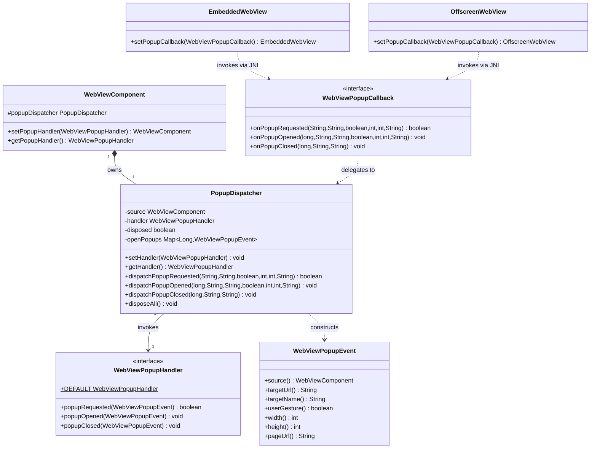

# REASONS Canvas: Browser-Initiated Popups (`window.open`) — Java API + macOS / Linux / Windows Coverage

## R · Requirements

- Establish the cross-platform Java contract for browser-initiated
  **popups** originating inside the embedded page — `window.open(url,
  name, features)` and clicks on `<a target="_blank">` / `<form
  target="_blank">` — and ship working macOS (WKWebView), Linux
  (WebKitGTK), and Windows (WebView2) implementations of that contract.
  Today all three platforms silently drop `window.open`: no
  `WKUIDelegate createWebViewWithConfiguration:` selector is installed
  (`src_c/webview_embed.cpp` `get_webview_embed_ui_delegate_cls`
  installs only the four dialog selectors), no WebKitGTK `create`
  signal is connected, and no WebView2 `NewWindowRequested` handler is
  registered. WebKit's default `createWebViewWithConfiguration:`
  returns `nil`, so `window.open` returns `null` to JavaScript and
  OAuth "sign-in with popup" flows fail with
  `auth/popup-blocked`. This canvas closes exactly the gap that
  [[browser-initiated-ui-dialogs-and-macos-coverage]] (Canvas 11)
  listed as an explicit non-goal ("`window.open(url, name, features)`
  popup handling … a different channel, out of scope").

- **Presentation model: the native engine owns the popup window.**
  When a popup is allowed, the native layer creates the child web view
  **linked to the opener** (WKWebView built from the exact
  `WKWebViewConfiguration` WebKit passes to the delegate; WebKitGTK
  `webkit_web_view_new_with_related_view`; WebView2 `put_NewWindow`
  with a controller from the same environment) and hosts it in a fresh
  **native top-level window** that the engine creates, shows, sizes,
  and destroys. The opener linkage is mandatory: OAuth popups call
  `window.opener.postMessage(...)` and `window.close()`, which only
  work when the popup is a WebKit-created *related* view, not an
  independent browser tab. Java is NOT asked to host the popup in a
  Swing surface — the existing engines cannot be created detached and
  reparented into a new JAWT parent (creation binds to a live
  `NSView` / X11 drawable / `HWND`), so a native-owned window is the
  correct, deadlock-free model and matches the caller's "separate
  popup window" expectation.

- Expose a single public functional-style interface
  `ca.weblite.webview.WebViewPopupHandler` with three `default`
  methods:
  - `boolean popupRequested(WebViewPopupEvent event)` — the policy
    gate. Returns `true` to allow the popup (the engine opens the
    native window) or `false` to block it (`window.open` returns
    `null`, exactly as today). The default returns `true`.
    **This method runs on the native UI thread, synchronously**,
    because the platform popup callbacks must return the child web
    view (or a block decision) before yielding back to WebKit and
    cannot round-trip to the Swing EDT without risking an
    AppKit-main/EDT deadlock. Its Javadoc MUST state: runs off the
    EDT, must be fast and thread-safe, and must not touch Swing
    state.
  - `void popupOpened(WebViewPopupEvent event)` — notification that a
    popup window has been created and shown. Runs on the EDT
    (`invokeLater`). Default is a no-op. Lets applications log or
    track open popups.
  - `void popupClosed(WebViewPopupEvent event)` — notification that a
    popup window has closed (the popup page called `window.close()`,
    or the user closed the native window). Runs on the EDT
    (`invokeLater`). Default is a no-op.
  - `static WebViewPopupHandler DEFAULT = new WebViewPopupHandler() {};`
    — allows every popup, no-op notifications; installed when no
    caller has set a handler.

- Expose one immutable event POJO
  `ca.weblite.webview.WebViewPopupEvent` carrying: `source`
  (the opener `WebViewComponent`, never null), `targetUrl` (the URL
  the popup will load; empty when `window.open()` is called with no
  URL), `targetName` (the window name / target; empty when
  unspecified), `userGesture` (whether a user gesture initiated the
  popup), `width` / `height` (requested size from the window
  features, or `-1` when unspecified), and `pageUrl` (the opener page
  URL, for per-origin policy). Accessors use the no-`get` style to
  match `WebViewMouseEvent` / `WebViewAlertEvent`.

- Expose `setPopupHandler(WebViewPopupHandler)` /
  `getPopupHandler()` on `WebViewComponent` as concrete `final`
  methods. Passing `null` to the setter installs an internal `DROP`
  handler whose `popupRequested` returns `false` (all popups
  blocked — the pre-feature behaviour, available as an explicit
  opt-out) and whose notifications are no-ops. `getPopupHandler()`
  MUST NEVER return `null`; it returns `WebViewPopupHandler.DEFAULT`
  when no caller has set one. `setPopupHandler(null)` is NOT
  identity-equal to `setPopupHandler(WebViewPopupHandler.DEFAULT)`;
  callers reset to the framework default by passing `DEFAULT`
  explicitly. This mirrors the `setDialogHandler` contract from
  Canvas 11 exactly.

- Wire the contract to all three heavyweight engines and the Linux
  offscreen engine via a new internal JNI callback
  `WebViewPopupCallback` with three methods:
  - `boolean onPopupRequested(String targetUrl, String targetName,
    boolean userGesture, int width, int height, String pageUrl)` —
    invoked **synchronously on the native UI thread**; the return
    value decides allow/deny.
  - `void onPopupOpened(long popupId, String targetUrl, String
    targetName, boolean userGesture, int width, int height, String
    pageUrl)` — invoked after the native window is shown; `popupId`
    is an engine-assigned opaque handle correlating open/close.
  - `void onPopupClosed(long popupId, String targetUrl, String
    pageUrl)` — invoked after the native popup window is destroyed.
  The callback follows the existing `WebViewDialogCallback` /
  `WebViewFocusCallback` / `WebViewClickCallback` precedent and is
  public only because the JNI bridge in `src_c/webview_embed.cpp`
  and `windows/webview_embed.cc` calls it.

- Add two new native method declarations on `WebViewNative`,
  following the `webview_embed_set_dialog_callback` /
  `webview_offscreen_set_dialog_callback` precedent
  (`WebViewNative.java:284, 393`):
  - `native static void webview_embed_set_popup_callback(long w, WebViewPopupCallback cb)`.
  - `native static void webview_offscreen_set_popup_callback(long peer, WebViewPopupCallback cb)`.

- Add `setPopupCallback(WebViewPopupCallback)` to both
  `EmbeddedWebView` and `OffscreenWebView`, anchoring the callback in
  the wrapper's `heap` list so the JVM does not collect the adapter
  while the native side holds a global ref (mirrors
  `setDialogCallback` at `EmbeddedWebView.java:503`). The callback is
  cleared (`webview_embed_set_popup_callback(peer, null)`) in
  `dispose()` before the native peer is destroyed.

- Install the popup adapter at peer-attach time in
  `WebViewHeavyweightComponent.createPeer()` (after the existing
  dialog adapter) and `WebViewLightweightComponent.addNotify()`,
  delegating each callback method to the per-component
  `PopupDispatcher`. The heavyweight/lightweight `dispose()` paths
  call `popupDispatcher.disposeAll()` alongside the existing
  `dialogDispatcher.disposeAll()`.

- **Threading contract.** `popupRequested` (allow/deny) runs on the
  native UI thread with no EDT hop — the dispatcher calls the handler
  directly and returns its boolean synchronously, because the
  platform popup callback must return the decision before yielding to
  WebKit. `popupOpened` / `popupClosed` are asynchronous
  notifications and DO marshal to the EDT via
  `SwingUtilities.invokeLater` (matching the focus/click notification
  pattern, which uses `invokeLater`, not the dialog `invokeAndWait`).
  This split is the crux of the design and MUST be documented on
  `WebViewPopupHandler`, `WebViewPopupCallback`, and
  `PopupDispatcher`.

- The implementation MUST NOT introduce a JSON-parsing dependency;
  all payloads are primitives (`String`, `boolean`, `int`, `long`).
  No JS shim is installed and no reserved `__webview_*` binding is
  added — `window.open` interception is a native-delegate channel,
  not a page-injected bridge.

- Definition of Done:
  - `window.open(url, ...)` from the embedded page opens a native
    top-level window loading `url`, linked to the opener
    (`window.opener` is non-null; `postMessage` to the opener
    works), on all three platforms. `window.close()` from the popup
    closes the native window.
  - `setPopupHandler(null)` blocks all popups (`window.open` returns
    `null`), restoring the pre-feature behaviour as an explicit
    opt-out.
  - `getPopupHandler()` never returns null; `setPopupHandler(null)`
    installs DROP; `setPopupHandler(DEFAULT)` resets.
  - A `WebViewPopupDemo` under `demos/` exercises allow / block /
    custom-notification modes.
  - README grows a "Browser-initiated popups" subsection (sibling of
    "Browser-initiated dialogs") documenting the `setPopupHandler`
    API, the native-owned-window model, and the opener-linkage
    guarantee that makes OAuth popups work.
  - `PopupDispatcherTest` validates the Java contract:
    handler registration, DROP semantics, `getHandler() != null`
    invariant, `popupRequested` synchronous return + off-EDT
    execution, `popupOpened` / `popupClosed` EDT marshaling and
    exception isolation, event field plumbing, `-1` size defaults,
    and dispose fallbacks. Native window creation is
    integration-tested via the demo (consistent with the
    no-automated-GUI-tests policy).

- Out of scope (explicit non-goals):
  - Hosting the popup inside a Swing surface / as a tab in the
    opener's window. The existing engines cannot be created
    detached and reparented into a new JAWT parent; a native-owned
    window is the model. A future canvas may add an "adopt into a
    provided `WebViewComponent`" path if a caller needs Swing
    integration.
  - Per-popup window chrome customisation (toolbars, address bar).
    The native window is a bare top-level host for the child web
    view.
  - Blocking / allow decisions that require asynchronous user
    interaction (e.g. a Swing confirmation dialog) inside
    `popupRequested`. The gate is synchronous and off-EDT; a handler
    needing async confirmation should allow the popup and close it
    later, or pre-compute policy.
  - `window.open` feature strings beyond `width` / `height`
    (`left`, `top`, `menubar`, `toolbar`, `resizable`, …). Only size
    is surfaced on the event; the native window uses platform
    defaults for the rest.
  - HTTP auth challenges, download interception, and permission
    prompts — separate channels, each a future canvas.
  - Adding the popup API to the standalone in-process `WebView`
    class — this canvas only touches the embedded
    `WebViewComponent` surface (same boundary Canvas 11 drew).

## E · Entities

- **WebViewPopupEvent** (new public final class,
  `src/ca/weblite/webview/WebViewPopupEvent.java`). Immutable value
  type. Fields (all `final`, package-private constructor):
  - `source` : `WebViewComponent` — the opener; never null
    (constructor throws NPE named `"source"`).
  - `targetUrl` : `String` — never null, may be empty.
  - `targetName` : `String` — never null, may be empty.
  - `userGesture` : `boolean`.
  - `width` : `int` — `-1` when unspecified.
  - `height` : `int` — `-1` when unspecified.
  - `pageUrl` : `String` — never null, may be empty.
  Accessors: `source()`, `targetUrl()`, `targetName()`,
  `userGesture()`, `width()`, `height()`, `pageUrl()`.
  `toString()` returns a single-line debug summary
  (`WebViewPopupEvent[url=<...>, name=<...>, size=WxH]`, url
  truncated to 80 chars). No `equals` / `hashCode`.

- **WebViewPopupHandler** (new public interface,
  `src/ca/weblite/webview/WebViewPopupHandler.java`).
  Functional-style — three `default` methods, no required abstract
  method. NOT `@FunctionalInterface` (more than one method).
  - `default boolean popupRequested(WebViewPopupEvent event)` —
    returns `true` (allow). Javadoc: runs on the native UI thread,
    synchronously, off the EDT; must be fast, thread-safe, no Swing.
  - `default void popupOpened(WebViewPopupEvent event)` — no-op.
    Javadoc: runs on the EDT.
  - `default void popupClosed(WebViewPopupEvent event)` — no-op.
    Javadoc: runs on the EDT.
  - `static WebViewPopupHandler DEFAULT = new WebViewPopupHandler() {};`.

- **WebViewPopupCallback** (new public interface,
  `src/ca/weblite/webview/WebViewPopupCallback.java`). Internal JNI
  bridge — public only because the native layer calls it. NOT
  `@FunctionalInterface` (three methods).
  - `boolean onPopupRequested(String targetUrl, String targetName, boolean userGesture, int width, int height, String pageUrl)`.
  - `void onPopupOpened(long popupId, String targetUrl, String targetName, boolean userGesture, int width, int height, String pageUrl)`.
  - `void onPopupClosed(long popupId, String targetUrl, String pageUrl)`.
  Class Javadoc: invoked from the native UI thread (AppKit main /
  GTK main / WebView2 worker); `onPopupRequested` returns
  synchronously and MUST NOT be marshalled to the EDT (the native
  side is blocked awaiting the decision); `onPopupOpened` /
  `onPopupClosed` are fire-and-forget notifications the dispatcher
  marshals to the EDT. Not intended for application implementation —
  customise via `WebViewComponent.setPopupHandler`.

- **PopupDispatcher** (new public final class,
  `src/ca/weblite/webview/PopupDispatcher.java`). Per-component
  fan-out hub. Public-because-cross-package (same rationale as
  `DialogDispatcher`). Fields:
  - `private final WebViewComponent source;` — non-null.
  - `private volatile WebViewPopupHandler handler = WebViewPopupHandler.DEFAULT;`.
  - `private volatile boolean disposed = false;`.
  - `private final java.util.concurrent.ConcurrentHashMap<Long, WebViewPopupEvent> openPopups = new ConcurrentHashMap<Long, WebViewPopupEvent>();`
    — correlates `onPopupOpened` → `onPopupClosed` so `popupClosed`
    receives the same rich event.
  - `static final WebViewPopupHandler DROP` — package-private
    singleton: `popupRequested` returns `false`, notifications
    no-op.
  Methods: `setHandler`, `getHandler`, `isDisposed`, `disposeAll`,
  and the three `dispatch*` entry points (Operations 4).

- **WebViewComponent** (modified,
  `src/ca/weblite/webview/swing/WebViewComponent.java`). Gains:
  - `protected final PopupDispatcher popupDispatcher = new PopupDispatcher(this);`
    (adjacent to `dialogDispatcher`, `WebViewComponent.java:77`).
  - `public final WebViewComponent setPopupHandler(WebViewPopupHandler handler)`.
  - `public final WebViewPopupHandler getPopupHandler()`.

- **EmbeddedWebView** (modified,
  `src/ca/weblite/webview/EmbeddedWebView.java`). Gains
  `public EmbeddedWebView setPopupCallback(WebViewPopupCallback cb)`
  mirroring `setDialogCallback` (`:503`): anchors `cb` in `heap`,
  calls `WebViewNative.webview_embed_set_popup_callback(peer, cb)`.
  `dispose()` clears it (`webview_embed_set_popup_callback(p, null)`)
  before `webview_embed_destroy`.

- **OffscreenWebView** (modified). Gains
  `public OffscreenWebView setPopupCallback(WebViewPopupCallback cb)`
  calling `WebViewNative.webview_offscreen_set_popup_callback`.

- **WebViewNative** (modified,
  `src/ca/weblite/webview/WebViewNative.java`). Gains two
  `native static` declarations after the dialog ones, with a block
  comment documenting per-platform delivery (macOS WKUIDelegate
  `createWebViewWithConfiguration:` + `webViewDidClose:`; Linux
  WebKitGTK `create` + `ready-to-show` + `close`; Windows WebView2
  `add_NewWindowRequested` + child `add_WindowCloseRequested`).

- **`src_c/webview_embed.cpp`** (modified — macOS + Linux). See
  Operations 9 (macOS) and 10 (Linux). Adds, per Engine, a
  `jobject popup_callback` field; for child (popup) engines a
  native-window handle field (`id popup_window` on macOS,
  `GtkWidget *popup_window` on GTK) and a `jlong popup_id`; the
  `createWebViewWithConfiguration:` + `webViewDidClose:` selector
  IMPs (added to the shared UI-delegate class) on macOS; the
  `create` / `ready-to-show` / `close` signal handlers on GTK; the
  `cocoa_set_popup_callback` / `gtk_set_popup_callback` /
  `gtk_off_set_popup_callback` setters; and the two JNI bridge
  functions (in an `extern "C"` block, matching the dialog bridges
  at `:4544`).

- **`windows/webview_embed.cc`** (modified — Windows). See
  Operation 11. Adds `jobject popup_callback` and
  `EventRegistrationToken new_window_token`; a
  `NewWindowRequestedHandler` (deferral pattern); child-window
  creation + `add_WindowCloseRequested`; `set_popup_callback`; and
  the JNI bridge.

- **WebViewPopupDemo** (new demo,
  `demos/WebViewPopupDemo/src/ca/weblite/webview/demos/WebViewPopupDemo.java`
  + `build.xml` + `README.md`). Mirrors `WebViewDialogDemo` layout.

- **README.md** (modified): "Browser-initiated popups" subsection +
  demo listing.

- **PopupDispatcherTest** (new JUnit 4 test,
  `test/ca/weblite/webview/PopupDispatcherTest.java`). Mirrors
  `DialogDispatcherTest`.

## A · Approach

1. **Native-owns-window model, and why.** WebKit's popup channel
   hands the delegate a *linked* child web view to drive (macOS: a
   `WKWebView` built from the passed `WKWebViewConfiguration`; GTK:
   `webkit_web_view_new_with_related_view`; WebView2:
   `put_NewWindow`). That linkage is what makes `window.opener`
   non-null and `postMessage`-to-opener work — the exact mechanism
   Firebase `signInWithPopup` uses to return its result. An
   independent tab loading the same URL is NOT linked and the OAuth
   handshake fails. The extraction of the engine-create paths
   confirms the heavyweight engines cannot be created detached and
   later reparented into a Swing surface (creation binds to a live
   `NSView` / X11 drawable / `HWND`). Therefore the engine both
   creates the linked child and hosts it in a native top-level window
   it owns — this is deadlock-free, requires no JAWT reparenting, and
   is precisely the "separate popup window" experience.

2. **Threading split (the crux).** `popupRequested` is a synchronous
   allow/deny decision: on macOS `createWebViewWithConfiguration:`
   must return the `WKWebView` (or nil) before yielding to WebKit, so
   the decision cannot be deferred to a worker thread or the EDT the
   way the dialog completion-handler path is. The dispatcher
   therefore calls `handler.popupRequested(event)` **directly on the
   native UI thread** and returns its boolean synchronously. A
   well-behaved policy method (return a constant, or inspect
   `pageUrl`) is fast and side-effect free; the Javadoc forbids Swing
   access and blocking. By contrast, `popupOpened` / `popupClosed`
   need no return value and are marshalled to the EDT with
   `SwingUtilities.invokeLater` — matching the focus/click
   notification adapters (`WebViewHeavyweightComponent.java:534-560`),
   which also use `invokeLater`. This asymmetry is intentional and
   documented.

3. **Allow/deny reduces to handler presence by default.** With the
   DEFAULT handler `popupRequested` returns `true`, so popups work
   out of the box once the library is wired. `setPopupHandler(null)`
   installs DROP whose `popupRequested` returns `false`, restoring
   the pre-feature "popups blocked" behaviour as an explicit opt-out.
   A custom handler can gate per-URL. The native side treats a
   missing `popup_callback` (no adapter installed) as "block" —
   identical to today — so the feature is inert until the wiring in
   `createPeer()` / `addNotify()` installs the adapter.

4. **macOS selector strategy.** Add two selectors to the existing
   shared UI-delegate class built by
   `get_webview_embed_ui_delegate_cls()`
   (`src_c/webview_embed.cpp:2969`), so both the opener engine's
   delegate and each child engine's delegate handle them:
   - `webView:createWebViewWithConfiguration:forNavigationAction:windowFeatures:`
     → `impl_create_web_view`. Recover `Engine* e` via the associated
     `"eng"` object. Read `navigationAction.request.URL.absoluteString`
     (targetUrl), `navigationAction` user-gesture (best effort; pass
     `true` — `window.open` requires a gesture in practice), size from
     `windowFeatures.width` / `.height` (`NSNumber`, `nil` → `-1`),
     `pageUrl` from `webView.URL.absoluteString`. If `e->popup_callback`
     is null → return `nil`. Else call Java `onPopupRequested`
     synchronously (attach the thread if needed, `GetMethodID`,
     `CallBooleanMethod`, exception-sanitize); if `false` → return
     `nil`. Otherwise build the child:
     `id child = [[WKWebView alloc] initWithFrame:CGRectMake(0,0,W,H) configuration:configuration]`
     (W/H default to 500×650 — a typical auth-popup size — when
     unspecified). Create an `NSWindow`
     (`NSWindowStyleMaskTitled|Closable|Resizable`, contentRect W×H),
     set its `contentView` to `child`, `center`, and
     `makeKeyAndOrderFront:`. Build a child `Engine` (webview=child,
     jvm, config=configuration, manager=child's
     `configuration.userContentController`, `popup_callback` and
     `dialog_callback` inherited as fresh global refs, a new
     UI-delegate instance associated to the child engine assigned via
     `setUIDelegate:`, `popup_window` = the NSWindow,
     `popup_id = (jlong)(intptr_t)child`), register it in
     `g_webview_map`. Fire `onPopupOpened(popupId, …)` asynchronously
     on a detached worker thread (the established JNI-hop pattern).
     Return `child`.
   - `webViewDidClose:` → `impl_web_view_did_close`. Recover the child
     `Engine`, `[popup_window close]`, fire
     `onPopupClosed(popupId, …)` async, then tear down the child
     engine (remove from `g_webview_map`, `setUIDelegate:nil`, delete
     global refs, release window + delegate).

5. **Linux (WebKitGTK) signal strategy.** Connect three signals on
   every `WebKitWebView` created by `gtk_create_engine`
   (`src_c/webview_embed.cpp:871`) and `gtk_off_create_engine`
   (`:1513`), at the same sites the dialog signals are connected
   (`:1021`, `:1567`):
   - `create` → `on_create_web_view`. Read the request URI and
     user-gesture from the `WebKitNavigationAction*`. If the engine's
     `popup_callback` is null or Java `onPopupRequested` returns
     `false`, return `NULL` (blocked). Else
     `WebKitWebView* child = WEBKIT_WEB_VIEW(webkit_web_view_new_with_related_view(e->web))`,
     put it in a new `GTK_WINDOW_TOPLEVEL`, connect the child's
     `ready-to-show` and `close`, connect `create` /
     `script-dialog` / `run-file-chooser` on the child too (nested
     popups + dialogs), build the child `Engine`, register it, and
     return the child web view (WebKit adopts the reference).
   - `ready-to-show` → size the window from
     `webkit_web_view_get_window_properties` (fallback 500×650),
     `gtk_widget_show_all` + `gtk_window_present`, then fire
     `onPopupOpened` async.
   - `close` → `gtk_widget_destroy` the window, fire `onPopupClosed`
     async, tear down the child engine.

6. **Windows (WebView2) event strategy.** Register
   `add_NewWindowRequested` at the controller-ready site
   (`windows/webview_embed.cc`, alongside `add_WebMessageReceived`),
   storing `new_window_token`. The handler `Invoke`:
   1. `args->GetDeferral(&deferral)` (WebView2 supports async here).
   2. Read `args->get_Uri`, `args->get_IsUserInitiated`,
      `args->get_WindowFeatures` (width/height/hasSize).
   3. Decide allow/deny (sync via `popup_callback`
      `onPopupRequested`). If deny: `put_Handled(TRUE)` with no
      `NewWindow` (blocks), `Complete` the deferral, return `S_OK`.
   4. If allow: create a new top-level `HWND`, then
      `CreateCoreWebView2Controller` on it from the SAME environment;
      in that completion, `controller->get_CoreWebView2(&child)`,
      `args->put_NewWindow(child)`, `args->put_Handled(TRUE)`,
      `deferral->Complete()`, show the window, connect the child's
      `add_WindowCloseRequested` → `DestroyWindow` + `onPopupClosed`,
      and fire `onPopupOpened`. Follow the `CallbackBase<Iface>`
      template used by `FocusHandler` / `MsgHandler`.

7. **JNI mechanics.** `onPopupRequested` runs on the native UI thread
   and returns a value, so it attaches the thread, resolves the
   `jmethodID` per call (mirroring the dialog selectors), calls
   `CallBooleanMethod`, and sanitizes exceptions (`ExceptionCheck` →
   `Describe` → `Clear`) — a leaked exception into ObjC/GTK/COM
   crashes the process. `onPopupOpened` / `onPopupClosed` fire from a
   detached worker thread (macOS) or directly on the GTK/WebView2
   worker (which are already decoupled from the EDT) via
   `CallVoidMethod`. Global refs for `popup_callback` follow the
   `cocoa_set_dialog_callback` delete-old / new-global-ref lifecycle
   (`:3006`).

8. **Dispatcher exception isolation.** `dispatchPopupRequested` wraps
   the direct handler call in `try/catch(Throwable)` → forwards to
   `Thread.getDefaultUncaughtExceptionHandler()` and returns `false`
   (safe default: block on error). `dispatchPopupOpened` /
   `dispatchPopupClosed` wrap the EDT-marshalled invocation the same
   way (return void). Matches `DialogDispatcher.forwardUncaught`.

## S · Structure

### Inheritance Relationships
1. `WebViewPopupHandler` — public interface, three `default` methods,
   `DEFAULT` constant. No required abstract method.
2. `WebViewPopupEvent` — public final class, no inheritance (matches
   `WebViewAlertEvent`).
3. `WebViewPopupCallback` — public interface, three methods, not
   `@FunctionalInterface`.
4. `PopupDispatcher` — public final class (matches `DialogDispatcher`).
5. `WebViewComponent` (abstract) gains one field + two `final`
   methods; no change to the abstract surface.
6. `EmbeddedWebView` / `OffscreenWebView` each gain one
   `setPopupCallback` method.

### Dependencies
1. `WebViewPopupHandler` → none beyond `WebViewPopupEvent` (defaults
   are trivial; no Swing imports — the default does not open the
   window, the native side does).
2. `PopupDispatcher` → `javax.swing.SwingUtilities`
   (`invokeLater`, `isEventDispatchThread`),
   `java.util.concurrent.ConcurrentHashMap`, `WebViewPopupEvent`,
   `WebViewPopupHandler`, `WebViewComponent`.
3. `WebViewComponent` → `PopupDispatcher`, `WebViewPopupHandler`.
4. `WebViewHeavyweightComponent.createPeer()` /
   `WebViewLightweightComponent.addNotify()` → `EmbeddedWebView` /
   `OffscreenWebView`, `PopupDispatcher`, `WebViewPopupCallback`.
5. `EmbeddedWebView.setPopupCallback` →
   `WebViewNative.webview_embed_set_popup_callback`.
6. Native selectors/signals/events → `Engine::popup_callback` jobject
   → JNI `CallBooleanMethod` / `CallVoidMethod` → Java
   `WebViewPopupCallback` → `PopupDispatcher.dispatch*` →
   (`popupRequested` inline / `popupOpened`+`popupClosed` on EDT) →
   `WebViewPopupHandler`.

### Layered Architecture
1. **Native engine layer** (`src_c/webview_embed.cpp`,
   `windows/webview_embed.cc`): popup selector/signal/event handlers,
   native window creation, child-engine lifecycle, `set_popup_callback`
   setters, JNI bridges.
2. **JNI surface** (`WebViewNative`): two `native static` decls.
3. **Engine wrapper layer** (`EmbeddedWebView`, `OffscreenWebView`):
   `setPopupCallback`.
4. **Dispatcher layer** (`PopupDispatcher`): per-component hub;
   synchronous allow/deny, async EDT notifications, exception
   isolation, open-popup correlation.
5. **Component API layer** (`WebViewComponent`): `setPopupHandler` /
   `getPopupHandler`.
6. **Public contract layer** (`WebViewPopupHandler`,
   `WebViewPopupEvent`, `WebViewPopupCallback`).
7. **Wiring layer** (`WebViewHeavyweightComponent.createPeer()`,
   `WebViewLightweightComponent.addNotify()`).
8. **Demo layer** (`demos/WebViewPopupDemo/`).

## O · Operations

### 1. Create Value Object — WebViewPopupEvent
File: `src/ca/weblite/webview/WebViewPopupEvent.java`
1. Immutable carrier of one popup request. Package-private
   constructor `WebViewPopupEvent(WebViewComponent source, String
   targetUrl, String targetName, boolean userGesture, int width, int
   height, String pageUrl)`: null-check `source` (NPE named
   `"source"`); coerce null `targetUrl` / `targetName` / `pageUrl`
   to empty; store `width` / `height` verbatim (callers pass `-1`
   for unspecified). Store all fields in `final` ivars.
2. Accessors: `source()`, `targetUrl()`, `targetName()`,
   `userGesture()`, `width()`, `height()`, `pageUrl()`.
3. `toString()` — single-line summary, `targetUrl` truncated to 80
   chars. No `equals` / `hashCode`.

### 2. Create Handler Interface — WebViewPopupHandler
File: `src/ca/weblite/webview/WebViewPopupHandler.java`
1. Public interface, three `default` methods, `DEFAULT` constant.
2. `default boolean popupRequested(WebViewPopupEvent event) { return true; }`
   — Javadoc: allow/deny gate, runs on the native UI thread
   synchronously (off the EDT); must be fast, thread-safe, no Swing.
3. `default void popupOpened(WebViewPopupEvent event) { }` — Javadoc:
   runs on the EDT.
4. `default void popupClosed(WebViewPopupEvent event) { }` — Javadoc:
   runs on the EDT.
5. `WebViewPopupHandler DEFAULT = new WebViewPopupHandler() {};`.
6. Class Javadoc documents: the native-owned-window model; that the
   library opens/sizes/closes the window (the handler only decides
   policy and observes); the opener-linkage guarantee that makes
   OAuth popups work; the `setPopupHandler(null)` drop shortcut; and
   the threading split.

### 3. Create JNI Callback Interface — WebViewPopupCallback
File: `src/ca/weblite/webview/WebViewPopupCallback.java`
1. Public interface, three methods (signatures in Entities). Javadoc
   per Entities. Method Javadoc: `onPopupRequested` returns the
   allow/deny decision synchronously and MUST NOT be EDT-marshalled;
   `onPopupOpened` / `onPopupClosed` are notifications.

### 4. Create Dispatcher — PopupDispatcher
File: `src/ca/weblite/webview/PopupDispatcher.java`
1. `public final class`. Fields per Entities. DROP singleton:
   `popupRequested` → `false`, notifications no-op.
2. Constructor `PopupDispatcher(WebViewComponent source)`:
   null-check `source`.
3. `setHandler(WebViewPopupHandler h)`: store `h`, or DROP if null.
4. `getHandler()`: return the volatile handler (never null).
5. `isDisposed()` / `disposeAll()`: as `DialogDispatcher`.
6. `boolean dispatchPopupRequested(String targetUrl, String
   targetName, boolean userGesture, int width, int height, String
   pageUrl)`:
   - If `disposed`, return `false`.
   - Build a `WebViewPopupEvent`.
   - Call `handler.popupRequested(event)` **directly** (no EDT hop)
     inside `try { return handler.popupRequested(event); } catch
     (Throwable t) { forwardUncaught(t); return false; }`.
7. `void dispatchPopupOpened(long popupId, String targetUrl, String
   targetName, boolean userGesture, int width, int height, String
   pageUrl)`:
   - If `disposed`, return.
   - Build the event, `openPopups.put(popupId, event)`.
   - `runOnEdtLater(() -> handler.popupOpened(event))`.
8. `void dispatchPopupClosed(long popupId, String targetUrl, String
   pageUrl)`:
   - If `disposed`, return.
   - `WebViewPopupEvent event = openPopups.remove(popupId);` — if
     null, build a minimal event from `targetUrl` / `pageUrl` (empty
     name, `-1` sizes).
   - `runOnEdtLater(() -> handler.popupClosed(event))`.
9. Private `runOnEdtLater(Runnable r)`: if
   `SwingUtilities.isEventDispatchThread()` run inline (wrapped in
   try/catch → `forwardUncaught`); else
   `SwingUtilities.invokeLater(wrapped)` where `wrapped` catches and
   forwards. Private static `forwardUncaught(Throwable)` identical to
   `DialogDispatcher`.

### 5. Extend WebViewComponent
File: `src/ca/weblite/webview/swing/WebViewComponent.java`
1. Add `protected final PopupDispatcher popupDispatcher = new PopupDispatcher(this);`
   next to `dialogDispatcher`.
2. `public final WebViewComponent setPopupHandler(WebViewPopupHandler handler) { popupDispatcher.setHandler(handler); return this; }`.
3. `public final WebViewPopupHandler getPopupHandler() { return popupDispatcher.getHandler(); }`.
   Javadoc mirrors `setDialogHandler`/`getDialogHandler`.

### 6. Extend EmbeddedWebView with setPopupCallback
File: `src/ca/weblite/webview/EmbeddedWebView.java`
1. `public EmbeddedWebView setPopupCallback(WebViewPopupCallback cb)`
   — `checkAlive()`; if `cb != null` `heap.add(cb)`;
   `WebViewNative.webview_embed_set_popup_callback(peer, cb)`;
   `return this;`. Mirrors `setDialogCallback` (`:503`).
2. In `dispose()`, before `webview_embed_destroy(p)` and alongside
   the focus/click clears, add
   `WebViewNative.webview_embed_set_popup_callback(p, null);`.

### 7. Extend OffscreenWebView with setPopupCallback
File: `src/ca/weblite/webview/OffscreenWebView.java`
1. `public OffscreenWebView setPopupCallback(WebViewPopupCallback cb)`
   mirroring the offscreen dialog setter; calls
   `WebViewNative.webview_offscreen_set_popup_callback(peer, cb)`.

### 8. Extend WebViewNative
File: `src/ca/weblite/webview/WebViewNative.java`
1. Add, after the dialog natives (with a documenting block comment):
   `native static void webview_embed_set_popup_callback(long w, WebViewPopupCallback cb);`
   `native static void webview_offscreen_set_popup_callback(long peer, WebViewPopupCallback cb);`

### 9. macOS native — createWebView + webViewDidClose + setter + JNI
File: `src_c/webview_embed.cpp` (Cocoa)
1. Add `jobject popup_callback = nullptr;`, `id popup_window = nullptr;`,
   `jlong popup_id = 0;` to the Cocoa `Engine` struct.
2. `cocoa_set_popup_callback(Engine*, JNIEnv*, jobject)` — verbatim
   copy of `cocoa_set_dialog_callback` against `popup_callback`.
3. In `get_webview_embed_ui_delegate_cls()` add two
   `class_addMethod`s: `webView:createWebViewWithConfiguration:forNavigationAction:windowFeatures:`
   (`impl_create_web_view`, return-type `@`) and `webViewDidClose:`
   (`impl_web_view_did_close`, `v@:@`).
4. Implement `impl_create_web_view` and `impl_web_view_did_close` per
   Approach §4. Reuse `ensure_jni_env` / the detached-worker JNI hop
   for the async `onPopupOpened` / `onPopupClosed`; do the synchronous
   `onPopupRequested` inline on AppKit main. Every path either returns
   a valid child or `nil`; a child engine's `dialog_callback` and
   `popup_callback` are inherited so the popup itself supports dialogs
   and nested popups. `impl_web_view_did_close` recovers the engine
   from the delegate's `"eng"` associated object and, before any
   release, clears that association (`objc_setAssociatedObject(self,
   "eng", nil, OBJC_ASSOCIATION_ASSIGN)`), calls
   `setUIDelegate:nil`, and removes the child from **both**
   `g_webview_map` and (if present) `g_retained_popups` under their
   mutexes — so a close arriving before adoption cannot leave a
   dangling registry entry. It then frees the engine (`delete e`)
   **only when the engine is not `java_owned`** (an engine-owned
   native-window popup, or a retained-but-unadopted child): a
   `java_owned` engine — a normal embedded engine, or a popup already
   promoted by `cocoa_adopt_popup` — is owned by the Java
   `EmbeddedWebView` and is freed exactly once by
   `cocoa_destroy_engine`, so `impl_web_view_did_close` fires
   `onPopupClosed` (when `popup_id != 0`) and returns without
   deleting it, leaving the single free to the Java-driven destroy.
5. JNI bridges `Java_ca_weblite_webview_WebViewNative_webview_1embed_1set_1popup_1callback`
   and `…_webview_1offscreen_1set_1popup_1callback` in the existing
   `extern "C"` block (`:4544`), `#ifdef`-dispatching to
   `cocoa_set_popup_callback` / `gtk_set_popup_callback` /
   `gtk_off_set_popup_callback`.

### 10. Linux native — create/ready-to-show/close signals + setter
File: `src_c/webview_embed.cpp` (GTK)
1. Add `jobject popup_callback = nullptr;` to the GTK `Engine` /
   `OffEngine` structs; a `GtkWidget *popup_window` + `jlong popup_id`
   on child engines.
2. `gtk_set_popup_callback` / `gtk_off_set_popup_callback` mirroring
   the GTK dialog setters.
3. `on_create_web_view_engine` / `on_ready_to_show_engine` /
   `on_close_engine` per Approach §5. Connect them in
   `gtk_create_engine` (`:1021` region) and `gtk_off_create_engine`
   (`:1567` region) alongside the dialog signal connects.

### 11. Windows native — NewWindowRequested + setter + JNI
File: `windows/webview_embed.cc`
1. Add `jobject popup_callback` and `EventRegistrationToken
   new_window_token` to `Engine`; a child-window `HWND` + `jlong
   popup_id` on child engines.
2. `set_popup_callback(Engine*, JNIEnv*, jobject)` mirroring the
   Windows dialog setter.
3. `NewWindowRequestedHandler : CallbackBase<ICoreWebView2NewWindowRequestedEventHandler>`
   with `Invoke` per Approach §6; register via
   `webview->add_NewWindowRequested(handler, &e->new_window_token)`
   at the controller-ready site. Child `add_WindowCloseRequested` →
   destroy + `onPopupClosed`.
4. JNI bridge `Java_…_webview_1embed_1set_1popup_1callback` in
   `windows/webview_embed.cc`.

### 12. Wire the popup adapter (heavyweight + lightweight)
Files: `src/ca/weblite/webview/swing/WebViewHeavyweightComponent.java`,
`src/ca/weblite/webview/swing/WebViewLightweightComponent.java`
1. In `createPeer()` (heavyweight), after the dialog adapter
   (`:560` region), install:
   `embedded.setPopupCallback(new WebViewPopupCallback() {`
   `  public boolean onPopupRequested(String u, String n, boolean g, int w, int h, String p) { return popupDispatcher.dispatchPopupRequested(u, n, g, w, h, p); }`
   `  public void onPopupOpened(long id, String u, String n, boolean g, int w, int h, String p) { popupDispatcher.dispatchPopupOpened(id, u, n, g, w, h, p); }`
   `  public void onPopupClosed(long id, String u, String p) { popupDispatcher.dispatchPopupClosed(id, u, p); }`
   `});`
2. In `addNotify()` (lightweight), inside the `engine != null`
   branch after the dialog install, the same adapter via
   `engine.setPopupCallback(...)`.
3. In both `dispose()` paths, add `popupDispatcher.disposeAll();`
   next to `dialogDispatcher.disposeAll();`.

### 13. Demo — WebViewPopupDemo
Files: `demos/WebViewPopupDemo/…`
1. `JPopupMenu.setDefaultLightWeightPopupEnabled(false)` +
   `ToolTipManager…setLightWeightPopupEnabled(false)` at startup.
2. Inline page loaded via a **base64-encoded `data:` URL** — build
   the HTML string, base64-encode it (`java.util.Base64`), and call
   `setUrl("data:text/html;charset=utf-8;base64," + b64)`, exactly as
   `WebViewDialogDemo` does. Do **not** use `addOnBeforeLoad` +
   `about:blank`: that path renders a blank page on macOS WKWebView
   (empty content area, no controls), and raw/percent-encoded `data:`
   bodies hit two WKWebView pitfalls the dialog demo documents (literal
   `%20` text; truncation at the first `#` in CSS colours). Base64 is
   cross-engine reliable and sidesteps both. The page has buttons:
   `window.open('https://example.com','_blank','width=520,height=640')`,
   a `target=_blank` link, and a button that reports
   `window.open(...) === null` to a console line (verifies allow vs
   block). A JComboBox switches handler modes: Default (allow),
   Block (`setPopupHandler(null)`), Custom (logs
   `popupOpened`/`popupClosed`).
3. `build.xml` + `README.md` mirror `WebViewDialogDemo`. The demo
   `README.md`'s platform-status section mirrors the **Native coverage
   status** note (Safeguards): all three platforms open a native,
   opener-linked popup — macOS (WKWebView, Canvas 15), Linux (WebKitGTK
   `create`, heavyweight *and* lightweight, Canvas 16), Windows (WebView2
   `NewWindowRequested`, Canvas 17) — and `setPopupHandler(null)` blocks
   `window.open` on every platform. It must not describe Linux/Windows as
   unimplemented or "follow-up".

### 14. README
File: `README.md`
1. New "Browser-initiated popups" subsection after
   "Browser-initiated dialogs" (`:306`): documents `setPopupHandler`,
   the native-owned-window model, the opener-linkage guarantee (OAuth
   popups), and `setPopupHandler(null)` as the block opt-out.
2. List `WebViewPopupDemo` under Demos.

### 15. Tests — PopupDispatcherTest
File: `test/ca/weblite/webview/PopupDispatcherTest.java`
1. Reuse the `StubComponent` pattern from `DialogDispatcherTest`.
2. Cover: default handler is DEFAULT; `getHandler()` never null;
   `setHandler(null)` installs DROP and DROP `dispatchPopupRequested`
   returns `false`; custom handler returned by getter;
   `setHandler(DEFAULT)` resets; `dispatchPopupRequested` returns the
   handler's boolean **and runs off the EDT** (assert
   `!isEventDispatchThread()` inside the handler when called from a
   non-EDT thread); event field plumbing (url/name/gesture/w/h/page,
   `source` identity, `-1` sizes); `dispatchPopupOpened` /
   `dispatchPopupClosed` invoke the handler **on the EDT**
   (latch-verified) and `popupClosed` receives the same event
   instance stored at open (correlation via `popupId`); exception
   isolation for all three (forwarded to the uncaught handler;
   `dispatchPopupRequested` returns `false` on handler exception);
   disposed dispatcher returns `false` / no-ops without invoking the
   handler; `disposeAll` idempotent; constructor rejects null source.

## N · Norms

- **Mirror the `DialogDispatcher` skeleton**, diverging in exactly
  two documented places: (1) `popupRequested` runs the handler
  **inline on the calling (native UI) thread**, never on the EDT,
  because the platform popup callback needs the decision
  synchronously; (2) `popupOpened` / `popupClosed` use
  `SwingUtilities.invokeLater` (async notifications), not
  `invokeAndWait`. Document both in `PopupDispatcher`'s Javadoc.
- **Accessor naming** — no-`get` style (`event.targetUrl()`,
  `event.userGesture()`), matching `WebViewAlertEvent`.
- **Null discipline** — `targetUrl` / `targetName` / `pageUrl` use
  empty string for "no value", never null. `width` / `height` use
  `-1` for "unspecified". `source` is never null.
- **`getPopupHandler() != null` is a never-relax invariant**, even
  after `setPopupHandler(null)` (returns DROP) and after
  `disposeAll()` (returns the last-set handler).
- **`setPopupHandler(null) != setPopupHandler(DEFAULT)`** — null
  installs DROP (block all popups); DEFAULT allows. Document on
  `setPopupHandler` Javadoc.
- **No JSON parser dependency; no `__webview_*` binding; no JS
  shim.** `window.open` is a native-delegate channel.
- **Per-call `jmethodID` resolution** in the native selectors,
  matching the dialog selectors.
- **JNI exception sanitization** after every `CallBooleanMethod` /
  `CallVoidMethod` (`ExceptionCheck` → `Describe` → `Clear`); a
  leaked exception into ObjC / GTK / COM crashes the process.
- **`pom.xml` Java 8 target stays in force** — `default` methods,
  `ConcurrentHashMap`, `invokeLater` are all Java 8.
- **Demo heavyweight-popup prerequisite** — the demo sets
  `JPopupMenu.setDefaultLightWeightPopupEnabled(false)` and the
  tooltip equivalent at startup.
- **No automated tests for GUI integration** — the native
  window-creation paths are verified by running `WebViewPopupDemo`
  on each platform; `PopupDispatcherTest` covers the Java contract
  (consistent with Canvas 11 and the embedding canvases).

## S · Safeguards

- **Constructor null-checks.** `WebViewPopupEvent` and
  `PopupDispatcher` reject null `source` with an NPE named
  `"source"`. Other Strings coerce null → empty; sizes accept `-1`.
- **Block-on-error default.** If a handler's `popupRequested` throws,
  the dispatcher forwards to the uncaught handler and returns
  `false` — a thrown policy decision blocks the popup rather than
  leaking an exception into the native UI thread. `popupOpened` /
  `popupClosed` exceptions are forwarded and swallowed (notifications
  cannot fail the popup).
- **Native returns nil/NULL on every non-allow path.** Missing
  `popup_callback`, JNI attach failure, `onPopupRequested == false`,
  or any exception → the selector/signal/event returns
  `nil`/`NULL`/no-`NewWindow`, i.e. `window.open` returns `null`.
  Never return a half-constructed child web view.
- **Child-engine teardown ordering.** `webViewDidClose:` /
  `close` / `WindowCloseRequested` MUST clear the child's UI delegate
  (`setUIDelegate:nil` etc.) and remove the delegate's `"eng"`
  associated-object back-pointer before releasing the delegate and
  window, and remove the child from `g_webview_map` (and, on macOS,
  from `g_retained_popups` when a close races an unadopted child), so
  no in-flight selector dereferences a freed engine. Delete the
  inherited `popup_callback` / `dialog_callback` global refs on
  teardown.
- **A browser `window.close()` never frees a Java-owned engine.**
  `impl_web_view_did_close` MUST NOT `delete` an engine flagged
  `java_owned` (a normal embedded engine, or a popup already promoted
  by `cocoa_adopt_popup`); that engine's single free is the
  Java-driven `cocoa_destroy_engine`. Deleting from both the close
  path and the dispose path is a double-free (observed as an
  `objc_msgSend` crash on app quit). Only an engine-owned
  native-window popup or a retained-but-unadopted child — neither of
  which Java wraps — is freed by its close/discard path.
- **`popupId` correlation is best-effort.** `dispatchPopupClosed`
  tolerates a missing map entry (builds a minimal event); a close
  without a prior open never NPEs.
- **Disposed dispatcher is inert.** After `disposeAll()`, all three
  `dispatch*` return the safe value (`false` / void) without invoking
  the handler, even mid-teardown, so a native popup event racing with
  component disposal cannot resurrect the handler.
- **Opener linkage is mandatory.** The child web view MUST be created
  from the WebKit-provided configuration / related-view /
  `put_NewWindow` so `window.opener` and `postMessage` work. Creating
  an independent view loading the same URL is a defect (breaks
  OAuth).
- **No `setDebug` coupling.** Popup handling works in release builds;
  the delegate/signals/events are installed unconditionally.
- **Reserved-prefix protection preserved.** No new binding is added.
- **Headless construction.** Constructing `WebViewComponent`,
  calling `setPopupHandler`, and constructing `PopupDispatcher` must
  not throw `HeadlessException`; the default handler opens no Swing
  UI (the native side owns the window), so even the DEFAULT handler
  is headless-safe.

- **Native coverage status (per-iteration, mirrors Canvas 11).** The
  full Java contract (Operations 1–8, 12) and the **macOS** native
  implementation (Operation 9) shipped in the first iteration; the demo
  (13), README (14) and `PopupDispatcherTest` (15) landed with them.
  The **Linux** (Operation 10) native callback site landed in Canvas 16
  ([[browser-initiated-popups-linux-coverage]]) and the **Windows**
  (Operation 11) native callback site landed in Canvas 17
  ([[browser-initiated-popups-windows-coverage]]), exactly as the dialog
  feature staged macOS → Linux → Windows across Canvases 11 → 12 → 13.
  **All three platforms are now wired**: `window.open` opens a native,
  opener-linked popup window on macOS (WKWebView), Linux (WebKitGTK), and
  Windows (WebView2), and `setPopupHandler(null)` blocks it everywhere.
  The Java layer introduced here was designed so the Linux / Windows
  stories wired their native callbacks without re-shaping the Java side,
  which is how it played out. The native code in this repository is
  validated on-device via `WebViewPopupDemo` under the project's
  no-automated-GUI-tests policy; the sandbox that generated each
  iteration had no native toolchain, so the selector / signal / event
  code is pattern-faithful to the shipped dialog handlers but MUST be
  built and exercised on each target device before release.
