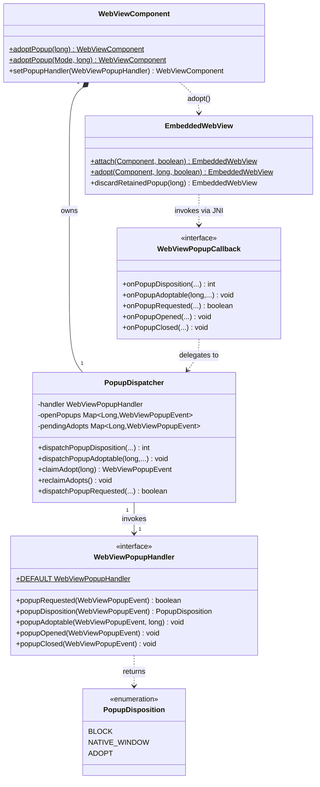

# REASONS Canvas: Popup Adoption Into a Caller-Provided WebViewComponent — Java API + macOS Coverage (STORY-005-001)

## R · Requirements

- Extend the browser-initiated popup feature
  ([[browser-initiated-popups-window-open]], Canvas 15) so an
  application can **adopt** an engine-created popup — the
  opener-linked child web view WebKit raises for `window.open`, `<a
  target="_blank">`, or `<form method="post" target="…">` — into a
  **`WebViewComponent` the application supplies** (a Swing tab),
  instead of the native top-level window the engine owns today. Ship
  the cross-platform Java contract and the **macOS (WKWebView)**
  reference backend. This is exactly the "adopt into a provided
  `WebViewComponent`" path Canvas 15 named as anticipated future work.

- **Why the existing model is insufficient for a tabbed browser.** A
  tabbed consumer (swingwebbrowser) that wants popups as tabs must
  today block the native window (`popupRequested` → `false`) and
  re-open `WebViewPopupEvent.targetUrl()` via
  `WebViewComponent.setUrl(url)`. `setUrl` issues a **GET**, so a
  `<form method="post" target="…">` popup loses its POST body, and the
  re-opened page is no longer opener-linked (`window.opener` is null,
  `postMessage`-to-opener fails, OAuth "sign-in with popup" breaks).
  The POST body is **not reliably exposed** to the popup-create
  delegate on any engine (WKWebView's `navigationAction.request
  .HTTPBody` is effectively always nil there; WebKitGTK's
  `WebKitURIRequest` lacks it), so the request cannot be reconstructed
  and replayed from Java. The only faithful path is to **reuse the
  engine's own child** — the view WebKit already drove the original
  request (verb + body) into, and that is already opener-linked.

- **Presentation model: two-phase adoption.** Adoption is decided
  synchronously on the native UI thread but performed asynchronously
  on the EDT, because the platform popup callback must return its
  decision before yielding to WebKit and cannot round-trip to the EDT
  without risking the AppKit-main/EDT deadlock (the same constraint
  Canvas 15 documents). Phase 1 (native UI thread, synchronous): the
  handler returns a **disposition** — `BLOCK`, `NATIVE_WINDOW`, or
  `ADOPT`. On `ADOPT` the engine creates the opener-linked child from
  the exact `WKWebViewConfiguration` WebKit passes (preserving POST +
  `window.opener`) but does **not** create or show its own `NSWindow`;
  it retains the child under a **hidden holder** keyed by the
  engine-assigned `popupId`, returns the child to WebKit (which drives
  the original request into it), and fires an **EDT adopt
  notification** carrying the `popupId`. Phase 2 (EDT, asynchronous):
  the application creates a new tab whose `WebViewComponent` **adopts**
  the retained child — the native child view is reparented into that
  component's realized surface and engine ownership transfers to the
  component.

- **Additive, backward-compatible disposition surface.** Add one
  `default` method to `WebViewPopupHandler`:
  `PopupDisposition popupDisposition(WebViewPopupEvent event)`. Its
  default implementation derives the disposition from the existing
  `popupRequested` boolean — `true` ⇒ `NATIVE_WINDOW`, `false` ⇒
  `BLOCK` — so **every Canvas 15 handler keeps working unchanged** and
  `setPopupHandler(null)` still blocks all popups. Only handlers that
  want tab adoption override `popupDisposition` to return `ADOPT`. The
  method runs on the native UI thread, synchronously, off the EDT —
  same threading rules and Javadoc caveats as `popupRequested`.

- Add a new **public enum** `ca.weblite.webview.PopupDisposition` with
  three constants: `BLOCK` (block the popup; `window.open` returns
  `null`), `NATIVE_WINDOW` (host in an engine-owned native window —
  today's allow behavior), `ADOPT` (retain the child for the
  application to adopt into a `WebViewComponent`).

- Add a new **EDT notification** to `WebViewPopupHandler`:
  `default void popupAdoptable(WebViewPopupEvent event, long popupId)`
  — fired on the EDT after an `ADOPT` decision, once the child is
  created and retained under the hidden holder. It carries the
  `popupId` the application passes to `adoptPopup`. Default is a no-op.
  (A no-op default means an `ADOPT`-returning handler that never
  overrides `popupAdoptable` leaves the child unclaimed — see the
  reclaim Safeguard.)

- Expose a **public adopting-construction entry point** on
  `WebViewComponent`:
  `public static WebViewComponent adoptPopup(long popupId)` (and a
  `Mode`-parameterized overload `adoptPopup(Mode, long)`), returning a
  component whose peer, at attach time, adopts the pre-existing native
  child engine identified by `popupId` rather than creating its own.
  The returned component is added to a container by the application
  exactly like a normal component; adoption happens when the peer is
  realized (`addNotify` / `createPeer`).

- Wire the adopt seam through the engine wrappers and JNI:
  - `EmbeddedWebView.adopt(Component parent, long popupId, boolean
    debug)` — a static factory paralleling `attach(parent, debug)`
    that calls a new native `webview_embed_adopt_popup(parent,
    popupId, debug)` (reparent the retained child into `parent`'s
    surface and return its peer handle) instead of
    `webview_embed_create`.
  - `native static long webview_embed_adopt_popup(Component parent,
    long popupId, int debug)` on `WebViewNative`, following the
    `webview_embed_create` precedent.
  - The macOS native `impl_create_web_view` gains an `ADOPT` branch
    (retain child, no `NSWindow`, fire `popupAdoptable`) and a new
    `cocoa_adopt_popup` reparent function invoked by the JNI bridge.

- `PopupDispatcher` gains **pending-adopt bookkeeping**: track the
  `popupId`s currently retained-and-unclaimed; enforce **adopt-once**;
  reject adoption of an unknown or already-adopted `popupId` with a
  clear exception (`IllegalArgumentException` for never-issued,
  `IllegalStateException` for already-adopted); and **reclaim**
  unclaimed children when the opener component is disposed, plus a
  bounded grace-period backstop.

- Definition of Done:
  - A handler returning `ADOPT` from `popupDisposition`, plus an app
    that on `popupAdoptable` creates a tab via
    `WebViewComponent.adoptPopup(popupId)`, results in the popup
    appearing **inside that component** on macOS, with the **POST body
    preserved** (a `<form method="post">` popup shows the POST
    response) and **opener linkage intact** (`window.opener` non-null,
    `postMessage`-to-opener works). No native popup window appears at
    any point on the `ADOPT` path.
  - A Canvas 15 handler that allows the popup (`popupRequested` →
    `true`, or `DEFAULT`) still opens a native window; a blocking
    handler / `setPopupHandler(null)` still blocks — byte-for-byte the
    prior behavior.
  - `adoptPopup` on an unknown `popupId` throws
    `IllegalArgumentException`; a second `adoptPopup` on the same
    `popupId` throws `IllegalStateException`; neither leaves a
    half-constructed component or native view behind.
  - A popup that is decided `ADOPT` but never adopted is reclaimed
    (native child + hidden holder torn down) when the opener is
    disposed or the grace period expires, with a logged diagnostic —
    no orphaned engine.
  - Closing an adopted popup (`window.close()` or the tab is closed)
    fires `popupClosed` correlated by `popupId` and disposes the
    adopted engine without dereferencing freed native state.
  - `WebViewAdoptPopupDemo` (or an extension of `WebViewPopupDemo`)
    exercises adopt vs. native-window vs. block on macOS.
  - README grows an "Adopting popups into a component" subsection
    under "Browser-initiated popups".
  - `PopupDispatcherTest` grows cases for disposition routing,
    `popupDisposition` default derivation from the boolean,
    `popupAdoptable` EDT marshaling, adopt-once enforcement,
    unknown/duplicate-id rejection, pending-adopt reclaim, and
    dispose fallbacks. Native reparenting is integration-tested via
    the demo (no-automated-GUI-tests policy).

- Out of scope (explicit non-goals of THIS canvas):
  - **Linux (WebKitGTK) adoption** — Canvas 19 / STORY-005-002.
  - **Windows (WebView2) adoption** — Canvas 20 / STORY-005-003.
  - **swingwebbrowser consumer wiring** (open popups as tabs via
    `adoptPopup`) — STORY-005-004, in the swingwebbrowser repo.
  - Reparenting an **arbitrary running** `WebViewComponent` between
    windows. Only a freshly engine-created popup child is adopted,
    once, at popup time.
  - Surfacing the HTTP method/body to Java or adding a `postUrl` /
    request-object navigation API. Adoption exists precisely because
    the request cannot be surfaced; the engine's child is reused.
  - `window.open` feature strings beyond `width`/`height`; per-tab
    window chrome; HTTP auth / download / permission channels
    (unchanged from Canvas 15).
  - Adding the popup/adoption API to the standalone in-process
    `WebView` class (same boundary Canvas 15 drew — embedded
    `WebViewComponent` surface only).

## E · Entities

- **PopupDisposition** (new public enum,
  `src/ca/weblite/webview/PopupDisposition.java`). Three constants:
  `BLOCK`, `NATIVE_WINDOW`, `ADOPT`. Javadoc maps each to its runtime
  meaning and to the legacy boolean (`NATIVE_WINDOW` = old `true`,
  `BLOCK` = old `false`, `ADOPT` = new).

- **WebViewPopupHandler** (modified,
  `src/ca/weblite/webview/WebViewPopupHandler.java`). Gains:
  - `default PopupDisposition popupDisposition(WebViewPopupEvent
    event)` — returns `popupRequested(event) ? NATIVE_WINDOW : BLOCK`.
    Javadoc: runs on the native UI thread, synchronously, off the EDT;
    must be fast, thread-safe, no Swing; overriding this supersedes
    the boolean gate for disposition purposes.
  - `default void popupAdoptable(WebViewPopupEvent event, long
    popupId)` — no-op. Javadoc: runs on the EDT; the application
    should create a component via `WebViewComponent.adoptPopup(popupId)`
    to host the popup, or the child is reclaimed.
  - `popupRequested`, `popupOpened`, `popupClosed`, and `DEFAULT`
    unchanged.

- **WebViewPopupEvent** (unchanged,
  `src/ca/weblite/webview/WebViewPopupEvent.java`). Reused as-is;
  carries no HTTP method/body by design. The `popupId` travels
  alongside the event (as a separate `long` argument on
  `popupAdoptable` and the callback), not as an event field.

- **PopupDispatcher** (modified,
  `src/ca/weblite/webview/PopupDispatcher.java`). Gains pending-adopt
  bookkeeping and disposition routing:
  - `private final java.util.concurrent.ConcurrentHashMap<Long,
    WebViewPopupEvent> pendingAdopts = new ConcurrentHashMap<>();` —
    `popupId`s retained-and-unclaimed (decided `ADOPT`, not yet
    adopted).
  - `int dispatchPopupDisposition(String targetUrl, String targetName,
    boolean userGesture, int width, int height, String pageUrl)` —
    synchronous; returns the ordinal of the `PopupDisposition` the
    handler chooses (`handler.popupDisposition(event)`), off the EDT,
    with the same exception isolation as `dispatchPopupRequested`
    (`BLOCK` on throw/disposed).
  - `void dispatchPopupAdoptable(long popupId, String targetUrl,
    String targetName, boolean userGesture, int width, int height,
    String pageUrl)` — records the event in `pendingAdopts` and
    marshals `handler.popupAdoptable(event, popupId)` to the EDT via
    `invokeLater`.
  - `WebViewPopupEvent claimAdopt(long popupId)` — atomically removes
    and returns the pending event for `popupId`; throws
    `IllegalArgumentException` if never issued, `IllegalStateException`
    if already claimed. Called by the adopting component at attach.
  - `void reclaimAdopts()` — invoked from `disposeAll()`: for each
    still-pending `popupId`, ask the native side to tear down the
    retained child (via the source component's engine wrapper) and
    clear the map.
  - Retains `dispatchPopupRequested` (legacy boolean bridge) so the
    existing native callback signature and non-adopting callers are
    untouched.

- **WebViewPopupCallback** (modified,
  `src/ca/weblite/webview/WebViewPopupCallback.java`). Gains two
  methods (default where the platform hasn't implemented them, to keep
  the interface implementable by the Linux/Windows sites until their
  canvases land):
  - `default int onPopupDisposition(String targetUrl, String
    targetName, boolean userGesture, int width, int height, String
    pageUrl)` — synchronous; returns a `PopupDisposition` ordinal.
    Default: `onPopupRequested(...) ? NATIVE_WINDOW.ordinal() :
    BLOCK.ordinal()` so engines that only call `onPopupRequested`
    still work.
  - `default void onPopupAdoptable(long popupId, String targetUrl,
    String targetName, boolean userGesture, int width, int height,
    String pageUrl)` — notification the child is retained and
    adoptable.
  - `onPopupRequested`, `onPopupOpened`, `onPopupClosed` unchanged.

- **WebViewComponent** (modified,
  `src/ca/weblite/webview/swing/WebViewComponent.java`). Gains:
  - `public static WebViewComponent adoptPopup(long popupId)` and
    `public static WebViewComponent adoptPopup(Mode mode, long
    popupId)` — construct a component flagged to adopt `popupId` at
    peer-attach.
  - Existing `setPopupHandler`/`getPopupHandler`/`popupDispatcher`
    unchanged.

- **EmbeddedWebView** (modified,
  `src/ca/weblite/webview/EmbeddedWebView.java`). Gains
  `public static EmbeddedWebView adopt(Component parent, long popupId,
  boolean debug)` — parallels `attach` but calls
  `WebViewNative.webview_embed_adopt_popup(parent, popupId, debug ? 1
  : 0)`, wraps the returned peer, installs the same
  eval/function/attach bridges, and returns the wrapper. Also
  `public EmbeddedWebView discardRetainedPopup(long popupId)` — clears
  a retained-but-unadopted child (reclaim path), calling a native
  `webview_embed_discard_popup(peer, popupId)`.

- **WebViewNative** (modified,
  `src/ca/weblite/webview/WebViewNative.java`). Gains, after the popup
  natives:
  - `native static long webview_embed_adopt_popup(Component parent,
    long popupId, int debug);`
  - `native static void webview_embed_discard_popup(long w, long
    popupId);`
  With a block comment documenting per-platform delivery (macOS
  reparent via `addSubview:`; Linux/Windows in Canvases 19/20).

- **`src_c/webview_embed.cpp`** (modified — macOS). `impl_create_web_view`
  gains a disposition switch: on `ADOPT` it builds the child from the
  passed configuration, stores it in a global **retained-popup map**
  keyed by `popupId` (no `NSWindow`, no `makeKeyAndOrderFront:`),
  fires `onPopupAdoptable` async, and returns the child; on
  `NATIVE_WINDOW` it does exactly today's window path; on `BLOCK` it
  returns `nil`. New `cocoa_adopt_popup(parent NSView*, popupId)`
  reparents the retained child (`[parentView addSubview:child]`,
  size to parent bounds) and promotes the retained child `Engine` into
  a normal embedded engine registered against `parent`'s peer;
  `cocoa_discard_popup(popupId)` tears an unclaimed child down. Two
  JNI bridges for the new native methods.

- **WebViewAdoptPopupDemo** (new demo, or a mode added to
  `WebViewPopupDemo`): exercises adopt / native-window / block.

- **README.md** (modified): "Adopting popups into a component"
  subsection.

- **PopupDispatcherTest** (modified,
  `test/ca/weblite/webview/PopupDispatcherTest.java`): disposition +
  adopt bookkeeping cases.

## A · Approach

1. **Reuse the engine's child; never replay from Java.** POST body and
   `window.opener` live inside the WebKit-created child. Adoption
   returns that exact child to WebKit (so it drives the original
   navigation-action request into it) and later reparents its native
   view into the caller's surface. Java never sees or reconstructs the
   request — sidestepping the unavailable-`HTTPBody` problem entirely.

2. **Two-phase, mirroring Canvas 15's threading split.** Disposition
   (`popupDisposition`) is synchronous on the native UI thread — it
   must return before the delegate yields to WebKit, exactly like
   `popupRequested`. The dispatcher calls it **inline**, off the EDT,
   and returns the ordinal. `popupAdoptable`, `popupOpened`,
   `popupClosed` are asynchronous EDT notifications via `invokeLater`.
   The reparent (`adoptPopup` → `EmbeddedWebView.adopt`) runs entirely
   on the EDT when the caller's component is realized. No native-thread
   code ever touches Swing.

3. **Backward compatibility by derivation.** `popupDisposition`'s
   default returns `NATIVE_WINDOW`/`BLOCK` from the legacy boolean, and
   `WebViewPopupCallback.onPopupDisposition`'s default returns the same
   from `onPopupRequested`. Existing handlers, the `DEFAULT` handler,
   `setPopupHandler(null)` (DROP), and the current native callback
   signature all keep their exact behavior. The native macOS site
   calls `onPopupDisposition` (new) rather than `onPopupRequested`, but
   the default bridges the two so non-overriding handlers are
   unaffected.

4. **Hidden holder = no window, no flash.** On `ADOPT` the macOS site
   builds the child from the passed configuration but never allocates
   an `NSWindow` and never calls `makeKeyAndOrderFront:`. The child is
   held only by a global retained-popup map (and WebKit's own
   reference) until adoption. Because a `WKWebView` with no window
   still loads, WebKit begins the POST navigation immediately; by the
   time the tab adopts it, content is ready. AC3 (no native window) and
   the STORY-005-004 no-flash NFR both follow.

5. **Adopt = reparent an already-created view.** Canvas 15's "engines
   cannot be created detached and reparented" concern was about
   *creation*; the child here is already created and realized. Moving
   an existing `WKWebView` from the hidden holder into the tab's JAWT
   `NSView` via `[parentView addSubview:child]` is the same operation
   heavyweight embedding performs, and is well-defined mid-navigation.
   `cocoa_adopt_popup` also promotes the retained child `Engine` to a
   normal embedded engine keyed by the new parent peer, re-points its
   callbacks to the adopting component's dispatchers, and installs the
   standard per-component bridges.

6. **New construction seam, not a mutated one.** `EmbeddedWebView.attach`
   stays "create a fresh engine". `EmbeddedWebView.adopt(parent,
   popupId, debug)` is a sibling that calls
   `webview_embed_adopt_popup` (reparent the retained child) and then
   installs the identical eval/function/attach bridges. The Swing
   component chooses `attach` vs. `adopt` based on whether it was
   constructed via `adoptPopup(popupId)` (a pending-adopt id stored on
   the component).

7. **Lifecycle owned jointly.** The native retained-popup map owns the
   child object; `PopupDispatcher.pendingAdopts` owns the Java-visible
   bookkeeping. `claimAdopt(popupId)` enforces adopt-once and clean
   rejection. Reclaim triggers: (a) the opener component's
   `disposeAll()` calls `reclaimAdopts()`, which discards each pending
   child natively; (b) a bounded grace-period backstop (a single
   scheduled sweep, not a busy loop) discards children unclaimed after
   the grace window, logged. Both paths route through
   `discardRetainedPopup` → `webview_embed_discard_popup`.

8. **Exception + null discipline unchanged.** `dispatchPopupDisposition`
   wraps the handler call in `try/catch(Throwable)` → forward to the
   uncaught handler, return `BLOCK` ordinal on error (safe default:
   block). `dispatchPopupAdoptable` wraps the EDT-marshaled call the
   same way. Native JNI paths sanitize exceptions after every
   `Call*Method` and return `nil`/no-window on any non-adopt/allow
   path. Strings stay null-coerced to empty; sizes stay `-1` for
   unspecified.

## S · Structure

### Inheritance Relationships
1. `PopupDisposition` — public enum, three constants.
2. `WebViewPopupHandler` — public interface; gains two `default`
   methods (`popupDisposition`, `popupAdoptable`); no required
   abstract method; still not `@FunctionalInterface`.
3. `WebViewPopupCallback` — public interface; gains two `default`
   methods (`onPopupDisposition`, `onPopupAdoptable`).
4. `PopupDispatcher` — public final class; gains a second correlation
   map and disposition/adopt/claim/reclaim methods.
5. `WebViewComponent` (abstract) gains two static factories and a
   pending-adopt id field; `EmbeddedWebView` gains `adopt` +
   `discardRetainedPopup`.

### Dependencies
1. `WebViewPopupHandler` → `PopupDisposition`, `WebViewPopupEvent`.
2. `PopupDispatcher` → `SwingUtilities`, `ConcurrentHashMap`,
   `PopupDisposition`, `WebViewPopupEvent`, `WebViewPopupHandler`,
   `WebViewComponent` (source, for reclaim routing to its engine).
3. `WebViewComponent.adoptPopup` → `WebViewHeavyweightComponent` /
   `WebViewLightweightComponent` (pending-adopt id) → `EmbeddedWebView
   .adopt` / offscreen adopt.
4. `EmbeddedWebView.adopt` →
   `WebViewNative.webview_embed_adopt_popup`;
   `discardRetainedPopup` → `webview_embed_discard_popup`.
5. Native macOS selectors → retained-popup map → `cocoa_adopt_popup`
   / `cocoa_discard_popup` → JNI `onPopupDisposition` /
   `onPopupAdoptable` → `PopupDispatcher` → handler.

### Layered Architecture
1. **Native engine layer** (`src_c/webview_embed.cpp`, macOS):
   disposition switch in `impl_create_web_view`, retained-popup map,
   `cocoa_adopt_popup` / `cocoa_discard_popup`, JNI bridges.
2. **JNI surface** (`WebViewNative`): two new `native static` decls.
3. **Engine wrapper layer** (`EmbeddedWebView`): `adopt`,
   `discardRetainedPopup`.
4. **Dispatcher layer** (`PopupDispatcher`): disposition routing,
   pending-adopt bookkeeping, adopt-once, reclaim.
5. **Component API layer** (`WebViewComponent`): `adoptPopup`
   factories.
6. **Public contract layer** (`WebViewPopupHandler`,
   `PopupDisposition`, `WebViewPopupCallback`).
7. **Wiring layer** (`WebViewHeavyweightComponent.createPeer` /
   `addNotify`): choose `attach` vs `adopt`; call
   `onPopupDisposition` / `onPopupAdoptable` in the installed popup
   callback.
8. **Demo layer** (`WebViewAdoptPopupDemo`).

## O · Operations

### 1. Create Enum — PopupDisposition
File: `src/ca/weblite/webview/PopupDisposition.java`
1. Public enum with `BLOCK`, `NATIVE_WINDOW`, `ADOPT`. Javadoc maps
   each to runtime meaning + legacy boolean. Ordinals are the wire
   contract with native (`BLOCK=0`, `NATIVE_WINDOW=1`, `ADOPT=2`);
   document that ordering must not change.

### 2. Extend WebViewPopupHandler
File: `src/ca/weblite/webview/WebViewPopupHandler.java`
1. `default PopupDisposition popupDisposition(WebViewPopupEvent e) {
   return popupRequested(e) ? PopupDisposition.NATIVE_WINDOW :
   PopupDisposition.BLOCK; }` — Javadoc: native UI thread, sync, off
   EDT; overriding supersedes the boolean for disposition; must be
   fast/thread-safe/no-Swing.
2. `default void popupAdoptable(WebViewPopupEvent e, long popupId) { }`
   — Javadoc: EDT; call `WebViewComponent.adoptPopup(popupId)` to host
   the popup or it will be reclaimed.
3. Update class Javadoc: document the three dispositions, the
   two-phase adopt model, and that `ADOPT` requires overriding
   `popupAdoptable` + calling `adoptPopup`.

### 3. Extend WebViewPopupCallback
File: `src/ca/weblite/webview/WebViewPopupCallback.java`
1. `default int onPopupDisposition(String u, String n, boolean g, int
   w, int h, String p) { return onPopupRequested(u,n,g,w,h,p) ? 1 : 0;
   }` — ordinals per Operation 1.
2. `default void onPopupAdoptable(long popupId, String u, String n,
   boolean g, int w, int h, String p) { }`.
3. Javadoc: `onPopupDisposition` returns synchronously on the native
   UI thread and MUST NOT be EDT-marshaled; `onPopupAdoptable` is a
   notification.

### 4. Extend PopupDispatcher
File: `src/ca/weblite/webview/PopupDispatcher.java`
1. Add `pendingAdopts` map.
2. `int dispatchPopupDisposition(...)`: if `disposed` return
   `BLOCK.ordinal()`; build event; `try { return
   handler.popupDisposition(event).ordinal(); } catch (Throwable t) {
   forwardUncaught(t); return BLOCK.ordinal(); }`.
3. `void dispatchPopupAdoptable(long popupId, ...)`: if `disposed`
   return; build event; `pendingAdopts.put(popupId, event)`;
   `runOnEdtLater(() -> handler.popupAdoptable(event, popupId))`.
4. `WebViewPopupEvent claimAdopt(long popupId)`: `remove` from
   `pendingAdopts`; if the id was never present, distinguish
   never-issued (`IllegalArgumentException`) from already-claimed by
   consulting a small `claimed` set (add on successful claim) →
   `IllegalStateException`. Return the event.
5. `void reclaimAdopts()`: for each remaining pending `popupId`, route
   a discard to the source component's engine
   (`discardRetainedPopup`); clear `pendingAdopts`. Called from
   `disposeAll()` (after setting `disposed`).
6. Keep `dispatchPopupRequested` (legacy boolean) intact.
7. Grace-backstop hook: `schedulePendingSweep(popupId)` arms a single
   delayed reclaim for that id (see Safeguards for the duration);
   claiming cancels it.

### 5. Extend WebViewComponent
File: `src/ca/weblite/webview/swing/WebViewComponent.java`
1. `public static WebViewComponent adoptPopup(long popupId)` →
   `adoptPopup(resolveDefaultMode(), popupId)`.
2. `public static WebViewComponent adoptPopup(Mode mode, long
   popupId)`: construct the heavyweight/lightweight component with a
   stored `pendingAdoptPopupId`; Javadoc: the popup id comes from
   `popupAdoptable`; must be called on the EDT; adoption occurs when
   the component is realized; throws if the id is unknown/already
   adopted at attach.

### 6. Extend EmbeddedWebView
File: `src/ca/weblite/webview/EmbeddedWebView.java`
1. `public static EmbeddedWebView adopt(Component parent, long
   popupId, boolean debug)`: validate `parent` non-null + displayable
   (as `attach`); `long p = WebViewNative.webview_embed_adopt_popup(
   parent, popupId, debug ? 1 : 0)`; if `0` throw `IllegalStateException`;
   wrap, install the attach/eval/function bridges exactly as `attach`,
   return.
2. `public EmbeddedWebView discardRetainedPopup(long popupId)`:
   `checkAlive()`; `WebViewNative.webview_embed_discard_popup(peer,
   popupId)`; return this.

### 7. Extend WebViewNative
File: `src/ca/weblite/webview/WebViewNative.java`
1. `native static long webview_embed_adopt_popup(Component parent,
   long popupId, int debug);`
2. `native static void webview_embed_discard_popup(long w, long
   popupId);`
   Block comment: macOS reparents the retained child via `addSubview:`;
   Linux/Windows land in Canvases 19/20.

### 8. macOS native — disposition switch + adopt/discard + JNI
File: `src_c/webview_embed.cpp` (Cocoa)
1. Add a file-scope `std::map<jlong, Engine*> g_retained_popups` (+
   mutex) for retained-but-unadopted children.
2. In `impl_create_web_view`, replace the boolean gate with a
   disposition call: JNI `onPopupDisposition(...)` → switch:
   - `BLOCK` (0): return `nil`.
   - `NATIVE_WINDOW` (1): exactly today's window path (create child,
     `NSWindow`, `makeKeyAndOrderFront:`, register child engine, fire
     `onPopupOpened`).
   - `ADOPT` (2): create child from `configuration`; build a child
     `Engine` with `popup_window = nil`; `popup_id = (jlong)child_e`;
     inherit callbacks as global refs; put in `g_retained_popups`;
     fire `onPopupAdoptable(popup_id, …)` async; **do not** create an
     `NSWindow`; return `child`.
3. `cocoa_adopt_popup(Engine* parentEngine, jlong popupId)`: look up
   the retained child `Engine`; `id childView = child_e->webview`;
   `id parentView = <parentEngine's content NSView>`;
   `[parentView addSubview:childView]`; set the child frame to the
   parent bounds; promote `child_e` to a normal embedded engine keyed
   by `parentEngine`'s peer (re-point `popup_callback`/`dialog_callback`
   to the parent's, register in `g_webview_map`, keep the UI delegate);
   remove from `g_retained_popups`; return the child engine handle.
4. `cocoa_discard_popup(jlong popupId)`: look up + remove from
   `g_retained_popups`; `setUIDelegate:nil`; delete inherited global
   refs; release the child view; delete the engine (mirror
   `impl_web_view_did_close` teardown ordering, minus the window).
5. JNI bridges
   `Java_ca_weblite_webview_WebViewNative_webview_1embed_1adopt_1popup`
   (resolve `parent`'s peer/`NSView` from the AWT `Component` via the
   existing JAWT path used by `webview_embed_create`, call
   `cocoa_adopt_popup`, return the peer handle) and
   `…_webview_1embed_1discard_1popup` in the existing `extern "C"`
   block.

### 9. Wire the popup callback for disposition + adoptable
Files: `WebViewHeavyweightComponent.createPeer()` /
`WebViewLightweightComponent.addNotify()`
1. In the installed `WebViewPopupCallback`, override
   `onPopupDisposition` → `popupDispatcher.dispatchPopupDisposition(...)`
   and `onPopupAdoptable` → `popupDispatcher.dispatchPopupAdoptable(...)`,
   alongside the existing `onPopupRequested`/`onPopupOpened`/
   `onPopupClosed`.
2. In `createPeer`/`addNotify`, if this component was constructed with
   a pending-adopt id, call `EmbeddedWebView.adopt(canvas,
   pendingAdoptPopupId, debug)` instead of `EmbeddedWebView.attach`;
   before that, claim the id from the **opener's** dispatcher is not
   possible cross-component — instead the native
   `webview_embed_adopt_popup` validates the id against
   `g_retained_popups` and returns `0` for unknown/consumed, which
   `EmbeddedWebView.adopt` turns into the documented exception. (The
   Java `pendingAdopts`/`claimAdopt` bookkeeping guards the opener-side
   reclaim + adopt-once at the API boundary; native validation guards
   the reparent itself.)
3. `dispose()` unchanged except `popupDispatcher.disposeAll()` now also
   triggers `reclaimAdopts()`.

### 10. Demo — WebViewAdoptPopupDemo
Files: `demos/WebViewAdoptPopupDemo/…` (or a mode on
`WebViewPopupDemo`)
1. `JPopupMenu.setDefaultLightWeightPopupEnabled(false)` + tooltip
   equivalent at startup.
2. Base64 `data:` page (per the Canvas 15 demo pitfall notes) with a
   `<form method="post">` submit to a small echo target, a
   `window.open` button, and a `target=_blank` link. A JComboBox
   switches handler modes: Adopt (host in a `JFrame`-hosted tab/panel
   created on `popupAdoptable`), Native window (Canvas 15 allow),
   Block. Adopt mode logs POST-body round-trip to a console line.

### 11. README + Tests
Files: `README.md`, `test/ca/weblite/webview/PopupDispatcherTest.java`
1. README: "Adopting popups into a component" subsection under
   "Browser-initiated popups" — the disposition enum, the two-phase
   model, `adoptPopup`, the POST/opener guarantee, and the reclaim
   contract.
2. Tests: `popupDisposition` default derivation (true→NATIVE_WINDOW,
   false→BLOCK); `dispatchPopupDisposition` returns the right ordinal
   off the EDT and `BLOCK` on throw/disposed; `dispatchPopupAdoptable`
   marshals to the EDT and populates `pendingAdopts`; `claimAdopt`
   returns the stored event, throws `IllegalArgumentException`
   (unknown) / `IllegalStateException` (double claim); `reclaimAdopts`
   clears pending on `disposeAll`; disposed dispatcher returns
   `BLOCK`/no-ops.

## N · Norms

- **Mirror Canvas 15's `PopupDispatcher` conventions.** The new
  disposition path runs the handler **inline on the native UI thread**
  (like `dispatchPopupRequested`); `popupAdoptable` uses
  `SwingUtilities.invokeLater` (like `popupOpened`/`popupClosed`).
- **Ordinal wire contract.** `PopupDisposition` ordinals
  (`BLOCK=0/NATIVE_WINDOW=1/ADOPT=2`) are shared with native; never
  reorder. Document on the enum.
- **Additive-only handler surface.** `popupRequested` stays the legacy
  gate; `popupDisposition` defaults from it. Never break a Canvas 15
  handler or `setPopupHandler(null)`.
- **Accessor / null / size discipline** unchanged from Canvas 15
  (no-`get` accessors; empty-string for missing strings; `-1` for
  unspecified sizes; `source` never null).
- **`getPopupHandler() != null`** invariant preserved; disposed
  dispatcher is inert for the new paths too (returns `BLOCK`, no-ops
  adoptable/claim/reclaim without invoking the handler).
- **Adopt-once, clean rejection.** `claimAdopt` throws
  `IllegalArgumentException` (never-issued) vs. `IllegalStateException`
  (already-claimed); `EmbeddedWebView.adopt` maps a native `0` return
  to `IllegalStateException` with the `popupId` in the message.
- **No JSON parser; no `__webview_*` binding; no JS shim** for the
  disposition/adopt channel — native-delegate channel, primitives
  only.
- **Per-call `jmethodID` resolution + JNI exception sanitization** in
  the new native calls, matching the dialog/popup selectors.
- **`pom.xml` Java 8 target** — enums, `default` methods,
  `ConcurrentHashMap`, `invokeLater` are all Java 8.
- **No automated GUI tests** — native reparenting is validated by
  running the demo on-device; `PopupDispatcherTest` covers the Java
  contract.

## S · Safeguards

- **Backward compatibility is a never-relax invariant.** A Canvas 15
  handler (boolean only), the `DEFAULT` handler, `setPopupHandler(null)`
  (DROP), and the existing native `onPopupRequested` signature MUST
  behave byte-for-byte as before. `popupDisposition` /
  `onPopupDisposition` defaults derive from the boolean; the macOS
  `NATIVE_WINDOW`/`BLOCK` branches are the unchanged Canvas 15 paths.
- **Off-EDT synchronous decision.** `popupDisposition` /
  `dispatchPopupDisposition` / `onPopupDisposition` run on the native
  UI thread, never marshal to the EDT, and return before yielding to
  WebKit — preserving the deadlock-free property Canvas 15 and the
  deadlock-elimination analysis established. Handlers must not touch
  Swing here.
- **No native window on ADOPT (AC3).** The `ADOPT` branch MUST NOT
  allocate an `NSWindow` or call `makeKeyAndOrderFront:`. The child is
  reachable only via `g_retained_popups` + WebKit's own reference
  until adoption.
- **Adopt-once + clean rejection (AC7).** `adoptPopup` on an unknown
  `popupId` throws `IllegalArgumentException`; a second adoption of the
  same id throws `IllegalStateException`; native
  `webview_embed_adopt_popup` returns `0` on unknown/consumed and
  never returns a half-attached peer.
- **No-leak reclaim (AC6).** A child decided `ADOPT` but never adopted
  is discarded when (a) the opener component is disposed
  (`disposeAll` → `reclaimAdopts` → `discardRetainedPopup`), or (b) a
  bounded grace-period backstop of **30 seconds** (a single scheduled
  sweep per pending id, cancelled on claim) elapses — whichever comes
  first — with a logged diagnostic. No busy-wait; no silent drop.
- **Child-engine teardown ordering.** `cocoa_adopt_popup` and
  `cocoa_discard_popup` MUST clear the UI delegate and update
  `g_webview_map` / `g_retained_popups` before releasing native
  objects, and manage the inherited `popup_callback`/`dialog_callback`
  global refs with the delete-old / new-global-ref lifecycle — no
  double-free, no dereference of a freed engine (mirrors
  `impl_web_view_did_close`).
- **Opener linkage + POST are mandatory (AC1/AC2).** The adopted child
  MUST be the WebKit-created child from the passed configuration;
  creating a fresh view or re-navigating from Java is a defect.
- **`popupId` correlation is best-effort on close.** `popupClosed`
  tolerates a missing map entry; a close racing adoption never NPEs.
- **Disposed dispatcher is inert.** After `disposeAll()`, the
  disposition path returns `BLOCK`, and adoptable/claim/reclaim do not
  invoke the handler.
- **Headless construction.** Constructing the handler, the dispatcher,
  and a component via `adoptPopup` (before it is realized) MUST NOT
  throw `HeadlessException`; adoption's native work only happens at
  peer-realize time.
- **No `setDebug` coupling; reserved-prefix protection preserved.**

- **Native coverage status (per-iteration, mirrors Canvas 11 / 15).**
  The full Java contract (Operations 1–7, 9, 11) and the **macOS**
  native implementation (Operation 8) are this canvas's deliverable;
  the demo (10) lands with them. **Linux** adoption (Canvas 19 /
  STORY-005-002) and **Windows** adoption (Canvas 20 /
  STORY-005-003) extend the same Java contract to WebKitGTK and
  WebView2 without re-shaping the Java side; **swingwebbrowser**
  consumer wiring (STORY-005-004) lives in the swingwebbrowser repo.
  The native code here is pattern-faithful to the shipped Canvas 15
  popup handlers but the sandbox that generated it has **no native
  toolchain**, so the disposition switch, `cocoa_adopt_popup`, and
  `cocoa_discard_popup` MUST be built and exercised on macOS (the
  reparent retain/release and first-responder handoff are prime
  candidates for on-device zombie/Instruments validation) before
  release.

## REASONS-Implements

- `src/ca/weblite/webview/PopupDisposition.java`
- `src/ca/weblite/webview/WebViewPopupHandler.java`
- `src/ca/weblite/webview/WebViewPopupCallback.java`
- `src/ca/weblite/webview/PopupDispatcher.java`
- `src/ca/weblite/webview/swing/WebViewComponent.java`
- `src/ca/weblite/webview/swing/WebViewHeavyweightComponent.java`
- `src/ca/weblite/webview/swing/WebViewLightweightComponent.java`
- `src/ca/weblite/webview/EmbeddedWebView.java`
- `src/ca/weblite/webview/WebViewNative.java`
- `src_c/webview_embed.cpp` (macOS paths)
- `demos/WebViewAdoptPopupDemo/…`
- `test/ca/weblite/webview/PopupDispatcherTest.java`
- `README.md`
