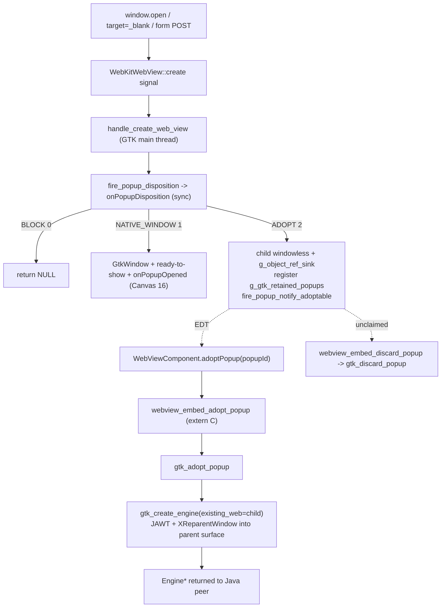

# REASONS Canvas: Popup Adoption Into a Caller-Provided WebViewComponent — Linux (WebKitGTK) Coverage (STORY-005-002)

## R · Requirements

- Extend popup adoption ([[popup-adoption-into-webviewcomponent-tab]],
  Canvas 18) to the **Linux (WebKitGTK / X11)** heavyweight backend.
  Canvas 18 shipped the cross-platform Java contract and the **macOS
  (WKWebView)** reference; this canvas lands the **WebKitGTK** native
  implementation of the same contract so an application can **adopt**
  an engine-created popup — the opener-linked child web view WebKit
  raises for `window.open`, `<a target="_blank">`, or `<form
  method="post" target="…">` — into a **`WebViewComponent` the
  application supplies** (a Swing tab), instead of the native GTK
  top-level window the engine owns today (Canvas 16).

- **No Java changes.** The entire Java contract — `PopupDisposition`,
  `WebViewPopupHandler.popupDisposition` / `popupAdoptable`,
  `WebViewPopupCallback.onPopupDisposition` / `onPopupAdoptable`,
  `PopupDispatcher` bookkeeping, `WebViewComponent.adoptPopup`,
  `EmbeddedWebView.adopt` / `discardRetainedPopup`, and the
  `webview_embed_adopt_popup` / `webview_embed_discard_popup` JNI
  declarations — was authored platform-agnostically by Canvas 18 and is
  **reused unchanged**. This canvas conforms to that contract; it does
  not re-shape the Java side, and touches no `.java` file. The wire
  contract (disposition ordinals `BLOCK=0` / `NATIVE_WINDOW=1` /
  `ADOPT=2`, the `onPopupDisposition` / `onPopupAdoptable` JNI
  signatures) is exactly the one macOS already speaks.

- **Why the existing Linux model is insufficient for a tabbed browser.**
  Same rationale as Canvas 18: a tabbed consumer that wants popups as
  tabs must today block the native window and re-open the target URL via
  `setUrl`, which issues a GET (losing a `<form method="post">` body)
  and drops opener linkage (`window.opener` null, `postMessage`-to-opener
  broken). WebKitGTK's `WebKitURIRequest` does **not** expose the POST
  body, so the request cannot be reconstructed and replayed from Java.
  The only faithful path is to **reuse the engine's own child** — the
  `webkit_web_view_new_with_related_view(opener)` view WebKit already
  drove the original request (verb + body) into, which is already
  opener-linked — and reparent it into the caller's surface.

- **Two-phase adoption, mirroring macOS.** Phase 1 (GTK main thread,
  synchronous): the `create` signal handler
  (`handle_create_web_view`) calls `onPopupDisposition` and switches on
  the returned ordinal. On `ADOPT` it builds the opener-linked child
  from `webkit_web_view_new_with_related_view`, creates **no**
  `GtkWindow`, retains the child (holding an explicit strong reference)
  under `g_gtk_retained_popups` keyed by an engine-assigned `popup_id`,
  returns the child to WebKit (which drives the original request into
  it), and fires `onPopupAdoptable(popup_id, …)`. Phase 2 (EDT): the
  application's `WebViewComponent.adoptPopup(popup_id)` peer attach calls
  `webview_embed_adopt_popup` → `gtk_adopt_popup`, which reparents the
  retained child into the component's realized X11 surface and returns
  the engine pointer.

- **The disposition decision is synchronous on the GTK main thread.**
  Exactly like the Canvas 16 `onPopupRequested` gate and the
  `script-dialog` confirm path, the `create` handler must return the
  child before yielding to WebKit, so `onPopupDisposition` is called
  **inline** on the GTK main thread and never marshalled to the EDT. The
  GTK create handler already runs OFF the EDT, so — unlike the macOS
  AppKit-main path — `onPopupAdoptable` can be a **direct
  `CallVoidMethod`** (no detached worker thread); the Java
  `PopupDispatcher` marshals `popupAdoptable` to the EDT via
  `invokeLater` itself.

- **Scope: Linux heavyweight (embed) engine only.** The offscreen /
  lightweight WebKitGTK path (`OffEngine` /
  `WebViewLightweightComponent`) is **out of scope** — its Canvas-19
  guard is left as-is; only the heavyweight `Engine` gains adoption. This
  matches the macOS boundary (no lightweight adopt) and keeps the risky
  X11-reparent work confined to the one engine that already does
  XReparentWindow embedding.

- Definition of Done:
  - A handler returning `ADOPT` from `popupDisposition`, plus an app
    that on `popupAdoptable` creates a tab via
    `WebViewComponent.adoptPopup(popupId)`, results in the popup
    appearing **inside that component** on Linux, with the **POST body
    preserved** and **opener linkage intact** (`window.opener`
    non-null, `postMessage`-to-opener works). No native popup window
    appears at any point on the `ADOPT` path.
  - A Canvas 16 handler that allows the popup (`popupRequested` →
    `true`, or `DEFAULT`) still opens a native GTK window; a blocking
    handler / `setPopupHandler(null)` still blocks — byte-for-byte the
    prior Linux behavior.
  - `adoptPopup` on an unknown/consumed `popupId` yields a native `0`
    return (`gtk_adopt_popup` finds nothing in `g_gtk_retained_popups`),
    which `EmbeddedWebView.adopt` turns into the documented
    `IllegalStateException`; adoption is once-only (claim removes under
    lock).
  - A popup decided `ADOPT` but never adopted is reclaimed via
    `webview_embed_discard_popup` → `gtk_discard_popup` (opener disposed
    or grace-period backstop) — native child torn down, `onPopupClosed`
    fired, inherited refs freed, no orphaned engine.
  - Closing an adopted popup fires `onPopupClosed` correlated by
    `popup_id` and disposes the engine without dereferencing freed
    native state.

- Out of scope (explicit non-goals):
  - **Windows (WebView2) adoption** — Canvas 20 / STORY-005-003.
  - The **offscreen / lightweight** WebKitGTK engine (`OffEngine`).
  - Any **Java** change (contract is Canvas 18's, reused verbatim).
  - **swingwebbrowser** consumer wiring — STORY-005-004.
  - Surfacing the HTTP method/body to Java; reparenting an arbitrary
    running component; `window.open` feature strings beyond
    `width`/`height` (unchanged from Canvas 16).

## E · Entities

- **`src_c/webview_embed.cpp`** (modified — GTK region, inside
  `#ifdef WEBVIEW_GTK`). All new native code lands here:
  - `g_gtk_retained_popups` (`std::map<jlong, PopupEngine*>`) +
    `g_gtk_retained_popups_mutex` — the WebKitGTK counterpart of the
    macOS `g_retained_popups`; holds retained-but-unadopted popup
    children keyed by `popup_id`.
  - `fire_popup_disposition(jvm, cb, url, name, gesture, w, h, page)
    -> int` — pure-JNI, synchronous on the GTK main thread; calls
    `WebViewPopupCallback.onPopupDisposition`, returns the ordinal
    (`0` = BLOCK on null cb / attach failure / exception). Mirrors the
    macOS `fire_popup_disposition` and this file's `fire_popup_requested`.
  - `fire_popup_notify_adoptable(jvm, cb, popup_id, url, name, gesture,
    w, h, page)` — pure-JNI; fires `onPopupAdoptable` with a **direct
    `CallVoidMethod`** (GTK handler already off the EDT), same
    fire-and-forget shape as `fire_gtk_popup_opened`.
  - `handle_create_web_view` (modified) — the shared `create`-signal
    inner handler now calls `fire_popup_disposition` and switches:
    `BLOCK` → `NULL`; `NATIVE_WINDOW` → the unchanged Canvas 16 GtkWindow
    path; `ADOPT` → windowless child + `g_object_ref_sink` retain +
    register in `g_gtk_retained_popups` + `fire_popup_notify_adoptable`,
    connecting create/script-dialog/run-file-chooser/close (NOT
    ready-to-show).
  - `on_ready_to_show_popup` (modified) — early-returns when
    `pe->window == nullptr` so an ADOPT child never shows a window or
    fires `onPopupOpened`.
  - `gtk_create_engine` (modified) — gains an optional
    `GtkWidget *existing_web = nullptr` parameter; when non-null the
    engine **reuses** that web view (skipping
    `webkit_web_view_new()`) while performing the identical
    JAWT/XReparent/window/frame-clock/signal wiring.
  - `gtk_adopt_popup(env, parent, popupId, debug) -> Engine*` — claims
    the retained `PopupEngine` (adopt-once), disconnects its
    PopupEngine-scoped signal handlers, calls `gtk_create_engine(…,
    existing_web=child)` to reparent the child into `parent`'s surface,
    transfers the inherited popup/dialog callbacks to the engine, drops
    the retained ref, deletes the shell, and returns the `Engine*`
    (`nullptr` for unknown/consumed id, or on attach failure — after
    re-retaining the child).
  - `gtk_discard_popup(popupId)` — claims + tears down an unadopted
    retained child (fires `onPopupClosed`, disconnects handlers,
    `gtk_widget_destroy` + drops the retained ref, frees inherited refs,
    deletes the shell). Mirrors `on_close_popup` minus the window.
  - The two JNI bridges
    `Java_…_webview_1embed_1adopt_1popup` /
    `…_webview_1embed_1discard_1popup` (modified) — their `#ifdef
    WEBVIEW_GTK` branch now calls `embed::gtk_adopt_popup` /
    `embed::gtk_discard_popup` (previously returned `0` / no-op). They
    **remain inside the `extern "C"` block** — a newly-added JNI method
    placed outside it gets C++-mangled and fails at runtime with
    `UnsatisfiedLinkError` (the exact bug already hit and fixed for the
    dialog setters; see the block comment above the bridges).

- **`PopupEngine`** (reused unchanged) — its `window` field is now
  `nullptr` for an ADOPT child (windowless); `web`, `jvm`,
  `popup_callback`, `dialog_callback`, `popup_id` carry the retained
  child's state until adoption or discard.

## A · Approach

1. **Reuse the engine's child; never replay from Java.** POST body and
   `window.opener` live inside the WebKit-created child. Adoption returns
   that exact child to WebKit (so it drives the original navigation-action
   request into it) and later reparents its X11 window into the caller's
   surface via the same `XReparentWindow` machinery
   `gtk_create_engine` already performs. Java never sees or reconstructs
   the request — sidestepping the unavailable-POST-body problem.

2. **Refactor, don't duplicate, the embedding path.**
   `gtk_create_engine` gains an optional `existing_web` parameter. When
   non-null it skips `webkit_web_view_new()` and reuses the retained
   child, but runs the identical JAWT lock / `XReparentWindow` / window
   realize / software-compositing / frame-clock / engine-scoped signal
   wiring. `gtk_adopt_popup` is thin: claim, disconnect the child's old
   PopupEngine handlers, call the shared path, transfer callbacks, drop
   the retained ref. This keeps the reparent logic single-sourced, so
   adoption cannot drift from normal create embedding.

3. **Disposition switch inside the shared create handler.**
   `handle_create_web_view` is the one inner handler all three GTK create
   wrappers (engine / off_engine / popup) route through, so replacing the
   `fire_popup_requested` boolean gate with a `fire_popup_disposition`
   ordinal switch makes ADOPT reachable from the heavyweight engine's
   `create` signal automatically — `on_create_web_view_engine` already
   passes the engine's `popup_callback` here (Canvas 16).

4. **Windowless retain via explicit strong ref.** On ADOPT the child is
   never added to a GTK container, so its floating reference would leave
   it destroyable. `g_object_ref_sink(childw)` clears the floating flag
   and gives `g_gtk_retained_popups` an owning reference. This mirrors
   the NATIVE_WINDOW refcounting (there the GtkWindow container owns the
   sunk ref) — the child ends up held by our ref + WebKit's own reference
   on the returned view. The retained ref is balanced by
   `g_object_unref` in `gtk_adopt_popup` (after the adopting window takes
   a container ref) or `gtk_widget_destroy` + `g_object_unref` in
   `gtk_discard_popup`.

5. **Signal-handler handoff on adopt.** The retained child's
   create/script-dialog/run-file-chooser/close handlers are registered
   with the `PopupEngine` as user-data. Before reusing the view,
   `gtk_adopt_popup` calls `g_signal_handlers_disconnect_by_data(web,
   pe)` so exactly one handler set survives; `gtk_create_engine` then
   connects the fresh engine-scoped handlers
   (`on_create_web_view_engine` / `on_script_dialog_engine` /
   `on_run_file_chooser_engine`). The inherited popup/dialog global refs
   are transferred from the shell to the engine (nulled on the shell to
   prevent double-free), so nested popups + dialogs keep working
   immediately and are later overwritten by the component's own
   `gtk_set_popup_callback` / `gtk_set_dialog_callback` at attach (which
   `DeleteGlobalRef` the transferred ref first — no leak).

6. **Threading matches the platform.** `onPopupDisposition` is
   synchronous inline on the GTK main thread (never EDT-marshalled).
   `onPopupAdoptable` is a direct `CallVoidMethod` because the GTK
   handler already runs off the EDT — no detached worker thread is
   needed (the macOS variant needs one only because the AppKit main
   thread is blocked in its delegate). The Java dispatcher marshals
   `popupAdoptable` to the EDT itself.

7. **JNI bridges stay in `extern "C"`.** Only the GTK branch of the two
   already-present bridges changes (macOS/Windows branches untouched).
   The bridges keep their position inside the `extern "C"` block so the
   JVM resolves them — the mangling bug is documented in the block
   comment and must not regress.

8. **Exception + null discipline unchanged.** `fire_popup_disposition`
   returns `0` (BLOCK) on null callback / attach failure / exception.
   Every `Call*Method` is followed by an `ExceptionCheck` /
   `ExceptionDescribe` / `ExceptionClear`. Strings are null-coerced to
   empty; sizes are `-1` for unspecified at create time.

## S · Structure

### Layered Architecture (native only; layers above are Canvas 18's, unchanged)
1. **Native engine layer** (`src_c/webview_embed.cpp`, GTK region):
   disposition switch in `handle_create_web_view`, the
   `g_gtk_retained_popups` registry, `fire_popup_disposition` /
   `fire_popup_notify_adoptable`, `gtk_create_engine`'s `existing_web`
   reuse, `gtk_adopt_popup` / `gtk_discard_popup`, `on_ready_to_show_popup`
   windowless guard.
2. **JNI surface** (`extern "C"` bridges): GTK branch of
   `webview_embed_adopt_popup` / `webview_embed_discard_popup`.
3. **Everything above** (`WebViewNative`, `EmbeddedWebView`,
   `PopupDispatcher`, `WebViewComponent`, `WebViewPopupHandler`,
   `PopupDisposition`, `WebViewPopupCallback`): **Canvas 18, unmodified.**

### Dependencies
1. `handle_create_web_view` → `fire_popup_disposition`,
   `fire_popup_notify_adoptable`, `g_gtk_retained_popups`.
2. `gtk_adopt_popup` → `g_gtk_retained_popups`, `gtk_create_engine`
   (with `existing_web`), `GtkPump`, the PopupEngine signal handlers
   (reconnect on failure).
3. `gtk_discard_popup` → `g_gtk_retained_popups`, `fire_gtk_popup_closed`,
   `GtkPump`.
4. JNI bridges → `embed::gtk_adopt_popup` / `embed::gtk_discard_popup`.

## O · Operations

### 1. Retained-popup registry
File: `src_c/webview_embed.cpp` (GTK, after `PopupEngine`)
1. Add `static std::mutex g_gtk_retained_popups_mutex;` and
   `static std::map<jlong, PopupEngine *> g_gtk_retained_popups;` with an
   ON-DEVICE-VALIDATION comment.

### 2. Disposition + adoptable JNI helpers
File: `src_c/webview_embed.cpp` (GTK)
1. `fire_popup_disposition` after `fire_popup_requested`: attach env,
   `GetMethodID("onPopupDisposition",
   "(Ljava/lang/String;Ljava/lang/String;ZIILjava/lang/String;)I")`,
   `CallIntMethod`, sanitize exceptions, return the ordinal (0 on any
   failure).
2. `fire_popup_notify_adoptable` after `fire_gtk_popup_opened`: attach
   env, `GetMethodID("onPopupAdoptable",
   "(JLjava/lang/String;Ljava/lang/String;ZIILjava/lang/String;)V")`,
   direct `CallVoidMethod`, sanitize.

### 3. Disposition switch in `handle_create_web_view`
File: `src_c/webview_embed.cpp` (GTK)
1. Replace the `fire_popup_requested` gate with `int disposition =
   fire_popup_disposition(...)`; `disposition == 0` → `return NULL`;
   `adopt = (disposition == 2)`.
2. `NATIVE_WINDOW`: unchanged — GtkWindow + `gtk_container_add` +
   ready-to-show + `onPopupOpened`.
3. `ADOPT`: no window; `g_object_ref_sink(childw)`; build the
   PopupEngine with `window = nullptr`; connect create/script-dialog/
   run-file-chooser/close (NOT ready-to-show); register in
   `g_gtk_retained_popups`; `fire_popup_notify_adoptable`.
4. `on_ready_to_show_popup`: early-return when `pe->window == nullptr`.

### 4. `gtk_create_engine` reuse parameter
File: `src_c/webview_embed.cpp` (GTK)
1. Add `GtkWidget *existing_web = nullptr` param; inside the run_sync
   body, `e->web = existing_web ? existing_web : webkit_web_view_new()`.
   Everything else (JAWT, XReparent, signals, container_add,
   frame-clock) is shared.

### 5. `gtk_adopt_popup`
File: `src_c/webview_embed.cpp` (GTK)
1. Claim the `PopupEngine` from `g_gtk_retained_popups` under lock
   (adopt-once); `nullptr` if absent.
2. `g_signal_handlers_disconnect_by_data(pe->web, pe)` on the GTK thread.
3. `Engine *e = gtk_create_engine(env, parent, debug, GTK_WIDGET(pe->web))`.
   On failure: reconnect the PopupEngine handlers, re-retain in the
   registry, return `nullptr`.
4. Transfer `popup_callback` / `dialog_callback` from `pe` to `e` (null
   them on `pe`).
5. `g_object_unref(childw)` on the GTK thread (drop the retained ref).
6. `delete pe`; return `e`.

### 6. `gtk_discard_popup`
File: `src_c/webview_embed.cpp` (GTK)
1. Claim from the registry (no-op if absent).
2. `fire_gtk_popup_closed`.
3. On the GTK thread: disconnect handlers, `gtk_widget_destroy(web)`,
   `g_object_unref(web)`.
4. Free the inherited global refs; `delete pe`.

### 7. JNI bridges (GTK branch)
File: `src_c/webview_embed.cpp` (`extern "C"`)
1. `webview_embed_adopt_popup`: `#ifdef WEBVIEW_GTK` →
   `embed::gtk_adopt_popup(env, parent, popupId, debug)`; return
   `(jlong)e`.
2. `webview_embed_discard_popup`: `#ifdef WEBVIEW_GTK` →
   `embed::gtk_discard_popup(popupId)`.
3. Both remain inside `extern "C"`.

## N · Norms

- **No Java changes.** This canvas is native-only; the Java contract is
  Canvas 18's. The wire contract (ordinals, JNI method signatures) is
  identical to macOS.
- **Ordinal wire contract.** `onPopupDisposition` returns
  `BLOCK=0/NATIVE_WINDOW=1/ADOPT=2`; never reorder.
- **Additive-only.** The `NATIVE_WINDOW` / `BLOCK` branches are the
  unchanged Canvas 16 Linux paths; a boolean-only handler, `DEFAULT`,
  and `setPopupHandler(null)` behave byte-for-byte as before.
- **Synchronous, off-EDT disposition.** `fire_popup_disposition` runs
  inline on the GTK main thread and is never marshalled to the EDT.
- **Direct-call adoptable notify.** `fire_popup_notify_adoptable` uses a
  plain `CallVoidMethod` (GTK handler already off the EDT); no detached
  worker thread (the macOS-only requirement).
- **Per-call `jmethodID` resolution + JNI exception sanitization** in
  the new native calls, matching the dialog/popup selectors.
- **GTK object ownership discipline.** ADOPT holds the child via
  `g_object_ref_sink`; adopt balances with `g_object_unref` after the
  window's container ref; discard balances with `gtk_widget_destroy` +
  `g_object_unref`. Inherited global refs are transferred (nulled on the
  shell) so `delete pe` never double-frees.
- **Single handler set per signal.** `g_signal_handlers_disconnect_by_data`
  removes the PopupEngine-scoped handlers before the engine-scoped ones
  are connected.
- **Offscreen path untouched.** No change to `OffEngine` /
  `WebViewLightweightComponent`; the lightweight Canvas-19 guard stays.
- **C++11, no `-Werror`** (`g++ -std=c++11 -Wall -DWEBVIEW_GTK=1`);
  avoid hard errors. Default parameter on `gtk_create_engine` keeps the
  existing single call site compiling unchanged.

## S · Safeguards

- **Backward compatibility is a never-relax invariant.** A Canvas 16
  handler, `DEFAULT`, and `setPopupHandler(null)` MUST behave
  byte-for-byte as before on Linux; the `NATIVE_WINDOW` / `BLOCK`
  branches are the unchanged paths.
- **No native window on ADOPT.** The ADOPT branch MUST NOT create a
  GtkWindow or connect `ready-to-show`; `on_ready_to_show_popup`
  early-returns on a windowless child so `onPopupOpened` never fires for
  an adopt popup.
- **Adopt-once + clean rejection.** `gtk_adopt_popup` removes the id from
  `g_gtk_retained_popups` under lock, so a second adopt (or unknown id)
  finds nothing and returns `nullptr` → JNI `0` →
  `IllegalStateException`. A never-half-attached engine is returned.
- **No-leak reclaim.** `gtk_discard_popup` fires `onPopupClosed`, tears
  the child down, frees the inherited refs, and deletes the shell — the
  Linux end of the Canvas 18 reclaim contract (opener dispose +
  grace-period backstop, both driven from the unchanged Java side).
- **JNI bridges inside `extern "C"`.** The GTK-branch edit does not move
  the bridges; keeping them inside `extern "C"` is mandatory
  (UnsatisfiedLinkError otherwise — the documented, previously-fixed
  bug).
- **Opener linkage + POST are mandatory.** The adopted child MUST be the
  `webkit_web_view_new_with_related_view` child; creating a fresh view or
  re-navigating from Java is a defect.

- **Native coverage status — ON-DEVICE VALIDATION REQUIRED.** The
  generating sandbox has **no GTK toolchain**, so this native code is
  pattern-faithful to the shipped Canvas 16 popup handlers and the
  Canvas 18 macOS adopt/discard, but is **unbuilt and unexercised
  here**. Prime candidates for on-device scrutiny on a real
  WebKitGTK/X11 stack:
  - the `XReparentWindow` of the reused child under the new AWT canvas
    window (inside `gtk_create_engine`);
  - the widget ownership handoff — the `g_object_ref_sink` retained
    reference, the adopting window's container reference, and WebKit's
    own reference on the returned child — verified balanced across
    adopt AND discard (watch for leaks / premature finalization /
    use-after-destroy);
  - whether the child's in-flight POST navigation keeps rendering after
    being reparented from windowless to the adopting surface;
  - the `g_signal_handlers_disconnect_by_data` handoff (no double
    `create` handling, no dangling PopupEngine dereference);
  - the software-compositing / frame-clock repaint pacing on the reused
    view (the Canvas 6/16 virtualized-X11 concerns apply unchanged).

## REASONS-Implements

- `src_c/webview_embed.cpp` (GTK region: `g_gtk_retained_popups` +
  mutex, `fire_popup_disposition`, `fire_popup_notify_adoptable`,
  `handle_create_web_view` disposition switch, `on_ready_to_show_popup`
  windowless guard, `gtk_create_engine` `existing_web` reuse,
  `gtk_adopt_popup`, `gtk_discard_popup`)
- `src_c/webview_embed.cpp` (`extern "C"`: GTK branch of
  `Java_ca_weblite_webview_WebViewNative_webview_1embed_1adopt_1popup`
  and `…_webview_1embed_1discard_1popup`)
- Conforms to the Canvas 18 Java contract
  ([[popup-adoption-into-webviewcomponent-tab]]) — **no Java changes**.
