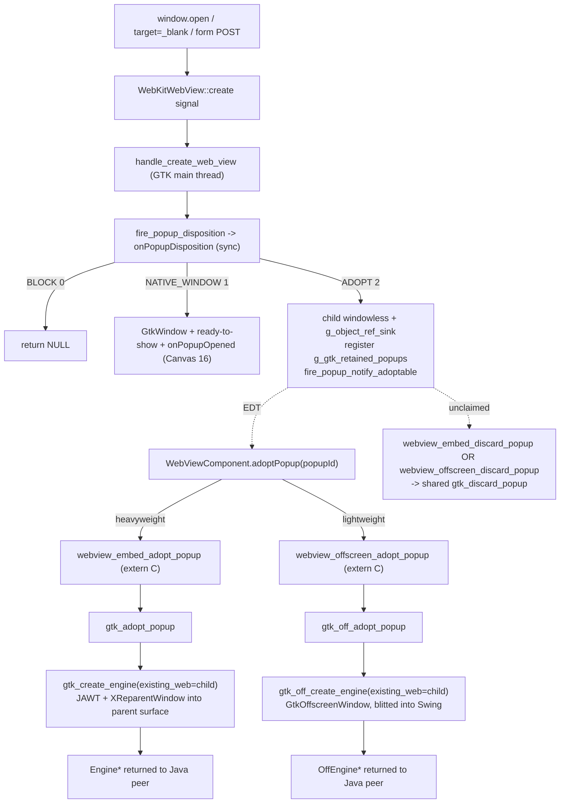

# REASONS Canvas: Popup Adoption Into a Caller-Provided WebViewComponent — Linux (WebKitGTK) Coverage — Heavyweight + Lightweight/Offscreen (STORY-005-002)

## R · Requirements

- Extend popup adoption ([[popup-adoption-into-webviewcomponent-tab]],
  Canvas 18) to the **Linux (WebKitGTK / X11)** heavyweight backend.
  Canvas 18 shipped the cross-platform Java contract and the **macOS
  (WKWebView)** reference; this canvas lands the **WebKitGTK** native
  implementation of the same contract so an application can **adopt**
  an engine-created popup — the opener-linked child web view WebKit
  raises for `window.open`, `<a target="_blank">`, or `<form
  method="post" target="…">` — into a **`WebViewComponent` the
  application supplies** (a Swing tab), instead of the native GTK
  top-level window the engine owns today (Canvas 16).

- **Both Linux engines are covered.** The adoption target is either
  Linux engine: the **heavyweight** (`EmbeddedWebView` /
  `WebViewHeavyweightComponent`, on-screen X11-reparented `Engine`) and
  the **lightweight/offscreen** (`OffscreenWebView` /
  `WebViewLightweightComponent`, `GtkOffscreenWindow`-hosted `OffEngine`
  blitted into Swing). This matters because the DEFAULT Linux mode is
  the lightweight component; adoption that only worked heavyweight would
  miss the common case. Both targets claim the retained child from the
  **same** shared `g_gtk_retained_popups` registry, because the opener
  that raised the popup may itself be heavyweight OR lightweight (both
  route `create` through the shared `handle_create_web_view`, which
  retains the child identically on `ADOPT`).

- **Heavyweight is native-only; lightweight adds internal Java.** The
  heavyweight path reuses the Canvas 18 Java contract verbatim —
  `PopupDisposition`, `WebViewPopupHandler.popupDisposition` /
  `popupAdoptable`, `WebViewPopupCallback.onPopupDisposition` /
  `onPopupAdoptable`, `PopupDispatcher` bookkeeping,
  `WebViewComponent.adoptPopup`, `EmbeddedWebView.adopt` /
  `discardRetainedPopup`, and the `webview_embed_adopt_popup` /
  `webview_embed_discard_popup` JNI declarations — authored
  platform-agnostically by Canvas 18 and touching no heavyweight `.java`
  file. The wire contract (disposition ordinals `BLOCK=0` /
  `NATIVE_WINDOW=1` / `ADOPT=2`, the `onPopupDisposition` /
  `onPopupAdoptable` JNI signatures) is exactly the one macOS already
  speaks. The **lightweight** path adds new internal Java plumbing —
  `OffscreenWebView.adopt` / `discardRetainedPopup`, two
  `webview_offscreen_adopt_popup` / `webview_offscreen_discard_popup`
  `WebViewNative` declarations, and real adoption wiring in
  `WebViewLightweightComponent.addNotify` (replacing its Canvas-19
  skip-guard). The **public `WebViewComponent` API is unchanged** — the
  same `adoptPopup(popupId)` factory drives whichever component the app
  built; only the lightweight component's internals learn to adopt.

- **Why the existing Linux model is insufficient for a tabbed browser.**
  Same rationale as Canvas 18: a tabbed consumer that wants popups as
  tabs must today block the native window and re-open the target URL via
  `setUrl`, which issues a GET (losing a `<form method="post">` body)
  and drops opener linkage (`window.opener` null, `postMessage`-to-opener
  broken). WebKitGTK's `WebKitURIRequest` does **not** expose the POST
  body, so the request cannot be reconstructed and replayed from Java.
  The only faithful path is to **reuse the engine's own child** — the
  `webkit_web_view_new_with_related_view(opener)` view WebKit already
  drove the original request (verb + body) into, which is already
  opener-linked — and reparent it into the caller's surface.

- **Two-phase adoption, mirroring macOS.** Phase 1 (GTK main thread,
  synchronous): the `create` signal handler
  (`handle_create_web_view`) calls `onPopupDisposition` and switches on
  the returned ordinal. On `ADOPT` it builds the opener-linked child
  from `webkit_web_view_new_with_related_view`, creates **no**
  `GtkWindow`, retains the child (holding an explicit strong reference)
  under `g_gtk_retained_popups` keyed by an engine-assigned `popup_id`,
  returns the child to WebKit (which drives the original request into
  it), and fires `onPopupAdoptable(popup_id, …)`. Phase 2 (EDT): the
  application's `WebViewComponent.adoptPopup(popup_id)` peer attach
  claims the retained child and reuses it. When the adopting component
  is **heavyweight**, `EmbeddedWebView.adopt` →
  `webview_embed_adopt_popup` → `gtk_adopt_popup` reparents the retained
  child into the component's realized X11 surface and returns the
  heavyweight engine pointer. When it is **lightweight**,
  `OffscreenWebView.adopt` → `webview_offscreen_adopt_popup` →
  `gtk_off_adopt_popup` reuses the retained child inside a fresh
  `GtkOffscreenWindow` (`OffEngine`), so the child renders into the
  offscreen surface that Java blits — no X11 reparent into an on-screen
  window is involved. Phase 1 is identical for both targets (the child
  is retained windowless in the shared registry regardless of which
  engine the opener was).

- **The disposition decision is synchronous on the GTK main thread.**
  Exactly like the Canvas 16 `onPopupRequested` gate and the
  `script-dialog` confirm path, the `create` handler must return the
  child before yielding to WebKit, so `onPopupDisposition` is called
  **inline** on the GTK main thread and never marshalled to the EDT. The
  GTK create handler already runs OFF the EDT, so — unlike the macOS
  AppKit-main path — `onPopupAdoptable` can be a **direct
  `CallVoidMethod`** (no detached worker thread); the Java
  `PopupDispatcher` marshals `popupAdoptable` to the EDT via
  `invokeLater` itself.

- **Scope: both Linux engines (heavyweight embed + lightweight
  offscreen).** The heavyweight `Engine` gains adoption via
  `gtk_adopt_popup` (X11 reparent) and the lightweight `OffEngine` gains
  adoption via `gtk_off_adopt_popup` (reuse the child inside a
  `GtkOffscreenWindow`). Both share the single `g_gtk_retained_popups`
  registry and the single `gtk_discard_popup` reclaim path. macOS
  remains heavyweight-only (its offscreen engine is a stub); the
  lightweight adopt is a WebKitGTK-specific capability the offscreen
  blit pipeline makes cheap (no X11 reparent risk — the child lives in
  an offscreen toplevel).

- Definition of Done:
  - A handler returning `ADOPT` from `popupDisposition`, plus an app
    that on `popupAdoptable` creates a tab via
    `WebViewComponent.adoptPopup(popupId)`, results in the popup
    appearing **inside that component** on Linux — for **either** a
    heavyweight or a lightweight/offscreen adopting component — with the
    **POST body preserved** and **opener linkage intact**
    (`window.opener` non-null, `postMessage`-to-opener works). No native
    popup window appears at any point on the `ADOPT` path.
  - For the **lightweight** target specifically: `adoptPopup` on a
    lightweight `WebViewComponent` makes
    `WebViewLightweightComponent.addNotify` call `OffscreenWebView.adopt`
    (not `create`) and **not** navigate `pendingUrl` (the adopted child
    already carries its in-flight navigation), and the adopted child's
    pixels blit into the Swing component via the existing snapshot
    pipeline. The public `WebViewComponent` API is unchanged.
  - A Canvas 16 handler that allows the popup (`popupRequested` →
    `true`, or `DEFAULT`) still opens a native GTK window; a blocking
    handler / `setPopupHandler(null)` still blocks — byte-for-byte the
    prior Linux behavior.
  - `adoptPopup` on an unknown/consumed `popupId` yields a native `0`
    return (`gtk_adopt_popup` finds nothing in `g_gtk_retained_popups`),
    which `EmbeddedWebView.adopt` turns into the documented
    `IllegalStateException`; adoption is once-only (claim removes under
    lock).
  - A popup decided `ADOPT` but never adopted is reclaimed via
    `gtk_discard_popup` (opener disposed or grace-period backstop) —
    native child torn down, `onPopupClosed` fired, inherited refs freed,
    no orphaned engine. Both JNI reclaim bridges converge on the **same**
    `gtk_discard_popup`: heavyweight via `webview_embed_discard_popup`,
    lightweight via `webview_offscreen_discard_popup` (the retained child
    is the same `PopupEngine` in the shared registry, so the reclaim is
    identical and is NOT duplicated).
  - Closing an adopted popup fires `onPopupClosed` correlated by
    `popup_id` and disposes the engine without dereferencing freed
    native state.

- Out of scope (explicit non-goals):
  - **Windows (WebView2) adoption** — Canvas 20 / STORY-005-003.
  - **macOS offscreen adoption** — the macOS/Windows offscreen engines
    are stubs (`webview_offscreen_create` returns 0), so
    `webview_offscreen_adopt_popup` returns 0 there and adoption is
    never triggered on those platforms.
  - Any change to the **public `WebViewComponent` API** — the lightweight
    Java additions are internal (`OffscreenWebView`, `WebViewNative`,
    `WebViewLightweightComponent` internals only). The heavyweight Java
    contract is Canvas 18's, reused verbatim.
  - **swingwebbrowser** consumer wiring — STORY-005-004.
  - Surfacing the HTTP method/body to Java; reparenting an arbitrary
    running component; `window.open` feature strings beyond
    `width`/`height` (unchanged from Canvas 16).

## E · Entities

- **`src_c/webview_embed.cpp`** (modified — GTK region, inside
  `#ifdef WEBVIEW_GTK`). All new native code lands here:
  - `g_gtk_retained_popups` (`std::map<jlong, PopupEngine*>`) +
    `g_gtk_retained_popups_mutex` — the WebKitGTK counterpart of the
    macOS `g_retained_popups`; holds retained-but-unadopted popup
    children keyed by `popup_id`.
  - `fire_popup_disposition(jvm, cb, url, name, gesture, w, h, page)
    -> int` — pure-JNI, synchronous on the GTK main thread; calls
    `WebViewPopupCallback.onPopupDisposition`, returns the ordinal
    (`0` = BLOCK on null cb / attach failure / exception). Mirrors the
    macOS `fire_popup_disposition` and this file's `fire_popup_requested`.
  - `fire_popup_notify_adoptable(jvm, cb, popup_id, url, name, gesture,
    w, h, page)` — pure-JNI; fires `onPopupAdoptable` with a **direct
    `CallVoidMethod`** (GTK handler already off the EDT), same
    fire-and-forget shape as `fire_gtk_popup_opened`.
  - `handle_create_web_view` (modified) — the shared `create`-signal
    inner handler now calls `fire_popup_disposition` and switches:
    `BLOCK` → `NULL`; `NATIVE_WINDOW` → the unchanged Canvas 16 GtkWindow
    path; `ADOPT` → windowless child + `g_object_ref_sink` retain +
    register in `g_gtk_retained_popups` + `fire_popup_notify_adoptable`,
    connecting create/script-dialog/run-file-chooser/close (NOT
    ready-to-show).
  - `on_ready_to_show_popup` (modified) — early-returns when
    `pe->window == nullptr` so an ADOPT child never shows a window or
    fires `onPopupOpened`.
  - `gtk_create_engine` (modified) — gains an optional
    `GtkWidget *existing_web = nullptr` parameter; when non-null the
    engine **reuses** that web view (skipping
    `webkit_web_view_new()`) while performing the identical
    JAWT/XReparent/window/frame-clock/signal wiring.
  - `gtk_adopt_popup(env, parent, popupId, debug) -> Engine*` — claims
    the retained `PopupEngine` (adopt-once), disconnects its
    PopupEngine-scoped signal handlers, calls `gtk_create_engine(…,
    existing_web=child)` to reparent the child into `parent`'s surface,
    transfers the inherited popup/dialog callbacks to the engine, drops
    the retained ref, deletes the shell, and returns the `Engine*`
    (`nullptr` for unknown/consumed id, or on attach failure — after
    re-retaining the child).
  - `gtk_discard_popup(popupId)` — claims + tears down an unadopted
    retained child (fires `onPopupClosed`, disconnects handlers,
    `gtk_widget_destroy` + drops the retained ref, frees inherited refs,
    deletes the shell). Mirrors `on_close_popup` minus the window.
  - The two JNI bridges
    `Java_…_webview_1embed_1adopt_1popup` /
    `…_webview_1embed_1discard_1popup` (modified) — their `#ifdef
    WEBVIEW_GTK` branch now calls `embed::gtk_adopt_popup` /
    `embed::gtk_discard_popup` (previously returned `0` / no-op). They
    **remain inside the `extern "C"` block** — a newly-added JNI method
    placed outside it gets C++-mangled and fails at runtime with
    `UnsatisfiedLinkError` (the exact bug already hit and fixed for the
    dialog setters; see the block comment above the bridges).

- **`src_c/webview_embed.cpp`** (modified — GTK offscreen/lightweight
  region, inside `#ifdef WEBVIEW_GTK`). New offscreen adoption code:
  - `gtk_off_create_engine` (modified) — gains an optional
    `GtkWidget *existing_web = nullptr` trailing parameter, mirroring
    the `gtk_create_engine` refactor. When non-null the offscreen engine
    **reuses** that web view (skipping `webkit_web_view_new()`) while
    still building the `GtkOffscreenWindow`, wiring the external
    message handler / dialogs / popups / IM-disable / focus-synth, and
    doing `gtk_container_add` + `gtk_widget_show_all`. The single
    existing caller (`webview_offscreen_create` bridge) passes the old
    three-arg form and gets the default `nullptr` (fresh view).
  - `gtk_off_adopt_popup(env, popupId, width, height, debug)
    -> OffEngine*` — claims the retained `PopupEngine` from the shared
    `g_gtk_retained_popups` (adopt-once, under
    `g_gtk_retained_popups_mutex`; `nullptr` if absent), disconnects its
    PopupEngine-scoped signal handlers
    (`g_signal_handlers_disconnect_by_data` via `GtkPump` run_sync),
    calls `gtk_off_create_engine(env, width, height, debug,
    existing_web=child)` to reuse the child in a `GtkOffscreenWindow`,
    transfers the inherited popup/dialog global refs to the `OffEngine`,
    drops the retained `g_object` ref (the offscreen window now holds
    the child), and deletes the `PopupEngine` shell. On failure it
    reconnects the PopupEngine handlers and re-retains the child in the
    registry (exactly like `gtk_adopt_popup`). The GTK counterpart of
    `gtk_adopt_popup` for the offscreen engine.
  - `gtk_discard_popup` (**reused unchanged**) — the offscreen reclaim
    path claims the SAME `PopupEngine` from the SAME shared registry, so
    the discard is identical and is NOT duplicated for the offscreen
    engine.
  - The two new offscreen JNI bridges (see below) live in the
    `extern "C"` block.

- **`src_c/webview_embed.cpp`** (`extern "C"` block) — two new offscreen
  JNI bridges added next to `webview_offscreen_set_popup_callback` /
  `webview_offscreen_set_user_agent`:
  - `Java_…_webview_1offscreen_1adopt_1popup(env, jclass, jint width,
    jint height, jlong popupId, jint debug) -> jlong` — `#ifdef
    WEBVIEW_GTK` returns `(jlong)embed::gtk_off_adopt_popup(env,
    popupId, width, height, debug)`; `#else` returns `0`
    (macOS/Windows offscreen is a stub).
  - `Java_…_webview_1offscreen_1discard_1popup(env, jclass,
    jlong /*peer*/, jlong popupId) -> void` — `#ifdef WEBVIEW_GTK`
    calls `embed::gtk_discard_popup(popupId)` (the shared reclaim).
  - Both **remain inside the `extern "C"` block** — a JNI method outside
    it gets C++-mangled and fails at runtime with `UnsatisfiedLinkError`
    (the exact bug already hit and fixed for the dialog setters).

- **`src/ca/weblite/webview/WebViewNative.java`** (modified) — two new
  `native static` declarations next to the other `webview_offscreen_*`:
  - `webview_offscreen_adopt_popup(int width, int height, long popupId,
    int debug) -> long`.
  - `webview_offscreen_discard_popup(long peer, long popupId) -> void`.

- **`src/ca/weblite/webview/OffscreenWebView.java`** (modified) — the
  offscreen wrapper's adoption factory + reclaim:
  - `static adopt(int width, int height, long popupId, boolean debug)
    -> OffscreenWebView` — mirrors the `create(w, h, debug)` factory:
    calls `webview_offscreen_adopt_popup`, throws
    `IllegalStateException` when the returned peer is `0` (no retained
    popup for that id / unsupported platform), otherwise wraps the peer
    and installs the same evalAsync / addJavascriptFunction bridges that
    `create` installs.
  - `discardRetainedPopup(long popupId) -> OffscreenWebView` — calls
    `webview_offscreen_discard_popup(peer, popupId)`; the offscreen
    counterpart of `EmbeddedWebView.discardRetainedPopup`.

- **`src/ca/weblite/webview/swing/WebViewLightweightComponent.java`**
  (modified) — `addNotify` real adoption:
  - The Canvas-19 skip-guard (stderr warning + early return when
    `pendingAdoptPopupId != 0`) is **replaced** by real adoption: when
    `pendingAdoptPopupId != 0L` the engine is built via
    `OffscreenWebView.adopt(w, h, pendingAdoptPopupId, debug)` instead of
    `OffscreenWebView.create(w, h, debug)`.
  - `pendingUrl` is NOT navigated on the adopt path (the adopted child
    carries its own in-flight navigation), mirroring the heavyweight
    component's `if (pendingAdoptPopupId == 0L) navigate` guard.
  - A reclaim sink is installed like the heavyweight component's:
    `popupDispatcher.setReclaimSink(...)` whose `discard(popupId)` calls
    `engine.discardRetainedPopup(popupId)` (best-effort).
  - The UA-apply-before-navigate and `applyUserAgentToPeer` override are
    kept intact.

- **`PopupEngine`** (reused unchanged) — its `window` field is now
  `nullptr` for an ADOPT child (windowless); `web`, `jvm`,
  `popup_callback`, `dialog_callback`, `popup_id` carry the retained
  child's state until adoption or discard. The SAME `PopupEngine` is
  claimed by either `gtk_adopt_popup` (heavyweight) or
  `gtk_off_adopt_popup` (lightweight), whichever component adopts it.

## A · Approach

1. **Reuse the engine's child; never replay from Java.** POST body and
   `window.opener` live inside the WebKit-created child. Adoption returns
   that exact child to WebKit (so it drives the original navigation-action
   request into it) and later reparents its X11 window into the caller's
   surface via the same `XReparentWindow` machinery
   `gtk_create_engine` already performs. Java never sees or reconstructs
   the request — sidestepping the unavailable-POST-body problem.

2. **Refactor, don't duplicate, the embedding path — both engines.**
   `gtk_create_engine` gains an optional `existing_web` parameter. When
   non-null it skips `webkit_web_view_new()` and reuses the retained
   child, but runs the identical JAWT lock / `XReparentWindow` / window
   realize / software-compositing / frame-clock / engine-scoped signal
   wiring. `gtk_adopt_popup` is thin: claim, disconnect the child's old
   PopupEngine handlers, call the shared path, transfer callbacks, drop
   the retained ref. The offscreen engine mirrors this exactly:
   `gtk_off_create_engine` gains the same optional `existing_web`
   parameter (reuse vs. `webkit_web_view_new()`), and
   `gtk_off_adopt_popup` is the offscreen twin of `gtk_adopt_popup` —
   claim from the shared registry, disconnect, call
   `gtk_off_create_engine(existing_web=child)`, transfer callbacks, drop
   the retained ref. This keeps the reuse logic single-sourced per
   engine, so adoption cannot drift from normal create.

2b. **Shared retained registry + shared reclaim.** Phase 1
   (`handle_create_web_view` ADOPT branch) is untouched and
   engine-agnostic: whether the opener is heavyweight or lightweight, the
   child is retained windowless in the single `g_gtk_retained_popups`
   under `g_gtk_retained_popups_mutex`. Adoption therefore claims from
   that same map regardless of adopt target, and the discard/reclaim path
   is the single `gtk_discard_popup` — the offscreen discard JNI bridge
   calls it directly rather than adding a parallel offscreen teardown.

3. **Disposition switch inside the shared create handler.**
   `handle_create_web_view` is the one inner handler all three GTK create
   wrappers (engine / off_engine / popup) route through, so replacing the
   `fire_popup_requested` boolean gate with a `fire_popup_disposition`
   ordinal switch makes ADOPT reachable from the heavyweight engine's
   `create` signal automatically — `on_create_web_view_engine` already
   passes the engine's `popup_callback` here (Canvas 16).

4. **Windowless retain via explicit strong ref.** On ADOPT the child is
   never added to a GTK container, so its floating reference would leave
   it destroyable. `g_object_ref_sink(childw)` clears the floating flag
   and gives `g_gtk_retained_popups` an owning reference. This mirrors
   the NATIVE_WINDOW refcounting (there the GtkWindow container owns the
   sunk ref) — the child ends up held by our ref + WebKit's own reference
   on the returned view. The retained ref is balanced by
   `g_object_unref` in `gtk_adopt_popup` (after the adopting window takes
   a container ref) or `gtk_widget_destroy` + `g_object_unref` in
   `gtk_discard_popup`.

5. **Signal-handler handoff on adopt.** The retained child's
   create/script-dialog/run-file-chooser/close handlers are registered
   with the `PopupEngine` as user-data. Before reusing the view,
   `gtk_adopt_popup` calls `g_signal_handlers_disconnect_by_data(web,
   pe)` so exactly one handler set survives; `gtk_create_engine` then
   connects the fresh engine-scoped handlers
   (`on_create_web_view_engine` / `on_script_dialog_engine` /
   `on_run_file_chooser_engine`). The inherited popup/dialog global refs
   are transferred from the shell to the engine (nulled on the shell to
   prevent double-free), so nested popups + dialogs keep working
   immediately and are later overwritten by the component's own
   `gtk_set_popup_callback` / `gtk_set_dialog_callback` at attach (which
   `DeleteGlobalRef` the transferred ref first — no leak).

6. **Threading matches the platform.** `onPopupDisposition` is
   synchronous inline on the GTK main thread (never EDT-marshalled).
   `onPopupAdoptable` is a direct `CallVoidMethod` because the GTK
   handler already runs off the EDT — no detached worker thread is
   needed (the macOS variant needs one only because the AppKit main
   thread is blocked in its delegate). The Java dispatcher marshals
   `popupAdoptable` to the EDT itself.

7. **JNI bridges stay in `extern "C"`.** Only the GTK branch of the two
   already-present bridges changes (macOS/Windows branches untouched).
   The bridges keep their position inside the `extern "C"` block so the
   JVM resolves them — the mangling bug is documented in the block
   comment and must not regress.

8. **Exception + null discipline unchanged.** `fire_popup_disposition`
   returns `0` (BLOCK) on null callback / attach failure / exception.
   Every `Call*Method` is followed by an `ExceptionCheck` /
   `ExceptionDescribe` / `ExceptionClear`. Strings are null-coerced to
   empty; sizes are `-1` for unspecified at create time.

9. **Offscreen ownership is simpler than heavyweight.** On the offscreen
   adopt there is NO `XReparentWindow` into a foreign on-screen X11 tree:
   the reused child is added to a fresh `GtkOffscreenWindow` via
   `gtk_container_add`, which takes the container ref. The retained
   `g_object_ref_sink` ref is then dropped (the offscreen window owns the
   child), exactly balancing as in the heavyweight adopt. The child's
   in-flight (POST) navigation continues to render, now into the
   offscreen surface that Java snapshots and blits.

10. **Lightweight component: adopt instead of create, don't
    re-navigate.** `WebViewLightweightComponent.addNotify` chooses
    `OffscreenWebView.adopt(w, h, pendingAdoptPopupId, debug)` when
    `pendingAdoptPopupId != 0L`, else `OffscreenWebView.create(w, h,
    debug)`. The adopted child already carries its navigation, so
    `pendingUrl` is only navigated on the create path (guard
    `if (pendingAdoptPopupId == 0L)`), mirroring the heavyweight
    component. All the other addNotify wiring (console/mouse/dialog/popup
    bridges, pending-config replay, UA-before-navigate, repaint timer,
    editing-shortcut dispatcher) is shared with the create path. A
    reclaim sink is registered on the `popupDispatcher` so the component
    can discard retained-but-unadopted children through
    `engine.discardRetainedPopup`.

## S · Structure

### Layered Architecture
1. **Native engine layer** (`src_c/webview_embed.cpp`, GTK region):
   - Heavyweight: disposition switch in `handle_create_web_view`, the
     `g_gtk_retained_popups` registry, `fire_popup_disposition` /
     `fire_popup_notify_adoptable`, `gtk_create_engine`'s `existing_web`
     reuse, `gtk_adopt_popup` / `gtk_discard_popup`,
     `on_ready_to_show_popup` windowless guard.
   - Lightweight (new): `gtk_off_create_engine`'s `existing_web` reuse,
     `gtk_off_adopt_popup`, sharing the SAME `g_gtk_retained_popups`
     registry and the SAME `gtk_discard_popup` reclaim.
2. **JNI surface** (`extern "C"` bridges): GTK branch of
   `webview_embed_adopt_popup` / `webview_embed_discard_popup`
   (heavyweight, Canvas 18); new `webview_offscreen_adopt_popup` /
   `webview_offscreen_discard_popup` (lightweight).
3. **Java layer**:
   - Heavyweight (`EmbeddedWebView`, `PopupDispatcher`,
     `WebViewComponent`, `WebViewPopupHandler`, `PopupDisposition`,
     `WebViewPopupCallback`, `WebViewHeavyweightComponent`): **Canvas 18,
     unmodified.**
   - Lightweight (new/modified, internal only): `WebViewNative` (two new
     offscreen decls), `OffscreenWebView` (`adopt` /
     `discardRetainedPopup`), `WebViewLightweightComponent` (real
     adoption + reclaim sink in `addNotify`). The public
     `WebViewComponent` API and `adoptPopup` factory are unchanged.

### Dependencies
1. `handle_create_web_view` → `fire_popup_disposition`,
   `fire_popup_notify_adoptable`, `g_gtk_retained_popups`.
2. `gtk_adopt_popup` → `g_gtk_retained_popups`, `gtk_create_engine`
   (with `existing_web`), `GtkPump`, the PopupEngine signal handlers
   (reconnect on failure).
3. `gtk_off_adopt_popup` → `g_gtk_retained_popups`,
   `gtk_off_create_engine` (with `existing_web`), `GtkPump`, the
   PopupEngine signal handlers (reconnect on failure).
4. `gtk_discard_popup` → `g_gtk_retained_popups`, `fire_gtk_popup_closed`,
   `GtkPump` (shared by both engines' reclaim bridges).
5. Heavyweight JNI bridges → `embed::gtk_adopt_popup` /
   `embed::gtk_discard_popup`.
6. Offscreen JNI bridges → `embed::gtk_off_adopt_popup` /
   `embed::gtk_discard_popup`.
7. `OffscreenWebView.adopt` → `WebViewNative.webview_offscreen_adopt_popup`;
   `OffscreenWebView.discardRetainedPopup` →
   `WebViewNative.webview_offscreen_discard_popup`.
8. `WebViewLightweightComponent.addNotify` → `OffscreenWebView.adopt` /
   `OffscreenWebView.create`, `popupDispatcher.setReclaimSink` →
   `OffscreenWebView.discardRetainedPopup`.

## O · Operations

### 1. Retained-popup registry
File: `src_c/webview_embed.cpp` (GTK, after `PopupEngine`)
1. Add `static std::mutex g_gtk_retained_popups_mutex;` and
   `static std::map<jlong, PopupEngine *> g_gtk_retained_popups;` with an
   ON-DEVICE-VALIDATION comment.

### 2. Disposition + adoptable JNI helpers
File: `src_c/webview_embed.cpp` (GTK)
1. `fire_popup_disposition` after `fire_popup_requested`: attach env,
   `GetMethodID("onPopupDisposition",
   "(Ljava/lang/String;Ljava/lang/String;ZIILjava/lang/String;)I")`,
   `CallIntMethod`, sanitize exceptions, return the ordinal (0 on any
   failure).
2. `fire_popup_notify_adoptable` after `fire_gtk_popup_opened`: attach
   env, `GetMethodID("onPopupAdoptable",
   "(JLjava/lang/String;Ljava/lang/String;ZIILjava/lang/String;)V")`,
   direct `CallVoidMethod`, sanitize.

### 3. Disposition switch in `handle_create_web_view`
File: `src_c/webview_embed.cpp` (GTK)
1. Replace the `fire_popup_requested` gate with `int disposition =
   fire_popup_disposition(...)`; `disposition == 0` → `return NULL`;
   `adopt = (disposition == 2)`.
2. `NATIVE_WINDOW`: unchanged — GtkWindow + `gtk_container_add` +
   ready-to-show + `onPopupOpened`.
3. `ADOPT`: no window; `g_object_ref_sink(childw)`; build the
   PopupEngine with `window = nullptr`; connect create/script-dialog/
   run-file-chooser/close (NOT ready-to-show); register in
   `g_gtk_retained_popups`; `fire_popup_notify_adoptable`.
4. `on_ready_to_show_popup`: early-return when `pe->window == nullptr`.
5. `on_close_popup` MUST be crash-safe when a `window.close()` races an
   unadopted ADOPT child (a windowless `pe` still in the registry): it
   first claims `pe` from `g_gtk_retained_popups` under
   `g_gtk_retained_popups_mutex` (remove-if-present), so no later
   `gtk_adopt_popup` / `gtk_discard_popup` can find and re-tear-down the
   same shell. For a windowless child (`pe->window == nullptr` but
   `pe->web != nullptr`) it disconnects the child's handlers,
   `gtk_widget_destroy`s the child, and drops the `g_object_ref_sink`
   reference (`g_object_unref`) — mirroring `gtk_discard_popup`'s
   windowless teardown — instead of leaking the child and its ref. The
   NATIVE_WINDOW path (`pe->window != nullptr`) is unchanged. `delete
   pe` happens exactly once, after the notify + teardown.

### 4. `gtk_create_engine` reuse parameter
File: `src_c/webview_embed.cpp` (GTK)
1. Add `GtkWidget *existing_web = nullptr` param; inside the run_sync
   body, `e->web = existing_web ? existing_web : webkit_web_view_new()`.
   Everything else (JAWT, XReparent, signals, container_add,
   frame-clock) is shared.

### 5. `gtk_adopt_popup`
File: `src_c/webview_embed.cpp` (GTK)
1. Claim the `PopupEngine` from `g_gtk_retained_popups` under lock
   (adopt-once); `nullptr` if absent.
2. `g_signal_handlers_disconnect_by_data(pe->web, pe)` on the GTK thread.
3. `Engine *e = gtk_create_engine(env, parent, debug, GTK_WIDGET(pe->web))`.
   On failure: reconnect the PopupEngine handlers, re-retain in the
   registry, return `nullptr`.
4. Transfer `popup_callback` / `dialog_callback` from `pe` to `e` (null
   them on `pe`).
5. `g_object_unref(childw)` on the GTK thread (drop the retained ref).
6. `delete pe`; return `e`.

### 6. `gtk_discard_popup`
File: `src_c/webview_embed.cpp` (GTK)
1. Claim from the registry (no-op if absent).
2. `fire_gtk_popup_closed`.
3. On the GTK thread: disconnect handlers, `gtk_widget_destroy(web)`,
   `g_object_unref(web)`.
4. Free the inherited global refs; `delete pe`.

### 7. JNI bridges — heavyweight (GTK branch)
File: `src_c/webview_embed.cpp` (`extern "C"`)
1. `webview_embed_adopt_popup`: `#ifdef WEBVIEW_GTK` →
   `embed::gtk_adopt_popup(env, parent, popupId, debug)`; return
   `(jlong)e`.
2. `webview_embed_discard_popup`: `#ifdef WEBVIEW_GTK` →
   `embed::gtk_discard_popup(popupId)`.
3. Both remain inside `extern "C"`.

### 8. `gtk_off_create_engine` reuse parameter
File: `src_c/webview_embed.cpp` (GTK offscreen)
1. Add trailing `GtkWidget *existing_web = nullptr` param; inside the
   run_sync body, `e->web = existing_web ? existing_web :
   webkit_web_view_new()`. Everything else (offscreen window, external
   message handler, dialog/popup signals, IM-disable, focus-synth,
   `gtk_container_add`, `show_all`) is shared. The one existing caller
   (the `webview_offscreen_create` bridge) is unchanged and gets the
   default.

### 9. `gtk_off_adopt_popup`
File: `src_c/webview_embed.cpp` (GTK offscreen)
1. Claim the `PopupEngine` from the shared `g_gtk_retained_popups` under
   `g_gtk_retained_popups_mutex` (adopt-once); `nullptr` if absent or if
   `pe->web` is null.
2. `g_signal_handlers_disconnect_by_data(pe->web, pe)` on the GTK thread.
3. `OffEngine *e = gtk_off_create_engine(env, width, height, debug,
   GTK_WIDGET(pe->web))`. On failure: reconnect the PopupEngine handlers,
   re-retain in the registry, return `nullptr`.
4. Transfer `popup_callback` / `dialog_callback` from `pe` to `e` (null
   them on `pe`).
5. `g_object_unref(childw)` on the GTK thread (drop the retained ref; the
   offscreen window now holds a container ref).
6. `delete pe`; return `e`.

### 10. Offscreen JNI bridges (GTK branch)
File: `src_c/webview_embed.cpp` (`extern "C"`)
1. `webview_offscreen_adopt_popup(env, jclass, jint width, jint height,
   jlong popupId, jint debug) -> jlong`: `#ifdef WEBVIEW_GTK` →
   `return (jlong)embed::gtk_off_adopt_popup(env, popupId, width, height,
   debug)`; `#else return 0`.
2. `webview_offscreen_discard_popup(env, jclass, jlong /*peer*/,
   jlong popupId) -> void`: `#ifdef WEBVIEW_GTK` →
   `embed::gtk_discard_popup(popupId)` (shared reclaim).
3. Both placed inside `extern "C"`, next to
   `webview_offscreen_set_popup_callback` /
   `webview_offscreen_set_user_agent`.

### 11. Java: `WebViewNative` declarations
File: `src/ca/weblite/webview/WebViewNative.java`
1. Add `native static long webview_offscreen_adopt_popup(int width,
   int height, long popupId, int debug)` and `native static void
   webview_offscreen_discard_popup(long peer, long popupId)` next to the
   other `webview_offscreen_*` decls.

### 12. Java: `OffscreenWebView.adopt` / `discardRetainedPopup`
File: `src/ca/weblite/webview/OffscreenWebView.java`
1. `static adopt(int width, int height, long popupId, boolean debug)`:
   call `webview_offscreen_adopt_popup`; if peer == 0 throw
   `IllegalStateException` naming the popupId; else construct the wrapper
   and install the SAME evalAsync + addJavascriptFunction bridges that
   `create` installs (factor the shared bind sequence so `create` and
   `adopt` cannot diverge).
2. `discardRetainedPopup(long popupId)`: call
   `webview_offscreen_discard_popup(peer, popupId)`; return `this`.

### 13. Java: `WebViewLightweightComponent.addNotify`
File: `src/ca/weblite/webview/swing/WebViewLightweightComponent.java`
1. Replace the Canvas-19 skip-guard (stderr warning + early return on
   `pendingAdoptPopupId != 0`) with: `engine = (pendingAdoptPopupId !=
   0L) ? OffscreenWebView.adopt(w, h, pendingAdoptPopupId, debug) :
   OffscreenWebView.create(w, h, debug)`.
2. Guard the `engine.navigate(pendingUrl)` with `if (pendingAdoptPopupId
   == 0L)`.
3. Install `popupDispatcher.setReclaimSink(...)` whose `discard(popupId)`
   calls `engine.discardRetainedPopup(popupId)` (best-effort, swallow
   `RuntimeException`).
4. Keep UA-apply-before-navigate and `applyUserAgentToPeer` intact.

## N · Norms

- **No public-API changes; heavyweight Java untouched.** The heavyweight
  path is native-only (Canvas 18's Java contract, wire ordinals, and JNI
  signatures reused verbatim). The lightweight path adds INTERNAL Java
  only (`WebViewNative` decls, `OffscreenWebView.adopt` /
  `discardRetainedPopup`, `WebViewLightweightComponent` internals); the
  public `WebViewComponent` API and `adoptPopup` factory do not change.
  macOS and Windows code is not touched.
- **Ordinal wire contract.** `onPopupDisposition` returns
  `BLOCK=0/NATIVE_WINDOW=1/ADOPT=2`; never reorder.
- **Additive-only.** The `NATIVE_WINDOW` / `BLOCK` branches are the
  unchanged Canvas 16 Linux paths; a boolean-only handler, `DEFAULT`,
  and `setPopupHandler(null)` behave byte-for-byte as before.
- **Synchronous, off-EDT disposition.** `fire_popup_disposition` runs
  inline on the GTK main thread and is never marshalled to the EDT.
- **Direct-call adoptable notify.** `fire_popup_notify_adoptable` uses a
  plain `CallVoidMethod` (GTK handler already off the EDT); no detached
  worker thread (the macOS-only requirement).
- **Per-call `jmethodID` resolution + JNI exception sanitization** in
  the new native calls, matching the dialog/popup selectors.
- **GTK object ownership discipline.** ADOPT holds the child via
  `g_object_ref_sink`; adopt balances with `g_object_unref` after the
  window's container ref; discard balances with `gtk_widget_destroy` +
  `g_object_unref`. Inherited global refs are transferred (nulled on the
  shell) so `delete pe` never double-frees.
- **Single handler set per signal.** `g_signal_handlers_disconnect_by_data`
  removes the PopupEngine-scoped handlers before the engine-scoped ones
  are connected.
- **Shared registry + shared reclaim, single-sourced.** Both adopt
  targets claim from the one `g_gtk_retained_popups`; both reclaim
  bridges converge on the one `gtk_discard_popup`. The offscreen discard
  MUST NOT duplicate teardown logic.
- **Offscreen reuse mirrors heavyweight.** `gtk_off_adopt_popup` follows
  `gtk_adopt_popup` step-for-step (claim → disconnect → reuse-create →
  transfer refs → drop retained ref → delete shell; failure path
  reconnects + re-retains). `gtk_off_create_engine`'s `existing_web`
  reuse mirrors `gtk_create_engine`'s.
- **Adopt vs. create parity in the lightweight component.** The adopt
  path shares ALL of `addNotify`'s bridge/replay/UA wiring with the
  create path; only the engine-construction call and the `pendingUrl`
  navigate are gated on `pendingAdoptPopupId`.
- **`OffscreenWebView.adopt` installs the same bridges as `create`.** The
  adopted wrapper must be indistinguishable from a created one
  (evalAsync + addJavascriptFunction bridges present).
- **C++11, no `-Werror`** (`g++ -std=c++11 -Wall -DWEBVIEW_GTK=1`);
  avoid hard errors. Default parameter on `gtk_create_engine` AND
  `gtk_off_create_engine` keeps the existing single call sites compiling
  unchanged. The Java side compiles under Java 8 (`javac`).

## S · Safeguards

- **Backward compatibility is a never-relax invariant.** A Canvas 16
  handler, `DEFAULT`, and `setPopupHandler(null)` MUST behave
  byte-for-byte as before on Linux; the `NATIVE_WINDOW` / `BLOCK`
  branches are the unchanged paths.
- **No native window on ADOPT.** The ADOPT branch MUST NOT create a
  GtkWindow or connect `ready-to-show`; `on_ready_to_show_popup`
  early-returns on a windowless child so `onPopupOpened` never fires for
  an adopt popup.
- **Adopt-once + clean rejection.** `gtk_adopt_popup` removes the id from
  `g_gtk_retained_popups` under lock, so a second adopt (or unknown id)
  finds nothing and returns `nullptr` → JNI `0` →
  `IllegalStateException`. A never-half-attached engine is returned.
- **No-leak reclaim.** `gtk_discard_popup` fires `onPopupClosed`, tears
  the child down, frees the inherited refs, and deletes the shell — the
  Linux end of the Canvas 18 reclaim contract (opener dispose +
  grace-period backstop, both driven from the unchanged Java side).
- **Close-before-adopt is claim-guarded (no dangling registry entry,
  no leak).** A `window.close()` on an ADOPT child that has not yet been
  adopted invokes `on_close_popup` while the shell is still registered
  in `g_gtk_retained_popups`. `on_close_popup` MUST claim (remove) the
  shell from the registry under `g_gtk_retained_popups_mutex` before
  freeing it, so a subsequent `gtk_adopt_popup` / `gtk_discard_popup`
  cannot dereference a freed `PopupEngine`; and for the windowless
  child it MUST destroy the widget and drop the `g_object_ref_sink`
  reference (parity with `gtk_discard_popup`) rather than skipping the
  `pe->window`-gated teardown and leaking. Whoever removes the id from
  the registry owns the single teardown (mirrors the macOS
  `g_retained_popups` claim rule and the Windows
  `RetainedPopupCloseHandler`).
- **JNI bridges inside `extern "C"`.** The GTK-branch edit does not move
  the heavyweight bridges; keeping them inside `extern "C"` is mandatory
  (UnsatisfiedLinkError otherwise — the documented, previously-fixed
  bug). The two NEW offscreen bridges
  (`webview_offscreen_adopt_popup` / `webview_offscreen_discard_popup`)
  MUST also be added INSIDE the `extern "C"` block — a bridge placed
  outside it gets C++-mangled and fails at runtime with
  `UnsatisfiedLinkError` (this exact bug was already hit once).
- **Opener linkage + POST are mandatory.** The adopted child MUST be the
  `webkit_web_view_new_with_related_view` child; creating a fresh view or
  re-navigating from Java is a defect.

- **Native coverage status — ON-DEVICE VALIDATION REQUIRED.** The
  generating sandbox has **no GTK toolchain**, so this native code is
  pattern-faithful to the shipped Canvas 16 popup handlers and the
  Canvas 18 macOS adopt/discard, but is **unbuilt and unexercised
  here**. Prime candidates for on-device scrutiny on a real
  WebKitGTK/X11 stack:
  - the `XReparentWindow` of the reused child under the new AWT canvas
    window (inside `gtk_create_engine`);
  - the widget ownership handoff — the `g_object_ref_sink` retained
    reference, the adopting window's container reference, and WebKit's
    own reference on the returned child — verified balanced across
    adopt AND discard (watch for leaks / premature finalization /
    use-after-destroy);
  - whether the child's in-flight POST navigation keeps rendering after
    being reparented from windowless to the adopting surface;
  - the `g_signal_handlers_disconnect_by_data` handoff (no double
    `create` handling, no dangling PopupEngine dereference);
  - the software-compositing / frame-clock repaint pacing on the reused
    view (the Canvas 6/16 virtualized-X11 concerns apply unchanged).

- **Offscreen adoption — ON-DEVICE VALIDATION REQUIRED.** The offscreen
  adopt is likewise unbuilt/unexercised in this sandbox (no GTK
  toolchain). Prime candidates for on-device scrutiny on a real
  WebKitGTK stack:
  - the ownership/reparent handoff — a child created windowless (held by
    `g_object_ref_sink`) is `gtk_container_add`-ed into a fresh
    `GtkOffscreenWindow`, then the retained ref is dropped; verify the
    refcount stays balanced (offscreen window container ref + WebKit's
    own ref) with no premature finalization or use-after-destroy;
  - **blit of a mid-navigation child** — the reused child may be
    mid-POST-navigation when reparented from windowless into the
    offscreen window; verify the snapshot/blit pipeline (cairo surface →
    `BufferedImage`, ~30Hz via the component repaint timer) begins
    producing correct frames and does not race the reparent (e.g. a
    snapshot taken before the offscreen window realizes the child);
  - the `gtk_off_adopt_popup` failure path (re-retain + reconnect the
    PopupEngine handlers) leaves the child reclaimable exactly like the
    heavyweight failure path;
  - focus-synth / IM-disable on the reused view behaves as it does for a
    freshly-created offscreen engine (the adopted child skipped the
    `create`-time focus grab until `gtk_off_create_engine` runs it).

## REASONS-Implements

- `src_c/webview_embed.cpp` (GTK heavyweight region:
  `g_gtk_retained_popups` + mutex, `fire_popup_disposition`,
  `fire_popup_notify_adoptable`, `handle_create_web_view` disposition
  switch, `on_ready_to_show_popup` windowless guard, `gtk_create_engine`
  `existing_web` reuse, `gtk_adopt_popup`, `gtk_discard_popup`)
- `src_c/webview_embed.cpp` (GTK offscreen/lightweight region:
  `gtk_off_create_engine` `existing_web` reuse, `gtk_off_adopt_popup`;
  offscreen reclaim reuses the shared `gtk_discard_popup`)
- `src_c/webview_embed.cpp` (`extern "C"`: GTK branch of
  `Java_ca_weblite_webview_WebViewNative_webview_1embed_1adopt_1popup`
  and `…_webview_1embed_1discard_1popup`; and the two new offscreen
  bridges `…_webview_1offscreen_1adopt_1popup` and
  `…_webview_1offscreen_1discard_1popup`)
- `src/ca/weblite/webview/WebViewNative.java` (two new offscreen
  `native static` decls: `webview_offscreen_adopt_popup`,
  `webview_offscreen_discard_popup`)
- `src/ca/weblite/webview/OffscreenWebView.java` (`adopt(int, int, long,
  boolean)` factory, `discardRetainedPopup(long)`)
- `src/ca/weblite/webview/swing/WebViewLightweightComponent.java`
  (`addNotify` real adoption: `OffscreenWebView.adopt` on
  `pendingAdoptPopupId != 0`, adopt-path navigate guard, reclaim sink)
- Heavyweight path conforms to the Canvas 18 Java contract
  ([[popup-adoption-into-webviewcomponent-tab]]) — **no heavyweight Java
  changes**. Lightweight path adds internal Java only; the public
  `WebViewComponent` API is unchanged.
