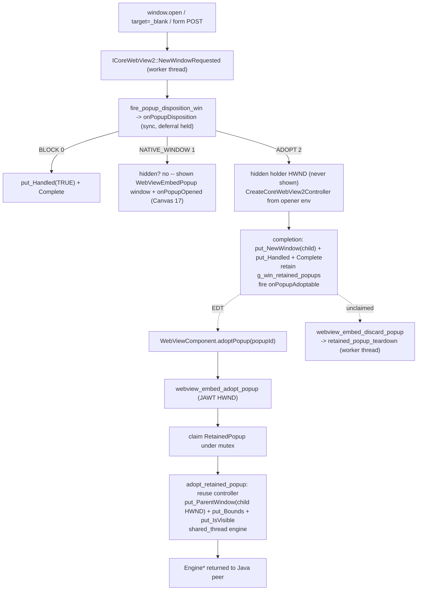

# REASONS Canvas: Popup Adoption Into a Caller-Provided WebViewComponent — Windows (WebView2) Coverage — Heavyweight (STORY-005-003)

## R · Requirements

- Extend popup adoption ([[popup-adoption-into-webviewcomponent-tab]],
  Canvas 18) to the **Windows (WebView2 / Chromium-Edge)** heavyweight
  backend. Canvas 18 shipped the cross-platform Java contract and the
  **macOS (WKWebView)** reference; Canvas 19 landed **Linux
  (WebKitGTK)**; this canvas lands the **WebView2** native implementation
  of the same contract so an application can **adopt** an engine-created
  popup — the opener-linked child web view WebView2 raises for
  `window.open`, `<a target="_blank">`, or `<form method="post"
  target="…">` — into a **`WebViewComponent` the application supplies** (a
  Swing tab), instead of the native top-level window the engine owns today
  (Canvas 17).

- **Windows heavyweight is native-only — no Java changes.** The Windows
  path reuses the Canvas 18 Java contract verbatim — `PopupDisposition`,
  `WebViewPopupHandler.popupDisposition` / `popupAdoptable`,
  `WebViewPopupCallback.onPopupDisposition` / `onPopupAdoptable`,
  `PopupDispatcher` bookkeeping, `WebViewComponent.adoptPopup`,
  `EmbeddedWebView.adopt` / `discardRetainedPopup`, and the
  `webview_embed_adopt_popup` / `webview_embed_discard_popup` `WebViewNative`
  declarations — authored platform-agnostically by Canvas 18 and touching
  no `.java` file. The wire contract (disposition ordinals `BLOCK=0` /
  `NATIVE_WINDOW=1` / `ADOPT=2`, the `onPopupDisposition` /
  `onPopupAdoptable` JNI signatures) is exactly the one macOS and Linux
  already speak. Windows has no lightweight/offscreen engine
  (`webview_offscreen_create` returns 0), so this canvas is
  **heavyweight-only**; the two offscreen adopt/discard JNI bridges are
  Windows stubs (return 0 / no-op) for link-symmetry, and adoption into a
  lightweight component is never triggered on Windows.

- **Why the existing Windows model is insufficient for a tabbed browser.**
  Same rationale as Canvas 18/19: a tabbed consumer that wants popups as
  tabs must today block the native window and re-open the target URL via
  `setUrl`, which issues a GET (losing a `<form method="post">` body) and
  drops opener linkage (`window.opener` null, `postMessage`-to-opener
  broken). WebView2's `ICoreWebView2NewWindowRequestedEventArgs` does
  **not** expose the POST body, so the request cannot be reconstructed and
  replayed from Java. The only faithful path is to **reuse the engine's own
  child** — the linked child WebView2 returns to the page via
  `put_NewWindow`, which WebView2 already drove the original request (verb +
  body) into and which is already opener-linked — and reparent it into the
  caller's surface via `ICoreWebView2Controller::put_ParentWindow`.

- **Two-phase adoption, mirroring macOS/Linux.** Phase 1 (WebView2 worker
  thread, but asynchronous by necessity — see below): the
  `NewWindowRequested` handler calls `onPopupDisposition` and switches on
  the returned ordinal. On `ADOPT` it builds the opener-linked child
  controller from the opener's **same** `ICoreWebView2Environment` against a
  **hidden holder HWND** (`CreateWindowEx` a top-level window that is
  **never** `ShowWindow`n), returns the child to WebView2 via
  `put_NewWindow` (which drives the original request into it), retains the
  child in `g_win_retained_popups` keyed by an engine-assigned `popupId`
  (`(jlong)(LONG_PTR)rp`), and fires `onPopupAdoptable(popupId, …)`. Phase 2
  (EDT): the application's `WebViewComponent.adoptPopup(popupId)` peer
  attach claims the retained child and reuses it —
  `EmbeddedWebView.adopt` → `webview_embed_adopt_popup` reparents the
  retained controller into the component's realized AWT HWND
  (`put_ParentWindow`), sizes it to the parent client rect, makes it
  visible, and returns the adopted engine pointer.

- **The disposition decision + retain happen inside the deferral, on the
  WebView2 worker thread.** Because controller creation on WebView2 is
  **asynchronous** (`CreateCoreWebView2Controller` + a completion handler),
  the `ADOPT` retain + `onPopupAdoptable` notify + deferral `Complete()`
  all run **inside the controller-completion handler**, exactly like the
  Canvas-17 `NATIVE_WINDOW` path already does for the shown window. The
  disposition hop itself (`onPopupDisposition`) is a **synchronous**
  `CallIntMethod` run on the short-lived JNI worker thread the
  `NewWindowRequested` handler spins up (the deferral is held across it),
  matching the Canvas-17 `onPopupRequested` boolean gate; `onPopupAdoptable`
  is fire-and-forget and the Java `PopupDispatcher` marshals `popupAdoptable`
  to the EDT itself.

- **Apartment-thread affinity is the defining Windows constraint.** A
  WebView2 `ICoreWebView2Controller` is bound to the thread that created it
  and cannot be moved to another thread. The retained child controller was
  created on the **opener engine's dedicated WebView2 worker thread**, so
  every controller/webview call on it — during retain, during the
  `put_ParentWindow` reparent at adoption, and during teardown at discard —
  MUST run on that same worker thread. The adopted `Engine` therefore
  **reuses the opener's worker thread** (`thread_id = opener thread_id`,
  `shared_thread = true`) rather than spinning its own, and its
  `destroy_engine` closes the controller synchronously on that shared thread
  instead of posting `WM_EMBED_QUIT` (which would tear down the opener's
  message loop and the opener engine with it).

- Definition of Done:
  - A handler returning `ADOPT` from `popupDisposition`, plus an app that on
    `popupAdoptable` creates a tab via
    `WebViewComponent.adoptPopup(popupId)`, results in the popup appearing
    **inside that component** on Windows (heavyweight) with the **POST body
    preserved** and **opener linkage intact** (`window.opener` non-null,
    `postMessage`-to-opener works). No native popup window appears at any
    point on the `ADOPT` path.
  - A Canvas 17 handler that allows the popup (`popupRequested` → `true`, or
    `DEFAULT`) still opens a native WebView2-owned window; a blocking handler
    / `setPopupHandler(null)` still blocks — byte-for-byte the prior Windows
    behavior (the `NATIVE_WINDOW` / `BLOCK` branches are the unchanged
    Canvas-17 paths).
  - `adoptPopup` on an unknown/consumed `popupId` yields a native `0` return
    (`webview_embed_adopt_popup` finds nothing in `g_win_retained_popups`),
    which `EmbeddedWebView.adopt` turns into the documented
    `IllegalStateException`; adoption is once-only (claim removes under the
    mutex).
  - A popup decided `ADOPT` but never adopted is reclaimed via
    `webview_embed_discard_popup` (opener disposed or grace-period backstop,
    both driven from the unchanged Java side) — native child torn down,
    `onPopupClosed` fired, inherited global refs freed, holder HWND
    destroyed, COM refs released, no orphaned engine.
  - Closing a retained-but-unadopted popup with `window.close()` fires
    `onPopupClosed` correlated by `popupId` and tears the child down without
    dereferencing freed native state.

- Out of scope (explicit non-goals):
  - **Windows lightweight/offscreen adoption** — Windows has no offscreen
    engine; the offscreen adopt/discard JNI bridges are Windows stubs
    (return 0 / no-op), matching `webview_offscreen_create` returning 0.
  - Any change to the **public `WebViewComponent` API** or any **Java** file
    — the Windows path is native-only and reuses Canvas 18's contract
    verbatim. **macOS and Linux code is not touched.**
  - **swingwebbrowser** consumer wiring — STORY-005-004.
  - Surfacing the HTTP method/body to Java; reparenting an arbitrary running
    component; `window.open` feature strings beyond `width`/`height`
    (unchanged from Canvas 17).

## E · Entities

- **`windows/webview_embed.cc`** (modified — the ONLY file this canvas
  touches). All new native code lands here, in `namespace embed_win` and in
  the JNI export region:
  - `Engine::shared_thread` (new `bool` field) — TRUE for an adopted engine
    that reuses the opener's WebView2 worker thread; gates `destroy_engine`
    so it Close()es the controller on the shared thread instead of posting
    `WM_EMBED_QUIT`.
  - `fire_popup_disposition_win(Engine*, url, gesture, w, h, page) -> jint`
    — synchronous `CallIntMethod` on `onPopupDisposition`
    (`"(Ljava/lang/String;Ljava/lang/String;ZIILjava/lang/String;)I"`);
    returns the ordinal, `0` (BLOCK) on null callback / attach failure /
    exception. Mirrors `fire_popup_requested_win`.
  - `fire_popup_adoptable_win(Engine*, popup_id, url, gesture, w, h, page)`
    — fire-and-forget `CallVoidMethod` on `onPopupAdoptable`
    (`"(JLjava/lang/String;Ljava/lang/String;ZIILjava/lang/String;)V"`),
    same shape as `fire_popup_opened_win`.
  - `struct RetainedPopup` — holds the retained child's
    `ICoreWebView2Controller*` + `ICoreWebView2*` (AddRef'd), the opener's
    `ICoreWebView2Environment*` (AddRef'd), the hidden holder `HWND`, the
    `JavaVM*`, `popup_id`, `url`/`page`, the `worker_thread_id` (the
    apartment the COM objects belong to), the inherited popup/dialog callback
    global refs, and the retained-phase event tokens
    (`new_window_token` / `script_dialog_token` / `close_token`).
  - `g_win_retained_popups_mutex` + `g_win_retained_popups`
    (`std::map<jlong, RetainedPopup*>`) — the WebView2 counterpart of the
    macOS `g_retained_popups` / Linux `g_gtk_retained_popups`.
  - `ensure_popup_holder_class_registered()` — a `DefWindowProc` hidden
    holder window class (`"WebViewEmbedPopupHolder"`), never shown.
  - `post_to_worker_thread(DWORD tid, DispatchFn)` — posts a
    `WM_EMBED_DISPATCH` op onto a specific WebView2 worker thread (the
    apartment owning a retained child).
  - `fire_popup_closed_retained(RetainedPopup*)` +
    `retained_popup_teardown(RetainedPopup*, bool fire_closed)` +
    `free_inherited_refs(...)` — reclaim helpers (Close/Release the
    controller/webview, destroy the holder, Release the environment, free the
    inherited global refs, `delete` the shell); MUST run on the child's
    worker thread.
  - `RetainedPopupCloseHandler` (`ICoreWebView2WindowCloseRequestedEventHandler`)
    — `window.close()` on a retained-but-unadopted child claims it under the
    mutex and tears it down (fires `onPopupClosed`).
  - `NewWindowRequestedHandler::Invoke` (modified) — replaces the Canvas-17
    boolean gate with the `fire_popup_disposition_win` ordinal switch:
    `BLOCK` → `put_Handled(TRUE)` + Complete; `NATIVE_WINDOW` → the unchanged
    Canvas-17 shown-window path; `ADOPT` → hidden holder +
    `CreateCoreWebView2Controller` from the opener's environment, and inside
    the completion: `put_NewWindow(child)` + `put_Handled(TRUE)` + Complete +
    retain in `g_win_retained_popups` + inherit callbacks + wire the child's
    `WindowCloseRequested` → discard + `fire_popup_adoptable_win`. The
    handler is already registered (Canvas 17) in the controller-ready path;
    only its body changed — **no duplicate registration**.
  - `adopt_retained_popup(env, parent, rp, debug) -> Engine*` — builds a
    normal `embed_win::Engine` reusing the claimed child's controller/webview
    (transferring COM refs + inherited global refs into it), then on the
    shared worker thread removes the retained-phase handlers, creates the
    standard `"WebViewEmbedChild"` HWND under `parent`, reparents the
    controller into it (`put_ParentWindow`), sizes it to the parent client
    rect, makes it visible, wires the adopted engine's own handlers
    (message / focus / script-dialog / new-window), **destroys the now-unused
    hidden holder HWND** (`DestroyWindow(rp->holder)` on the same worker
    thread that created it, after the reparent), and frees the retained shell.
    Returns the Engine immediately (valid controller/webview) so Java gets a
    usable peer.
  - `destroy_engine` (modified) — the `shared_thread` branch synchronously
    Close()es the controller + destroys the child HWND on the shared worker
    thread; the non-shared path is unchanged.
  - `Java_…_webview_1embed_1adopt_1popup(env, jclass, jobject component,
    jlong popupId, jint debug) -> jlong` (new JNI bridge) — resolves the
    parent HWND via the SAME JAWT path as `webview_embed_create`
    (`JawtLock` → `JAWT_Win32DrawingSurfaceInfo::hwnd`), claims the
    `RetainedPopup` under the mutex (adopt-once; `0` if absent), calls
    `adopt_retained_popup`, returns `(jlong)engine`. **Defined INSIDE the
    explicit `extern "C"` block** (next to the offscreen adopt/discard stubs
    and `set_popup_callback`) so it gets C linkage directly. The checked-in
    `ca_weblite_webview_WebViewNative.h` is stale and does **not** declare
    these newer natives, so relying on the header for C linkage would let C++
    name-mangle the symbol and the JVM would fail to resolve it at runtime
    (`UnsatisfiedLinkError`) even though it compiles clean.
  - `Java_…_webview_1embed_1discard_1popup(env, jclass, jlong /*wv*/,
    jlong popupId) -> void` (new JNI bridge) — claims + tears down an
    unadopted `RetainedPopup` on its owning worker thread. Same declaration
    style (inside the `extern "C"` block).
  - `Java_…_webview_1embed_1set_1user_1agent` (Canvas 21 bridge) — likewise
    defined inside the `extern "C"` block for the same stale-header reason.
  - `Java_…_webview_1offscreen_1adopt_1popup` / `…_discard_1popup` — Windows
    stubs (return 0 / no-op) inside the existing `extern "C"` block, for
    link-symmetry with the Linux offscreen bridges (Canvas 19).

## A · Approach

1. **Reuse the engine's child; never replay from Java.** POST body and
   `window.opener` live inside the WebView2-created linked child. Adoption
   returns that exact child to WebView2 via `put_NewWindow` (so it drives the
   original navigation request into it) and later reparents its controller
   into the caller's surface via `put_ParentWindow`. Java never sees or
   reconstructs the request — sidestepping the unavailable-POST-body problem.

2. **Disposition switch inside the existing NewWindowRequested handler.**
   The Canvas-17 handler already: extracts uri/user-gesture/window-features/
   page, `GetDeferral` + `AddRef`, hops to Java on a short-lived worker,
   then `dispatch_to_thread` back onto the WebView2 worker to act + Complete.
   The only change is swapping the `fire_popup_requested_win` boolean gate for
   a `fire_popup_disposition_win` ordinal, and adding the `ADOPT` branch
   alongside the unchanged `BLOCK` / `NATIVE_WINDOW` branches. The handler
   registration (controller-ready path) is untouched — no duplication.

3. **Async retain in the controller completion.** Because WebView2 controller
   creation is asynchronous, the `ADOPT` branch creates the child controller
   against the hidden holder and does the retain + `onPopupAdoptable` +
   deferral `Complete` **inside** `CreateCoreWebView2Controller`'s completion
   handler — the same structure the Canvas-17 `NATIVE_WINDOW` path uses for
   its shown window. `put_NewWindow(child)` + `put_Handled(TRUE)` return the
   linked child to the page; the controller is left `put_IsVisible(FALSE)`
   and the holder is never `ShowWindow`n, so no window flashes.

4. **Hidden holder = no window, no flash.** WebView2 requires a real parent
   HWND to create a controller. A top-level `"WebViewEmbedPopupHolder"`
   window is created but **never shown**; the child renders offscreen there
   until adoption calls `put_ParentWindow` to move it into the adopting AWT
   canvas HWND. This is the WebView2 analogue of the macOS hidden holder and
   the Linux windowless `g_object_ref_sink` retain.

5. **Apartment-correct reuse via a shared worker thread.** The retained
   controller is bound to the opener's WebView2 worker thread and cannot
   migrate. The adopted `Engine` sets `thread_id` to the opener's worker
   thread and `shared_thread = true`; all controller ops (reparent, bounds,
   visibility, handler (de)registration, and eventual Close) run there via
   `dispatch_to_thread` / `post_to_worker_thread`. `destroy_engine`'s
   `shared_thread` branch Close()es the controller synchronously on that
   thread instead of quitting its message loop, so the opener survives the
   adopted child's disposal.

6. **Retained → adopted handler handoff.** The retained-phase child carries
   `NewWindowRequested` / `ScriptDialogOpening` / `WindowCloseRequested`
   handlers bound to the **opener** engine (so nested popups + dialogs keep
   working while retained). At adoption the tokens are used to
   `remove_*` those handlers before the adopted engine registers its own
   (message / focus / script-dialog / new-window) bound to itself — exactly
   one handler set survives, the Windows analogue of Linux's
   `g_signal_handlers_disconnect_by_data`.

7. **COM + global-ref ownership transfer.** The retained child's controller,
   webview, and environment are AddRef'd COM references, and the inherited
   popup/dialog callbacks are JNI global refs, all owned by the
   `RetainedPopup`. `adopt_retained_popup` **transfers** (copies, does not
   re-AddRef) those into the adopted `Engine`, then frees the shell with a
   plain `delete` (no re-release) — so the adopted engine's normal
   `destroy_engine` balances them. `retained_popup_teardown` (discard /
   `window.close`) instead Releases/frees them itself. Adopt-once and
   discard-once are enforced by removing the id from the registry under the
   mutex — whoever removes it owns the teardown.

8. **Exception + null discipline unchanged.** `fire_popup_disposition_win`
   returns `0` (BLOCK) on null callback / attach failure / exception; every
   `Call*Method` is followed by `ExceptionCheck` / `ExceptionDescribe` /
   `ExceptionClear`. Strings are null-coerced to empty. An `ADOPT` that
   cannot build a linked child (no environment, holder creation fails,
   controller creation fails) safely falls back to `put_Handled(TRUE)` +
   Complete (blocked) and tears any half-built shell down.

## S · Structure

### Layered Architecture
1. **Native engine layer** (`windows/webview_embed.cc`, `namespace
   embed_win`): the `Engine::shared_thread` field, `fire_popup_disposition_win`
   / `fire_popup_adoptable_win`, the `RetainedPopup` registry +
   holder-window class + reclaim helpers + `RetainedPopupCloseHandler`, the
   `NewWindowRequestedHandler::Invoke` disposition switch, `adopt_retained_popup`,
   and the `destroy_engine` shared-thread branch.
2. **JNI surface** (`windows/webview_embed.cc`, JNI export region): the
   `webview_embed_adopt_popup` / `webview_embed_discard_popup` bridges, plus
   the offscreen adopt/discard Windows stubs — all defined **inside** the
   `extern "C"` block (the checked-in JNI header is stale and does not declare
   the newer natives, so their C linkage must come from the block, not the
   header).
3. **Java layer**: **Canvas 18, unmodified.** The Windows path speaks the
   same wire contract and the same `webview_embed_adopt_popup` /
   `webview_embed_discard_popup` native declarations. No Java, macOS, or
   Linux file is touched.

### Dependencies
1. `NewWindowRequestedHandler::Invoke` → `fire_popup_disposition_win`,
   `fire_popup_adoptable_win`, `g_win_retained_popups`,
   `ensure_popup_holder_class_registered`, `RetainedPopupCloseHandler`,
   `retained_popup_teardown`, the opener's `ICoreWebView2Environment`.
2. `webview_embed_adopt_popup` → `JawtLock` (parent HWND),
   `g_win_retained_popups`, `adopt_retained_popup`.
3. `adopt_retained_popup` → `post_to_worker_thread`, `MsgHandler` /
   `FocusHandler` / `ScriptDialogHandler` / `NewWindowRequestedHandler`,
   `ensure_class_registered`, the shared worker thread.
4. `webview_embed_discard_popup` → `g_win_retained_popups`,
   `post_to_worker_thread`, `retained_popup_teardown`.
5. `destroy_engine` (shared_thread branch) → `dispatch_to_thread`.

## O · Operations

### 1. Engine::shared_thread + retained-popup registry
File: `windows/webview_embed.cc`
1. Add `bool shared_thread = false;` to `struct Engine` with the apartment /
   worker-thread rationale.
2. Add `static std::mutex g_win_retained_popups_mutex;` and
   `static std::map<jlong, RetainedPopup*> g_win_retained_popups;` plus the
   `RetainedPopup` struct, an ON-DEVICE-VALIDATION comment.

### 2. Disposition + adoptable JNI helpers
File: `windows/webview_embed.cc`
1. `fire_popup_disposition_win` after `fire_popup_closed_win`: attach env,
   `GetMethodID("onPopupDisposition",
   "(Ljava/lang/String;Ljava/lang/String;ZIILjava/lang/String;)I")`,
   `CallIntMethod`, sanitize, return ordinal (`0` on any failure).
2. `fire_popup_adoptable_win`: attach env,
   `GetMethodID("onPopupAdoptable",
   "(JLjava/lang/String;Ljava/lang/String;ZIILjava/lang/String;)V")`, direct
   `CallVoidMethod`, sanitize.

### 3. Holder class + reclaim helpers + close handler
File: `windows/webview_embed.cc`
1. `ensure_popup_holder_class_registered()` (`DefWindowProc`, never shown).
2. `post_to_worker_thread(DWORD, DispatchFn)`.
3. `fire_popup_closed_retained` / `free_inherited_refs` /
   `retained_popup_teardown` (Close/Release controller+webview, DestroyWindow
   holder, Release environment, free inherited global refs, delete shell).
4. `RetainedPopupCloseHandler` — claim under the mutex, teardown, fire
   `onPopupClosed`.

### 4. Disposition switch in NewWindowRequestedHandler::Invoke
File: `windows/webview_embed.cc`
1. Replace `fire_popup_requested_win` with `int disposition =
   fire_popup_disposition_win(...)`.
2. `disposition == 0` (BLOCK): `put_Handled(TRUE)` + Complete + Release.
3. `disposition == 2` (ADOPT): hidden holder + inherit callbacks + build
   `RetainedPopup` + `CreateCoreWebView2Controller`(holder); in the
   completion `put_NewWindow(child)` + `put_Handled(TRUE)` + Complete +
   `put_IsVisible(FALSE)` + wire retained-phase handlers (store tokens) +
   register in `g_win_retained_popups` (`popup_id = (jlong)(LONG_PTR)rp`) +
   `fire_popup_adoptable_win`. Failure paths block + teardown.
4. `disposition == 1` (NATIVE_WINDOW): the unchanged Canvas-17 shown-window
   path.
5. The handler registration in the controller-ready path is untouched (no
   duplicate `add_NewWindowRequested`).

### 5. adopt_retained_popup + destroy_engine shared-thread branch
File: `windows/webview_embed.cc`
1. `adopt_retained_popup(env, parent, rp, debug)`: build `Engine` with
   `shared_thread = true`, `thread_id = rp->worker_thread_id`, transfer COM
   refs + inherited global refs; on the shared worker thread remove
   retained-phase handlers, create the `"WebViewEmbedChild"` HWND under
   `parent`, `put_ParentWindow(child)` + `put_Bounds` + `put_IsVisible(TRUE)`,
   wire the adopted engine's handlers, `DestroyWindow(rp->holder)` (the hidden
   holder is unused once the controller is reparented; destroy it on its
   creating worker thread), `delete rp`; return the Engine.
2. `destroy_engine`: if `shared_thread`, synchronously Close()+Release the
   controller/webview and DestroyWindow the child on the shared thread (do NOT
   post `WM_EMBED_QUIT`), then fall through to free global refs + delete e.

### 6. JNI bridges
File: `windows/webview_embed.cc`
1. `webview_embed_adopt_popup` (declared like `webview_embed_create`): JAWT
   parent HWND, claim under mutex (`0` if absent), `adopt_retained_popup`,
   return `(jlong)e`.
2. `webview_embed_discard_popup`: claim under mutex (no-op if absent),
   `post_to_worker_thread(rp->worker_thread_id, teardown)`.
3. `webview_offscreen_adopt_popup` / `webview_offscreen_discard_popup`:
   Windows stubs (return 0 / no-op) inside the `extern "C"` block.

## N · Norms

- **No public-API changes; Java / macOS / Linux untouched.** The Windows path
  is native-only and reuses Canvas 18's Java contract, wire ordinals, and JNI
  signatures verbatim.
- **Ordinal wire contract.** `onPopupDisposition` returns
  `BLOCK=0 / NATIVE_WINDOW=1 / ADOPT=2`; never reorder.
- **Additive-only.** The `NATIVE_WINDOW` / `BLOCK` branches are the unchanged
  Canvas-17 Windows paths; a boolean-only handler, `DEFAULT`, and
  `setPopupHandler(null)` behave byte-for-byte as before.
- **Synchronous disposition, async retain.** `fire_popup_disposition_win` is a
  synchronous `CallIntMethod` while the deferral is held; the retain +
  `onPopupAdoptable` + deferral Complete run in the controller completion
  (async controller creation). `onPopupAdoptable` is fire-and-forget; Java
  marshals `popupAdoptable` to the EDT.
- **Apartment-thread affinity.** Every `ICoreWebView2*` call on the retained /
  adopted child runs on the opener's WebView2 worker thread. The adopted
  engine shares that thread (`shared_thread`); `destroy_engine` never quits
  it.
- **Per-call `jmethodID` resolution + JNI exception sanitization** in the new
  native calls, matching the dialog/popup helpers.
- **COM ownership discipline.** Controller/webview/environment are AddRef'd on
  the retained shell; adoption transfers them (no re-AddRef) so the adopted
  engine's `destroy_engine` balances them; discard Releases them itself.
  Inherited global refs are transferred on adopt (freed by `destroy_engine`)
  or freed on discard — no double-free, no dereference of a freed engine.
- **Single handler set per event.** Retained-phase handlers are `remove_*`d
  before the adopted engine's handlers are added.
- **JNI bridge linkage.** Every native added after the checked-in
  `ca_weblite_webview_WebViewNative.h` was last regenerated —
  `webview_embed_adopt_popup`, `webview_embed_discard_popup`,
  `webview_embed_set_user_agent`, and the offscreen adopt/discard stubs —
  MUST be defined **inside** the explicit `extern "C"` block so C linkage is
  guaranteed at the definition. The stale header only declares the older
  natives (e.g. `webview_embed_create`); a newer bridge placed outside the
  block would be C++ name-mangled and fail to resolve at runtime
  (`UnsatisfiedLinkError`) despite compiling clean — a defect a compile-only
  CI cannot catch (it bit the macOS adopt/discard bridges on-device first).
- **C++17, `cl /std:c++17 /EHsc`** against the WebView2 SDK
  (`Microsoft.Web.WebView2.0.8.355`) + `jawt.lib`; avoid hard errors. The
  Java side compiles under Java 8 (unchanged).

## S · Safeguards

- **Backward compatibility is a never-relax invariant.** A Canvas 17 handler,
  `DEFAULT`, and `setPopupHandler(null)` MUST behave byte-for-byte as before
  on Windows; the `NATIVE_WINDOW` / `BLOCK` branches are the unchanged paths.
- **No native window on ADOPT.** The holder HWND is NEVER `ShowWindow`n and
  the controller is `put_IsVisible(FALSE)` while retained; no window flashes
  and `onPopupOpened` is not fired for an adopt popup.
- **Adopt-once + clean rejection.** `webview_embed_adopt_popup` removes the id
  from `g_win_retained_popups` under the mutex, so a second adopt (or unknown
  id) finds nothing and returns `0` → `IllegalStateException`. A
  never-half-attached engine is returned (the retained child already exists
  before the bridge runs).
- **No-leak reclaim.** `webview_embed_discard_popup` fires `onPopupClosed`,
  Close/Release the controller+webview, DestroyWindow the holder, Release the
  environment, frees the inherited refs, and deletes the shell — the Windows
  end of the Canvas 18 reclaim contract (opener dispose + grace-period
  backstop, both driven from the unchanged Java side).
- **Opener linkage + POST are mandatory.** The adopted child MUST be the
  WebView2-created linked child returned via `put_NewWindow`; creating a fresh
  controller or re-navigating from Java is a defect.
- **Shared-thread teardown.** An adopted engine's `destroy_engine` MUST NOT
  post `WM_EMBED_QUIT` (it would kill the opener); it Close()es on the shared
  worker thread. If the opener is disposed first, its worker thread ends and
  `post_to_worker_thread` becomes a no-op — the unchanged Java reclaim
  ordering (opener dispose runs `reclaimAdopts` before the opener engine is
  destroyed) is what keeps this safe.

- **Native coverage status — ON-DEVICE VALIDATION REQUIRED.** The generating
  sandbox has **no MSVC / WebView2 SDK toolchain**, so this native code is
  pattern-faithful to the shipped Canvas 17 popup handler and the Canvas 18
  macOS / Canvas 19 Linux adopt/discard, but is **unbuilt and unexercised
  here**. Windows CI compiles `windows/webview_embed.cc` with `cl /std:c++17
  /EHsc` against the WebView2 SDK headers + `jawt.lib`. Prime candidates for
  on-device scrutiny on a real WebView2 stack:
  - the `put_ParentWindow` reparent of a **live, mid-navigation** controller
    from the hidden holder HWND into the adopting AWT canvas child HWND —
    verify the child keeps rendering its in-flight POST navigation and does
    not blank/reset;
  - the **COM ownership handoff** — controller / webview / environment
    AddRef'd on the retained shell, transferred (not re-AddRef'd) into the
    adopted engine, balanced by exactly one `destroy_engine` — verified with
    no leak / premature release / double-free across BOTH adopt and discard
    (the transfer-vs-teardown split is the riskiest handoff);
  - the **apartment / worker-thread affinity** — every controller call on the
    retained + adopted child, the `shared_thread` `destroy_engine` Close, and
    the `post_to_worker_thread` teardown all landing on the opener's WebView2
    worker thread, never a foreign thread;
  - the **retained → adopted handler handoff** (`remove_*` before re-`add_*`)
    — no double `NewWindowRequested` / `ScriptDialogOpening` handling, no
    dangling opener-bound handler firing after adoption;
  - the **JNI global-ref lifecycle** — inherited popup/dialog refs created at
    retain, transferred at adopt (freed by `destroy_engine`) or freed at
    discard, with no leak and no use of a freed ref;
  - `window.close()` on a **retained-but-unadopted** child racing an adoption
    — exactly one of `RetainedPopupCloseHandler` / `webview_embed_adopt_popup`
    wins the registry claim and owns the teardown.

## REASONS-Implements

- `windows/webview_embed.cc`
  (`Engine::shared_thread`; `fire_popup_disposition_win` /
  `fire_popup_adoptable_win`; `RetainedPopup` + `g_win_retained_popups` +
  mutex; `ensure_popup_holder_class_registered`; `post_to_worker_thread`;
  `fire_popup_closed_retained` / `free_inherited_refs` /
  `retained_popup_teardown`; `RetainedPopupCloseHandler`; the
  `NewWindowRequestedHandler::Invoke` disposition switch + ADOPT branch;
  `adopt_retained_popup`; the `destroy_engine` shared-thread branch; the
  `webview_embed_adopt_popup` / `webview_embed_discard_popup` JNI bridges; the
  `webview_offscreen_adopt_popup` / `webview_offscreen_discard_popup` Windows
  stubs)
- Conforms to the Canvas 18 Java contract
  ([[popup-adoption-into-webviewcomponent-tab]]) — **no Java changes**; macOS
  (Canvas 18) and Linux (Canvas 19) native code untouched. Windows is
  heavyweight-only (no offscreen engine).
