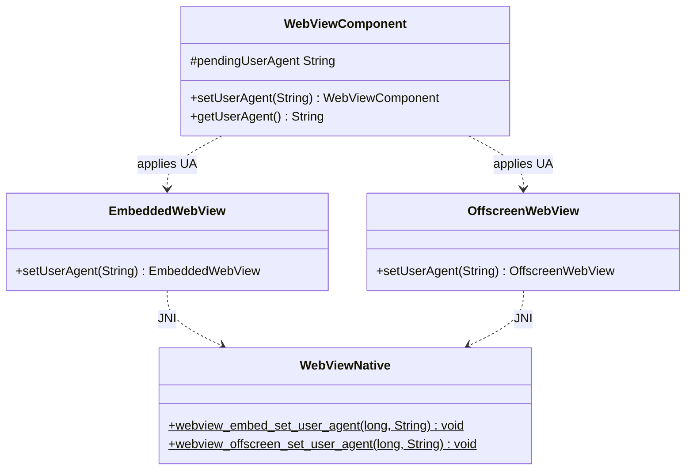

# REASONS Canvas: Custom User-Agent for the Embedded WebView

## R · Requirements

- Let callers override the embedded WebView's **User-Agent** so web
  apps that gate on the UA string accept the embedded browser. Expose
  `WebViewComponent.setUserAgent(String)` / `getUserAgent()`, wired to
  each engine's native custom-UA facility so the override changes the
  **actual HTTP `User-Agent` request header** (not merely the
  JS-visible `navigator.userAgent`). This is the header a server sees.

- **Why.** WKWebView's default UA omits the `Version/… Safari/…`
  tokens (`Mozilla/5.0 (Macintosh; Intel Mac OS X 10_15_7)
  AppleWebKit/605.1.15 (KHTML, like Gecko)`), so UA-sniffing sites
  reject it as "unsupported browser". A JS `navigator.userAgent` shim
  cannot fix server-side sniffing; only an engine-level custom UA can.

- **Contract.**
  - `setUserAgent(String ua)` — store the UA and apply it to the
    engine. `null` or empty **restores the engine default** (clears
    the override). May be called **before display** (stored, applied
    at peer attach, so the first request carries it) or **after**
    (applied live; takes effect on the next navigation — engines do
    not retro-rewrite the current page's request).
  - `getUserAgent()` — returns the pending/applied override, or
    `null` when none is set (engine default in force).
  - Accessor style follows `setUrl`/`getUrl` (get-style), not the
    no-`get` event style.

- **Backward compatible.** When `setUserAgent` is never called,
  `pendingUserAgent` is `null`, the native setter is never invoked,
  and the engine's default UA is used — byte-for-byte today's
  behaviour.

- **Popup inheritance.** A browser-initiated popup
  (`window.open` / `target="_blank"` / POST-to-new-window),
  whether **adopted** into a caller-supplied `WebViewComponent` tab
  (ADOPT) or hosted in an **engine-owned window** (NATIVE_WINDOW),
  inherits the opener's custom User-Agent. The override is applied
  to the newly created popup child **before its initial (in-flight)
  navigation**, so the popup's **first** request carries the opener's
  UA — not the engine default. When the opener has no override, the
  child keeps the engine default. This holds on macOS, Linux, and
  Windows. **Why.** `customUserAgent` (and its per-engine analogues)
  is a per-view **instance** property, not part of the
  `WKWebViewConfiguration` / related-view linkage the child inherits
  from the opener, so without explicit propagation the popup's first
  request goes out with the engine default UA — on macOS that lacks
  the `Safari` token, so UA-gating sites (e.g. Cloudbeds `/connect/…`,
  which 301s any non-Safari UA to `/browsererror`) block the popup
  even though the opener tab loads fine. Cross-references the popup
  canvases that own the child-creation sites: Canvas 15 (`window.open`
  / macOS), Canvas 16/17 (native-window Linux/Windows), and Canvas
  18/19/20 (popup adoption macOS/Linux/Windows).

- Definition of Done:
  - `wv.setUserAgent("…Safari…")` before display makes the first and
    subsequent navigations send that `User-Agent` header on all three
    engines.
  - `setUserAgent(null)` / `setUserAgent("")` reverts to the engine
    default.
  - `getUserAgent()` reflects the last set value (`null` when unset).
  - A headless `WebViewComponentUserAgentTest` verifies the Java
    store/reset/get contract without a native peer.
  - README gains a "Custom user agent" subsection.
  - On-device: `WebViewAdoptPopupDemo` (shared with Canvas 18) grows a
    User-Agent field + Set/Reset so the real HTTP header change is
    verifiable via an httpbin echo; run with
    `./run-mac-adopt-popup-demo.sh`.
  - A popup opened from an opener that has a custom UA sends that UA on
    its **first** (and subsequent) request on all three engines, for
    both the ADOPT and NATIVE_WINDOW dispositions; an opener at the
    engine default yields a popup at the engine default. Verifiable in
    `WebViewAdoptPopupDemo`: the `window.open → popup` button opens
    `https://httpbin.org/user-agent`, which echoes the popup's UA.

- Out of scope: per-request UA switching; UA-Client-Hints
  (`Sec-CH-UA`) customisation; spoofing `navigator.userAgent` from
  Java (that is a caller-side `addOnBeforeLoad` concern); the
  standalone in-process `WebView` class (embedded surface only, same
  boundary as Canvas 15/18).

## E · Entities

- **WebViewComponent** (modified). Gains:
  - `protected String pendingUserAgent = null;` (adjacent to
    `pendingUrl`/`debug`).
  - `public WebViewComponent setUserAgent(String ua)` — normalise
    empty to `null`, store, and apply live to the peer if attached.
  - `public String getUserAgent()` — return `pendingUserAgent`.
- **WebViewHeavyweightComponent** (modified). In `createPeer()`, after
  `EmbeddedWebView.attach`/`adopt` and **before** the initial
  `navigate`, apply `pendingUserAgent` when non-null via
  `embedded.setUserAgent(...)`. Live setter path when already attached.
- **WebViewLightweightComponent** (modified). Same at the
  `addNotify()` engine-create site, before `engine.navigate`.
- **EmbeddedWebView** (modified). `public EmbeddedWebView
  setUserAgent(String ua)` → `checkAlive()`;
  `WebViewNative.webview_embed_set_user_agent(peer, ua)`.
- **OffscreenWebView** (modified). `public OffscreenWebView
  setUserAgent(String ua)` → `webview_offscreen_set_user_agent(peer,
  ua)`.
- **WebViewNative** (modified). `native static void
  webview_embed_set_user_agent(long w, String ua);` and `native static
  void webview_offscreen_set_user_agent(long peer, String ua);`.
- **`src_c/webview_embed.cpp`** (modified — macOS + Linux),
  **`windows/webview_embed.cc`** (modified — Windows): per-engine
  setters + JNI bridges.
- **Popup-child creation sites** (modified — the propagation points
  for popup inheritance):
  - macOS `impl_create_web_view` (the `WKUIDelegate`
    `createWebViewWithConfiguration:` handler) in
    `src_c/webview_embed.cpp`: right after the child `WKWebView` is
    created from the shared configuration, and **before** the window
    setup so it covers BOTH dispositions, reads the opener engine's
    `customUserAgent` (`e->webview`) and, when non-nil, calls
    `setCustomUserAgent:` on the child.
  - Linux `handle_create_web_view` (the shared `create`-signal inner)
    in `src_c/webview_embed.cpp`: right after
    `webkit_web_view_new_with_related_view(opener)` creates the child,
    copies the opener view's user-agent onto the child's
    `WebKitSettings`.
  - Windows `NewWindowRequestedHandler` in `windows/webview_embed.cc`:
    in both the ADOPT (retained) and NATIVE_WINDOW controller-ready
    completions, sets the child's UA via
    `ICoreWebView2Settings2::put_UserAgent` from the opener engine's
    tracked override, before completing the deferral.
- **Windows `Engine`** (modified). Gains a tracked custom-UA field
  (the last non-empty UA passed to the embed setter; empty ⇒ engine
  default) so the `NewWindowRequested` handler — which runs on the
  WebView2 worker thread and cannot distinguish an override from the
  default via `get_UserAgent` — can propagate the opener's override to
  the child.
- **WebViewComponentUserAgentTest** (new), **README.md** (modified).

## A · Approach

1. **Pending-then-apply, mirroring `pendingUrl`.** The UA is caller
   state that must survive the peer create/destroy cycle. Store it on
   the component; apply at peer attach (before the first `navigate`)
   and live on subsequent `setUserAgent` calls when the peer exists.
   No override → native setter never called → engine default.

2. **Empty means default.** `setUserAgent(null|"")` stores `null`;
   the native setter, when invoked with `null`, clears the engine
   override (macOS `customUserAgent = nil`; GTK
   `webkit_settings_set_user_agent(settings, NULL)` restores default;
   WebView2 `put_UserAgent(L"")` — empty restores default).

3. **Per-engine native facility.**
   - macOS WKWebView: `-[WKWebView setCustomUserAgent:]` with an
     `NSString*` (or `nil` to clear).
   - Linux WebKitGTK: `webkit_settings_set_user_agent(
     webkit_web_view_get_settings(web), ua_or_null)`.
   - Windows WebView2: `ICoreWebView2Settings2::put_UserAgent(
     wide(ua))` (query the `_2` settings interface;
     no-op if unavailable on an old runtime).
   Each takes effect on the **next** navigation, so apply before the
   first `navigate` in the attach path.

4. **JNI mechanics.** UTF-8 in, per-engine string conversion,
   exception-free (never throw across JNI). A `null` jstring maps to
   the clear path.

5. **Popup inheritance at creation.** The custom-UA override is
   per-view instance state, not part of the shared configuration /
   related-view linkage a popup child inherits from its opener, so the
   child must be given the opener's override explicitly — at the
   child-creation site, **before** WebKit/WebView2 drives the original
   in-flight navigation-action request into it. Prefer reading the
   opener's effective override back from the **live opener view** where
   the engine exposes a getter that distinguishes an override from the
   default; otherwise track the last override on the opener engine.
   Per engine:
   - macOS reads `customUserAgent` off the opener `WKWebView`, which
     returns `nil` when unset — a clean override/default distinction,
     so an engine-default opener leaves the child untouched (child
     keeps the engine default).
   - Linux reads the opener view's `WebKitSettings` user-agent and
     copies it onto the child's settings. The GTK getter returns the
     effective UA (it cannot signal "no override"), but copying the
     opener's effective UA is harmless: an unset opener's UA is the
     engine default, and copying it onto a same-engine child is
     byte-identical to the child's own default. This also composes for
     nested popups — a popup's child reads the popup view's already
     propagated UA.
   - Windows reads a tracked override on the opener `Engine` (recorded
     alongside `put_UserAgent`; empty ⇒ default), because
     `ICoreWebView2Settings2::get_UserAgent` likewise cannot signal
     "no override". An empty tracked value leaves the child untouched.
     Nested popups reuse the opener engine, so they inherit the same
     override.

## S · Structure

### Inheritance Relationships
1. `WebViewComponent` (abstract) gains one field + two concrete
   methods; abstract surface unchanged.
2. `EmbeddedWebView` / `OffscreenWebView` each gain one `setUserAgent`.

### Dependencies
1. `WebViewComponent.setUserAgent` → subclass engine wrapper
   (`EmbeddedWebView`/`OffscreenWebView`).
2. Engine wrappers → `WebViewNative` natives → per-engine setter.
3. `createPeer()` / `addNotify()` → apply pending UA before navigate.
4. Popup-child creation site → opener's effective override (read from
   the opener view on macOS/Linux, from the opener `Engine`'s tracked
   value on Windows) → child view's UA, before the child's in-flight
   initial navigation.

### Layered Architecture
1. Native engine layer (`src_c/webview_embed.cpp`,
   `windows/webview_embed.cc`): setters + JNI bridges.
2. JNI surface (`WebViewNative`): two decls.
3. Engine wrapper layer (`EmbeddedWebView`/`OffscreenWebView`).
4. Component API layer (`WebViewComponent`).
5. Wiring layer (`createPeer`/`addNotify`).

## O · Operations

### 1. Extend WebViewComponent
File: `src/ca/weblite/webview/swing/WebViewComponent.java`
1. Add `protected String pendingUserAgent = null;` near `pendingUrl`.
2. `public WebViewComponent setUserAgent(String ua)`: normalise
   `ua == null || ua.isEmpty()` → `null`; store; if the peer is
   attached, apply live (subclass hook — see Ops 2/3). Return `this`.
   Javadoc: `null`/empty restores the engine default; before display
   it is applied to the first request, after display it takes effect
   on the next navigation; changes the HTTP `User-Agent` header.
3. `public String getUserAgent()`: return `pendingUserAgent`.
4. To let the base `setUserAgent` apply live without knowing the
   engine type, add `protected void applyUserAgentToPeer(String ua)
   { }` (no-op default) overridden by the two subclasses.

### 2. Wire heavyweight
File: `WebViewHeavyweightComponent.java`
1. In `createPeer()`, after the engine is obtained and **before**
   `embedded.navigate(pendingUrl)` (and before the adopt-skip guard's
   navigate), `if (pendingUserAgent != null)
   embedded.setUserAgent(pendingUserAgent);`.
2. Override `applyUserAgentToPeer(String ua)`:
   `EmbeddedWebView e = embedded; if (e != null) e.setUserAgent(ua);`.

### 3. Wire lightweight
File: `WebViewLightweightComponent.java`
1. In `addNotify()`, after the engine is created and before
   `engine.navigate(pendingUrl)`, apply `pendingUserAgent` when
   non-null.
2. Override `applyUserAgentToPeer(String ua)` against `engine`.

### 4. EmbeddedWebView / OffscreenWebView setters
1. `EmbeddedWebView.setUserAgent(String ua)`: `checkAlive()`;
   `WebViewNative.webview_embed_set_user_agent(peer, ua)`; return
   `this`.
2. `OffscreenWebView.setUserAgent(String ua)`:
   `WebViewNative.webview_offscreen_set_user_agent(peer, ua)`; return
   `this`.

### 5. WebViewNative decls
File: `WebViewNative.java`
1. `native static void webview_embed_set_user_agent(long w, String ua);`
2. `native static void webview_offscreen_set_user_agent(long peer, String ua);`
   Block comment: `ua == null` clears the override (engine default);
   takes effect on the next navigation; never throws via JNI.

### 6. macOS + Linux native
File: `src_c/webview_embed.cpp`
1. macOS `cocoa_set_user_agent(Engine*, const char* ua_or_null)`:
   on main thread, `[e->webview setCustomUserAgent: ua ? ns_str(ua) :
   nil]`.
2. Linux `gtk_set_user_agent(Engine*, ...)` / `gtk_off_set_user_agent`:
   `WebKitSettings* s = webkit_web_view_get_settings(WEBKIT_WEB_VIEW(
   e->web)); webkit_settings_set_user_agent(s, ua /* NULL ok */);`.
3. JNI bridges
   `Java_..._webview_1embed_1set_1user_1agent` /
   `..._webview_1offscreen_1set_1user_1agent` in the existing
   `extern "C"` block: `GetStringUTFChars` (null-safe), dispatch per
   `#ifdef`, `ReleaseStringUTFChars`.

### 7. Windows native
File: `windows/webview_embed.cc`
1. `set_user_agent(Engine*, const char* ua_or_null)`: query
   `ICoreWebView2Settings2` from the controller's settings;
   `put_UserAgent(widen(ua ? ua : ""))`; no-op if the `_2` interface
   is unavailable.
2. JNI bridge `Java_..._webview_1embed_1set_1user_1agent`.

### 8. Test + README
1. `test/ca/weblite/webview/WebViewComponentUserAgentTest.java`
   (StubComponent, overriding `applyUserAgentToPeer` to record):
   default `getUserAgent()==null`; `setUserAgent("x")` →
   `getUserAgent()=="x"`; `setUserAgent(null)` and `setUserAgent("")`
   → `null`; chaining returns `this`; live-apply hook fires when the
   stub reports an attached peer.
2. README "Custom user agent" subsection: the API, the null-resets
   semantics, the "changes the HTTP header (unlike a JS shim)" note,
   and the next-navigation timing.

### 9. Popup inherits the opener's custom UA
Propagate the opener's effective custom User-Agent to a newly created
popup child **before its initial navigation**, for BOTH the ADOPT and
NATIVE_WINDOW dispositions, on all three engines.
1. macOS — `src_c/webview_embed.cpp`, `impl_create_web_view`:
   immediately after the child `WKWebView` is created via
   `initWithFrame:configuration:` (and **before** the `if (!adopt)`
   window setup, so it applies to both dispositions), read the opener
   engine's `customUserAgent` from `e->webview`; when non-nil, call
   `setCustomUserAgent:` on the child with that value. When the opener
   has no override, `customUserAgent` is `nil` and the child is left at
   the engine default. Guard for `e` being null.
2. Linux — `src_c/webview_embed.cpp`, `handle_create_web_view`:
   immediately after `webkit_web_view_new_with_related_view(opener)`
   returns the child (and before the window / ref setup), read the
   opener view's user-agent via
   `webkit_settings_get_user_agent(webkit_web_view_get_settings(opener))`
   and, when non-null, set it on the child's settings via
   `webkit_settings_set_user_agent(webkit_web_view_get_settings(child),
   …)`. Guard for `opener` and both settings being non-null. This also
   composes for nested popups (a popup's child reads the popup view's
   already propagated UA).
3. Windows — `windows/webview_embed.cc`:
   a. `Engine` gains a tracked custom-UA field holding the last
      non-empty UA passed to the embed setter (empty ⇒ default). The
      embed UA setter records it on the WebView2 worker thread,
      alongside its existing `put_UserAgent` call, so reads from the
      `NewWindowRequested` completion (same worker thread) see a
      consistent value.
   b. In `NewWindowRequestedHandler`'s controller-ready completion,
      for BOTH the ADOPT (retained) and NATIVE_WINDOW child branches,
      after the child `ICoreWebView2` is obtained and **before**
      `deferral->Complete()`, when the opener engine's tracked override
      is non-empty, query `ICoreWebView2Settings2` from the child's
      settings and `put_UserAgent(tracked)`. No-op on an old runtime
      lacking the `_2` interface (mirrors the embed setter's tolerance).
      Nested popups reuse the opener engine, so they inherit the same
      override.

## N · Norms

- **Mirror `pendingUrl`** lifecycle: store on the component, apply at
  attach before first navigate, and live afterwards.
- **`null`/empty == engine default** at every layer; never send an
  empty UA to the engine as an override.
- **`getUserAgent()` returns `null` when unset** (not `""`).
- **JNI never throws**; null jstring is the clear path; UTF-8
  conversion released on every path.
- **Java 8 target**; get-style accessors (`setUserAgent`/
  `getUserAgent`) matching `setUrl`/`getUrl`.
- **No new dependency; no JS shim; no reserved binding.**
- **Popup inheritance runs at the child-creation site, before the
  child's in-flight navigation**, covers both dispositions on all three
  engines, and never propagates an empty override: an opener at the
  engine default leaves the child at the engine default (macOS `nil`
  `customUserAgent` / Windows empty tracked value ⇒ child untouched;
  Linux copies the effective UA, which equals the child's own default
  when the opener is unset).

## S · Safeguards

- **Backward compatibility (never-relax):** unset UA → native setter
  not invoked → engine default unchanged.
- **Reset semantics:** `setUserAgent(null)` and `setUserAgent("")`
  both clear the override on every engine (macOS `nil`, GTK `NULL`,
  WebView2 empty string).
- **Timing:** applied before the first `navigate` at attach so the
  initial request carries it; live changes affect the next
  navigation only (documented; engines do not rewrite in-flight
  requests).
- **Headless-safe:** `setUserAgent`/`getUserAgent` before the peer
  exists only touch the `pendingUserAgent` field; no
  `HeadlessException`.
- **WebView2 old-runtime tolerance:** absent `ICoreWebView2Settings2`
  → silent no-op, not a crash (applies to the popup-inheritance
  propagation too).
- **Popup UA inheritance (both dispositions, all engines):** applied to
  the child **before** its first request; opener-default ⇒
  child-default (macOS `nil` `customUserAgent`, Windows empty tracked
  value ⇒ child untouched; Linux copies the effective UA, which equals
  the child's own default when unset). Must not affect the opener's own
  UA, and must not depend on the caller having set a UA (unset ⇒ no
  propagation). On-device validation required (no native toolchain in
  the sandbox): confirm the popup's first request carries the opener's
  UA via an echo endpoint (`WebViewAdoptPopupDemo` `window.open` →
  `https://httpbin.org/user-agent`), for both ADOPT and NATIVE_WINDOW.
- **Native coverage status (mirrors Canvas 15/18):** the Java
  contract (Ops 1–5, 8) plus the macOS + Linux native setters (Op 6)
  and the Windows setter (Op 7) are this canvas's deliverable. The
  native code is pattern-faithful to the existing engine setters but
  the generating sandbox has **no native toolchain**, so all three
  per-engine setters MUST be built and exercised on-device (confirm
  the `User-Agent` header via an echo endpoint) before release.

## REASONS-Implements
- `src/ca/weblite/webview/swing/WebViewComponent.java`
- `src/ca/weblite/webview/swing/WebViewHeavyweightComponent.java`
- `src/ca/weblite/webview/swing/WebViewLightweightComponent.java`
- `src/ca/weblite/webview/EmbeddedWebView.java`
- `src/ca/weblite/webview/OffscreenWebView.java`
- `src/ca/weblite/webview/WebViewNative.java`
- `src_c/webview_embed.cpp` (macOS + Linux)
- `windows/webview_embed.cc` (Windows)
- `test/ca/weblite/webview/WebViewComponentUserAgentTest.java`
- `demos/WebViewAdoptPopupDemo/…` (UA field; shared with Canvas 18)
- `run-mac-adopt-popup-demo.sh`
- `README.md`
