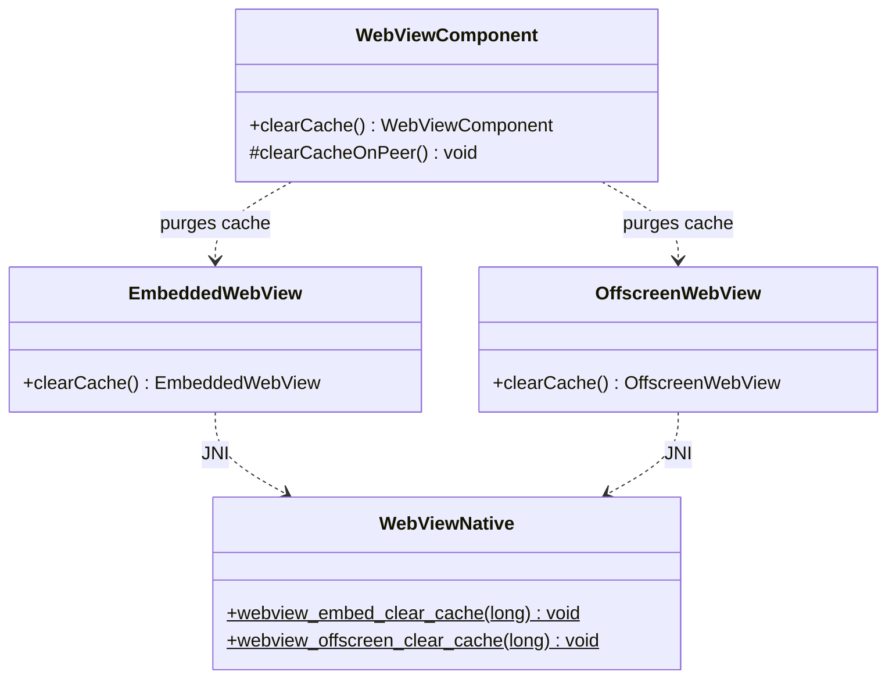

# REASONS Canvas: Clear the Embedded WebView HTTP Cache

## R · Requirements

- Let callers purge the embedded WebView's **HTTP resource cache**
  (the on-disk + in-memory cache the network process keeps) so a site
  that renders blank because a stale/broken cached resource is being
  replayed will re-fetch from the network on the next load. Expose
  `WebViewComponent.clearCache()`, wired to each engine's native
  website-data facility.

- **Why.** A page can cache a poisoned response (a stale HTML shell or
  JS bundle) that makes the site render blank on every subsequent load.
  Toggling the Web Inspector's "Disable Caches" fixes it because that
  disables the HTTP resource cache — proving the resource cache, not a
  service worker or Cache Storage, is the culprit. Only an engine-level
  purge clears that cache; a JavaScript `caches.delete()` /
  service-worker unregister cannot reach it. Deleting the app's cache
  directory by hand is fragile (path depends on the bundle id) and
  over-broad (it also drops cookies, logging the user out).

- **Cookies and login must survive.** `clearCache()` clears **only the
  HTTP resource cache** (disk + memory). It does **not** clear cookies,
  local storage, IndexedDB, or service-worker registrations — so a user
  who reached the site through a logged-in link stays logged in.

- **Contract.**
  - `clearCache()` — purge the attached engine's HTTP resource cache
    now. Best-effort and asynchronous at the native layer (the purge
    runs on the engine's UI thread and may complete slightly after the
    call returns); a `reload()`/`navigate(...)` issued after it refetches
    from the network. Returns `this` for chaining, matching
    `setUserAgent`/`setUrl`.
  - **No-op when no peer is attached.** A freshly created engine has no
    cache to clear, and there is nothing to defer, so — unlike
    `pendingUrl`/`pendingUserAgent` — `clearCache()` carries **no pending
    state**: called before the peer exists it simply does nothing (and
    never throws / never raises `HeadlessException`).

- **Backward compatible.** When `clearCache()` is never called, no
  native cache API is invoked and engine behaviour is byte-for-byte
  today's.

- Definition of Done:
  - `wv.clearCache()` on a live view purges the HTTP resource cache on
    all three engines (macOS, Linux, Windows), so a subsequent `reload()`
    re-fetches previously cached resources from the network; cookies (and
    thus an active login) are retained.
  - `clearCache()` before display is a silent no-op.
  - `clearCache()` returns `this`.
  - A headless `WebViewComponentClearCacheTest` verifies the Java
    forward-to-peer / no-op-when-detached / chaining contract without a
    native peer.
  - README gains a "Clear cache" subsection.
  - On-device: the shared `WebViewAdoptPopupDemo` (Canvas 18/21) grows a
    **Clear cache** button that calls `clearCache()` then `reload()`, so
    the purge is verifiable against a cache-busting echo endpoint; run
    with `./run-mac-adopt-popup-demo.sh`.

- Out of scope: clearing cookies / local storage / IndexedDB /
  service-worker registrations / Cache Storage (a caller can drop those
  from page JS, and clearing them here would break login); a persistent
  "disable cache" / ephemeral-data-store mode (a possible follow-up if a
  one-shot purge proves insufficient because the server keeps re-caching
  a poisoned response); per-resource or per-origin cache eviction; the
  standalone in-process `WebView` class (embedded surface only, same
  boundary as Canvas 15/18/21).

## E · Entities

- **WebViewComponent** (modified). Gains:
  - `public WebViewComponent clearCache()` — forward to the live peer
    via the `clearCacheOnPeer()` hook; return `this`. No field: there is
    no pending state (nothing to clear before an engine exists).
  - `protected void clearCacheOnPeer() { }` — no-op default, overridden
    by the two subclasses (mirrors `applyUserAgentToPeer`).
- **WebViewHeavyweightComponent** (modified). Override
  `clearCacheOnPeer()`: `EmbeddedWebView e = embedded; if (e != null)
  e.clearCache();`.
- **WebViewLightweightComponent** (modified). Override
  `clearCacheOnPeer()` against `engine` (`OffscreenWebView`).
- **EmbeddedWebView** (modified). `public EmbeddedWebView clearCache()`
  → `checkAlive()`; `WebViewNative.webview_embed_clear_cache(peer)`;
  return `this`.
- **OffscreenWebView** (modified). `public OffscreenWebView clearCache()`
  → `checkAlive()`; `WebViewNative.webview_offscreen_clear_cache(peer)`;
  return `this`.
- **WebViewNative** (modified). `native static void
  webview_embed_clear_cache(long w);` and `native static void
  webview_offscreen_clear_cache(long peer);`.
- **`src_c/webview_embed.cpp`** (modified — macOS + Linux),
  **`windows/webview_embed.cc`** (modified — Windows): per-engine cache
  purge + JNI bridges.
- **WebViewComponentClearCacheTest** (new), **README.md** (modified),
  **WebViewAdoptPopupDemo** (modified — Clear-cache button).

## A · Approach

1. **Forward-to-peer, no pending state.** Unlike `pendingUrl` /
   `pendingUserAgent`, a cache purge is a one-shot action on a *live*
   engine — a not-yet-created engine has no cache, so there is nothing
   to store and replay at attach. `clearCache()` therefore just invokes
   the `clearCacheOnPeer()` hook; the subclass override null-checks the
   engine wrapper and no-ops when detached. No `createPeer()` /
   `addNotify()` wiring is added.

2. **Cache types only — never cookies.** Each engine is asked to drop
   the HTTP resource cache and nothing else, so login (cookies) and DOM
   storage survive:
   - macOS WKWebView:
     `[[webview.configuration websiteDataStore]
       removeDataOfTypes: {WKWebsiteDataTypeDiskCache,
       WKWebsiteDataTypeMemoryCache}
       modifiedSince: distantPast
       completionHandler: ^{}]`.
   - Linux WebKitGTK:
     `webkit_web_context_clear_cache(
       webkit_web_view_get_context(WEBKIT_WEB_VIEW(web)))`
     — clears the context's memory + disk resource cache; does not touch
     the cookie manager.
   - Windows WebView2: `ICoreWebView2Profile2::ClearBrowsingData(
     COREWEBVIEW2_BROWSING_DATA_KINDS_DISK_CACHE, handler)` (reached via
     `ICoreWebView2_13::get_Profile`); the raw COM method is
     `ClearBrowsingData` (the docs' `…Async` is the WinRT/C# projection
     name). No-op if the runtime lacks the interfaces (mirrors the UA
     `_2`-interface tolerance).

3. **Runs on the engine thread.** Each purge is dispatched on the
   engine's UI/main thread (macOS via `cocoa_run_on_main_async`, exactly
   like `cocoa_set_user_agent`), guarding a destroyed engine. The purge
   is asynchronous; callers who need a network refetch call
   `reload()`/`navigate(...)` after it.

4. **JNI mechanics.** No string args — just the peer handle. Guard a
   `0` handle; never throw across JNI.

## S · Structure

### Inheritance Relationships
1. `WebViewComponent` (abstract) gains one concrete method
   (`clearCache`) + one overridable hook (`clearCacheOnPeer`); abstract
   surface unchanged.
2. `EmbeddedWebView` / `OffscreenWebView` each gain one `clearCache`.

### Dependencies
1. `WebViewComponent.clearCache` → `clearCacheOnPeer()` → subclass
   engine wrapper (`EmbeddedWebView`/`OffscreenWebView`).
2. Engine wrappers → `WebViewNative` natives → per-engine cache purge.
3. No attach-path (`createPeer`/`addNotify`) dependency — there is no
   pending state.

### Layered Architecture
1. Native engine layer (`src_c/webview_embed.cpp`,
   `windows/webview_embed.cc`): cache-purge functions + JNI bridges.
2. JNI surface (`WebViewNative`): two decls.
3. Engine wrapper layer (`EmbeddedWebView`/`OffscreenWebView`).
4. Component API layer (`WebViewComponent`).

## O · Operations

### 1. Extend WebViewComponent
File: `src/ca/weblite/webview/swing/WebViewComponent.java`
1. `public WebViewComponent clearCache()`: call `clearCacheOnPeer()`;
   return `this`. Javadoc: purges the **HTTP resource cache** (disk +
   memory) so the next `reload()`/`navigate` refetches from the network;
   does **not** clear cookies / local storage / service workers, so an
   active login survives; a no-op when no native peer is attached; the
   native purge is asynchronous (issue a reload after it to refetch).
2. `protected void clearCacheOnPeer() { }`: no-op default; javadoc notes
   subclasses forward to their engine wrapper's `clearCache`, and it is
   a no-op when no peer is attached. Place adjacent to
   `applyUserAgentToPeer`.

### 2. Wire heavyweight
File: `src/ca/weblite/webview/swing/WebViewHeavyweightComponent.java`
1. Override `clearCacheOnPeer()` beside `applyUserAgentToPeer`:
   `EmbeddedWebView e = embedded; if (e != null) e.clearCache();`.
2. No `createPeer()` change (no pending state to replay).

### 3. Wire lightweight
File: `src/ca/weblite/webview/swing/WebViewLightweightComponent.java`
1. Override `clearCacheOnPeer()` beside `applyUserAgentToPeer`:
   `OffscreenWebView e = engine; if (e != null) e.clearCache();`.

### 4. EmbeddedWebView / OffscreenWebView cache purge
1. `EmbeddedWebView.clearCache()`: `checkAlive()`;
   `WebViewNative.webview_embed_clear_cache(peer)`; return `this`.
   Javadoc: clears the HTTP resource cache (disk + memory), keeping
   cookies; takes effect on the next navigation.
2. `OffscreenWebView.clearCache()`: `checkAlive()`;
   `WebViewNative.webview_offscreen_clear_cache(peer)`; return `this`.

### 5. WebViewNative decls
File: `src/ca/weblite/webview/WebViewNative.java`
1. `native static void webview_embed_clear_cache(long w);`
2. `native static void webview_offscreen_clear_cache(long peer);`
   Block comment (mirroring the UA decls): purges only the HTTP resource
   cache (disk + memory); does not clear cookies; runs on the engine UI
   thread; never throws via JNI; `0` handle is a no-op.

### 6. macOS + Linux native
File: `src_c/webview_embed.cpp`
1. macOS `cocoa_clear_cache(Engine *e)` (next to `cocoa_set_user_agent`):
   on the AppKit main thread (`cocoa_run_on_main_async`, guarding
   `e->destroyed` / `!e->webview`), obtain the data store
   `id store = msg<id>(msg<id>(e->webview, sel("configuration")),
   sel("websiteDataStore"))`; build the type set
   `id types = msg<id, id, id, ...>(cls("NSSet"), sel("setWithObjects:"),
   WKWebsiteDataTypeDiskCache, WKWebsiteDataTypeMemoryCache, (id)nil)`
   (the `WKWebsiteDataType*` symbols are WebKit `NSString *` globals);
   `id past = msg<id, double>(cls("NSDate"),
   sel("dateWithTimeIntervalSince1970:"), 0.0)`; then
   `removeDataOfTypes:modifiedSince:completionHandler:` with an empty
   block. Pattern-faithful to the existing WKWebsiteDataStore-free
   setters; the block/`NSSet` construction follows the file's `msg<>`
   conventions.
2. Linux `gtk_clear_cache(Engine *e)` / `gtk_off_clear_cache(OffEngine
   *e)` (next to `gtk_set_user_agent` / `gtk_off_set_user_agent`):
   `WebKitWebContext *ctx = webkit_web_view_get_context(
   WEBKIT_WEB_VIEW(e->web)); if (ctx) webkit_web_context_clear_cache(ctx);`.
3. JNI bridges `Java_..._webview_1embed_1clear_1cache` /
   `..._webview_1offscreen_1clear_1cache` in the existing `extern "C"`
   block (beside the UA bridges): guard `wv == 0` / `peer == 0`, dispatch
   per `#ifdef` (`WEBVIEW_GTK` → gtk, `WEBVIEW_COCOA` → cocoa), no string
   handling.

### 7. Windows native
File: `windows/webview_embed.cc`
1. A `ClearCacheHandler : CallbackBase<
   ICoreWebView2ClearBrowsingDataCompletedHandler>` whose `Invoke(HRESULT)`
   returns `S_OK` (the base's `Release` deletes it), beside the other
   completed-handlers.
2. JNI bridge `Java_..._webview_1embed_1clear_1cache` (guard `wv == 0`), on
   the WebView2 UI thread (`embed_win::dispatch_to_thread`, like the UA
   setter): `QueryInterface` the engine's `ICoreWebView2` for
   `ICoreWebView2_13`; `get_Profile(&profile)`; `QueryInterface` the profile
   for `ICoreWebView2Profile2`; call
   `ClearBrowsingData(COREWEBVIEW2_BROWSING_DATA_KINDS_DISK_CACHE,
   new embed_win::ClearCacheHandler())`; `Release` each interface; `return`
   early (no-op) if any query fails (runtime too old). **Note the raw COM
   method is `ClearBrowsingData`** — the WebView2 docs' `ClearBrowsingDataAsync`
   name is only the WinRT/C# projection; the C++ `ICoreWebView2Profile2`
   vtable method is `ClearBrowsingData`. `DISK_CACHE` is the resource-cache
   kind, so cookies / DOM storage survive. Runtime-tolerant via the same
   QueryInterface no-op pattern as the UA setter — no compile-time guard
   (the build pins a WebView2 SDK that has these interfaces).
3. The offscreen bridge is a stub (Windows has no offscreen engine).

### 8. Test + README + demo
1. `test/ca/weblite/webview/WebViewComponentClearCacheTest.java`
   (a `StubComponent` overriding `clearCacheOnPeer()` to count calls and
   reporting a toggleable "attached" peer): `clearCache()` returns
   `this` (chaining); with a peer attached the hook fires; with no peer
   attached the hook is a no-op / never throws. No native peer required.
2. README "Clear cache" subsection: the API, the "HTTP resource cache
   only — cookies/login survive" semantics, the "reload after to
   refetch" note, and that it reaches the cache a JS `caches.delete()`
   cannot.
3. `WebViewAdoptPopupDemo`: a **Clear cache** button that calls
   `wv.clearCache().reload()` (or `clearCache()` then `reload()`), for
   on-device verification against a cache-busting echo endpoint.

## N · Norms

- **Mirror the UA hook shape**: a base method + a `…OnPeer` protected
  hook overridden by the two subclasses; the override null-checks the
  engine wrapper and no-ops when detached.
- **No pending field**: a cache purge has nothing to replay at attach;
  do not add pending state or attach-path wiring.
- **Cache only, never cookies**: every engine is asked for the HTTP
  resource cache exclusively; never a broad "remove all website data"
  that would drop cookies.
- **Runs on the engine thread**; guards a destroyed/absent engine.
- **JNI never throws**; a `0` handle is a no-op; no string conversion.
- **Java 8 target**; get-style chaining (`clearCache()` returns the
  wrapper), matching `setUrl`/`setUserAgent`.
- **No new dependency; no JS shim; no reserved binding.**

## S · Safeguards

- **Backward compatibility (never-relax):** never calling `clearCache()`
  invokes no native cache API — engine behaviour unchanged.
- **Login-preserving:** the purge targets the HTTP resource cache only
  (macOS disk+memory data types; GTK `clear_cache`; WebView2
  `DISK_CACHE` kind); cookies, local storage, and service workers are
  untouched, so an active session survives.
- **Headless-safe:** `clearCache()` before the peer exists only calls a
  no-op hook; no `HeadlessException`, no throw.
- **Windows runtime tolerance:** the purge uses
  `ICoreWebView2Profile2::ClearBrowsingData` (the raw COM name; the docs'
  `…Async` is the WinRT projection). A runtime whose
  `QueryInterface`/`get_Profile` fails no-ops rather than crashing —
  mirroring the UA setter's `ICoreWebView2Settings2` tolerance.
- **Three-platform parity:** macOS, Linux, and Windows all implement the
  resource-cache purge; the CI cross-platform native build compiles and
  links all three.
- **Async timing:** the native purge may complete just after the call
  returns; callers that need a fresh fetch call `reload()`/`navigate`
  afterward (documented). It does not rewrite the in-flight request for
  the current page.
- **Native coverage status (mirrors Canvas 15/18/21):** the Java
  contract (Ops 1–5, 8) plus the macOS + Linux purge (Op 6) and the
  Windows purge (Op 7) are this canvas's deliverable. The native code is
  pattern-faithful to the existing engine setters, but the generating
  sandbox has **no native toolchain**, so all three per-engine purges
  MUST be built and exercised on-device (confirm a previously-cached
  resource is re-requested after `clearCache()`, and that cookies/login
  survive) before release.

## REASONS-Implements
- `src/ca/weblite/webview/swing/WebViewComponent.java`
- `src/ca/weblite/webview/swing/WebViewHeavyweightComponent.java`
- `src/ca/weblite/webview/swing/WebViewLightweightComponent.java`
- `src/ca/weblite/webview/EmbeddedWebView.java`
- `src/ca/weblite/webview/OffscreenWebView.java`
- `src/ca/weblite/webview/WebViewNative.java`
- `src_c/webview_embed.cpp` (macOS + Linux)
- `windows/webview_embed.cc` (Windows)
- `test/ca/weblite/webview/WebViewComponentClearCacheTest.java`
- `demos/WebViewAdoptPopupDemo/…` (Clear-cache button; shared with Canvas 18/21)
- `run-mac-adopt-popup-demo.sh`
- `README.md`
