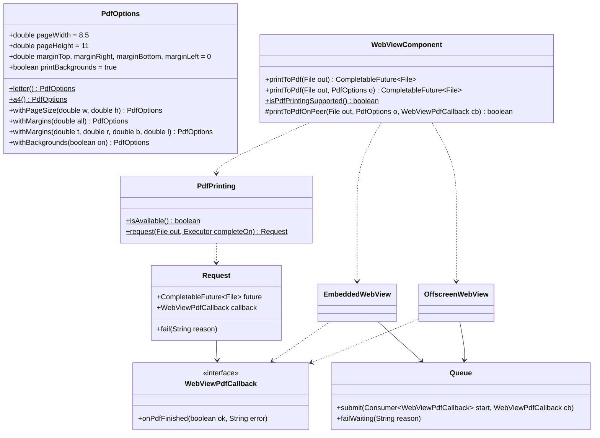

# REASONS Canvas: Print A Page To PDF (007-001)

> Source story: `requirements/[User-story-7]print-a-page-to-pdf.md` → **[STORY-007-001]**.
> Analysis: `spdd/analysis/GGQPA-XXX-202609250150-[Analysis]-print-a-page-to-pdf.md`.
>
> One asynchronous engine operation on all three platforms, in the shape of
> [[22-Clear-Http-Cache]] (a peer hook on `WebViewComponent`, a method on each engine wrapper, one JNI
> entry per engine kind, dispatched onto the engine UI thread) — plus the one thing Canvas 22 did not
> need: **a result delivered back to Java**, through a callback object passed with each request, in
> the upcall style of the download callbacks ([[23-Browser-Initiated-File-Downloads]]).

## REASONS-Implements

- `src/ca/weblite/webview/PdfOptions.java` — **new**: page size, margins, backgrounds; defaults.
- `src/ca/weblite/webview/WebViewPdfCallback.java` — **new**: the one-shot native → Java completion.
- `src/ca/weblite/webview/PdfPrinting.java` — **new**: the capability probe and the shared
  future plumbing (callback → `CompletableFuture<File>`, messages).
- `src/ca/weblite/webview/WebViewNative.java` — **edited**: three native declarations.
- `src/ca/weblite/webview/EmbeddedWebView.java` — **edited**: `printToPdf(File, PdfOptions)`.
- `src/ca/weblite/webview/OffscreenWebView.java` — **edited**: `printToPdf(File, PdfOptions)`.
- `src/ca/weblite/webview/swing/WebViewComponent.java` — **edited**: `printToPdf`,
  `isPdfPrintingSupported`, the `printToPdfOnPeer` hook, pending-request tracking.
- `src/ca/weblite/webview/swing/WebViewHeavyweightComponent.java` — **edited**: the hook, and
  failing pending requests on peer teardown.
- `src/ca/weblite/webview/swing/WebViewLightweightComponent.java` — **edited**: the same.
- `src_c/webkit_loader.h`, `src_c/webkit_shim.h` — **edited**: four `webkit_print_operation_*` symbols.
- `src_c/webview_embed.cpp` — **edited**: GTK (embedded + offscreen) and Cocoa implementations,
  the upcall helper, and three JNI exports inside the existing `extern "C"` block.
- `windows/webview_embed.cc` — **edited**: the WebView2 implementation, its completed-handler, and
  the three JNI exports.
- `test/ca/weblite/webview/PdfOptionsTest.java`, `test/ca/weblite/webview/PdfPrintingQueueTest.java`,
  `test/ca/weblite/webview/WebViewComponentPrintToPdfTest.java` — **new**.
- `demos/WebViewPdfDemo/…`, `run-linux-pdf-demo.sh`, `run-mac-pdf-demo.sh`,
  `run-windows-pdf-demo.bat` — **new**: prints a two-page sample.
- `README.md` — **edited**: a "Print to PDF" section and the demo in the demo list.

## Decisions (resolved here)

- **D1 · One callback object per request.** The Java wrapper creates a `WebViewPdfCallback` per call;
  the native side takes a global ref, calls `onPdfFinished(boolean ok, String error)` **exactly
  once**, and deletes the ref. No request ids, no map, and "exactly once" is local to one object.
- **D2 · `CompletableFuture<File>`.** Completes with the destination file, or exceptionally with an
  `IOException` whose message is the reason. The Swing component completes it **on the EDT**; the
  engine wrappers complete it on the thread the native calls back on (the engine UI thread) — callers
  of the wrappers who chain work must use the `…Async` variants.
- **D3 · Options in inches, with defaults for paged HTML.** `PdfOptions`: width 8.5, height 11,
  margins 0, backgrounds on. The engine's own headers/footers are always off and scale is 1: the PDF
  is the page (the page's CSS lays out its own margins and running heads).
- **D4 · Capability = the native answers.** `webview_pdf_available()` exists only in natives with this
  feature; `PdfPrinting.isAvailable()` calls it inside `catch (Throwable) → false`, exactly as
  `NativeCredentialStore.isAvailable()` does, which absorbs `UnsatisfiedLinkError` from an older
  native (AC6). A print against an older native fails with that same reason instead of throwing.
- **D5 · Runtime gaps fail the request, never the library.** WebView2 without `ICoreWebView2_7` or
  `Environment6`, macOS without `printOperationWithPrintInfo:`, and a GTK stack without the
  "Print to File" printer each complete the callback with a sentence naming what is missing (AC7).
- **D6 · No peer, no print.** The component fails the future at once with "The WebView is not
  attached yet." (AC8); a peer torn down with requests outstanding fails them with "The WebView was
  closed." — the component tracks its own pending futures so this never depends on the engine.
- **D7 · The destination folder must exist.** Checked in Java before the native call ("The folder
  … does not exist."), so every engine fails the same way for the common mistake (AC5); engine write
  errors still arrive through the callback.
- **D8 · Linux: GTK print-to-file, four new WebKit symbols.** `webkit_print_operation_new`,
  `webkit_print_operation_set_print_settings`, `webkit_print_operation_set_page_setup`,
  `webkit_print_operation_print` join `WK_WEBKIT_SYMS` and the shim; all exist in every WebKitGTK
  2.x, so no host loses the library. GTK functions link as they do today. Backgrounds use
  `g_object_set(settings, "print-backgrounds", …)` on the view's settings — no fifth symbol. The
  `finished` and `failed` signals complete the request; the operation object holds the callback.
- **D9 · macOS: a modal run on the view's window.** `printOperationWithPrintInfo:` (macOS 11+) with an
  `NSPrintInfo` copy: job disposition "save", `NSPrintJobSavingURL` = the file URL, paper size in
  points, margins in points, automatic pagination, no print or progress panel. The operation's view
  gets a frame of the paper size — without it WKWebView prints blank pages. Run with
  `runOperationModalForWindow:delegate:didRunSelector:contextInfo:` on the WKWebView's window (the
  only way WKWebView renders asynchronously into the operation); a runtime-created delegate class
  (`WebviewEmbedPdfDelegate`, once per JVM) receives `printOperationDidRun:success:contextInfo:`
  and completes the request carried in `contextInfo`. Backgrounds: `WKPreferences
  setShouldPrintBackgrounds:` when the selector exists (macOS 13.3+).
- **D10 · Windows: `ICoreWebView2_7::PrintToPdf`.** Settings from
  `ICoreWebView2Environment6::CreatePrintSettings` on the engine's stored environment: page width
  and height, four margins, `ShouldPrintBackgrounds`, `ShouldPrintHeaderAndFooter(FALSE)`,
  `ScaleFactor(1.0)`, portrait. A `PrintToPdfHandler : CallbackBase<ICoreWebView2PrintToPdfCompletedHandler>`
  completes the request with `isSuccessful`, or the `HRESULT` in hex on failure.
- **D11 · JNI exports inside the existing `extern "C"` blocks.** The headers are stale by design; a
  new export outside the block is an `UnsatisfiedLinkError` at call time.
- **D12 · One print at a time per engine.** An engine asked to print while a print is running drops
  the second: WebKitGTK emits `finished` for it without writing anything. Each engine wrapper owns a
  `PdfPrinting.Queue` that starts the next print from the callback of the one before; the component
  inherits this by printing through its wrapper. Prints still waiting when the wrapper is disposed
  are answered with "The WebView was closed."
- **D13 · Supported modes follow the library's support matrix.** Linux supports the lightweight
  (offscreen) component only; macOS and Windows support the heavyweight (embedded) component only.
  Those are the combinations this feature is built and verified for. The Linux embedded export
  refuses with "PDF printing on Linux needs the lightweight WebView component." — printing the
  embedded view segfaults inside `webkit_print_operation_print` (or hangs), so the unsupported mode
  must fail the request rather than the JVM. The macOS/Windows offscreen export answers "The WebView
  is not attached yet."
- **D14 · On Linux, success means the file was written.** `finished` alone is not proof (D12's
  dropped print ends there too): the request succeeds only when the destination exists, is non-empty
  and was modified by this print (mtime no earlier than the print's start, 1 s slack); otherwise it
  fails with "The PDF file was not written."
- **D15 · On macOS the native library loads when a component is constructed.** The first touch of
  `WebViewNative` loads `libjawt` and `libwebview` under the JVM's library lock. Done on the EDT once
  a window is showing — which is what `isPdfPrintingSupported()` right after `setVisible(true)` did in
  the demo — it deadlocks: the AppKit thread, delivering the window's first mouse-entered event,
  initialises `java.awt.event.MouseEvent`, whose static initialiser waits for the same lock, while the
  EDT's load waits on the AppKit thread. So on macOS the `WebViewComponent` constructor loads the
  natives (forcing `WebViewNative`'s class initialisation). Construction comes before showing in
  every normal use, so the load happens before AppKit delivers any window event. Any failure is
  swallowed: a missing native leaves `isPdfPrintingSupported()` answering false as before. Linux and
  Windows are unchanged.

## R · Requirements

- Print the page a WebView shows to a PDF file, dialog-free, at a chosen page size and margins, with
  backgrounds — on Linux (lightweight component), macOS and Windows (heavyweight component) (D13).
- Deliver the outcome asynchronously, exactly once, as a future.
- Say clearly when this native, this runtime or this component cannot print.

## E · Entities

## A · Approach

1. **Java**: `PdfOptions` validates (positive sizes, non-negative margins that leave a printable
   area). `PdfPrinting.request(file, executor)` builds a `CompletableFuture<File>` and a callback that
   completes it (once, guarded by an `AtomicBoolean`) on the given executor. The wrappers submit the
   native call to their `PdfPrinting.Queue` (D12); the component uses `SwingUtilities::invokeLater` as
   the executor, prints through its wrapper's public `printToPdf`, relays that future's outcome to its
   own callback, keeps a list of pending requests, and fails them on teardown.
2. **Native**: each JNI export takes a global ref to the callback, dispatches to the engine UI thread,
   starts the engine's print, and on completion upcalls `onPdfFinished` with attach/detach and
   exception clearing, then deletes the ref. Every early exit (no view, missing capability) also
   upcalls with a reason, so no path leaves a request unanswered.

## S · Structure

- Public API: `PdfOptions`, `WebViewComponent.printToPdf` / `isPdfPrintingSupported`,
  `EmbeddedWebView.printToPdf`, `OffscreenWebView.printToPdf`. Internal bridge:
  `WebViewPdfCallback`, `PdfPrinting`, `WebViewNative` declarations.
- Native: one upcall helper per translation unit (`pdf_new_job(JNIEnv*, jobject)` and
  `pdf_finish(PdfJob*, bool, const char*)`), one print function per platform (GTK's shared by both
  engine kinds), three exports per platform.

## O · Operations

### 1. `PdfOptions` (**new**, `ca.weblite.webview`)
Immutable; fields as in Entities; `letter()` (default), `a4()` (8.27 × 11.69); `with…` copies;
`validate()` returns null or a sentence: "Page width and height must be positive.",
"Margins must not be negative.", "The margins leave no room to print on the page."

### 2. `WebViewPdfCallback` (**new**)
`void onPdfFinished(boolean ok, String error);` Javadoc: internal bridge, called once from the engine
UI thread.

### 3. `PdfPrinting` (**new**)
- `static final String NOT_AVAILABLE = "PDF printing is not available in this version of the native library.";`
- `static final String NOT_ATTACHED = "The WebView is not attached yet.";`
- `static final String CLOSED = "The WebView was closed.";`
- `static boolean isAvailable()`: `try { return WebViewNative.webview_pdf_available(); } catch (Throwable t) { return false; }`.
- `static String precheck(File out, PdfOptions o)`: null out → "Say where to write the PDF.";
  options invalid → its sentence; parent folder missing → "The folder <parent> does not exist.";
  not available → `NOT_AVAILABLE`. An overload `precheck(File, PdfOptions, boolean available)` takes
  the capability answer instead of probing it.
- `static CompletableFuture<File> failed(String reason)`: an already-failed future.
- `static final class Request`: `future`, `callback` (completes the future via the executor: ok →
  `complete(out)`, else `completeExceptionally(new IOException(error))`, an empty error becoming
  "The page could not be printed to PDF."), `fail(String)`; completion at most once.
- `static final class Queue` (D12): `submit(Consumer<WebViewPdfCallback> start, WebViewPdfCallback cb)`
  runs `start` now when idle, else queues it; `start` receives a callback that answers `cb` once and
  then starts the next queued print. A `start` that throws answers `cb` with the exception's
  message. `failWaiting(String)` answers every queued, unstarted print with the reason.

### 4. `WebViewNative` (**edited**)
- `native static boolean webview_pdf_available();`
- `native static void webview_embed_print_to_pdf(long w, String path, double pageWidth, double pageHeight, double marginTop, double marginRight, double marginBottom, double marginLeft, boolean backgrounds, WebViewPdfCallback cb);`
- `native static void webview_offscreen_print_to_pdf(long peer, …same…);`

### 5. `EmbeddedWebView.printToPdf(File, PdfOptions)` / `OffscreenWebView.printToPdf` (**edited**)
`checkAlive()`; `precheck` → failed future; else build a `Request` completing on the calling native
thread (`Runnable::run`), anchor the callback in `heap` until it fires, and submit to the wrapper's
`pdfQueue` a start that calls the native with the absolute path (or answers `CLOSED` when the peer is
already gone). `dispose()` calls `pdfQueue.failWaiting(CLOSED)` before destroying the peer. Returns
the future.

### 6. `WebViewComponent` (**edited**)
- `public CompletableFuture<File> printToPdf(File out)` → `printToPdf(out, PdfOptions.letter())`.
- `protected boolean pdfPrintingAvailable()` → `PdfPrinting.isAvailable()`; the seam a headless test
  double overrides, since tests run without natives.
- `public CompletableFuture<File> printToPdf(File out, PdfOptions o)`: precheck (with
  `pdfPrintingAvailable()`) → failed future (on
  the EDT); a `Request` completing via `SwingUtilities::invokeLater`; on the EDT add it to
  `pendingPdf` (removed on completion), then — unless already done —
  `if (!printToPdfOnPeer(out, o, request.callback)) request.fail(NOT_ATTACHED)`.
- `protected boolean printToPdfOnPeer(File out, PdfOptions o, WebViewPdfCallback cb)`: base returns
  false.
- `protected void failPendingPdf()`: fail every pending request with `CLOSED`.
- `public static boolean isPdfPrintingSupported()` → `PdfPrinting.isAvailable()`.
- Constructor (D15): on macOS (`os.name` starting with "Mac"), `preloadNatives()` initialises
  `WebViewNative` via `Class.forName(name, true, loader)` inside a catch-all; a no-op elsewhere and
  after the first success. `isPdfPrintingSupported()` is unchanged.

### 7. Heavyweight / lightweight (**edited**)
Override `printToPdfOnPeer`: engine null → false; else call the wrapper's public `printToPdf(out, o)`
and relay its outcome to the callback (success → `onPdfFinished(true, null)`, failure → the cause's
message) and return true. The component owns the caller's future; the wrapper's future is only the
relay, and printing through the wrapper puts every print on the wrapper's queue (D12). Where each
disposes its engine, call `failPendingPdf()` first.

### 8. Linux native (**edited**)
- Loader + shim: the four `webkit_print_operation_*` symbols.
- `struct PdfJob { JavaVM *jvm; jobject cb; bool done; };` and
  `pdf_finish(PdfJob*, bool ok, const char *err)` (upcall once, delete ref, delete job).
- `gtk_print_to_pdf(std::function<GtkWidget*()> getWeb, PdfJob*, path, w, h, mt, mr, mb, ml, bg)`
  (placed in the GTK section before the offscreen engine, generic over the view):
  the export creates the job (global ref); the view is read through `getWeb` on the GTK thread.
  `GtkPump::run_async`: note the start time; no view → finish(false, "The WebView is not attached yet.");
  `g_object_set(webkit_web_view_get_settings(view), "print-backgrounds", bg, NULL)`;
  `GtkPrintSettings`: printer "Print to File", `output-file-format` "pdf", `output-uri` =
  `g_filename_to_uri(path)`; `GtkPageSetup` with `gtk_paper_size_new_custom("aaf-pdf","PDF",w,h,GTK_UNIT_INCH)`,
  portrait, margins in inches (the paper size also on the settings); `webkit_print_operation_new(view)`,
  set both, connect `failed` ("The page could not be printed to PDF: <GError message>.") and
  `finished` (success only per D14, unless failed fired first; then unref the operation); `print`;
  unref settings and setup. An invalid path → "The PDF path is not a valid file path."
- The offscreen export calls it with a getter for `e->web` — the supported Linux path. The embedded
  export does not print: it finishes with the D13 refusal.

### 9. macOS native (**edited**)
- `cocoa_print_to_pdf(Engine*, JNIEnv*, …)`: job with global ref; `cocoa_run_on_main_async`:
  destroyed/no view → finish(false, not attached); no `printOperationWithPrintInfo:` → finish(false,
  "PDF printing needs macOS 11 or later."); no window → finish(false, "The WebView has no window to
  print from."). Backgrounds via `configuration.preferences setShouldPrintBackgrounds:` when it
  responds. `NSPrintInfo` = `[[NSPrintInfo sharedPrintInfo] copy]`; `setJobDisposition:` "NSPrintSaveJob";
  `dictionary[@"NSJobSavingURL"] = [NSURL fileURLWithPath:]`; `setPaperSize:` (points = inches × 72);
  four margins; `setHorizontalPagination:`/`setVerticalPagination:` automatic (0); centred off.
  Operation from the view; `setShowsPrintPanel:NO`, `setShowsProgressPanel:NO`; its view's frame =
  paper rect; `runOperationModalForWindow:delegate:didRunSelector:contextInfo:` with the shared
  delegate, `printOperationDidRun:success:contextInfo:` and the job as `contextInfo`.
- The delegate class is created once (`std::call_once`) with that one method, which finishes the job
  (false → "The page could not be printed to PDF.").

### 10. Windows native (**edited**)
- `PrintToPdfHandler` completing a `PdfJob` with `isSuccessful` or `HRESULT 0x…`.
- Export: job with global ref; `dispatch_to_thread`: no webview → not attached; QI `ICoreWebView2_7`
  and `ICoreWebView2Environment6` → missing → "PDF printing needs a newer WebView2 runtime.";
  `CreatePrintSettings`, set values, `PrintToPdf(widePath, settings, handler)`; a failed call
  finishes with its `HRESULT`. `webview_pdf_available` → true; the offscreen export finishes with
  not attached (no offscreen engine on Windows).

### 11. Tests, demo, README (**new**/**edited**)
- `PdfOptionsTest`: defaults, A4, validation sentences.
- `PdfPrintingQueueTest`: a second submit waits for the first callback; order is kept; a throwing
  start answers its callback and the queue moves on; `failWaiting` answers unstarted prints only.
- `WebViewComponentPrintToPdfTest` (stub component overriding `printToPdfOnPeer` and
  `pdfPrintingAvailable`, headless; beside the Canvas 22 test in `ca.weblite.webview`): no peer →
  NOT_ATTACHED; missing folder → the folder sentence; a peer callback `ok` completes with the file on
  the EDT; `error` fails with the message; a second callback call is ignored; `failPendingPdf` fails
  pending with CLOSED; `isPdfPrintingSupported()` never throws and agrees with
  `PdfPrinting.isAvailable()` (CI's test phase may have natives on the path, so no fixed answer).
- Demo: loads a two-page HTML with `@page { size: 8.5in 11in; margin: 0 }`, a dark full-bleed first
  page, then prints to `~/webview-pdf-demo.pdf` (Letter) and `~/webview-pdf-demo-a4.pdf` (A4, 0.5 in
  margins) and logs each result; `-Dpdfdemo.auto=true` prints both plus one into a missing folder,
  then exits 0 only when both files were written and the bad path failed. Run scripts per OS (Linux
  lightweight, macOS/Windows heavyweight, D13); README checklist mapped to the ACs.

## N · Norms
- Mirror Canvas 22's shape and the download upcall style; comments cite `Canvas 29 Dn`.
- Every native path finishes the job exactly once; no native call throws into Java.
- Java 8 source level; no new dependency.

## S · Safeguards
- `webview_pdf_available` and both print exports are inside the `extern "C"` blocks (D11).
- The Linux loader list gains only symbols present since WebKitGTK 2.0.
- No print dialog is ever shown; engine headers/footers are off.
- The future completes exactly once; a callback after completion is ignored.
- One engine never runs two prints at once (D12); a Linux success is a file this print wrote (D14).
- On macOS no API in this Canvas is the first to load the natives after a window is showing (D15).
- Paths go to engines as UTF-8 (Linux/macOS) or UTF-16 (Windows) absolute paths; no shell.
