# REASONS Canvas: Custom URL Schemes — Java API + macOS WKWebView Coverage (008-001)

> Source story: `requirements/[User-story-8]serve-pages-from-a-custom-url-scheme.md` → **[STORY-008-001]**.
> Analysis: `spdd/analysis/GGQPA-XXX-202609261430-[Analysis]-serve-pages-from-a-custom-url-scheme.md`.
>
> **How the feature is split.** It follows the downloads feature ([[23-Browser-Initiated-File-Downloads]]
> / 24 / 25):
> - **this Canvas** — the portable Java API, the request dispatcher, the macOS WKWebView
>   implementation, the capability probe and the demo;
> - [[31-Custom-Url-Schemes-Linux-Coverage]] — WebKitGTK;
> - [[32-Custom-Url-Schemes-Windows-Coverage]] — WebView2.
>
> Until 31 and 32 land, the GTK and Windows natives carry **stub exports** that report "not
> supported". An application therefore gets AC10's sentence on those platforms rather than a link
> error or a silent no-op.
>
> **Two new shapes for this library:**
> - **The library's first application-wide setting.** Engines fix their schemes when they are
>   created, so schemes are registered once, before the first engine exists.
> - **A request answered asynchronously by Java.** The PDF callback of [[29-Print-A-Page-To-Pdf]]
>   runs the other way (native → Java completion). Here native asks, Java answers later with an
>   id, and native applies the answer on the engine's thread.

## REASONS-Implements

**Java**, all in `src/ca/weblite/webview/`:
- **New**
  - `WebViewSchemes.java` — the public, static registry: `register`, `isSupported`, the name
    rules, and the freeze at the first engine.
  - `WebViewSchemeHandler.java` — the application's handler interface.
  - `WebViewSchemeRequest.java` — what the handler receives.
  - `WebViewSchemeResponse.java` — what the handler answers with, plus static factories.
  - `WebViewSchemeResponder.java` — answers exactly once, from any thread.
  - `SchemeDispatcher.java` — package-private. It receives native upcalls, runs handlers on its own
    executor, enforces exactly-once, 500 on a throw, 504 on a timeout, the size caps and
    cancellation, and hands answers back to native through a sink.
- **Edited**
  - `WebViewNative.java` — three natives: `webview_scheme_available`, `webview_scheme_install`,
    `webview_scheme_respond`.
  - `EmbeddedWebView.java` and `OffscreenWebView.java` — call `WebViewSchemes.freezeForEngine()`
    immediately before their native create.

**Native**
- `src_c/webview_embed.cpp` — **edited**:
  - the shared scheme state (scheme list, dispatcher global ref, pending-task table);
  - the Cocoa `WKURLSchemeHandler` class;
  - installation on each new `WKWebViewConfiguration`;
  - the Cocoa responder;
  - three JNI exports inside the existing `extern "C"` block — real under `WEBVIEW_COCOA`, stubs
    under `WEBVIEW_GTK` until Canvas 31.
- `windows/webview_embed.cc` — **edited**: three stub exports, until Canvas 32.

**Tests**, in `test/ca/weblite/webview/`:
- **New**: `WebViewSchemesTest.java`, `SchemeDispatcherTest.java`, `WebViewSchemeResponseTest.java`.

**Demo**
- **New**: `demos/WebViewSchemeDemo/src/ca/weblite/webview/demos/WebViewSchemeDemo.java`,
  `demos/WebViewSchemeDemo/README.md`, `run-mac-scheme-demo.sh`, `run-linux-scheme-demo.sh` and
  `run-windows-scheme-demo.bat`. The last two print "not supported" until 31 and 32.
- `README.md` — **edited**: a "Custom URL schemes" section, and the demo in the demo list.

## Decisions (resolved here)

- **D1 · Application-wide, frozen at the first engine.**
  - `WebViewSchemes.register(scheme, handler)` is static.
  - The first `EmbeddedWebView` or `OffscreenWebView` construction calls
    `WebViewSchemes.freezeForEngine()` before its native create. From then on `register` throws
    `IllegalStateException`: "Custom schemes must be registered before the first WebView is
    created." (AC9).
  - Constructing a Swing component does not freeze. Only creating its engine (the peer) does, so an
    application can construct components and still register before they are shown.
  - The standalone zserge `WebView` never freezes and never serves schemes (Scope Out).

- **D2 · Nothing changes when nothing is registered.** `freezeForEngine()` calls the native
  `webview_scheme_install` **only if at least one scheme is registered**. An application that never
  registers never touches the new natives, so an older native library behaves exactly as before.

- **D3 · Scheme names.**
  - A scheme matches `[a-z][a-z0-9+.-]{1,31}`. The name is lower-cased before checking, and stored
    lower-case.
  - Otherwise `register` throws `IllegalArgumentException`: "“<name>” is not a valid scheme name:
    2–32 characters, a letter first, then letters, digits, '+', '-' or '.'."
  - Refused: `http`, `https`, `file`, `data`, `blob`, `about`, `javascript`, `ws`, `wss`, `ftp`.
    Message: "“<name>” cannot be registered: it is one of the web's own schemes." (AC8).
  - A duplicate is refused with "“<name>” is already registered."
  - A null handler is refused with "A handler is required."

- **D4 · Capability.**
  - `WebViewSchemes.isSupported()` calls `WebViewNative.webview_scheme_available()` inside
    `catch (Throwable) → false`, the same as `PdfPrinting.isAvailable()`.
  - **AWT first.** Unlike the PDF probe, this one runs at start-up, before any window exists, and
    loading `WebViewNative` loads `libjawt`. On macOS under JDK 8 that pulls in `libawt_lwawt`,
    whose `JNI_OnLoad` crashes the JVM (SIGSEGV) when the AWT toolkit has not started yet. So the
    native probe first checks `GraphicsEnvironment.isHeadless()`: when headless it answers `false`
    without touching `WebViewNative` (no WebView component can exist there); otherwise it calls
    `Toolkit.getDefaultToolkit()`, and only then the native probe.
  - `register` checks it first. If it is false, `register` throws `UnsupportedOperationException`:
    "Custom URL schemes are not available in this version of the native library" (AC10).
  - After this Canvas: `true` on macOS, and `false` on Linux and Windows until Canvases 31 and 32.

- **D5 · The handler runs off the UI thread.**
  - `SchemeDispatcher` runs every handler on its own executor: a cached pool of **daemon** threads
    named `webview-scheme-N`, never the EDT and never the native thread (AC5).
  - The native upcall only enqueues and returns at once, so no engine thread waits on application
    code.

- **D6 · Asynchronous answer by id.**
  - Native gives each request a positive `long` id. It is unique for the life of the JVM, and
    monotonic from a native atomic counter.
  - The handler's responder calls, once, into the dispatcher, which calls
    `webview_scheme_respond(id, status, headerPairs, body)`.
  - Native looks the id up in its pending table under a lock. An unknown id (already answered or
    cancelled) is dropped silently.

- **D7 · Exactly once** (AC5–AC7). The dispatcher keeps one `AtomicBoolean` per request. The
  **first** of these wins, and every later one is ignored:
  - the handler's answer;
  - the 500 after a throw (AC6);
  - the 504 after the timeout (AC7);
  - a native cancellation.

  A cancelled request sends nothing to native.

- **D8 · Timeout.** 30 seconds from the moment the handler is called (`TIMEOUT_MS = 30_000`), on
  one daemon `ScheduledExecutorService`. The value is package-private and overridable for tests.
  After it, the page receives 504 with body "Timed out" (`text/plain`).

- **D9 · Handler failures.**
  - A handler that throws: 500, with body "Internal error" (`text/plain`). The exception goes to
    the thread's uncaught-exception handler, as `DialogDispatcher` does.
  - A handler that answers `null`: 500.

- **D10 · Size caps.** Bodies are held whole, since streaming is out of scope.
  - A request body over **16 MB** is answered 413 without calling the handler.
  - A response body over **64 MB** is answered 500 "Response too large".
  - The caps are constants in `SchemeDispatcher`.

- **D11 · Headers.** Headers cross JNI as a `String[]` of alternating names and values. It is kept
  in order, and repeated names are allowed. In the response the dispatcher:
  - **drops** any `Content-Length`, because the engine computes it;
  - adds `Content-Type: application/octet-stream` if the handler set none;
  - adds `Access-Control-Allow-Origin: <scheme>://<host>` of the request, unless the handler set
    one, so a same-origin `fetch` is never blocked by CORS (AC3, AC4).

- **D12 · The request.** `WebViewSchemeRequest` carries:
  - `method` (upper-case) and `url` (as the engine gave it);
  - `scheme`, lower-case;
  - `headers`: an unmodifiable `Map<String, List<String>>` whose keys keep their case and are
    looked up case-insensitively through `header(String)`;
  - `body`, a `byte[]`, empty when there is none;
  - `bodyAvailable`, false when the engine could not supply a body (Linux < 2.40, Canvas 31).

- **D13 · macOS implementation.**
  - **The handler class.** One Objective-C class, `WebviewSchemeHandler`, conforms to
    `WKURLSchemeHandler` and is built once with `objc_allocateClassPair`, the file's existing
    pattern. A single shared instance serves every scheme and every engine.
  - **Installation.** Directly after `e->config = [WKWebViewConfiguration new]`, the engine calls
    `setURLSchemeHandler:forURLScheme:` for each installed scheme, then creates the WKWebView.
    Popups inherit it from the configuration WebKit hands the delegate (AC11). Adopted popups
    replace only the user-content controller, so they keep it too.
  - **`webView:startURLSchemeTask:`**, on AppKit main:
    1. Allocate an id, retain the task and store it in the table.
    2. Read the URL (`absoluteString`), `HTTPMethod` and `allHTTPHeaderFields`.
    3. Read the body from `HTTPBody`, or from `HTTPBodyStream` up to the cap plus one byte.
    4. Make the upcall `onSchemeRequest` from a **detached `std::thread`**, the file's existing
       macOS upcall pattern, never AppKit main.
  - **`webView:stopURLSchemeTask:`**: remove the id from the table and release the task. Then call
    `onSchemeCancelled(id)` on a detached thread.
  - **`webview_scheme_respond`**, from any thread: copy the arguments and `dispatch_async` to the
    main queue. There:
    1. Look up and remove the task under the lock; if it is absent, drop the answer.
    2. Build an `NSHTTPURLResponse` with `initWithURL:statusCode:HTTPVersion:@"HTTP/1.1"
       headerFields:`.
    3. Call `didReceiveResponse:`, `didReceiveData:` (when the body is non-empty) and `didFinish`.
    4. Release the task.
  - **Secure origin (AC4):** WKWebView treats an application-registered scheme as its own origin.
    There is no extra API. The demo verifies `isSecureContext` and `localStorage`, and a failure is
    recorded in the README as a macOS limitation (see Safeguards).

- **D14 · The shared native state** lives in `webview_embed.cpp`, shared by Cocoa now and GTK in
  Canvas 31:
  - `g_scheme_names` (a vector of std::string);
  - `g_scheme_dispatcher`, a global ref to the Java `SchemeDispatcher`;
  - `g_scheme_jvm`;
  - `g_scheme_next_id`, a `std::atomic<long long>`;
  - `g_scheme_mutex` and `g_scheme_tasks` (id → platform object).

  `webview_scheme_install(String[] names, Object dispatcher)` sets them **once**. A second call is
  ignored, because the Java side calls it once.

- **D15 · Upcalls.** `onSchemeRequest(long id, String method, String url, String[] headerPairs,
  byte[] body, boolean bodyAvailable)` and `onSchemeCancelled(long id)` are instance methods of
  `SchemeDispatcher`. The native helper `scheme_upcall_request(...)` attaches the thread if needed,
  calls the method, clears any exception, and detaches if it attached, following `pdf_finish`.

- **D16 · Anchoring.** The `SchemeDispatcher` instance is held by a static field in
  `WebViewSchemes` for the life of the JVM, and native holds a global ref (spdd/norms: anchor every
  JNI callback).

## R · Requirements

- Let an application **serve its own pages from its own URL scheme**, answered in Java, with no
  local server and no port.
- Make those pages behave like a **secure site**: same-origin `fetch` with bodies, storage, and
  popups that stay on the scheme.
- **Never block the UI, never crash**: handlers run off the UI thread and answer asynchronously,
  and every failure becomes an error response.
- Keep **existing applications unchanged**. Nothing new happens unless a scheme is registered.
- Deliver the portable API and **macOS** now, with Linux and Windows reporting "not supported"
  until Canvases 31 and 32.

## E · Entities

```mermaid
classDiagram
direction TB

class WebViewSchemes {
    <<final, static>>
    +register(String scheme, WebViewSchemeHandler handler) void
    +isSupported() boolean
    +registeredSchemes() List~String~
    ~freezeForEngine() void
    ~resetForTests() void
}
class WebViewSchemeHandler {
    <<interface>>
    +handle(WebViewSchemeRequest request, WebViewSchemeResponder responder) void
}
class WebViewSchemeRequest {
    +String method
    +String url
    +String scheme
    +Map~String,List~String~~ headers
    +byte[] body
    +boolean bodyAvailable
    +header(String name) String
}
class WebViewSchemeResponse {
    +int status
    +List~String[]~ headers
    +byte[] body
    +ok(String contentType, byte[] body)$ WebViewSchemeResponse
    +text(int status, String text)$ WebViewSchemeResponse
    +of(int status, String contentType, byte[] body)$ WebViewSchemeResponse
    +withHeader(String name, String value) WebViewSchemeResponse
}
class WebViewSchemeResponder {
    <<interface>>
    +respond(WebViewSchemeResponse response) void
}
class SchemeDispatcher {
    ~onSchemeRequest(long id, String method, String url, String[] headerPairs, byte[] body, boolean bodyAvailable)
    ~onSchemeCancelled(long id)
    ~Sink sink
    ~long timeoutMs
}
class Sink {
    <<interface>>
    +respond(long id, int status, String[] headerPairs, byte[] body)
}

WebViewSchemes "1" o-- "*" WebViewSchemeHandler : by scheme
WebViewSchemes --> SchemeDispatcher : owns one
SchemeDispatcher --> WebViewSchemeHandler : runs on executor
SchemeDispatcher --> WebViewSchemeRequest : builds
WebViewSchemeHandler --> WebViewSchemeResponder : answers through
WebViewSchemeResponder --> WebViewSchemeResponse
SchemeDispatcher --> Sink : native (webview_scheme_respond) or test
```



## A · Approach

1. **Registry, freeze, install.** The application registers at start-up. The first engine freezes
   the registry, and if anything is registered, installs the names and the dispatcher into native
   once. Each new engine then reads the installed names at its creation point: on macOS, the
   configuration.
2. **Upcall, enqueue, return.** Native captures a request, gives it an id, and upcalls the
   dispatcher from a non-UI native thread. The dispatcher builds the request, applies the request
   cap, and submits the handler to its executor. It never blocks the native side.
3. **Answer once, by id.** A responder per request, a guard per request, and a timer per request.
   The first outcome wins and goes back through the sink (`webview_scheme_respond`). Native then
   applies it on the engine's own thread, and only if the request is still pending.
4. **Pure Java where possible.** Names, freeze, caps, headers, exactly-once, timeouts and
   cancellation all live in Java and are unit-tested headless. Native bridges stay thin: capture,
   table, apply.
5. **Stubs keep the other platforms honest.** GTK and Windows export the three functions now, with
   `available` false, so the Java JNI declarations link everywhere and `register` refuses with
   AC10's sentence.

## S · Structure

### Inheritance Relationships
1. `WebViewSchemeHandler`, `WebViewSchemeResponder` and `SchemeDispatcher.Sink` are interfaces.
2. `WebViewSchemeRequest` and `WebViewSchemeResponse` are final value classes (Java 8, no records).
3. `SchemeDispatcher` is package-private and final. It is instantiated only by `WebViewSchemes`
   (and by tests, with a recording `Sink`).

### Dependencies
1. `EmbeddedWebView` and `OffscreenWebView` → `WebViewSchemes.freezeForEngine()`, before their
   native create.
2. `WebViewSchemes` → `WebViewNative.webview_scheme_available` and `webview_scheme_install`, and
   → `SchemeDispatcher`.
3. `SchemeDispatcher` → the handlers, a `Sink` (default: `WebViewNative.webview_scheme_respond`),
   the executor and the timer.
4. Native (Cocoa) → `SchemeDispatcher.onSchemeRequest` / `onSchemeCancelled` via JNI.

### Layered Architecture
1. Public API: `WebViewSchemes`, `WebViewSchemeHandler`, `WebViewSchemeRequest`,
   `WebViewSchemeResponse`, `WebViewSchemeResponder`.
2. Dispatch: `SchemeDispatcher`.
3. JNI: `WebViewNative`, with three declarations.
4. Engine bridges: Cocoa in this Canvas, GTK in 31, WebView2 in 32.

## O · Operations

### 1. `WebViewSchemeResponse` (**new**)
1. Final fields: `int status`, `List<String[]> headers` (name/value pairs, unmodifiable) and
   `byte[] body` (never null).
2. A private constructor, and three static factories:
   - `ok(String contentType, byte[] body)`: status 200;
   - `text(int status, String text)`: UTF-8, `text/plain; charset=utf-8`;
   - `of(int status, String contentType, byte[] body)`.
3. `withHeader(name, value)` returns a copy with one more header.
4. Validation: the status must be 100–599 (`IllegalArgumentException` otherwise), and a null body
   becomes an empty one.
5. The getters `status()`, `headers()` and `body()`.

### 2. `WebViewSchemeRequest` (**new**)
1. Final fields per D12, set by a package-private constructor from the upcall's pieces.
2. `header(String name)`: the first value, matched case-insensitively, or null.
3. `toString()` gives the method and URL only, never the body.

### 3. `WebViewSchemeHandler` and `WebViewSchemeResponder` (**new**)
1. `void handle(WebViewSchemeRequest request, WebViewSchemeResponder responder) throws Exception`.
   The javadoc says:
   - it runs on a library thread, never the UI thread;
   - it may answer now or later, from any thread;
   - it must answer within 30 s.
2. `void respond(WebViewSchemeResponse response)`. The javadoc says only the first call counts.

### 4. `SchemeDispatcher` (**new**, package-private)
1. **Constants:**
   - `static final int MAX_REQUEST_BYTES = 16 * 1024 * 1024`;
   - `MAX_RESPONSE_BYTES = 64 * 1024 * 1024`;
   - `long timeoutMs = 30_000`, package-private and overridable.
2. **Fields:**
   - `Map<String, WebViewSchemeHandler> handlers`, a copy taken at freeze;
   - `Sink sink`;
   - an `ExecutorService` (cached, daemon threads `webview-scheme-N`);
   - a `ScheduledExecutorService` (one daemon thread `webview-scheme-timer`);
   - `ConcurrentHashMap<Long, Pending> pending`.
3. **`Pending`**: `AtomicBoolean done`, `String origin` and `ScheduledFuture<?> timer`.
4. **`onSchemeRequest(id, method, url, headerPairs, body, bodyAvailable)`**, called by native:
   1. Build the request. The scheme is the URL's scheme, lower-cased. The origin is
      `scheme + "://" + host`.
   2. Put a `Pending` in the table.
   3. If there is no handler for the scheme, `finish(id, text(404, "Not found"))`.
   4. If the body is longer than `MAX_REQUEST_BYTES`, `finish(id, text(413, "Request too large"))`.
   5. Otherwise schedule the timeout (`finish(id, text(504, "Timed out"))`) and submit to the
      executor:

      ```
      try { handler.handle(req, r -> finish(id, r == null ? text(500, "Internal error") : r)); }
      catch (Throwable t) { report(t); finish(id, text(500, "Internal error")); }
      ```
   6. Return at once. It never throws to native: every `Throwable` is caught.
5. **`onSchemeCancelled(id)`**: remove the `Pending`, set `done`, and cancel its timer. Nothing is
   sent to the sink.
6. **`finish(id, response)`**:
   1. Look the `Pending` up. If it is absent, or `done.compareAndSet(false, true)` fails, return.
   2. Remove it from the table and cancel its timer.
   3. If the body exceeds `MAX_RESPONSE_BYTES`, the response becomes 500 "Response too large".
   4. Build the header pairs per D11: drop `Content-Length` (case-insensitive), default
      `Content-Type`, default `Access-Control-Allow-Origin` to the origin.
   5. Call `sink.respond(id, status, pairs, body)`, catching any `Throwable`.
7. **`report(Throwable)`**: `Thread.getDefaultUncaughtExceptionHandler()`, or `printStackTrace` if
   there is none.

### 5. `WebViewSchemes` (**new**)
1. **Static state**, guarded by the class lock:
   - `Map<String, WebViewSchemeHandler> handlers` (a `LinkedHashMap`);
   - `boolean frozen`;
   - `SchemeDispatcher dispatcher` (the anchor, D16);
   - the package-private test seams `BooleanSupplier available` (default: the native probe),
     `Installer installer` (default: `webview_scheme_install`; a package-private interface
     `install(String[] schemes, Object dispatcher)`) and `SchemeDispatcher.Sink sink` (default:
     native).
2. **`isSupported()`**: `available.getAsBoolean()`, wrapped in `try/catch (Throwable) → false`.
   The default `available` (the native probe) follows D4's "AWT first": headless → `false` without
   loading `WebViewNative`; otherwise `Toolkit.getDefaultToolkit()`, then
   `WebViewNative.webview_scheme_available()`.
3. **`register(String scheme, WebViewSchemeHandler handler)`**, synchronized. It checks, in order:
   1. the handler is non-null (D3);
   2. `isSupported()` (D4);
   3. not frozen (D1);
   4. the name rule (D3);
   5. not a web scheme (D3);
   6. not a duplicate (D3);

   and then puts the handler.
4. **`registeredSchemes()`**: an unmodifiable copy of the keys.
5. **`freezeForEngine()`**, synchronized:
   1. If already frozen, return.
   2. Set `frozen = true`.
   3. If there are no handlers, return (D2).
   4. Create the dispatcher from a copy of the handlers and the sink.
   5. Call `WebViewNative.webview_scheme_install(names, dispatcher)` inside a `try/catch
      (Throwable)`. A failure is reported and the registry stays frozen, and engines are then
      created without schemes.
6. **`resetForTests()`**, package-private: clear everything, unfreeze, and restore the default
   seams.

### 6. `WebViewNative` (**edited**)
Add, beside the PDF natives, with a comment citing Canvas 30:

```
native static boolean webview_scheme_available();
native static void webview_scheme_install(String[] schemes, Object dispatcher);
native static void webview_scheme_respond(long id, int status, String[] headerPairs, byte[] body);
```

### 7. `EmbeddedWebView` and `OffscreenWebView` (**edited**)
Immediately before `WebViewNative.webview_embed_create(…)` and `webview_offscreen_create(…)`, add
`WebViewSchemes.freezeForEngine();`, with a comment citing Canvas 30 D1.

### 8. `src_c/webview_embed.cpp` (**edited**)
1. **Shared state** (D14), in both builds, beside the PDF helper.
2. **`scheme_upcall_request(long long id, const char* method, const char* url, const
   std::vector<std::string>& headerPairs, const std::vector<uint8_t>& body, bool bodyAvailable)`**
   and **`scheme_upcall_cancelled(long long id)`**:
   - attach if needed;
   - build the jstrings, the `String[]` and the `byte[]`;
   - call `onSchemeRequest(JLjava/lang/String;Ljava/lang/String;[Ljava/lang/String;[BZ)V` or
     `onSchemeCancelled(J)V` on `g_scheme_dispatcher`;
   - delete local refs, clear any exception, and detach if attached.
3. **Cocoa (`#ifdef WEBVIEW_COCOA`):**
   1. `get_scheme_handler_cls()`: `std::call_once`, then `objc_allocateClassPair(NSObject,
      "WebviewSchemeHandler")` with `class_addProtocol(WKURLSchemeHandler)`. It has two methods,
      `webView:startURLSchemeTask:` (`v@:@@`) and `webView:stopURLSchemeTask:` (`v@:@@`), per
      D13. `g_scheme_handler_instance` is created once.
   2. `cocoa_install_schemes(id config)`: if `g_scheme_names` is not empty, call
      `setURLSchemeHandler:forURLScheme:` on the config with the shared instance, once per name.
   3. Call `cocoa_install_schemes(e->config)` directly after
      `e->config = msg(objc_cls("WKWebViewConfiguration"), sel("new"));`, before
      `initWithFrame:configuration:`.
   4. The start method:
      1. `id = ++g_scheme_next_id`;
      2. `retain` the task and put it in `g_scheme_tasks` under the lock;
      3. read the request (`msg(task, sel("request"))`): URL `absoluteString`, `HTTPMethod`,
         `allHTTPHeaderFields` (enumerated into pairs), and `HTTPBody` or `HTTPBodyStream`
         (open, read up to `16 MB + 1`, close);
      4. `std::thread([=]{ scheme_upcall_request(...); }).detach();`.
   5. The stop method: find the task's id by pointer under the lock, erase it and `release` the
      task, then `std::thread([=]{ scheme_upcall_cancelled(id); }).detach();`.
   6. `cocoa_scheme_respond(id, status, pairs, body)`: `dispatch_async(dispatch_get_main_queue(),
      ^{ ... })` per D13 steps 1–4.
4. **The JNI exports**, inside the existing `extern "C"` block:
   - `Java_ca_weblite_webview_WebViewNative_webview_1scheme_1available`: `JNI_TRUE` under COCOA,
     `JNI_FALSE` under GTK.
   - `…webview_1scheme_1install`: copy the names into `g_scheme_names`, and store the JVM and a
     global ref to the dispatcher, once.
   - `…webview_1scheme_1respond`: copy the arrays. Under COCOA, call `cocoa_scheme_respond`; under
     GTK, do nothing until Canvas 31.

### 9. `windows/webview_embed.cc` (**edited**)
Add the three exports inside the existing `extern "C"` block:
- `available` returns `JNI_FALSE`;
- `install` and `respond` do nothing.

Comment: "Canvas 32 fills these in."

### 10. Tests (**new**; JUnit 4, headless)
1. **`WebViewSchemesTest`**, with seams (`available` true or false, a recording sink) and
   `resetForTests` in `@After`:
   - a valid name registers and appears in `registeredSchemes`;
   - `https`, `file`, `ws`, `about`, `javascript`, `Data` → AC8's message;
   - `a`, `9x`, `bad_name`, a 33-character name → the name-rule message;
   - a duplicate is refused;
   - a null handler is refused;
   - with `available` false, AC10's `UnsupportedOperationException` message;
   - after `freezeForEngine()`, AC9's `IllegalStateException` message;
   - `freezeForEngine()` with nothing registered makes no install call (D2), recorded via a seam;
   - freezing twice installs once.
2. **`SchemeDispatcherTest`**, with a recording `Sink` and a short `timeoutMs`:
   - a handler answering 200 reaches the sink once, with `Content-Type`, the `Access-Control-Allow-
     Origin` of the request's origin, and no `Content-Length`;
   - an answer from another thread, 200 ms later, reaches the sink, and the calling thread was
     never the one that invoked `onSchemeRequest` (AC5);
   - a throwing handler → 500 (AC6);
   - a handler that never answers → 504 after the timeout (AC7);
   - a handler answering twice → the sink is called once;
   - a cancellation before the answer → the sink is not called;
   - no handler for the scheme → 404;
   - a 16 MB + 1 request → 413, and the handler is not called;
   - a response over the cap → 500;
   - the POST body and method are passed through (AC3);
   - repeated request headers are kept, and `header()` is case-insensitive;
   - `bodyAvailable` false is passed through;
   - 50 concurrent requests are each answered once, with their own bodies (NF).
3. **`WebViewSchemeResponseTest`**: the factories, status bounds, a null body becomes empty, and
   `withHeader` copies.

### 11. Demo (**new**)
`WebViewSchemeDemo` registers `demo` with a handler serving:
- `index.html`, which has a heading, a script tag, and a button that POSTs JSON and shows the
  answer, `isSecureContext`, `location.origin` and a `localStorage` round trip;
- `app.js`;
- `api/echo`, which echoes the POST body as JSON;
- `slow`, which answers after 2 s;
- `broken`, which throws.

It opens a `WebViewComponent` on `demo://app/index.html`. If `WebViewSchemes.isSupported()` is
false, it prints AC10's sentence and exits 0. The run scripts follow `run-mac-pdf-demo.sh`, and the
Linux and Windows scripts exist and currently report "not supported".

### 12. `README.md` (**edited**)
A "Custom URL schemes" section covering:
- registering before the first WebView;
- the handler contract (off the UI thread, answer once, 30 s);
- the caps;
- the reserved names;
- the platform status: macOS now, Linux and Windows in the next releases;
- the demo.

## N · Norms

1. Java 8 only (spdd/norms). There is no `var`, `List.of` or records, and value classes are
   hand-written.
2. Anchor every JNI-reachable object (D16). Native holds a global ref, and Java holds a static
   field.
3. The JNI exports live **inside the existing `extern "C"` block**, beside the PDF exports.
4. No native code calls into Java on AppKit main. Upcalls use detached threads, and responses are
   applied on the main queue.
5. `java.util.logging` or the uncaught-exception handler only. No new logging dependency.
6. Javadoc cites `Canvas 30 Dn`, and tests map to the story's ACs in their class comment.

## S · Safeguards

1. **Unchanged when unused:** with no scheme registered, no new native function is ever called, and
   engine creation is byte-for-byte as before (D2).
2. **Never on the UI thread:** handlers run only on `webview-scheme-N` threads. Native code never
   waits on Java.
3. **Exactly once:** each request id is answered at most once, and never after a cancellation.
   Native also drops unknown ids.
4. **Bounded:** 16 MB per request body, 64 MB per response body, and 30 s per request.
5. **Refusals:** the web's own schemes, invalid names, duplicates, late registration and an
   unsupported native are each refused with the exact message in D3, D1 or D4.
6. **Crash-free:** calling `isSupported()` or `register` in `main`, before any AWT window, never
   loads the native library ahead of the AWT toolkit (D4). Every `Throwable` in the dispatcher is caught. Every JNI upcall clears pending
   exceptions. A response for a stopped macOS task is never delivered to that task.
7. **Scope:**
   - no streaming;
   - no unregistering;
   - the standalone `WebView` is not covered;
   - no service workers;
   - Linux and Windows are stubbed ("not supported") until Canvases 31 and 32.
8. **macOS verification:** `isSecureContext`, `localStorage` and the POST body are verified by
   running the demo. Any that fail are listed in the README's platform notes as known limitations,
   not hidden.
