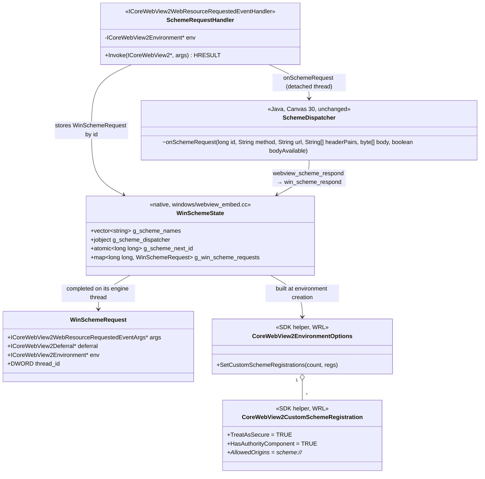

# REASONS Canvas: Custom URL Schemes — Windows WebView2 Coverage (008-001)

> Source story: `requirements/[User-story-8]serve-pages-from-a-custom-url-scheme.md` → **[STORY-008-001]**.
> Analysis: `spdd/analysis/GGQPA-XXX-202609261430-[Analysis]-serve-pages-from-a-custom-url-scheme.md`.
>
> **Where this sits.** It is the last of the three coverage Canvases, following the downloads split
> ([[23-Browser-Initiated-File-Downloads]] / 24 / 25):
> - [[30-Custom-Url-Schemes-And-Macos-Coverage]] — the Java API, the dispatcher, macOS and the demo.
>   **Landed; verified on macOS.**
> - [[31-Custom-Url-Schemes-Linux-Coverage]] — WebKitGTK, and the demo's automatic mode. **Landed;
>   verified on Linux.**
> - **this Canvas** — WebView2.
>
> **No Java API change.** This Canvas replaces the Windows stub bodies that Canvas 30 put in
> `windows/webview_embed.cc` with a real implementation. `windows/webview_embed.cc` is a separate
> translation unit from `src_c/webview_embed.cpp`, so the shared scheme state and the Java upcall
> that Canvas 30 D14–D15 defined there get their own Windows copies here.

## REASONS-Implements

**Native**
- `windows/webview_embed.cc` — **edited**:
  - `#include "WebView2EnvironmentOptions.h"` (the SDK's own options helper, from the same
    `build/native/include` as `WebView2.h`) and `<wrl.h>`;
  - the shared scheme state and `scheme_upcall_request` (Canvas 30 D14, D15, Windows copy);
  - `win_scheme_environment_options()`, used by `engine_thread` in place of the `nullptr` options;
  - `SchemeRequestHandler` (`ICoreWebView2WebResourceRequestedEventHandler`) and
    `win_install_scheme_hook(ICoreWebView2*, ICoreWebView2Environment*)`;
  - the hook installed on the engine's webview and on every popup child;
  - `win_scheme_respond(...)`;
  - the three exports' real bodies.

**Java**
- `src/ca/weblite/webview/WebViewSchemes.java` — **edited**: class Javadoc only ("macOS, Linux and
  Windows serve schemes"). No behaviour change.

**Demo and docs**
- `run-windows-scheme-demo.bat` — **edited**: header comment (Windows is supported now).
- `demos/WebViewSchemeDemo/README.md` — **edited**: Windows run instructions and Windows notes.
- `README.md` — **edited**: "Custom URL schemes" platform coverage and Windows notes.

**Tests**
- No new Java tests: this Canvas adds no Java logic. The Windows engine is checked with the demo's
  automatic mode (Canvas 31 D10) on a Windows machine, and CI compiles `windows_64` and
  `windows_arm64`.

## Decisions (resolved here)

- **D1 · Schemes are declared when the environment is created.**
  - WebView2 fixes custom schemes per **environment**, through
    `ICoreWebView2EnvironmentOptions4::SetCustomSchemeRegistrations`.
  - The library creates environments in exactly one place: `engine_thread`, with
    `CreateCoreWebView2EnvironmentWithOptions(nullptr, nullptr, <options>, handler)`.
    - Popup children are created from the opener's `e->environment`.
    - Adopted engines take over the retained child's environment.

    So every WebView the components create comes from an environment built at that one site.
  - **Nothing registered → `nullptr` options, exactly as today** (Canvas 30 D2). An application
    that registers nothing creates its environments byte-for-byte as before.
  - WebView2 requires every environment that shares a user data folder to be created with the same
    options. The freeze (Canvas 30 D1) guarantees every component engine sees the same scheme list.

- **D2 · The options object comes from the SDK's own helper.**
  - `WebView2EnvironmentOptions.h` ships in the pinned SDK (1.0.2592.51) beside `WebView2.h`. It
    defines `CoreWebView2EnvironmentOptions` and `CoreWebView2CustomSchemeRegistration` on WRL
    (`<wrl/implements.h>`, part of the Windows SDK that MSVC already uses).
  - Using it means every option other than the scheme list keeps the SDK's exact default,
    including `TargetCompatibleBrowserVersion`. The analysis considered implementing the COM
    options interfaces by hand; the helper removes that risk, because a hand-written getter with
    the wrong default would change unrelated behaviour.
  - `win_scheme_environment_options()` (called on the engine thread):
    1. Return `nullptr` if `g_scheme_names` is empty.
    2. `auto options = Microsoft::WRL::Make<CoreWebView2EnvironmentOptions>();`
    3. For each name, `Microsoft::WRL::Make<CoreWebView2CustomSchemeRegistration>(wideName)`, then:
       - `put_TreatAsSecure(TRUE)` — a secure context (AC4);
       - `put_HasAuthorityComponent(TRUE)` — `demo://app/…` has a host, so `demo://app` is its
         own origin (AC4);
       - `SetAllowedOrigins(1, {L"<scheme>://*"})` — requests that carry an `Origin` header
         (fetch, XHR, POST) are accepted only from pages on the same scheme (AC3). Requests
         without an `Origin` (navigations, images, scripts) are always allowed.
    4. `QueryInterface` the options for `ICoreWebView2EnvironmentOptions4` and call
       `SetCustomSchemeRegistrations(count, registrations)`.
    5. Return the options as `ICoreWebView2EnvironmentOptions*` (a `ComPtr`, released by the
       caller after the create call).
  - Any failure in steps 2–4 is logged with `WV_LOG` and falls back to `nullptr` options. The
    engine is then created without schemes rather than not at all.

- **D3 · Intercepting the requests.**
  - `win_install_scheme_hook(ICoreWebView2 *wv, ICoreWebView2Environment *env)`, on the webview's
    thread; a no-op when `g_scheme_names` is empty:
    1. For each name, `wv->AddWebResourceRequestedFilter(L"<scheme>:*",
       COREWEBVIEW2_WEB_RESOURCE_CONTEXT_ALL)`.
    2. `wv->add_WebResourceRequested(new SchemeRequestHandler(env), &token)`, then `Release()` the
       local reference. The token is not kept: the handler lives as long as the webview.
  - Where it is called:
    - `engine_thread`: directly after the `NewWindowRequestedHandler` is added, with
      `e->webview` and `e->environment`.
    - `NewWindowRequestedHandler`, in both the **ADOPT** and **NATIVE_WINDOW** branches: directly
      after `propagate_popup_user_agent(e, child, …)`, with `child` and `e->environment` (AC11).
    - **Adoption does not call it.** The adopted child already carries its hook, and
      `adopt_retained_popup` removes only the three retained-phase tokens it names.
  - **Every handler sees every filtered request.** WebView2 delivers each request that matches
    *any* filter on a webview to *every* `WebResourceRequested` handler on it, and the popup
    user-agent hook already filters `*`. So `SchemeRequestHandler` first checks the URI's scheme
    and returns `S_OK` untouched unless it is a registered one (AC12).

- **D4 · The request** (`SchemeRequestHandler::Invoke`, on the engine's STA thread):
  1. `args->get_Request(&req)`; `req->get_Uri` → UTF-8. Lower-case the part before the first `:`;
     not in `g_scheme_names` → return `S_OK`.
  2. `req->get_Method`; `req->get_Headers` → `GetIterator` → `GetCurrentHeader` / `MoveNext`
     into alternating pairs.
  3. `req->get_Content(&stream)`: a null stream is an empty body; otherwise `IStream::Read` in
     16 KB chunks up to `kSchemeMaxRequestRead` (16 MB + 1). `bodyAvailable = true` — WebView2
     always supplies the body.
  4. `args->GetDeferral(&deferral)`. If it fails, return `S_OK`: the request is left to WebView2,
     and the page sees a load failure rather than a hang.
  5. `id = ++g_scheme_next_id`; store `{args (AddRef), deferral, env (AddRef),
     GetCurrentThreadId()}` in `g_win_scheme_requests[id]` under `g_scheme_mutex`.
  6. `std::thread([...]{ scheme_upcall_request(...); }).detach();` — the file's existing
     deferral pattern (script dialogs, downloads, new windows). The engine thread never waits on
     Java.

- **D5 · The response** (`win_scheme_respond`, from any thread):
  1. Under the lock, find and **erase** the id. Absent → drop the answer (Canvas 30 D6).
  2. `post_to_worker_thread(entry.thread_id, …)`, and there:
     1. `SHCreateMemStream(body.data(), body.size())` (`shlwapi.lib`, already linked);
     2. the headers as one wide string, `"Name: value\r\n"` per pair;
     3. `entry.env->CreateWebResourceResponse(stream, status, reason, headers, &resp)`, where
        `reason` is the standard phrase for 200, 204, 301, 302, 304, 400, 403, 404, 405, 413, 500
        and 504, and `L""` otherwise;
     4. on success, `entry.args->put_Response(resp)`;
     5. **always** `entry.deferral->Complete()`. If the response could not be built, the page sees
        a load failure, never a hang;
     6. release the stream, the response, the deferral, the args and the environment.
  3. If `PostThreadMessage` fails because the engine thread has already exited, the entry's COM
     references are **leaked, not released**. Releasing them from the wrong apartment is unsafe.
     The leak is bounded by the requests pending when a view closed.

- **D6 · Cancellation on Windows.** WebView2 has no event telling the application that a
  `WebResourceRequested` deferral was abandoned. So, as on Linux (Canvas 31 D8), Windows never
  calls `onSchemeCancelled`. A request ends when it is answered, fails, or reaches the
  dispatcher's 504 after 30 s. Completing a deferral whose navigation has gone away is harmless:
  WebView2 ignores it.

- **D7 · Capability.** `webview_scheme_available()` returns `JNI_TRUE` on Windows.
  - Whether the installed **Runtime** honours custom scheme registrations only becomes known when
    an environment is created.
  - A Runtime that predates them ignores the registrations. Its pages on the scheme then fail to
    load: the filter never matches, because the Runtime does not know the scheme. This is
    documented; the evergreen Runtime that current Windows ships supports them.

- **D8 · Mode.** Windows supports the **heavyweight** component; the lightweight component is a
  stub there. The implementation lives in the heavyweight engine only.

- **D9 · Shared state, Windows copy** (Canvas 30 D14, D15), at file scope in
  `windows/webview_embed.cc` before the handler classes:
  - `g_scheme_names` (`std::vector<std::string>`), `g_scheme_dispatcher` (a global ref),
    `g_scheme_jvm`, `g_scheme_next_id` (`std::atomic<long long>`), `g_scheme_mutex`,
    `g_scheme_installed`;
  - `g_win_scheme_requests`: `std::map<long long, WinSchemeRequest>`;
  - `kSchemeMaxRequestRead`;
  - `scheme_upcall_request(...)`: the same JNI signature and steps as the Cocoa/GTK one (attach if
    needed, build the strings and arrays, call `onSchemeRequest`, delete local refs, clear any
    exception, detach if attached).

  `webview_scheme_install` fills them once, as in `webview_embed.cpp`.

- **D10 · The standalone `WebView` window** (Scope Out) creates its environment with `nullptr`
  options. An application that opens both a standalone window and a component with schemes, in
  the same process and user data folder, may have the second environment creation refused by
  WebView2 for differing options. This is documented and not addressed here.

## R · Requirements

- Give Windows applications the same **own-scheme pages, answered in Java**, that macOS and Linux
  have: one registration, one handler, and the same page behaviour.
- **Nothing changes for applications that register nothing**: environments are still created with
  null options.
- Keep every other WebView2 option at the **SDK's own default**, so enabling schemes changes
  nothing else.
- Complete the story on the **third engine**, so `isSupported()` is true everywhere the components
  run.

## E · Entities

## A · Approach

1. **Declare at the one creation site.** Build an options object carrying the scheme list, and
   only when the list is non-empty, then pass it to the environment creation `engine_thread`
   already makes. Popups and adopted engines reuse that environment, so they carry the schemes
   too.
2. **Let the SDK own the defaults.** Use the SDK's WRL helper classes for the options and the
   registrations, instead of hand-written COM objects, so every unrelated option is exactly what
   `nullptr` would have given.
3. **Filter and hook per webview, ignore what isn't ours.** Add a scheme filter and one handler to
   each webview the library creates: the engine's and every popup child's. The handler ignores
   requests of other schemes, because WebView2 shares filtered requests among handlers.
4. **The deferral pattern the file already uses.** Take a deferral, store it by id, call Java on a
   detached thread, and complete the deferral later on the engine thread with a built response.
5. **No Java logic, verify on the device.** The dispatcher's rules come from Canvas 30. CI compiles
   both Windows targets, and the demo's automatic mode checks the engine on Windows.

## S · Structure

### Inheritance Relationships
1. `SchemeRequestHandler` extends the file's `CallbackBase<ICoreWebView2WebResourceRequestedEventHandler>`.
2. The options and registrations are the SDK's `CoreWebView2EnvironmentOptions` and
   `CoreWebView2CustomSchemeRegistration` (WRL `RuntimeClass`), created with
   `Microsoft::WRL::Make`.

### Dependencies
1. `engine_thread` → `win_scheme_environment_options()` → the SDK helpers → the environment
   creation call.
2. `engine_thread` and `NewWindowRequestedHandler` → `win_install_scheme_hook`.
3. `SchemeRequestHandler` → `g_win_scheme_requests`, → `scheme_upcall_request` → `SchemeDispatcher`.
4. `Java_…_webview_1scheme_1respond` → `win_scheme_respond` → `post_to_worker_thread` →
   `CreateWebResourceResponse`, `put_Response`, `Complete`.

### Layered Architecture
1. Public API and dispatch: Java, Canvas 30, unchanged.
2. JNI exports: `windows/webview_embed.cc`, real bodies.
3. Engine bridge: WebView2 environment options, per-webview filter and handler, deferral responder.

## O · Operations

### 1. Includes and shared state (`windows/webview_embed.cc`, **edited**)
1. After `#include "WebView2.h"`: `#include <wrl.h>` and `#include "WebView2EnvironmentOptions.h"`.
2. The D9 state, `WinSchemeRequest` (plain struct: `args`, `deferral`, `env`, `thread_id`) and
   `scheme_upcall_request`, placed after the existing `CallbackBase` / `utf8_to_wide` declarations
   so it can use them, and before `NewWindowRequestedHandler`.

### 2. `win_scheme_environment_options()` (**new**) — D2
Returns `Microsoft::WRL::ComPtr<ICoreWebView2EnvironmentOptions>`, null when nothing is registered
or on failure.

### 3. `engine_thread` (**edited**) — D1
1. Before `CreateCoreWebView2EnvironmentWithOptions`, build the options with
   `win_scheme_environment_options()`.
2. Pass `options.Get()` (which is `nullptr` when there are no schemes) as the third argument, with
   a comment citing Canvas 32 D1.
3. After the `NewWindowRequestedHandler` is added, call
   `win_install_scheme_hook(e->webview, e->environment);`.

### 4. `SchemeRequestHandler` and `win_install_scheme_hook` (**new**) — D3, D4
Place them before `NewWindowRequestedHandler`, which calls the hook.

### 5. `NewWindowRequestedHandler` (**edited**) — D3
In both the ADOPT and the NATIVE_WINDOW branches, directly after
`propagate_popup_user_agent(e, child, uri.c_str());`, add
`win_install_scheme_hook(child, e->environment);` with a comment citing Canvas 32 D3 (AC11).

### 6. `win_scheme_respond` (**new**) — D5
`static void win_scheme_respond(long long id, int status, std::vector<std::string> pairs,
std::vector<unsigned char> body)`, plus a `static LPCWSTR win_reason_phrase(int status)`.

### 7. The exports (**edited**)
Replace the Canvas 30 stub bodies:
- `webview_scheme_available` → `JNI_TRUE` (D7).
- `webview_scheme_install` → fill the D9 state once, like `webview_embed.cpp`'s.
- `webview_scheme_respond` → copy the arrays (as `webview_embed.cpp` does), then call
  `win_scheme_respond`.

Update their comment: "Canvas 32: custom URL schemes on WebView2."

### 8. `WebViewSchemes.java` (**edited**, Javadoc only)
The platform sentence becomes: "macOS, Linux and Windows serve schemes; `isSupported()` is false
only against a native library built before this feature."

### 9. Demo script and docs (**edited**)
1. `run-windows-scheme-demo.bat`: replace the "arrives with Canvas 32" header paragraph with what
   the demo serves and `SCHEMEDEMO_AUTO=1`.
2. `demos/WebViewSchemeDemo/README.md`: Windows runs the same checklist and automatic mode; add
   **Windows notes** (D6, D7, D10).
3. `README.md`, "Custom URL schemes":
   - **Platform coverage** gains Windows: schemes declared on the WebView2 environment (secure,
     with a host, accepting requests from their own scheme) and answered through
     `WebResourceRequested`;
   - drop "Windows follows";
   - add **Windows notes**: no cancellation (the 30 s timeout ends an abandoned request); a Runtime
     too old for custom schemes cannot load them; don't combine the standalone `WebView` window
     with schemes in one process.

## N · Norms

1. **WebView2 objects only on their engine thread.** The handler runs there. Responses reach it
   through `post_to_worker_thread`, never inline on the caller's thread.
2. **Every COM reference balanced**, except the documented D5.3 case: `args`, `deferral` and `env`
   are each AddRef'd when stored and released exactly once after `Complete()`. Streams and
   responses are released on every path.
3. **Every deferral completed** on every path, so the page never hangs.
4. **SDK defaults untouched.** Only the scheme registrations are set on the options object.
5. Wide strings at the WebView2 boundary, UTF-8 at the JNI boundary, through the file's
   `utf8_to_wide` / `wide_to_utf8`.
6. JNI exports stay inside the existing `extern "C"` block. Comments cite `Canvas 32 Dn`.
7. MSVC `/std:c++17 /EHsc` as today; no new libraries (`shlwapi.lib` and `ole32.lib` are already
   linked).

## S · Safeguards

1. **Unchanged when unused:** with no scheme registered, environments are created with `nullptr`
   options, no filter is added, and no handler is installed (Canvas 30 D2).
2. **Other schemes untouched:** the handler returns immediately for any URI whose scheme is not
   registered, including the popup user-agent hook's `*` requests (AC12).
3. **Never blocks the engine thread on Java:** the upcall runs on a detached thread; the response is
   applied later through a posted message.
4. **Exactly once:** the id is erased under the lock before the response is posted, so a second
   answer finds nothing.
5. **Never a hang:** a failed `GetDeferral` leaves the request to WebView2, and a failed response
   build still completes the deferral.
6. **Builds on both Windows targets:** `windows_64` and `windows_arm64` must stay green in CI with
   the SDK helper header.
7. **Verification:** before the Canvas is called done, `SCHEMEDEMO_AUTO=1 run-windows-scheme-demo.bat`
   passes on a Windows machine, and the popup (AC11) is checked by hand. Any check that fails is
   listed in the README's Windows notes as a known limitation, not hidden.
8. **Scope:** heavyweight only; no cancellation upcall; the standalone `WebView` window remains
   unsupported (D10); no Java API change.
