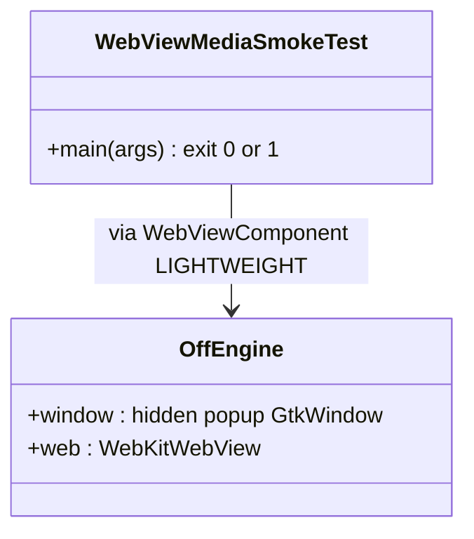

# REASONS Canvas: Media Plays In The Lightweight Engine (009-001)

> Source story: `requirements/[User-story-9]media-plays-in-the-lightweight-engine.md` → **[STORY-009-001]**.
> Analysis: `spdd/analysis/GGQPA-XXX-202609271830-[Analysis]-media-plays-in-the-lightweight-engine.md`.
>
> **Amends Canvas 7's approach** ("WebKit renders into a `GtkOffscreenWindow`"): it now renders into a
> hidden, on-screen-typed popup window. The pixel pump, input translation and sizing are unchanged.

## Decisions (resolved here)

- **D1 · Why.** WebKitGTK only lets a page start media once its view is `IsInWindow`
  (`WebPage::updateIsInWindow` turns `setCanStartMedia` on), and never counts a view inside a
  `GtkOffscreenWindow` as in a window (`widgetIsOnscreenToplevelWindow`, WebKitGTK 2.52.6
  `UIProcess/gtk/GtkUtilities.cpp`). In the lightweight engine every media element therefore waits
  forever — no `loadstart`, no `error`.
- **D2 · The toplevel.** `gtk_off_create_engine` creates `gtk_window_new(GTK_WINDOW_POPUP)` instead of
  `gtk_offscreen_window_new()`, and before it is shown sets: `gtk_window_move(win, -32000 / scale, -32000 / scale)`,
  `gtk_window_set_accept_focus(win, FALSE)`, `gtk_window_set_focus_on_map(win, FALSE)`,
  `gtk_window_set_skip_taskbar_hint(win, TRUE)`, `gtk_window_set_skip_pager_hint(win, TRUE)`,
  `gtk_window_set_decorated(win, FALSE)`. A popup is override-redirect on X11 (the only backend the
  pump allows): no window-manager decoration, taskbar entry or focus, and its position is honoured, so
  it is mapped but outside every monitor. `scale` is the display's window scale
  (`gdk_window_get_scale_factor` of the screen's root window): GTK multiplies a window position by it
  and X11 stores the result as a signed 16-bit device coordinate, so an unscaled `-32000` overflows at
  2x and wraps to `+1536`, on-screen. The move is made by one helper,
  `gtk_off_park_offscreen(GtkWindow *win)`, which reads the scale at the moment it runs and moves the
  window to `-32000 / scale` on both axes. It runs once before the window is shown, and again from a
  `notify::scale-factor` handler connected on the popup (`gtk_off_on_scale_factor`, no user data; the
  connection dies with the window). The window scale can change while the engine lives (X settings
  `Gdk/WindowScaling`); GTK then re-applies the old logical offset at the new scale, which can wrap on
  screen, and the handler re-parks it at the new scale.
- **D3 · Nothing else changes.** `gtk_widget_show_all`, the synthetic `GDK_FOCUS_CHANGE`,
  `gtk_off_snapshot_into` (`gtk_widget_draw` into our own image surface), input synthesis through
  `gtk_main_do_event`, `gtk_window_resize`, destruction, and popup adoption (Canvas 19, which goes
  through the same creation function) are untouched. Comments that call the window a
  `GtkOffscreenWindow` are corrected to "the engine's hidden popup toplevel".
- **D4 · Custom schemes as a media `src` stay out of reach on Linux.** WebKitGTK's GStreamer player
  accepts only `blob`, `data`, `file`, `http`, `https` (`isProtocolAllowed`; the
  `WEBKIT_GST_ALLOWED_URI_PROTOCOLS` variable only widens that first check), and its source element
  (`webkitwebsrc`) only claims `http`, `https`, `blob`. A page plays scheme media by `fetch` → `blob:`
  URL; D5 checks exactly that.
- **D5 · The smoke test** (`WebViewMediaSmokeTest`, run by `run-linux-media-smoketest.sh`): it exits
  `0` on pass and `1` on fail with one line per check, so it can run under Xvfb in CI.
  - Registers scheme `mediatest` whose handler serves `mediatest://app/` (an HTML page) and
    `mediatest://app/clip.webm` (a 16×16, 0.2 s VP8 WebM embedded in the source as base64), with
    `Access-Control-Allow-Origin: *`.
  - The page: a red background; video A with `src` = the same WebM as a `data:` URL; video B whose
    `src` is a `blob:` URL made from `fetch('mediatest://app/clip.webm')`. Each records
    `loadedmetadata <w>x<h>` or `error <code>` into `window.__media`.
  - A lightweight `WebViewComponent` (forced via `WebViewComponent.create(Mode.LIGHTWEIGHT)` or the
    component's own default on Linux) in a `JFrame` loads `mediatest://app/`; the test polls
    `evalAsync("return window.__media || {};")` every 250 ms for up to 20 s (`evalAsync` wraps
    the snippet in a function and JSON-stringifies what it `return`s; a bare expression yields
    `"null"`).
  - Checks: **A** reports `loadedmetadata 16x16`; **B** reports `loadedmetadata 16x16`; and the
    component, painted into a `BufferedImage`, has a pixel near its centre that is mostly red (the
    pixel pump still delivers the page).

## R · Requirements

- HTML media starts in the Linux lightweight engine as it does in a browser, with the engine's window
  still never visible to the user, and a runnable pass/fail check for it.

## E · Entities

## A · Approach

1. Change the one creation site in `gtk_off_create_engine` per D2; correct the comments per D3.
2. Add the smoke test, its README and its run script (modelled on `run-linux-data-smoketest.sh`).
3. Verify under Xvfb: the smoke test passes after the change and fails its media checks before it.

## S · Structure

- `src_c/webview_embed.cpp` (Linux lightweight engine only).
- New `demos/WebViewMediaSmokeTest/` and `run-linux-media-smoketest.sh`; no library Java changes.

## O · Operations

### 1. `gtk_off_create_engine`
- Replace `e->window = gtk_offscreen_window_new();` with a popup window configured per D2, before the
  existing `gtk_container_add` / `gtk_widget_show_all`. The position comes from
  `gtk_off_park_offscreen`, and `notify::scale-factor` on the window is connected to
  `gtk_off_on_scale_factor(GObject *, GParamSpec *, gpointer)`, which calls `gtk_off_park_offscreen`
  on the window (it runs on the pump thread, as every GTK signal does). The `OffEngine::window` field comment and the
  section comment say "hidden popup toplevel (Canvas 33)"; the snapshot comment keeps its rationale
  for not using `gtk_offscreen_window_get_surface`, reworded for a popup.

### 2. `WebViewMediaSmokeTest`
- As D5. Uses only public API: `WebViewSchemes.register`, `WebViewSchemeHandler`,
  `WebViewSchemeResponse` (as the scheme demo does), `WebViewComponent.create`, `setUrl`, `evalAsync`,
  `paint`. Prints `[media-smoke] PASS|FAIL <check>: <detail>` per check and exits.

### 3. `run-linux-media-smoketest.sh`
- Same steps as `run-linux-data-smoketest.sh` (resolve JAVA_HOME, pick WebKit, build
  `libwebview.so` when stale, build `dist/WebView.jar`), then compile and run the smoke test with
  `GDK_BACKEND=x11`, `WEBKIT_DISABLE_DMABUF_RENDERER=1`; returns the test's exit code.

## N · Norms

1. C++11, the file's existing style; GTK calls stay on the pump thread (they are inside the existing
   `run_sync`).
2. Comments cite `Canvas 33 Dn`.

## S · Safeguards

1. The engine's window is never on a visible monitor, never decorated, never focused by the window
   manager, never in a taskbar. This holds at every integer window scale and across a runtime change of
   that scale: the device-pixel position is always about `-32000`, inside X11's signed 16-bit range.
2. Only the lightweight engine's toplevel changes; the heavyweight engine, macOS and Windows are
   untouched.
