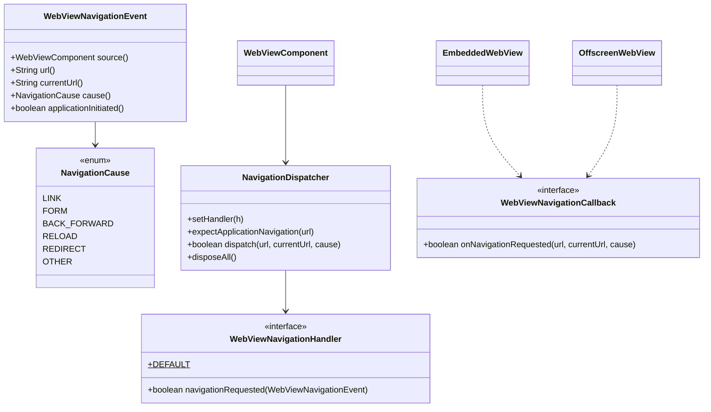

# REASONS Canvas: Decide Where A Page May Navigate — Java API, Linux, macOS and Windows (010-001)

> Source story: `requirements/[User-story-10]decide-where-a-page-may-navigate.md` → **[STORY-010-001]**.
> Analysis: `spdd/analysis/GGQPA-XXX-202609301715-[Analysis]-decide-where-a-page-may-navigate.md`.
>
> This follows the popup decision (Canvases 15–20) step for step. It covers all three engines in one
> Canvas, because the value is one portable guarantee.

## REASONS-Implements

**Java (`src/ca/weblite/webview/`)**
- **New:**
  - `WebViewNavigationHandler`: the application's decision (D1);
  - `WebViewNavigationEvent`: what the handler is told (D2);
  - `NavigationCause`: the cause, with an ordinal wire contract (D2);
  - `WebViewNavigationCallback`: the JNI-facing interface (D5);
  - `NavigationDispatcher`: per-component, inline, fail-closed, and marks application navigations (D3,
    D4).
- **Edited:**
  - `WebViewNative`: `webview_navigation_available`, `webview_embed_set_navigation_callback` and
    `webview_offscreen_set_navigation_callback` (D5);
  - `EmbeddedWebView` and `OffscreenWebView`: `setNavigationCallback` (D5);
  - `swing/WebViewComponent`: `setNavigationHandler`, `getNavigationHandler` and
    `isNavigationHandlerSupported()` (D1, D6);
  - `swing/WebViewHeavyweightComponent` and `swing/WebViewLightweightComponent`: install the callback at
    attach, before the first navigation; mark each `navigate` call; dispose the dispatcher (D4, D5).

**Native**
- **Edited** `src_c/webkit_loader.h` and `src_c/webkit_shim.h`: four WebKit symbols (D7).
- **Edited** `src_c/webview_embed.cpp`: the GTK `decide-policy` on `Engine`, `OffEngine` and adopted
  popups (D7); the Cocoa `decidePolicyForNavigationAction` (D8); and the JNI bridges (D5).
- **Edited** `windows/webview_embed.cc`: `NavigationStarting` and `FrameNavigationStarting` on the engine
  and an adopted child, and the JNI bridges (D9).

**Tests (JUnit 4, headless)**
- **New** `test/ca/weblite/webview/NavigationDispatcherTest.java`.

**Demo and docs**
- **New** `demos/WebViewNavigationDemo`, `run-linux-navigation-demo.sh`, `run-mac-navigation-demo.sh` and
  `run-windows-navigation-demo.bat`.
- **Edited** `README.md`.

## Decisions (resolved here)

- **D1 · `WebViewNavigationHandler`.**
  - It has one method, `boolean navigationRequested(WebViewNavigationEvent e)`: true allows, false refuses.
  - `DEFAULT` allows everything.
  - `setNavigationHandler(null)` installs `DEFAULT`, which removes the decision. This is unlike popups,
    where null blocks. A null that refused every navigation would break every page, including the
    application's own.
  - **The threading contract is the popup contract, word for word:** it runs on the native UI thread,
    synchronously, off the EDT, and must be fast and not touch Swing.
  - **It is asked about:**
    - every navigation of the view **and its frames**, including a frame's first page (`about:blank`,
      `about:srcdoc`);
    - but not new windows, which `WebViewPopupHandler` decides.

- **D2 · `WebViewNavigationEvent`** (immutable) carries:
  - `source()`, the component;
  - `url()`, the target address;
  - `currentUrl()`, the address the view reports when asked (for the first navigation this may equal
    the target, or be empty);
  - `cause()`, a `NavigationCause`: `LINK`, `FORM`, `BACK_FORWARD`, `RELOAD`, `REDIRECT` or `OTHER`,
    with ordinals 0–5 as a wire contract that must not be reordered;
  - `applicationInitiated()` (D4). The accessors follow `WebViewPopupEvent`'s record style, and strings are
    never null.

  A frame's navigation is not told apart: WebKitGTK can't (analysis §4), so no engine claims to.

- **D3 · `NavigationDispatcher.dispatch(url, currentUrl, causeOrdinal)`** is **inline** on the calling
  thread, and never marshals to the EDT.
  - A disposed dispatcher, a thrown handler, or an unknown ordinal (`OTHER` is used) all fail closed:
    **false**, with the throwable forwarded to the default uncaught-exception handler.
  - With `DEFAULT` installed, it answers true without building an event.

- **D4 · Application-initiated.**
  - `expectApplicationNavigation(url)` is called immediately before each native `navigate` the
    component makes, from `setUrl` and the attach-time first navigation.
  - It records the URL's normalized form (D4a) with a 30-second expiry, in a small bounded list (the
    newest 16).
  - `dispatch` marks a navigation application-initiated when its normalized URL matches an unexpired
    expectation, which is consumed.
  - **Redirects:** when the cause is `REDIRECT`, the mark is inherited from the last decision made
    (`lastAllowedApplication`), which is set true only when an application-initiated navigation was
    allowed. Any other decision resets it to false.
  - A frame decision arriving between a navigation and its redirect resets the mark, which fails closed.
  - **D4a · Normalization:**
    - lower-case the scheme and host;
    - drop the default port (80 for http, 443 for https);
    - an empty path on a hierarchical URL becomes `/`;
    - drop the fragment.

    A URL that `java.net.URI` can't parse compares as its exact string.

- **D5 · Wiring.**
  - **`WebViewNavigationCallback.onNavigationRequested(String url, String currentUrl, int cause)`**
    returns a boolean.
  - **`WebViewNative`:**
    - `static native boolean webview_navigation_available()`;
    - `webview_embed_set_navigation_callback(long, WebViewNavigationCallback)`;
    - `webview_offscreen_set_navigation_callback(long, WebViewNavigationCallback)`.
  - **`EmbeddedWebView` and `OffscreenWebView`** gain `setNavigationCallback`. They anchor the callback in
    `heap`, and catch `UnsatisfiedLinkError` so an older native keeps working without the decision.
  - **Both components install the callback at attach, before the first navigate,** and adopted popups get
    it the same way.
  - **Each engine holds one global ref,** replaced on set and deleted on destroy, exactly like
    `popup_callback`.

- **D6 · `WebViewComponent.isNavigationHandlerSupported()`** answers `WebViewNative.webview_navigation_available()`,
  false on an `UnsatisfiedLinkError` (AC11). A native built with this Canvas answers true on all three
  platforms.

- **D7 · Linux (WebKitGTK).**
  - **Loader:** add `webkit_navigation_policy_decision_get_navigation_action`,
    `webkit_navigation_action_get_navigation_type`, `webkit_navigation_action_is_redirect` and
    `webkit_policy_decision_ignore` to `WK_WEBKIT_SYMS` and to the shim (all exist since 2.6).
  - **Casts** use plain C casts, never the `WEBKIT_*` GObject cast macros, which would reference
    `*_get_type`.
  - **One static handler, `on_decide_policy(view, decision, type, jvm_and_callback_holder)`,** connected
    to `"decide-policy"` on:
    - every `Engine` and `OffEngine` web view at creation;
    - an adopted popup's web view when adopted (the adopting engine's holder).
  - **The handler:**
    - for any type other than `NAVIGATION_ACTION`, or with no callback, returns FALSE, so WebKit decides;
    - otherwise reads the request URI, cause and current URI (`webkit_web_view_get_uri`), and calls
      Java;
    - on false, calls `webkit_policy_decision_ignore` and returns TRUE; on true, returns FALSE.
  - **Cause mapping:**
    - `is_redirect` → `REDIRECT`;
    - `LINK_CLICKED` → `LINK`;
    - `FORM_SUBMITTED` and `FORM_RESUBMITTED` → `FORM`;
    - `BACK_FORWARD` → `BACK_FORWARD`;
    - `RELOAD` → `RELOAD`;
    - anything else → `OTHER`.
  - **JNI:** the handler attaches the current thread only if it isn't attached, and clears any pending
    exception, treating it as a refusal.
  - **The callback holder** is the engine itself (`Engine*` / `OffEngine*`, whose `navigation_callback`
    field is read at dispatch). A destroyed engine disconnects the signal before freeing (`g_signal_handlers_disconnect_by_data`).

- **D7a · Linux is lightweight only.** **On Linux, the supported and verified component is the lightweight
  one (`OffEngine`); heavyweight is never run, tested or verified on Linux** (see `CLAUDE.md`). The GTK
  `Engine` path carries the same hook only so the two GTK engines stay alike, as they do for popups and
  downloads.

- **D8 · macOS (WKWebView).**
  - **The delegate class adds** `webView:decidePolicyForNavigationAction:decisionHandler:` (type
    `v@:@@@`).
  - **A nil `targetFrame`** (a new window) answers Allow at once; the popup path decides it.
  - **Otherwise it asks Java** when `e->navigation_callback` is set:
    - the URL is `request.URL.absoluteString`, and the current URL is `webView.URL.absoluteString`;
    - the cause comes from `navigationType`: 0 → `LINK`, 1 → `FORM`, 2 → `BACK_FORWARD`, 3 → `RELOAD`,
      4 → `FORM`, anything else → `OTHER`. Redirects are reported as `OTHER`.
    - A refusal answers Cancel (0).
  - **An allowed navigation, or one with no callback, reproduces WebKit's default exactly:**
    - if `+[NSURLConnection canHandleRequest:]` is true, or the scheme is in `g_scheme_names`, it answers
      Download (2) when `shouldPerformDownload` is present and true, and Allow (1) otherwise;
    - otherwise, for a non-file URL, it calls `-[NSWorkspace openURL:]`, and answers Cancel.

- **D9 · Windows (WebView2).**
  - **`NavigationStartingHandler`** (an `ICoreWebView2NavigationStartingEventHandler`, `Engine*`) is
    registered with `add_NavigationStarting` and `add_FrameNavigationStarting`:
    - after the controller is created, beside `add_NewWindowRequested`;
    - on an adopted child.

    Its tokens are stored on the engine and removed on destroy.
  - **`Invoke`:**
    - with no callback, returns `S_OK`;
    - otherwise reads `get_Uri` and `get_IsRedirected`, and `get_NavigationKind` through
      `ICoreWebView2NavigationStartingEventArgs3` when available (reload → `RELOAD`, back or forward →
      `BACK_FORWARD`, else `OTHER`);
    - the current URL is `get_Source` of the engine's web view;
    - calls Java on the WebView2 thread, and on false calls `put_Cancel(TRUE)`.

    For a frame, the args come from `ICoreWebView2Frame`'s event and have the same shape, so one handler
    class serves both.

- **D10 · Demo.** `WebViewNavigationDemo` serves `demo://app/` from a custom scheme and runs a local
  listener on port 8123. Its buttons try each kind of navigation to `http://127.0.0.1:8123/?d=secret`,
  and it shows the handler's log and the listener's hits. Its handler allows `demo://app/…`,
  `about:blank`, `about:srcdoc` and application-initiated navigations.

## R · Requirements
- An application can refuse, before any request is sent, any navigation of a component's view or its
  frames.
- The application's own navigations are marked, so its controls keep working.
- Nothing changes without a handler.

## E · Entities

## A · Approach
1. **The popup decision's shape, reused:** handler, dispatcher, callback, global ref and attach.
2. **One decision point per engine,** asked before the request, answering with the engine's own
   refusal.
3. **Fail closed** on every error path; **fail open only where nothing was installed**, which is the
   pre-feature behaviour.
4. **Reproduce each engine's default** when allowing.

## S · Structure
1. The new Java types sit in `ca.weblite.webview` beside the popup types. `NavigationDispatcher` is
   public only because the Swing subclasses live in another package.
2. Native code is one static decision function per platform, plus setters and JNI bridges, next to the
   popup code in each file.

## O · Operations
1. **`NavigationCause`, `WebViewNavigationEvent`, `WebViewNavigationHandler` and
   `WebViewNavigationCallback`**, per D1, D2 and D5.
2. **`NavigationDispatcher`**, per D3 and D4.
3. **`WebViewNative`, `EmbeddedWebView` and `OffscreenWebView`**, per D5.
4. **`WebViewComponent`** (setter, getter and `isNavigationHandlerSupported`) and **both components**
   (attach, marking, dispose), per D4–D6.
5. **Linux**, per D7; **macOS**, per D8; **Windows**, per D9.
6. **`NavigationDispatcherTest`:**
   - `DEFAULT` allows everything;
   - a refusing handler refuses, and receives the URL, current URL and cause;
   - a throwing handler refuses, and the throwable reaches the uncaught handler;
   - a disposed dispatcher refuses;
   - an unknown cause ordinal becomes `OTHER`;
   - `null` resets to `DEFAULT`;
   - an expected URL marks the first matching navigation only, after normalization (`HTTPS://Example.com`
     matches `https://example.com/`), and not after expiry;
   - a redirect inherits the mark only after an allowed application navigation, and a refused one or an
     intervening page navigation resets it;
   - the expectation list keeps only the newest 16.
7. **Demo and README**, per D10.
8. **Verification recorded in the PR:**
   - the Linux native built and run under Xvfb **in the lightweight component, the only Linux mode**,
     with every kind of refused navigation leaving the listener untouched (AC1–AC10);
   - CI compiling the macOS and Windows natives.

## N · Norms
1. The popup Canvases' norms hold: Javadoc on every public type states the threading contract, and
   dispatchers never throw to native.
2. Comments cite `Canvas 34 Dn`.
3. Java 8 source level, as the rest of `src/`.

## S · Safeguards
1. **Before the request:** each engine's decision point runs before any byte is sent (verified on
   WebKitGTK).
2. **Fail closed:** a throw, a disposed component or a JNI error refuses.
3. **No behaviour change without a handler**, including macOS's download and external-scheme handling.
4. **No new mandatory dependency:** the Linux symbols come through the runtime loader.
5. **Scope:** popups stay with the popup handler, and a popup before adoption, or in an engine-owned
   window, is not decided by this handler.
